# Examen

Grupo-01

## Integrantes

- Emilia Contreras / [hazzaily](https://github.com/hazzaily)
- Katalina Riquelme / [katalinariquelme](https://github.com/katalinariquelme)
- Thyare Santander / [thyare08](https://github.com/thyare08)

## Premisa

Luz de noche, pensada principalmente para niños, que enciende LEDs gradualmente y los apaga de la misma manera. Y que fuera capaz de encenderse por sí sólo ante la falta de luz, y apagarse cuando esta hiciera presencia.

## Proyecto-02

- **Aprendizajes:**

Dentro de los aprendizajes podemos rescatar el revisar las entregas en GitHub muchas veces, al punto de saber qué es lo que estamos haciendo y tratando de no dejar pasar ningún error.

También el trabajar con tiempo, esto porque facilita muchas cosas y nos da tiempo de verificar que todo esté bien sin la presión que conlleva dejar todo a última hora y cometer errores sin tener tiempo de corregirlos.

Aprendimos a cómo manejar la frustración de que las cosas no nos resulten a la primera, al menos mejor que en el inicio. Y con la mentalidad de que todo tiene una solución.

Si nos vamos un poco más a lo técnico, podemos ver la capacidad de identificar problemas y soluciones en cuanto al proyecto, pudiendo apoyarnos un poco más entre nosotras, sin necesariamente recurrir a alguien más.

Una  cosa muy útil que nos dejó el proyecto-02 es poder manejarnos un poco mejor en Kicad, siendo una habilidad que siempre estará ahí, además de poder ir armando y viendo qué le falta al proyecto, y cómo se verá en su forma final.

- **Dificultades:**

Llegar a la cantidad de LEDs que queríamos funcionando al mismo tiempo, y cómo lograrlo.

Que el detector de sombra hiciera lo que necesitábamos, que es que encienda cuando llega sombra, y no al revés.

Encontrar los potenciómetros correctos para que lograr las acciones previstas.

Armar el circuito final conectado al secuenciador, con los transistores.

Definición de tamaño para la PCB modular, para lograr que fuera posible el "semicorte" que nos permite separarlas de forma más fácil y rápida.

## Protoboard

Para llevar a cabo cualquier circuito debemos partir utilizando la protoboard, de forma en que podemos cometer errores y cambiar componentes sin necesidad de soldar y des-soldar.

En estas dos primeras fotos podemos observar las protoboards de forma general.

En esta imagen podemos observar el detalle de que nuestro proyecto posee 4 LEDs en cada transistor conectado al secuenciador.

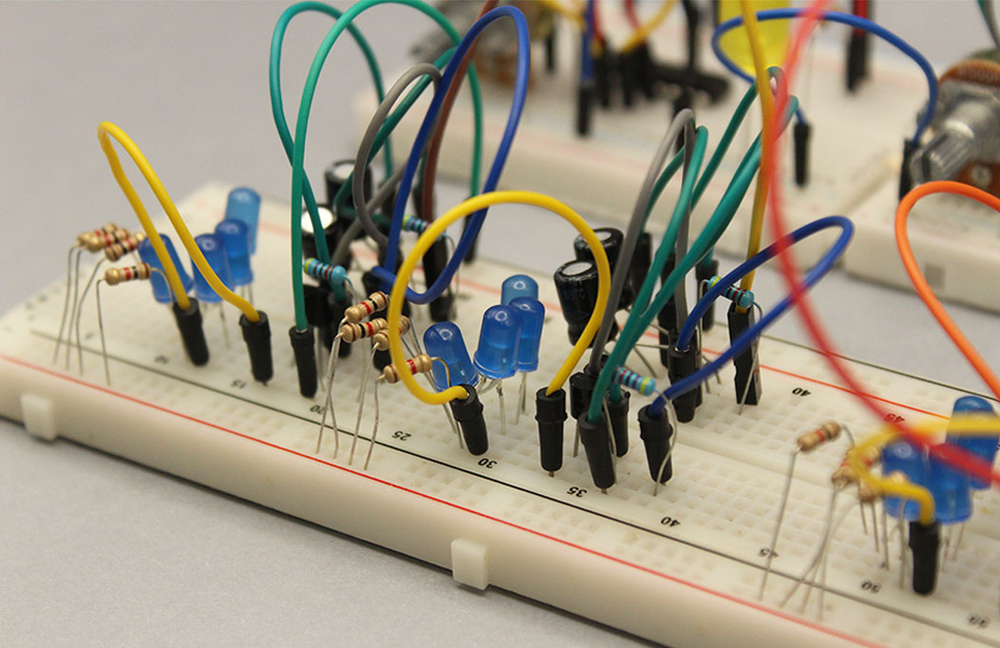

Luego, en esta, podemos apreciar a profundidad el circuito detector de sombra invertido.

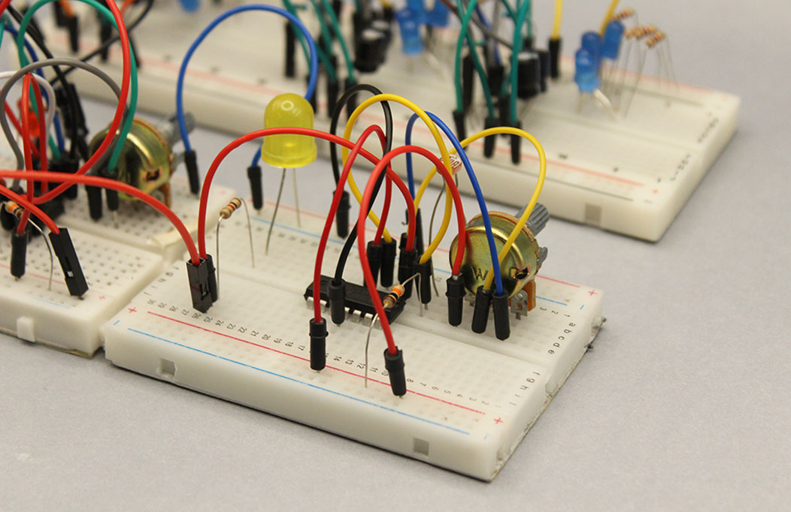

## Esquemático

El circuito esquemático nos sirve para planificar de mejor manera los circuitos realizados de forma especulativa en nuestras protoboards,  

En este primer circuito esquemático podemos observar la placa de control.

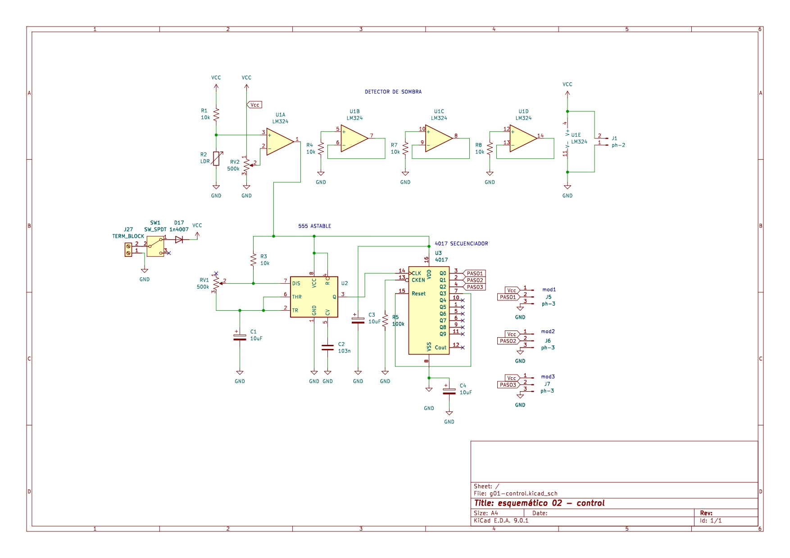

Y en este segundo esquemático las placas modulares.

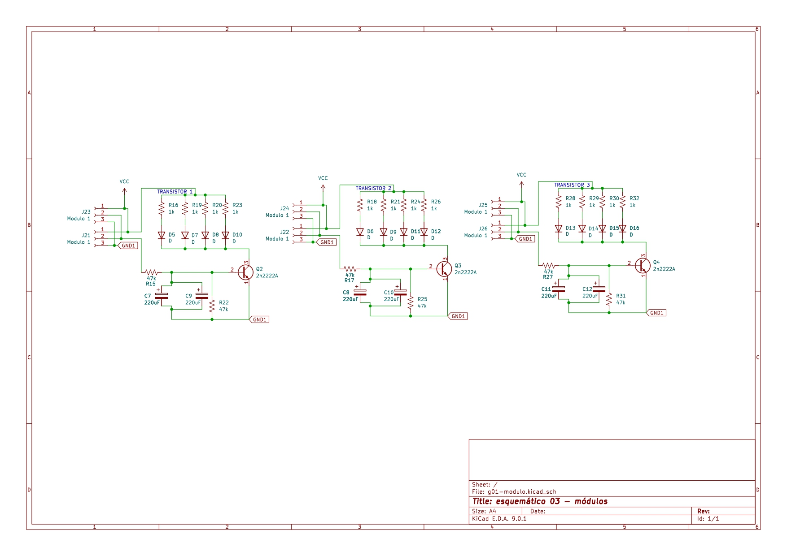

## PCB

Contamos con 2 PCBs, una de control que posee el detector de sombra, el controlador de velocidad o timer, y el secuenciador. Y la segunda, llamada módulo, que es la que tomamos para poder conectar los transistores y los diodos y ubicarla en distintas partes de la carcasa. Se conectan a través de cables a la placa de control.

En estas imágenes podemos ver nuestro proceso en kicad, desde diseñar la placa, hasta poder visualizarla en 3d.

Como primer ejemplo la placa de control.

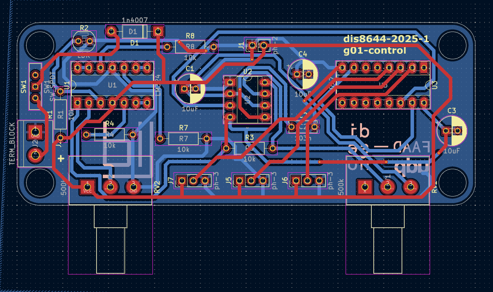

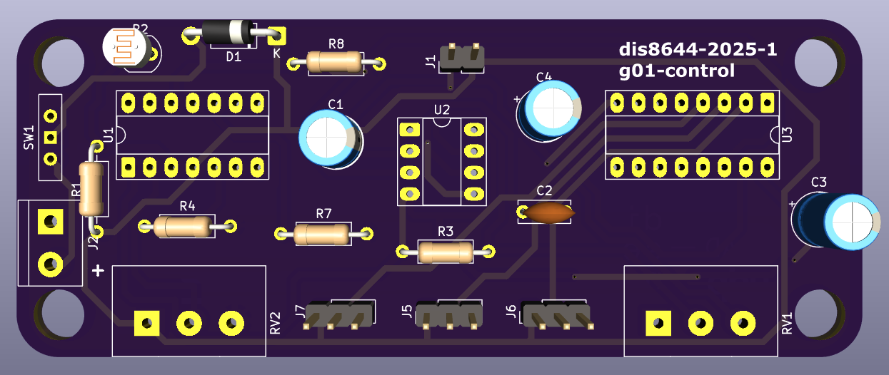

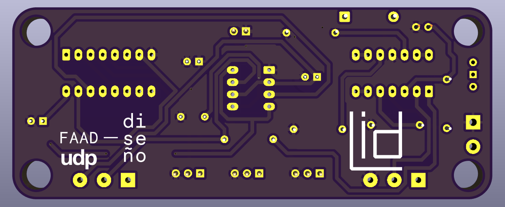

Y como segundo, tenemos la placa modular.

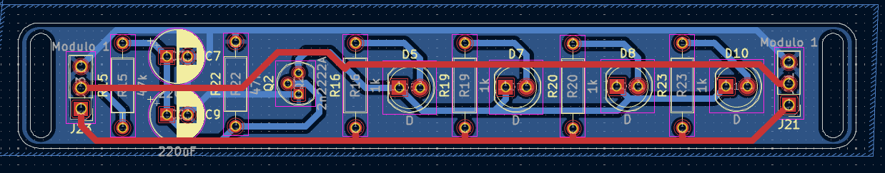

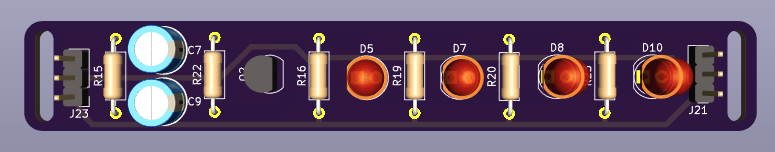

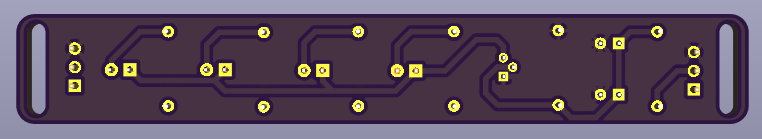

Finalmente al llegar las PCBs a nuestras manos desde China mediante JLCPCB, pudimos ver los resultados del esquemático y diagramación de la placa.

Aquí podemos apreciar la placa de control.

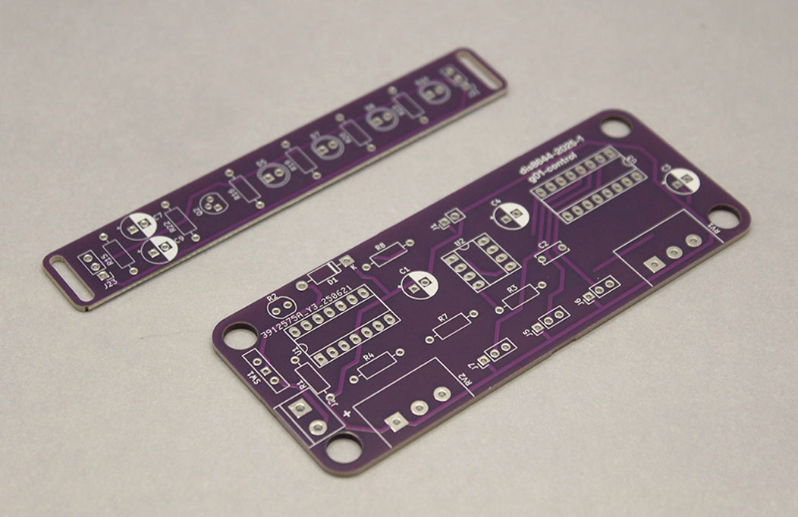

Y aquí las placas modulares, que poseen el prepicado, o semicorte, que nos permite separarlas para poder utilizarlas.

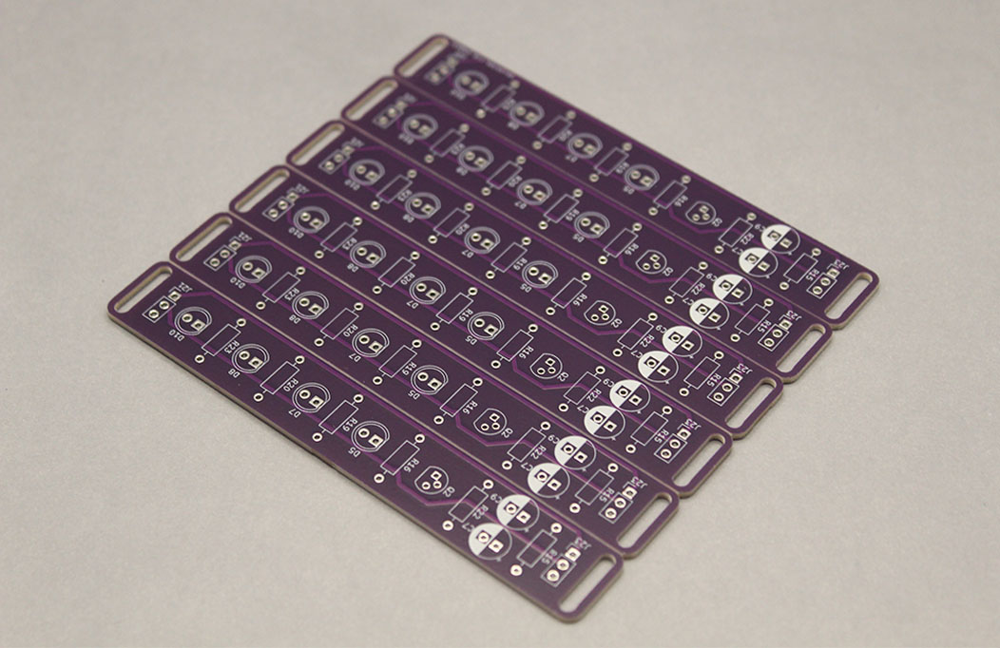

## BOM

El BOM, o Bill of Materials, es una herramienta indispensable que ofrece kicad a la hora de otorgar huellas a los distientos componentes. Y esto es porque gracias a esta lista sabemos cuántos materiales necesitamos desde un inicio y podemos verlos con anticipación.

| Reference                                       | Value   | Qty |
|-------------------------------------------------|---------|-----|
| C1,C3,C4                                        | 10uF    | 3   |
| C2                                              | 103n    | 1   |
| C7,C8,C9,C10,C11,C12                            | 220uF   | 6   |
| D5,D6,D7,D8,D9,D10,D11,D12,D13,D14,D15,D16      | LED 5mm | 12  |
| J1                                              | ph-2    | 1   |
| J5,J6,J7                                        | ph-3    | 2   |
| J21,J23                                         | mod1    | 2   |
| J22,J24                                         | mod2    | 2   |
| J25,J26                                         | mod3    | 2   |
| Q2,Q3,Q4                                        | 2n2222  | 3   |
| R1,R3,R4,R7,R8                                  | 10k     | 5   |
| R2                                              | LDR     | 1   |
| R5                                              | 100K    | 1   |
| R15,R17,R22,R25,R27,R31                         | 47K     | 6   |
| R16,R18,R19,R20,R21,R23,R24,R26,R28,R29,R30,R32 | 1K      | 12  |
| RV1,RV2                                         | 500K    | 2   |
| U1                                              | LM324   | 1   |
| U2                                              | 555     | 1   |
| U3                                              | 4017    | 1   |
| Socket 16 pines                          | Package DIP-16 | 1   |
| Socket 14 pines                          | Package DIP-14 | 1   |
| Socket 8 pines                           | Package DIP-8  | 1   |
| J27                                      | Terminal Block | 1   | 
| SW1                                      | SW_SPDT        | 1   |
| D17                                      | 1n4007         | 1   |

## Soldadura

Para poder llegar al proceso de armado y soldado de las placas finales dentro de la carcasa, tuvimos que soldar un circuito completo a modo de prototipo para confirmar que todo funcionase correctamente. Gracias a esto llegamos a las siguientes imágenes.

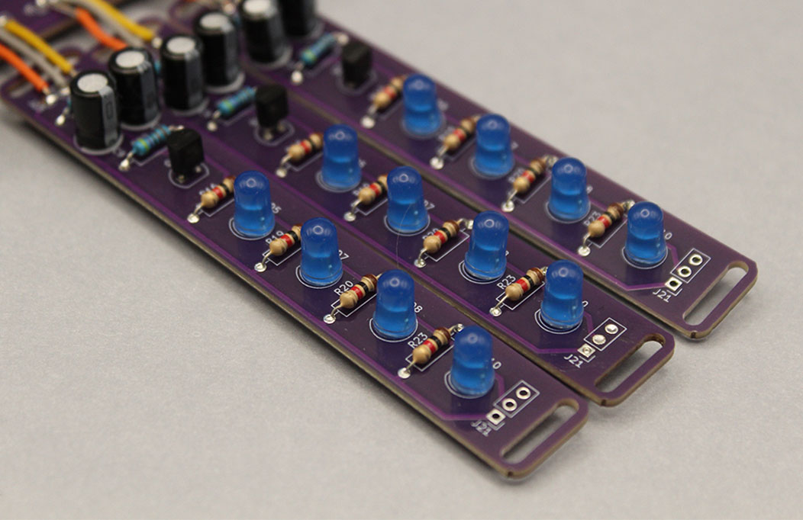

A continuación, procedimos con el diseño de la carcasa, lo que nos permitió comenzar a soldar y armar la estructura dentro de esta. Como se puede apreciar en las siguientes fotografías.

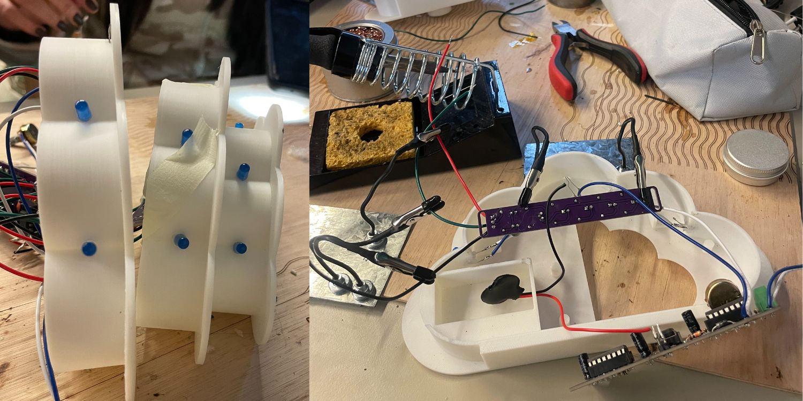

## ¿Qué es KET-cloud?

KET-cloud es una lámpara que acompaña a niños, o a personas con disgusto por la oscuridad, a no sentirse solas. Esto a través de luces LED que se encienden y apagan gradualmente, generando una onda entre las distintas capas del objeto. Y cuya velocidad a la hora intercambiarse es regulable gracias a la perilla que se encuentra en la parte frontal del dispositivo.

## Carcasa

En cuanto a las decisiones tomadas sobre la forma final de este objeto, podemos resaltar el uso de una nube debido a su versatilidad en cuanto a niños y/o adultos que se vean interesados en la lámpara. Los LEDs, por otro lado, son de color azul debido a que es un color que llama a la tranquilidad y a la calma, además de la relajación. Esto es respaldado por el libro “Psicología del Color” de Eva Heller, publicado en el año 2000, en dónde señala que el color azul es un color identificado como pasivo y sosegado, por lo que es usado muchas veces en cajas de inductores del sueño o sedantes, además de ser el color preferido de las personas para la ropa de cama y pijamas. (p. 45).

En esta primera imagen podemos observar tanto un módulo de la nube, como una placa modular, ensambladas.

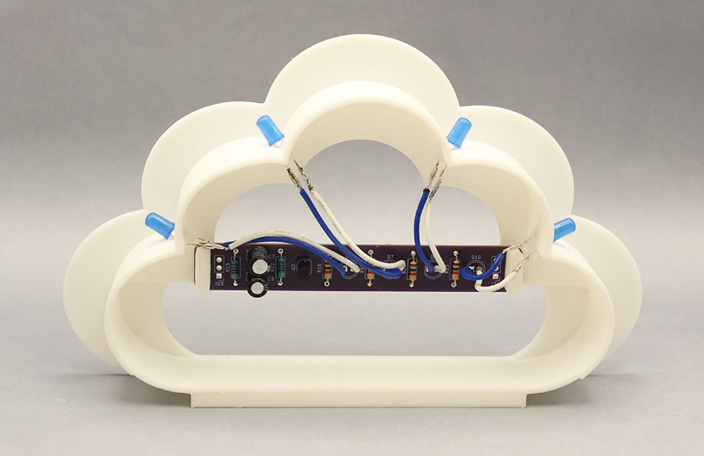

Aquí se puede observar el circuito interno, y todas las conexiones realizadas para lograr obtener el resultado final.

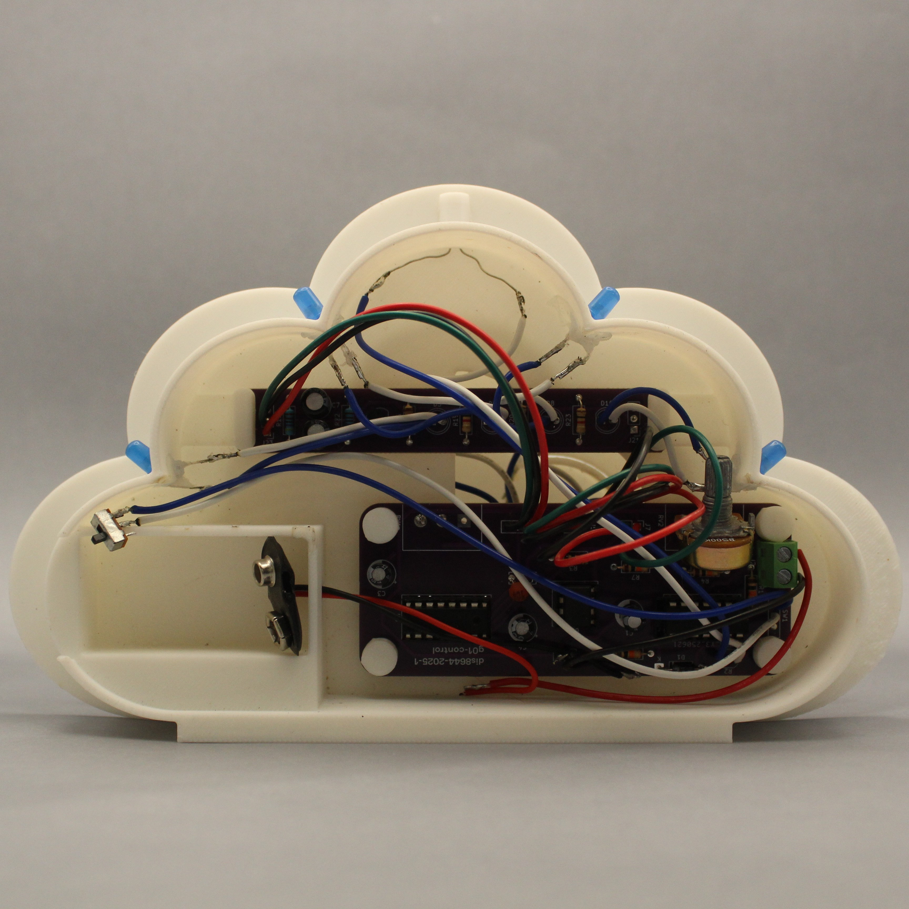

Luego, podemos ver la carcasa completa y cerrada, ocultando los circuitos internos.

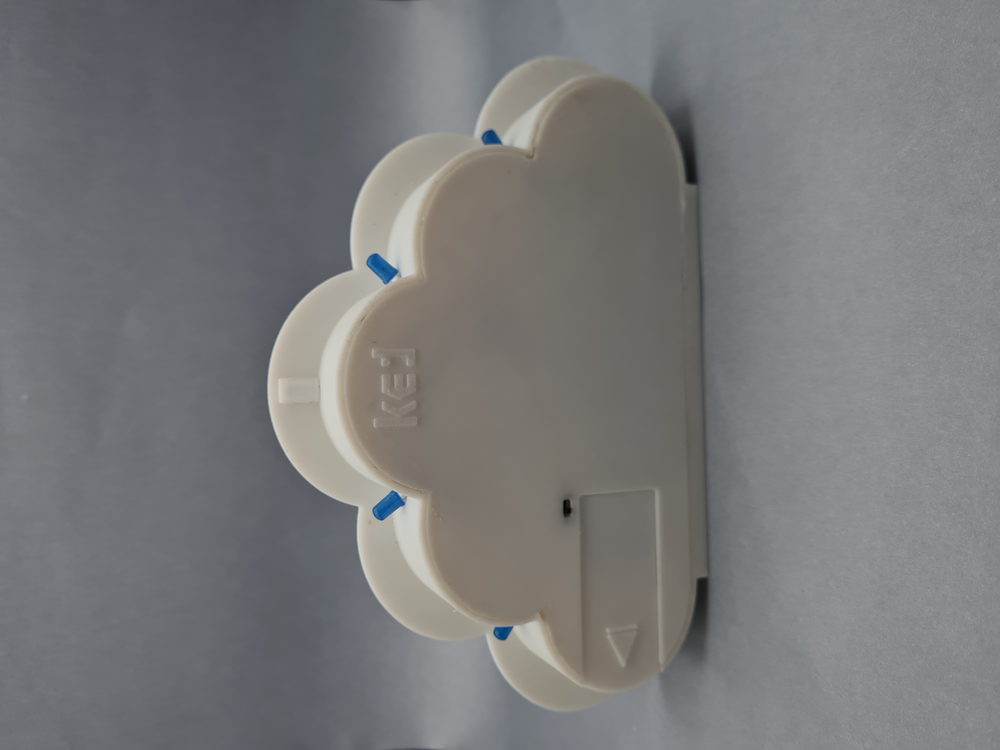

Esta fotografía nos deja ver el detalle del "KET" en relieve representativo del objeto.

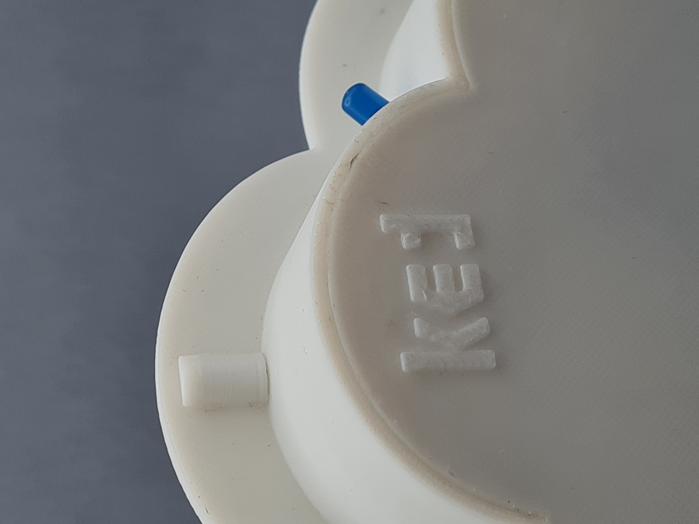

Y ésta, el detalle de la compuerta que deja entrar la batería de 9V que alimenta el circuito.

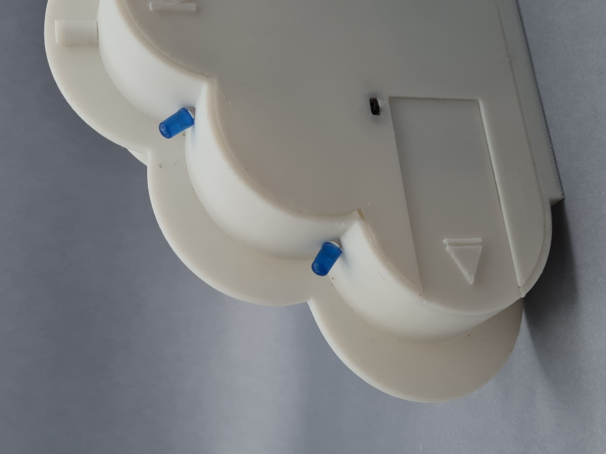

Ya teniendo todos los detalles y piezas ensambladas, podemos observar la carcasa completa desde una toma en perspectiva.

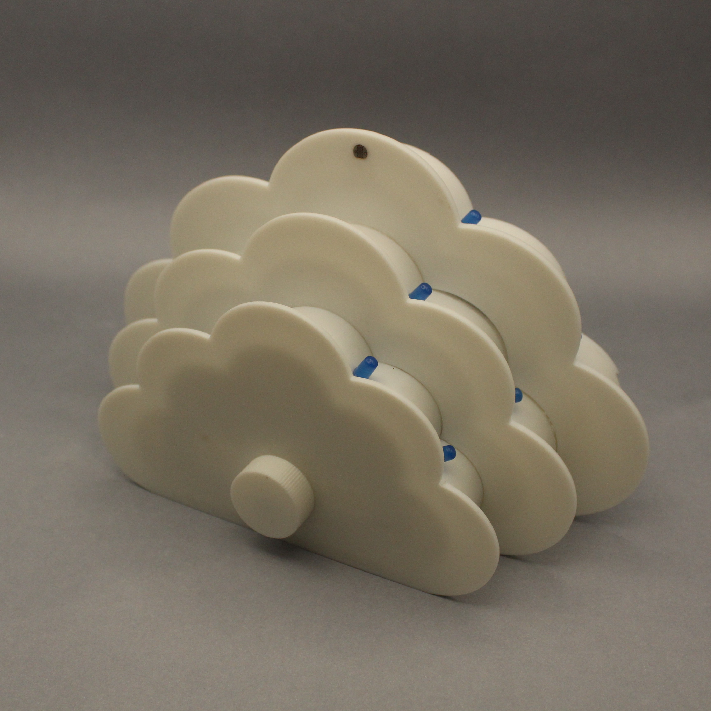

Finalmente podemos contemplar el objeto en uso, pasando por cada una de sus 3 capas.

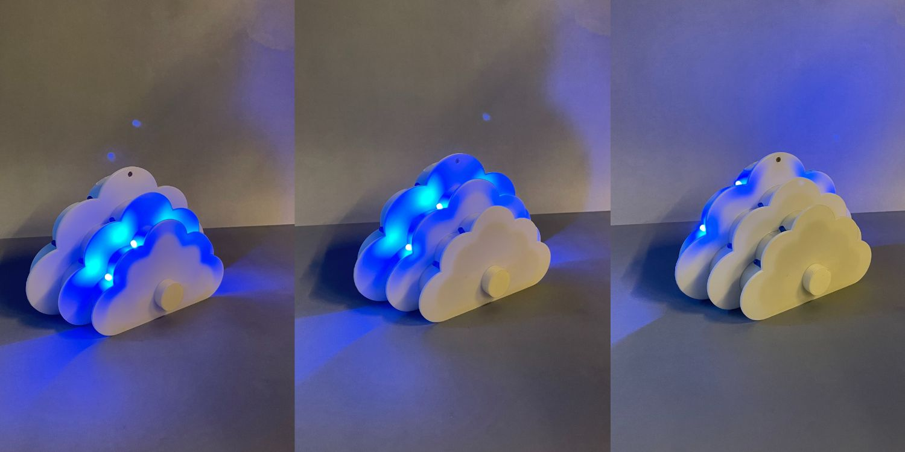

## Referentes

Dentro de los referentes podemos encontrar dos, uno conceptual como lo es [Hatch Rest](https://www.hatch.co/learn/restore?srsltid=AfmBOor3TkNgw5CXJi54WlzGW1LioDcFKLBov23hl6iOXXMYIuLS0YVI), del cual podemos rescatar el regular  la luz como un elemento sensorial clave para la relajación.

Y como referente visual, tenemos a [Rainbow Nursery Lamp](https://www.etsy.com/es/listing/1012684625/rainbow-lamp-nursery-lamp-baby-lamp-baby), del cual rescatamos su estética minimalista, además de las capas que posee.

## Bibliografía

Eva Heller. (2000). Psicología del Color. (1 ed.). Editorial Gustavo Gili.
