# Examen

grupo-02

## Integrantes
- [Sofía Etchepare](https://github.com/bumwox)
- [Antonia Fuentealba](https://github.com/antfuentealba)
- [Sofía Pérez](https://github.com/sofia-perezm)
## Proyecto-02
Nombre del proyecto: BONGAZO

Descripción del proyecto:

Instrumento de percusión electrónico que utiliza un sensor piezoeléctrico para captar vibraciones y convertirlas en variaciones de frecuencia audibles mediante un parlante. Su espectro tonal es regulable a través de un potenciometro que permite ajustar la sensibilidad y volumen en función de la intensidad del impacto.

- Aprendizajes:

Enfrentarnos a la frustración y aprender a manejarla cuando nos encontramos con un resultado inesperado o cuando algo simplemente no funciona como queríamos. Al principio costaba más, pero con el tiempo fuimos tomando las cosas con otra actitud, entendiendo que siempre hay una forma de resolver los problemas y que el pedir ayuda, ya sea a los docentes, como a nuestros propios compañeres, siempre será necesario para nuestro entendimiento y aprendizaje.

En cuanto a lo técnico, logramos identificar fallas y buscar soluciones, para no quedarnos estancadas en el proceso. También agregar que 
una habilidad concreta que ganamos fue aprender a usar Kicad con más soltura. Eso nos permitió visualizar mejor el proyecto, armarlo paso a paso y entender qué le faltaba para llegar a su versión final.

- Dificultades:

Definir la idea del proyecto. 

Teníamos claro que queríamos trabajar en torno al sonido y por ende, hacer un dispositivo que hiciera ruido, pero nos costó mucho aterrizar una propuesta concreta. 

Una vez definida la idea, uno de los obstáculo se nos presentó al montar el circuito en protoboard, ya que el chip 555 que usamos inicialmente no era el más adecuado para la función que queríamos lograr, lo que nos obligó a buscar otra alternativa. Luego, al pasar al esquemático en Kicad, nos encontramos con la dificultad de encontrar los componentes adecuados y ubicarlos correctamente en el esquemático.

También tuvimos problemas al crear la placa del circuito, especialmente al configurar las huellas y trazar correctamente las conexiones. Finalmente, al momento de soldar la placa que iría en la carcasa, tuvimos que extender cables desde la PCB a algunos componentes para poder posicionarlos mejor y facilitar el uso por parte del usuario. En ese proceso también soldamos mal algunos elementos, por lo que pedimos ayuda al grupo 00 para poder desoldarlos sin dañar la placa.

## PCB
Prototipado de circuitos en protoboard

el prototipado inicial del circuito consistió en probar si el parlante podía recibir feedback de un sensor, por lo que se utilizó un LDR en vez del piezo para probarlo y así tener una base en la cual trabajar y empezar a prototipar, agregando y quitando componentes.

Luego, ya con ayuda del equipo docente se logró definir un mejor esquema en el cual nos basamos para hacer la versión final del prototipado del circuito, el que finalmente sería replicado en la pcb final.

A continuación se presentan imágenes de la protoboard final.

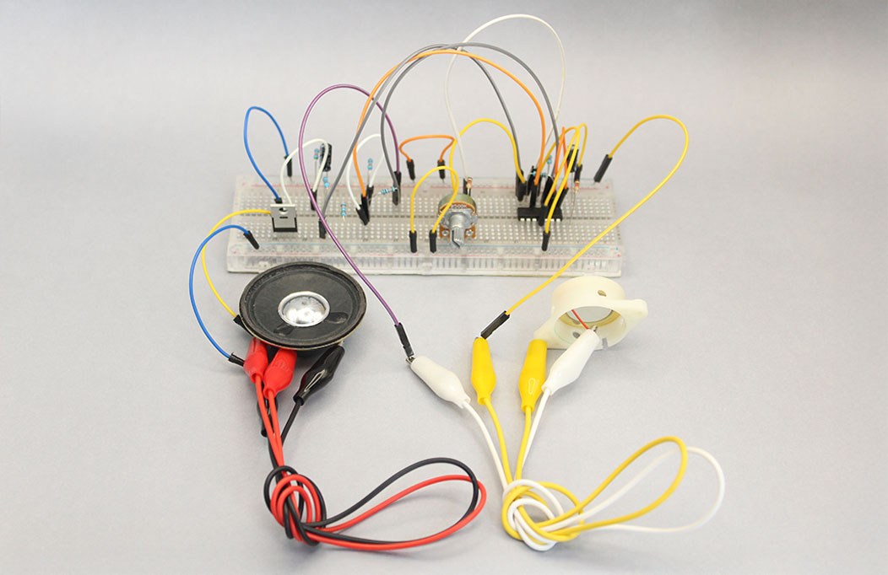

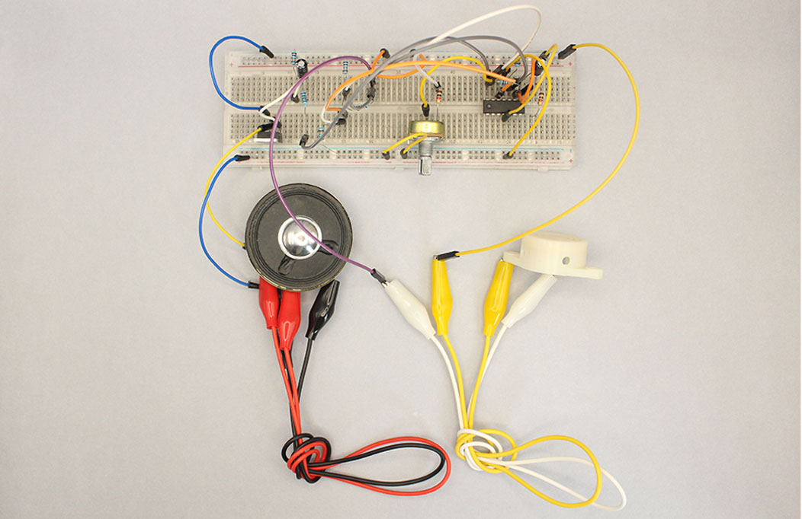

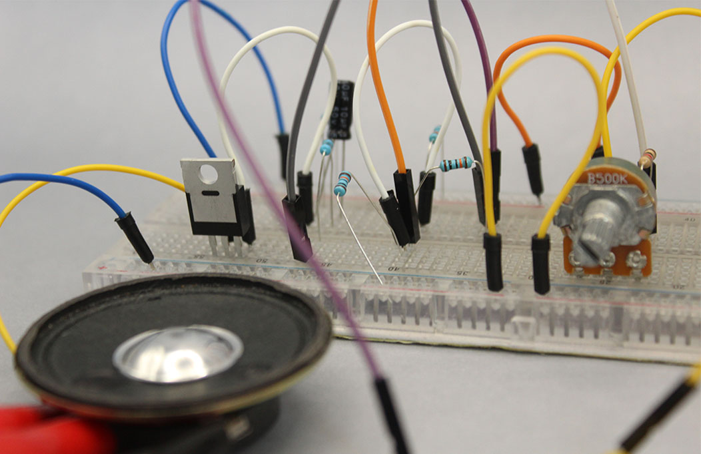

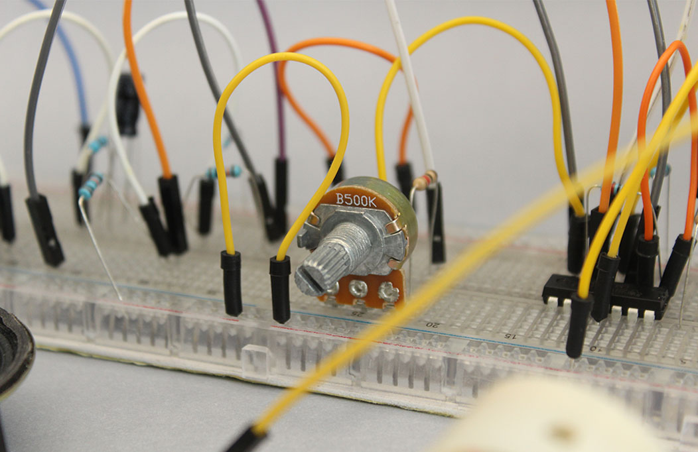

Para nuestro circuito se trabajo una PCB (placa de circuito impreso) de forma redonda y con un diseño llamativo, la idea de hacerla de ese tamaño y forma se ligó a que el instrumento simularía un bongo, al ser de pequeño y portátil se trabajó la gráfica de la placa para que tuviera coherencia tanto con su tamaño, como con los elementos gráficos, principalmente inspirados en juegos de ritmo como "Taiko no Tatsujin"

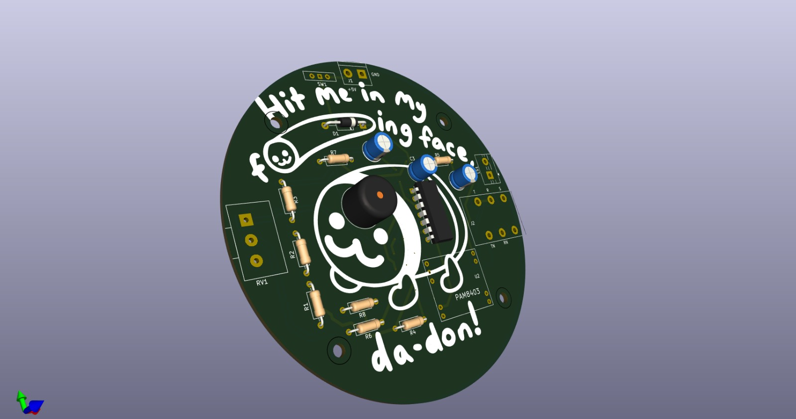

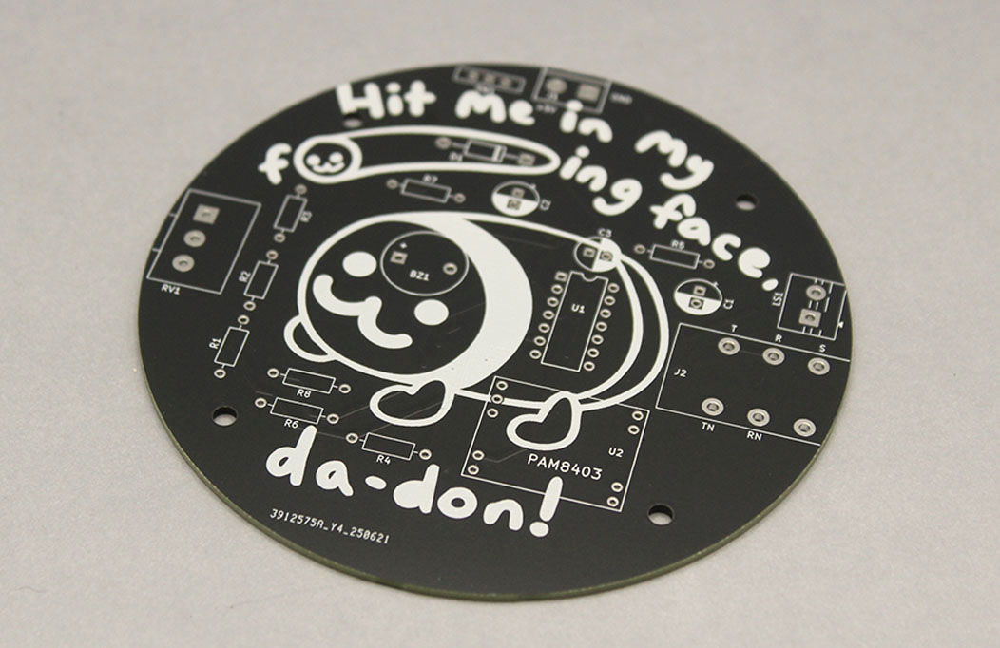

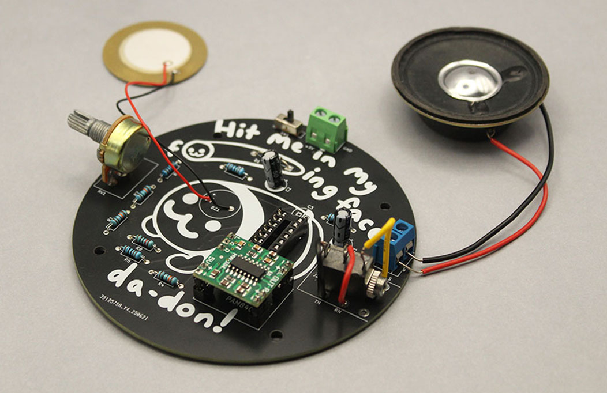

A continuación se presentan imágenes del diseño final de la pcb.

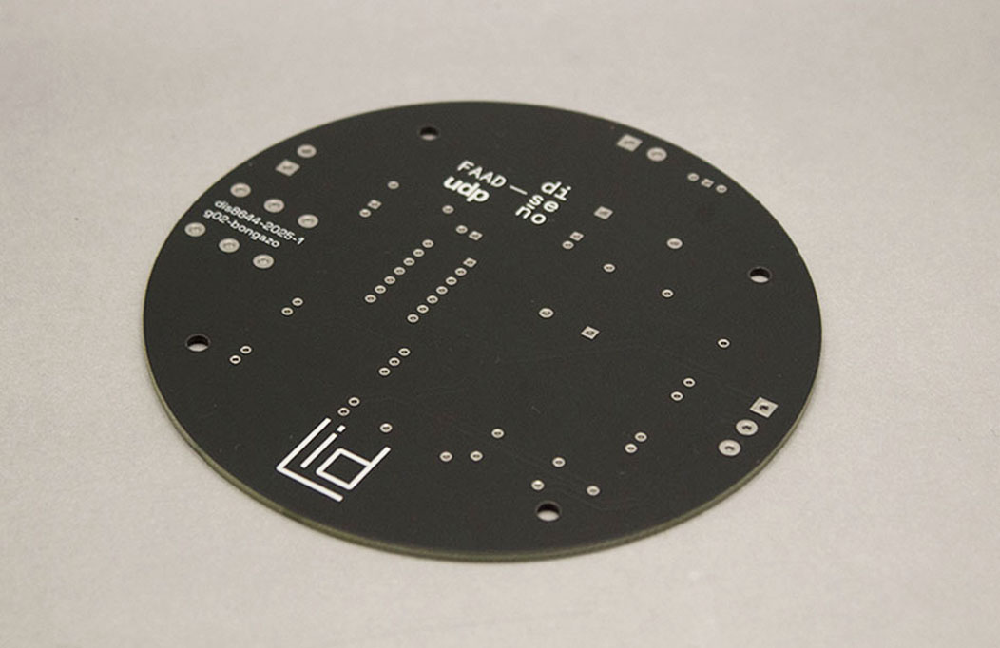

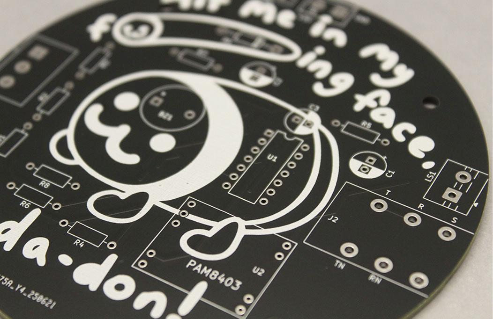

## Bill of Materials

| Componente                  | Cantidad | Comentarios          |
|-----------------------------|----------|----------------------|
| Chip                        | 1        | LM324                |
| Piezoeléctrico              | 1        |                      |
| Resistencia                 | 1        | 1M                   |
| Resistencia                 | 3        | 100k                 |
| Resistencia                 | 3        | 1k                   |
| Resistencia                 | 1        | 10k                  |
| Diodo                       | 1        | 1n4D07               |
| Condensador polarizado      | 2        | 10uF                 |
| Condensador polarizado      | 2        | 1uF                  |
| Potenciómetro               | 1        | 500k                 |
| Socket jack                 | 1        | 3.5mm                |
| Parlante (Speaker)          | 1        | 8Ω                   |
| Fuente de alimentación      | 1        | 5V máx.              |
| Socket                      | 1        | Para LM324           |
| Conectores                  | -        |                      |
| Amplificador                | 1        | PAM8403              |
| Terminal block              | 1        | 2 pin                |
| Switch spdt deslizable      | 1        | Para pcb             |
| Switch spdt circular        | 1        | Para carcasa         |

- Fue necesario adquirir un sensor piezoeléctrico. Este componente fue clave para permitir la detección de percusiones o vibraciones en el dispositivo.

## Esquemático

El primer esquemático hecho ya con una idea mas clara sobre el proyecto fue el siguiente:

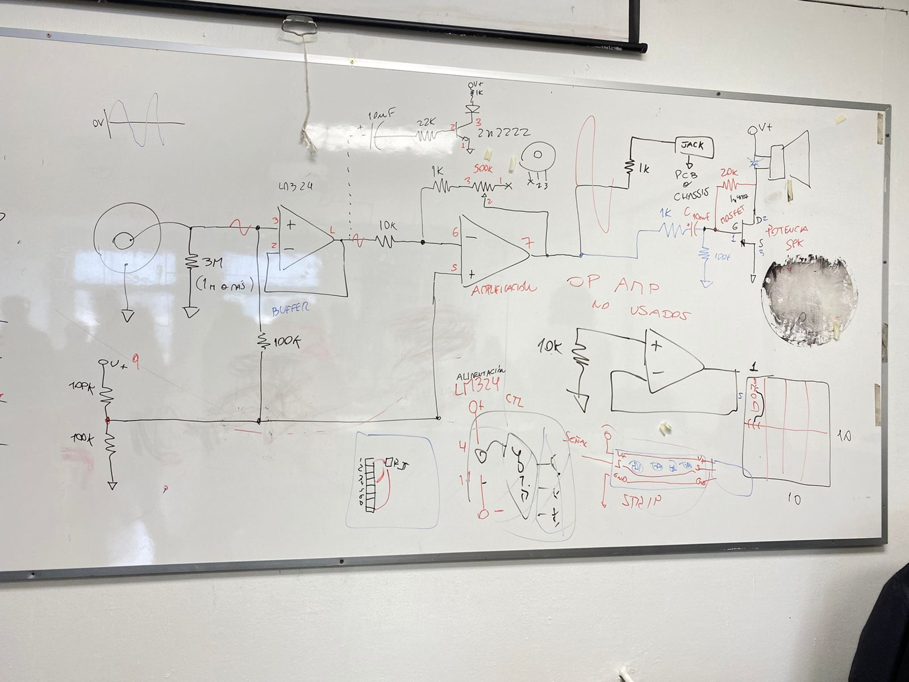

Se trabajó en base a un chip LM324 que se utilizó para la amplificación del sonido, que saldría por un parlante, se fue mutando ya que a medida que se iba probando, nos dimos cuenta de que en su mayoría los componentes se sobrecalentaban, por lo que se fueron añadiendo y restando componentes para obtener el funcionamiento deseado.

Finalmente se realizó este esquemático final gracias a la ayuda del equipo docente, donde se definió un chip amplificador PAM8403, diodos y condensadores electrolíticos que permitieron un mejor cuidado de los componentes al momento de permitir el paso de energía.

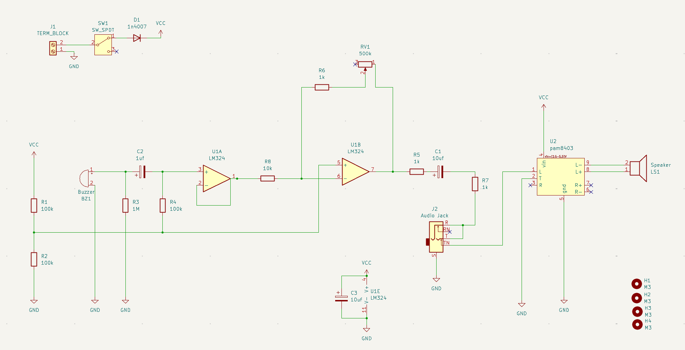

## Soldadura

Se utilizó soldadura sin plomo y los cautines del laboratorio. Además se siguieron los siguientes pasos para soldar:

1. Poner el cautín  3 segundos en el pad.
2. Colocar soldadura.
3. Mantener 3 segundos.
4. Sacar cautín.

El proceso se realizó con manos ayudantes de soldadura para mayor estabilidad de la pcb.

- Como recomendación, utilizar cinta para pegar componentes antes de soldar permitirá que estos no se muevan.
- Al finalizar todas las soldaduras, por recomendación de los docentes, colocamos un condensador de 10uf para estabilizar el paso de la energía y el sonido provocado por el piezoeléctrico.

A continuación se presentan imágenes de los componentes soldados en la pcb

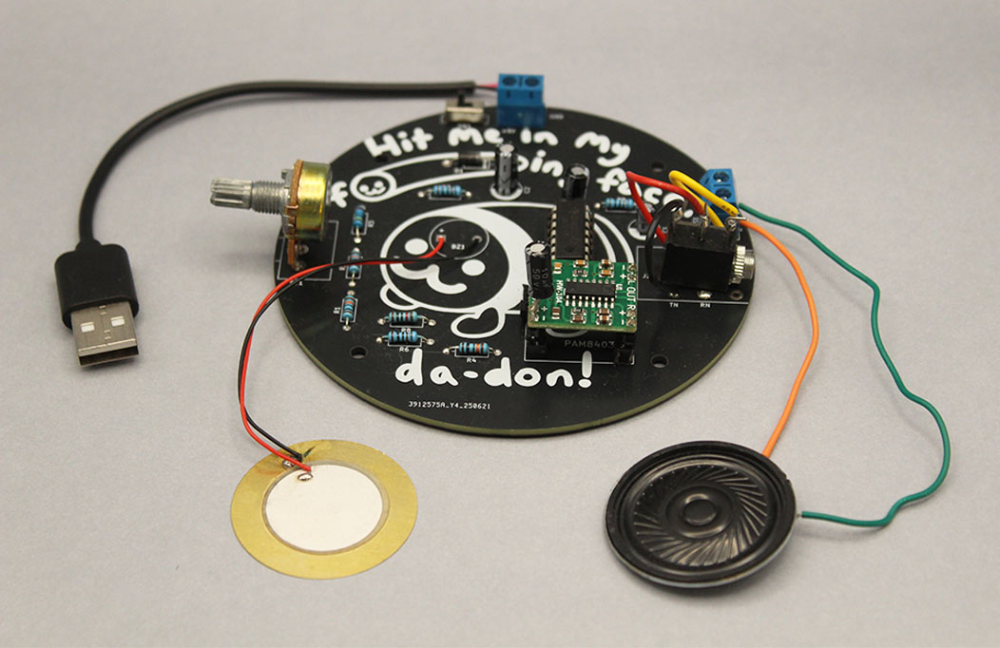

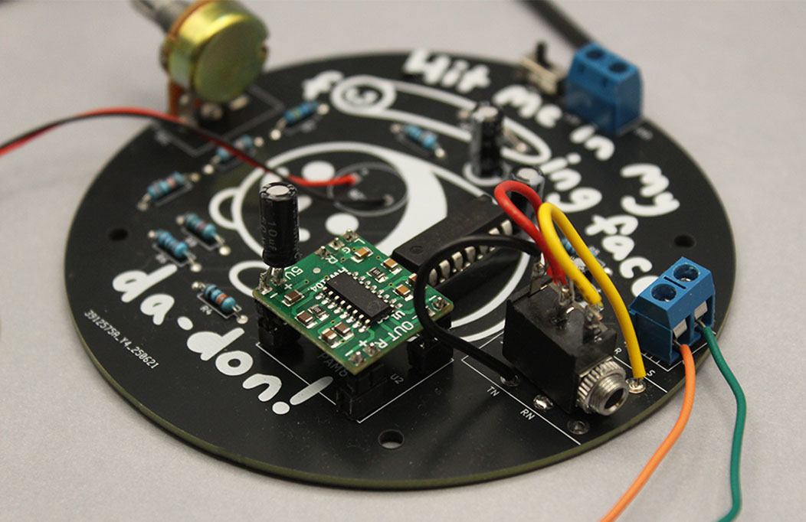

## Carcasa

La carcasa fue diseñada en forma cilíndrica como referencia a los bongos tradicionales, integrando componentes electrónicos sin perder la identidad del instrumento. 

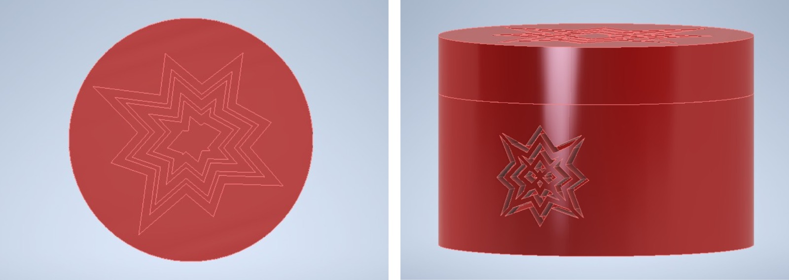

La tapa superior está diseñada para ser golpeada, funcionando como la zona de contacto principal del instrumento, desde donde se genera el sonido percusivo, contiene un espacio específico para alojar el piezoeléctrico, facilitando la transmisión directa del impacto al sensor.

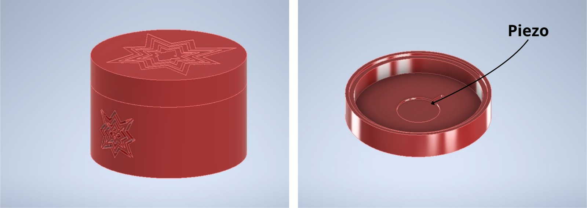

El cuerpo incluye aberturas para interruptor, jack, cable USB y potenciómetro, dispuestas para un uso cómodo y un montaje eficiente. 

En su interior, se integran soportes para la PCB y ranuras para el parlante, alineadas con calados decorativos que también permiten la salida del sonido.

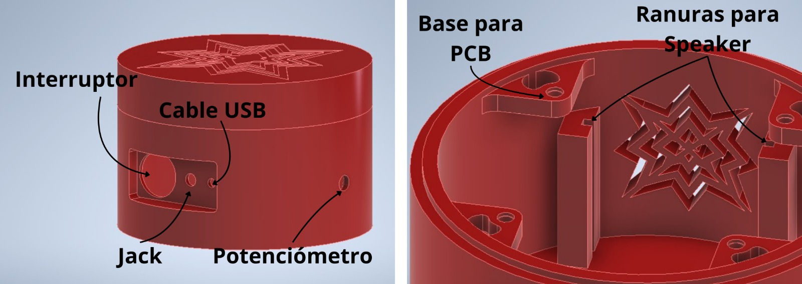

La carcasa fue fabricada mediante impresión 3D, lo que permitió optimizar el diseño para el ensamblaje interno, reducir costos y facilitar ajustes durante el desarrollo del prototipo. El resultado es una solución funcional, eficiente y coherente con el carácter del instrumento.

A continuación se presentan imágenes del protipo de la carcasa impreso en 3d

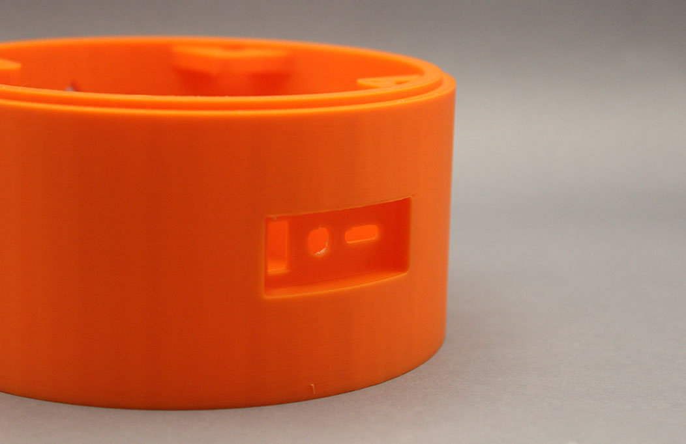

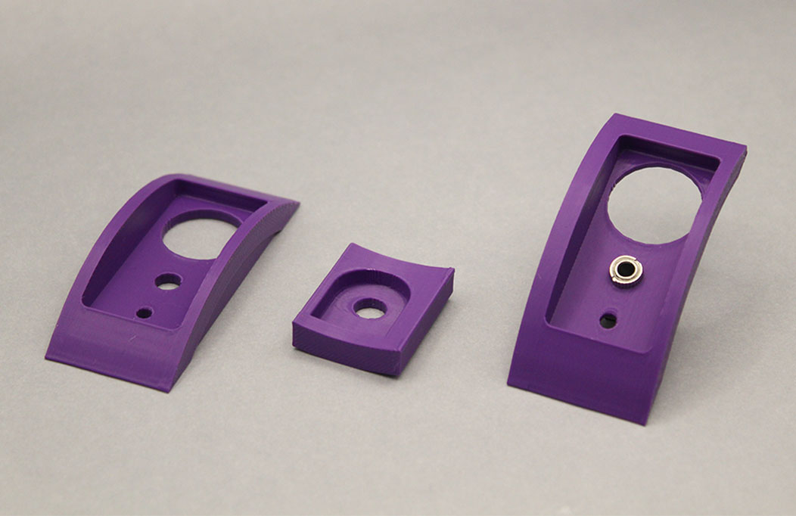

## Montaje

Para nuestro montaje se forraron todas las mesas con una tela negra y se instaló arriba de estas una iluminación que permite apreciar mejor la presentación del examen, que consiste en:

- Una pcb vacía.
- Una pcb soldada con los componentes.
- Una pcb que se replica dentro de la carcasa.
- Carcasa de prototipo como parte del proceso.
- Carcasa final.
- Protoboard como parte del proceso.
- Tablet que muestra un video sobre todo el proceso de principio a fin.

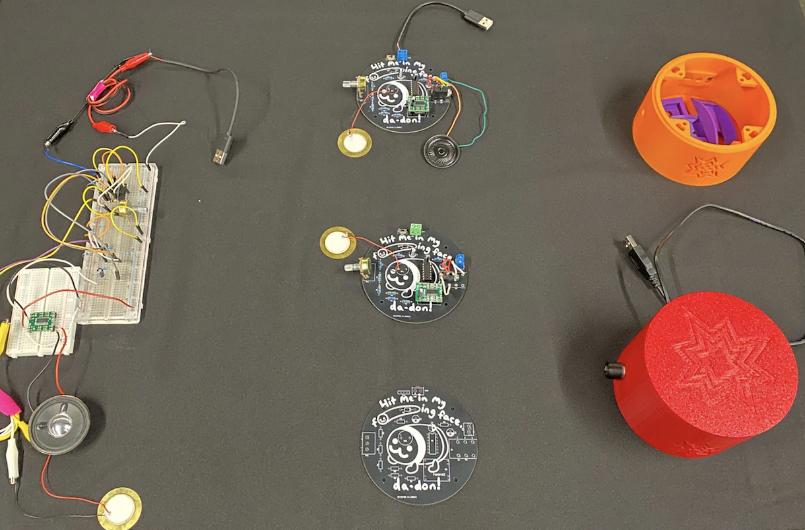

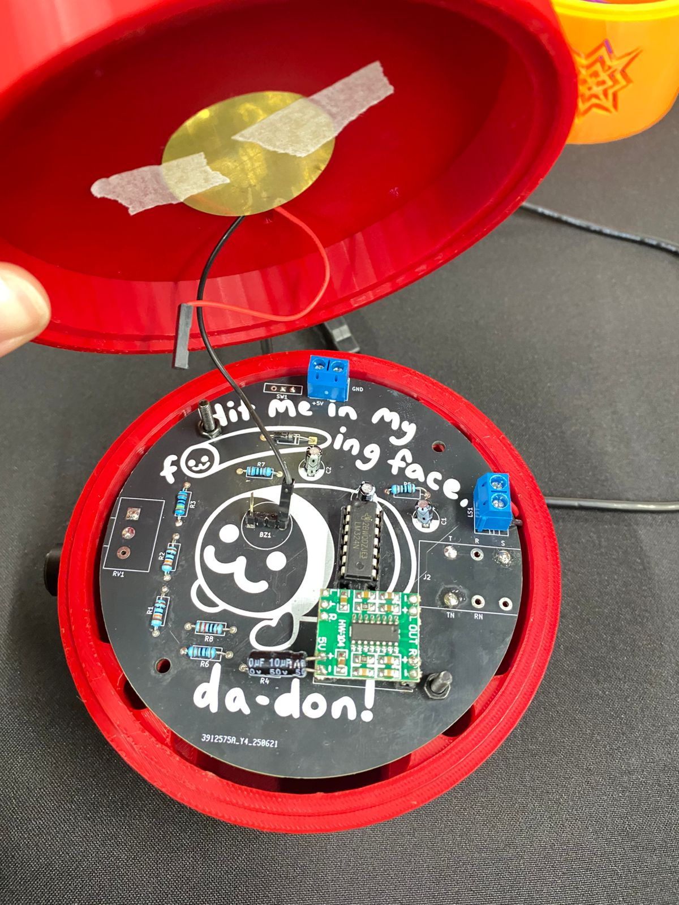
