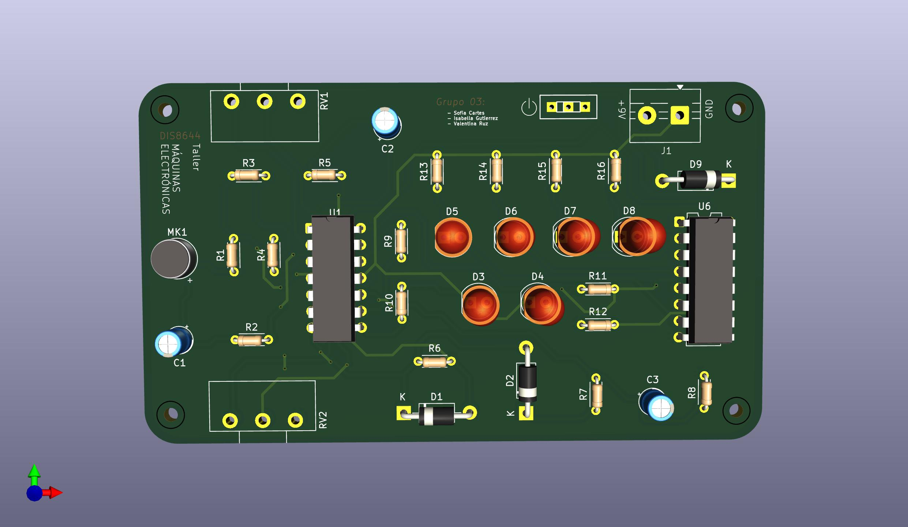
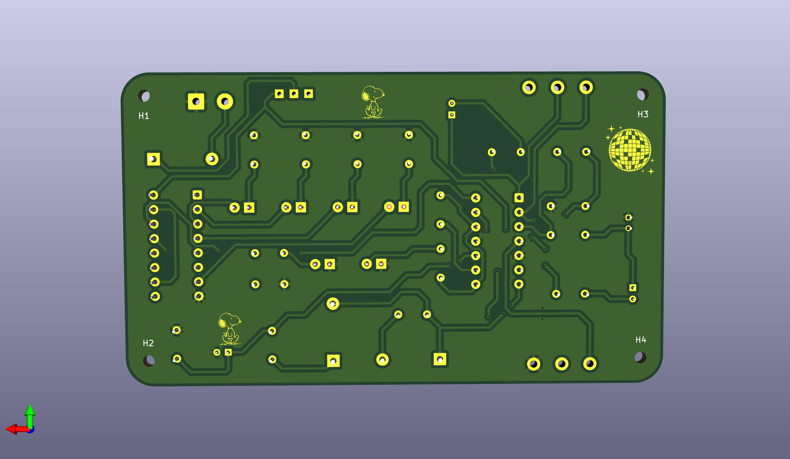
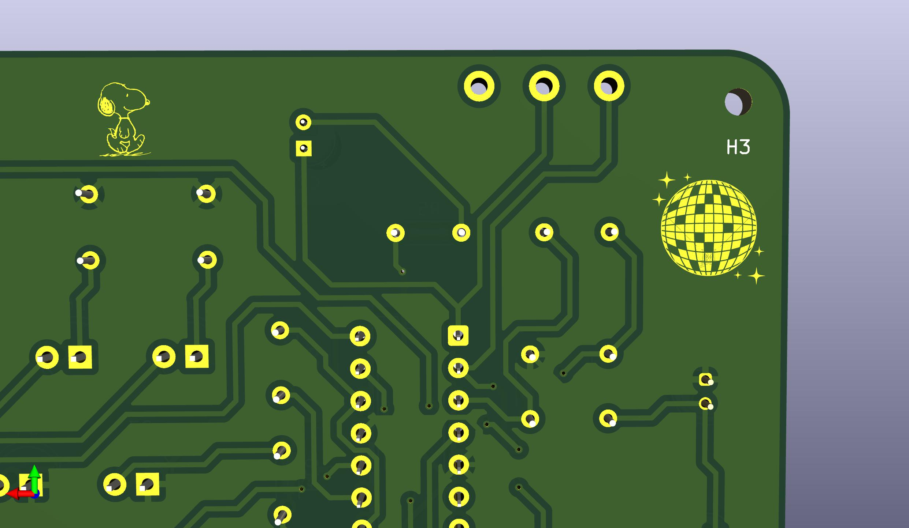

# examen

grupo-03

## Integrantes

- Sofía Cartes / [sofiacartes](https://github.com/sofiacartes)
- Isabella Gutiérrez / [isabellagutierrezm](https://github.com/isabellagutierrezm)
- Valentina Ruz / [vxlentiinaa](https://github.com/vxlentiinaa)

## Proyecto-02

- Aprendizajes

Uno de los principales aprendizajes fue desarrollar la perseverancia y la paciencia, cualidades esenciales durante todo el proceso. Esto implicó un constante trabajo en equipo, donde la colaboración y la comunicación fueron fundamentales para alcanzar el resultado final. Tuvimos que hacer y rehacer el circuito varias veces hasta lograr que funcionara correctamente. Además, profundizamos nuestros conocimientos sobre componentes electrónicos, como el potenciómetro de 1M ohm y el de 500k ohm. Estos elementos resultaron clave para regular la sensibilidad del micrófono y afinar el comportamiento del sistema. Cada etapa fue un desafío técnico y humano que enriqueció la experiencia.

Aprendimos a priorizar y organizar mejor nuestros tiempos, lo que nos permitió avanzar de manera más eficiente en cada etapa del proyecto. Supimos aprovechar al máximo los momentos "vacíos", utilizándolos para adelantar otras tareas pendientes. Este manejo del tiempo fue clave para mantener el ritmo de trabajo. Además, desarrollamos una mayor organización en el uso de los componentes, asegurándonos de tener siempre a mano lo necesario y evitando confusiones o pérdidas. Estos hábitos mejoraron nuestra forma de trabajar en equipo.

Por último, aprendimos a visualizar cómo se integraría la placa dentro de una carcasa, asegurándonos de que cumpliera con nuestros objetivos tanto a nivel de circuito como de iluminación. Cómo interactúa el objeto con el espacio, como grupo definimos que ciertos elementos sobresalen de la PCB para que el usuario interactúe con estos. Nos informamos más sobre la refracción para saber la alteración que tiene la luz, al estar en emisión con distintos elementos.

- Dificultades

Una de las principales dificultades fue lograr que el circuito funcionara de manera óptima, ya que en varias ocasiones la sensibilidad del micrófono fallaba, lo que impedía que las luces respondieran correctamente al sonido; encendiéndose solo un LED. 

También enfrentamos el desafío de probar distintos micrófonos, evaluando sus niveles de sensibilidad para encontrar el más adecuado. Sin embargo, la dificultad más decisiva surgió al integrar la placa en la carcasa final: una vez ensamblado todo, solo un LED reaccionaba al sonido. Esto nos llevó a replantear el diseño y la forma de la carcasa, tomando decisiones cruciales para asegurar el correcto funcionamiento del sistema.

Por último, la decisión de la forma de la carcasa, ya que al principio queríamos hacer una forma más orgánica pero nuestra placa estaba ordenada de una manera más lineal, por lo que decidimos hacer una forma ortogonal para seguir la misma característica de la placa.

- Soldar

Aprendizajes: Uno de los aprendizajes fue saber ordenar los cables para facilitar el proceso. Por otro lado, nos dieron como tip, colocar cinta de papel para que los componentes se mantuvieran estables. También aprendimos a utilizar los soportes para mantener la placa y los componentes. 

Dificultades: Una de las dificultades fue que a veces el estaño no unía los cables por lo que debíamos cortar para volver a empezar. 

IMAGEN
 
## PCB

Prototipado de circuitos en protoboard

- El circuito de entrada reacciona al sonido para medir la sensibilidad del micrófono, mediante un potenciómetro.
- El circuito de salida usa luces LED de colores para representar, y ver el sonido que entra en el circuito.
  
A continuación se presentan imágenes de las protoboards usadas.

A continuación se presentan imágenes de la PCB final.

## Bill of Materials

| Componente    | Cantidad | Comentarios     |
| ------------- | -------- | --------------- |
| Resistencia   | 8        | 1k              |
| Resistencia   | 4        | 10k             |
| Resistencia   | 1        | 220             |
| Resistencia   | 2        | 22k             |
| Micrófono     | 1        | CZN-15E         |
| Condensador   | 2        | 10uF            |
| Condensador   | 1        | 1uF             |
| Diodo         | 2        | 1n5819          |
| Diodo         | 1        | 1n4007          |
| Potenciómetro | 1        | 1M Ohm          |
| Potenciómetro | 1        | 500k            |
| LED           | 6     | 5mm             |
| Chip          | 1        | LM324N          |
| Chip          | 1        | 4017            |
| Terminal block | 1        | 2 pin           |
| Switch        | 1        | spdt            |
| Batería        | 1        | 9v              |  
| Socket         | 1         |  14 pins |
| Socket         |  1        | 16 pins  |
| Terminal block | 1  | 2 pin|
| Pernos m2      |4     | |

- Los LEDs de 5mm son de **colores variados**  (verde, blanco, amarillo, rojo, azul).

## Esquemático

En el primer esquemático, es el del **Chip LM324,** donde conectamos primero el micrófono, luego mediante los condensadores **regulamos la sensibilidad** de este para que capte mejor los sonidos e incorporamos dos LEDs para ver si el circuito funciona correctamente, dentro de este, el potenciómetro nos da la posibilidad de que **elijamos la receptividad.**

En el segundo esquemático es la **secuencia/contador** de luces mediante el **Chip 4017**, donde el pin 14 va al pin 14 del LM324, lo cual nos da la posibilidad de tener una **frecuencia diferente de los cuatro LEDS** incorporados,y que esta **dependa del sonido emitido.**

Primer esquemático, CHIP LM324

Segundo esquemático, CHIP 4017

DESCRIPCIÓN:

- **LM324** nos sirvió para **amplificar la señal emitida y poder regular la sensibilidad** de la recepción de los sonidos (micrófono).

CONEXIONES UTILIZADAS:

CHIP LM324

- pin 1 y 2 para la conexión con el potenciómetro la dos para la su pin central,  mientras la uno se dirige al condensador.

- pin 3 hacia dos resistencias de 10k, una hacia VCC y otra a GND.

- pin 4 a  VCC.

- pin 5 a GND.

- pin 6 va con una conexión al pin 1, pasando por la resistencia de 10k y el condensador de 1uF, anteriormente mencionados. También, está conectado al diodo 1N5819 en serie a la resistencia de 22k, intersectando con el pin 7 que está conectado al diodo 1N5819, siguiendo a la resistencia de 220, al condensador de 10uF, resistencia 10k, llegando al pin 10.

- pin 9 se dirige a la resistencia de 1k, conectando con el pin 8 dirigiéndose a GND por medio una resistencia de 1k y un LED. De igual manera, la conexión anterior pasa por el pin 12.

- pin 13 está conectado al pin central de un potenciómetro de 500k y sus otros pines uno a VCC y otro a GND.

- pin 14 hacia GND, mediante una resistencia de 1k y al LED.

CHIP 4017

- Nos sirvió para hacer la **secuencia de luces** con un reset por cada beat.

- Desde el pin 14 del LM324N se dirige al pin 14 del 4017.

- pin 2 hacia un LED, con un color predeterminado, consecutivamente a una resistencia de 1k llegando a GND. Se repite esto con los pins 3, 4 y 7.

- pin 8 a GND.

- pin 13 va a una resistencia de 100k, finalizando en GND.

- pin 15 para hacer reset se conecta al pin 10.

- pin 16 a VCC.

## kicad

## Recursos adicionales

- El **Chip LMV324M** del SparkFun Sound Detector **lo desglosamos**, por así decirlo, para tener el chip aparte y **poder regular la sensibilidad del micrófono.**

<https://www.sparkfun.com/sparkfun-sound-detector.html>

## Soldadura

Se utilizó soldadura sin plomo y los cautines del laboratorio (ersa i-con pico) (weller) a 400°C.

- Pasos para soldar:

1. Se pone el cautín  3 seg. en el pad para calentar.
2. Colocar soldadura.
3. Mantener 3 seg.
4. Sacar cautín.

El proceso se realizó con mucho cuidado.

**Recomendaciones:** Utilizamos cinta de papel para que los componentes no se movieran y antes de soldar, revisamos el esquemático y medimos con multímetro cada componente para verificar su valor.

Solo ocurrieron **dos percances**, ya que el socket del 4017 lo colocamos al revés pero, esto tiene **diferencia mecánica y no eléctrica** . Por otra parte, la huella de las resistencia en kicad es más pequeña pero los acomodamos para que quepan bien sin problemas.

IMAGENES 

## Carcasa

Decidimos hacer una forma ortogonal, ya que nosotras relacionamos la electrónica con la **geometría,** debido a la **representación gráfica** que pusimos en la pcb, por eso decidimos seguir con la idea en cuanto a la forma de un **prisma** ya que, al buscar sobre los estados de la luz encontramos uno que es el **espectro visible.**

Según **Erco**, el espectro visible "Se denomina espectro a la distribución de las **ondas electromagnéticas.** Solo una pequeña parte en el rango entre 380 y 780 nanómetros (nm) es visible para el ser humano; Este rango es lo que **denominamos luz."**

<https://www.erco.com/es/planificacion-de-iluminacion/conocimientos-luminotecnicos/fotometria/espectro-visible-7528/>

En otras palabras, es cuando la luz pasa a través de un prisma o cristal y emite una **reflexión de colores.**

- Decisión de materiales y colores
  
**Materiales:**

Impresión 3D PLA + (marca esun). Realizado en Bambulab.
  
Vinilo tornasol transparente. Comprado en Mercado Libre.

Acrílico transparente de 2 mm. Comprado en Acrílicos Chile.

Colores utilizados:

Impresión 3D PLA+ rosado ya que, el vinilo utilizado tiene esta tonalidad, comprado en Mercado Libre.

Impresión 3D PLA+ rosada ya que, el vinilo tornasol que utilizamos tiene tonalidades rosadas.

Vinilo tornasol transparente.

Acrílico transparente.

## Montaje

IMAGENES
