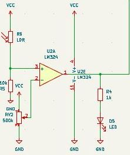
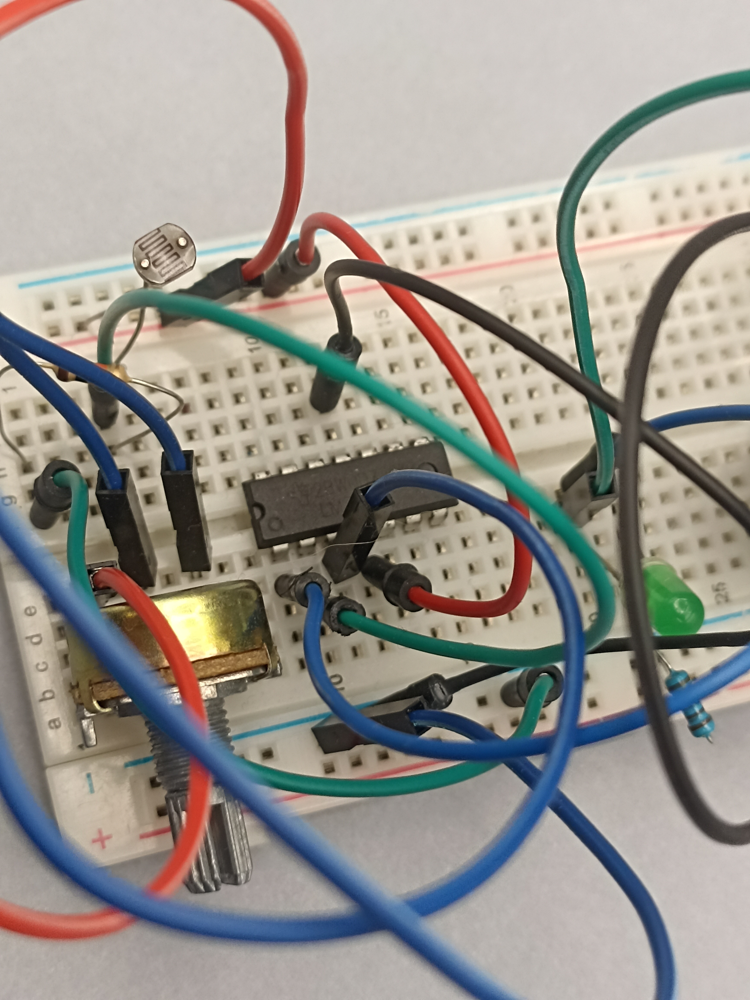
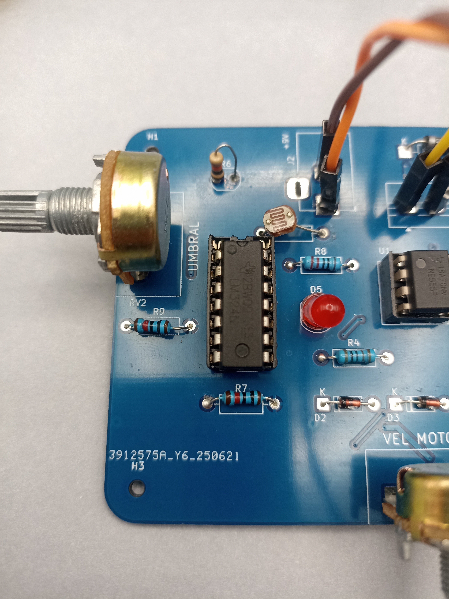
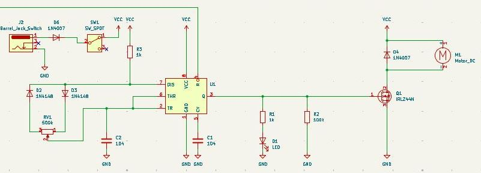
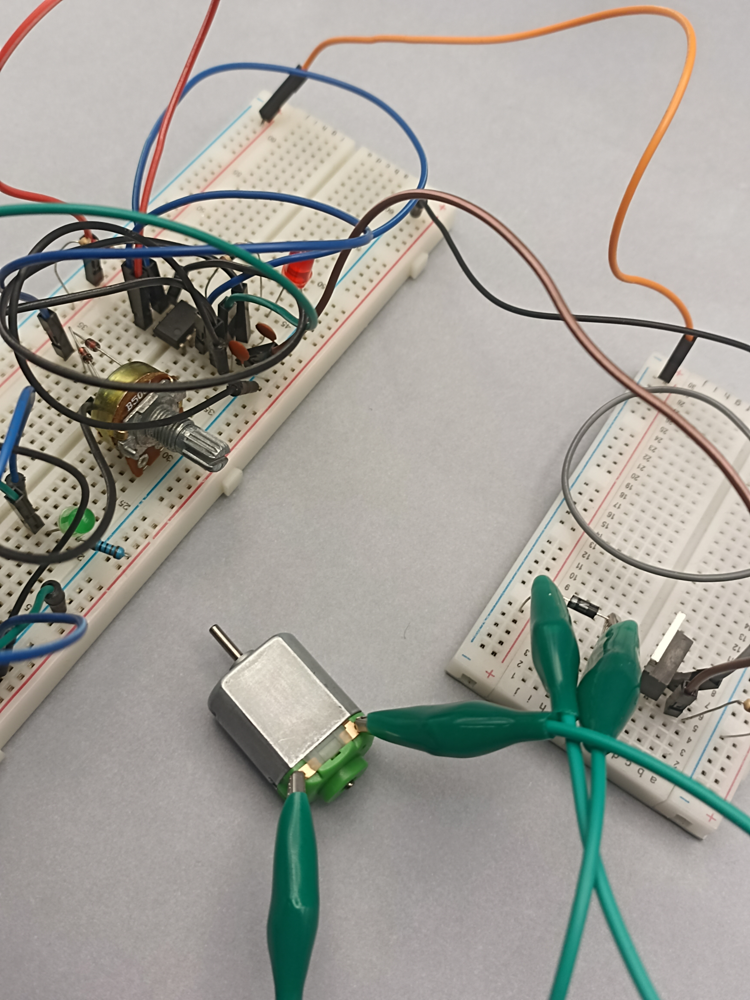
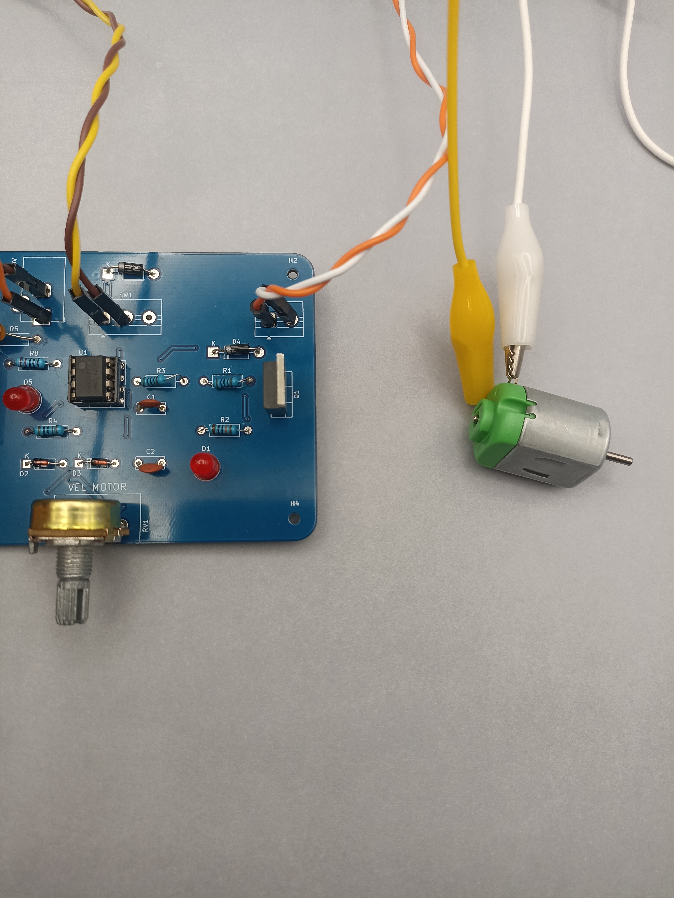
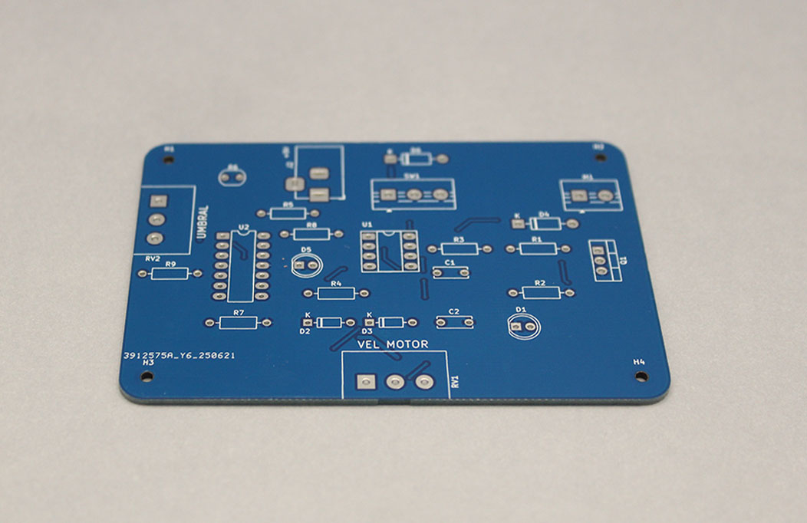

# examen

grupo-04

## Integrantes

- [Braulio Figueroa](https://github.com/brauliofigueroa2001)
- [Carlo Martínez](https://github.com/zaaaiko)
- [Bastian Solís](https://github.com/HSB25)

## Proyecto-02

aprendizajes: como equipo uno de los mayores aprendizajes que tuvimos en el proyecto 2 es que hay que hacer las cosas con tiempo para que nos salgan bien para no llegar justos con los plazos de entrega.

dificultades: una de las mayores dificultades que tuvimos como equipo fue la comunicación entre nosotros.

## Descripción del proyecto

El proyecto MeowTech es un juguete interactivo para gatos que se encuentran solos la mayor parte del tiempo, que tengan espacios de juego poco recreativos y necesiten un dispositivo para entretención de forma independiente y autónoma.

Es por ello que se llegó a la conclusión de que tenía que ser un objeto que se mueva solo, de una forma suficientemente autónoma para que el gato pueda jugar con la menor intervención humana posible. Para esto se ideó que debíamos usar alguna especie de motor que nos diera movimiento sobre el juguete y también algún sensor que detectara la presencia del gato, en este caso un sensor LDR. El proyecto mezcla aspectos de un circuito detector de sombra y por otra parte una variación de un circuito pwm.

### Primeros bocetos y referentes

**Petr Válek**

Petr Válek es un artista electrónico, de ruidos analógicos, proveniente de República Checa. Sus obras usan muchos materiales caseros y chatarra para ser realizadas. Utiliza mucho los motores para hacer girar cosas y que se golpeen entre sí generando diversos sonidos. Lo que rescatamos de este referente es más que nada el uso del motor y el cómo hace girar los objetos con estos mismos, por eso pensamos que podía ser un buen referente para un juguete de gato. En un principio se exploró el concepto de motor vibrador pero finalmente no fue realizado.

Petr Válek - Kinetic

Lo que se busca es que **al subir el gato a la plataforma, un sensor LDR detecte sombra y active el motor para que se mueva el juguete de forma automática**, para ello el proyecto fue estudiado y se basó en el siguiente esquemático.

## Esquemático

El circuito electrónico del proyecto tiene los siguientes componentes principales:

- Detector de sombra
  - Divisor de voltaje
  - Comparador de voltaje
- Controlador de motor
  - Chip 555 en modo astable
  - Transistor como interruptor
  - Motorreductor

### Detector de sombra

El detector de sombra tiene como entrada un sensor LDR, que es un resistor variable según la luz que detecta. Este LDR es uno de los dos resistores en un circuito divisor de voltaje.

Este divisor de voltaje es luego alimentado como entrada a un circuito comparador de voltaje. Este circuito está implementado con un amplificador operacional LM324, que compara el voltaje asociado a luz/sombra contra un umbral, que definimos con un potenciómetro para poder afinar el circuito.

Como refuerzo visual al funcionamiento del circuito, usamos un LED en paralelo que muestra si el comparador detecta o no sombra.

### Controlador de motor

La salida del amplificador operacional LM324 en su pin 1 es alimentada como entrada al pin 4 de un chip 555, configurado en modo astable.

La salida del chip 555 es la que controla si debemos o no mover el motor. Como esta señal de control no es suficiente para mover el motor del circuito, usamos un transistor conectado como interruptor controlado por voltaje, que regula el paso o la ausencia de energía alimentada al motor al final de la cadena.

## Protoboard

El desarrollo de la protoboard es el primer paso para que nuestro circuito sea probado y verifiquemos que todo funcione de la manera en la cuál propusimos. 

Debido a que el esquemático en el cuál está basado la protoboard contiene muchos componentes, decidimos que la forma más ordenada y clara de trabajarlo era con dos protoboard conectadas entre sí para que de esta forma se entendiera mucho mejor el circuito y no diera problemas estéticos ni de espacio.

## PCB

El proceso de pcb consistió en traspasar el circuito de la protoboard a una placa pcb, para esto se buscó seguir de la mejor manera posible lo que ya estaba armado en esquemático y protoboard para mantener un orden y coherencia con lo que ya se había planteado. En este caso no es necesario seguir al 100% la composición de la protoboard ya que se busca la mejor forma en que la placa quede ordenada, por lo que se pueden plantear cambios de posición en conveniencia de la placa.

## Soldadura

## Carcasa

## Montaje
