# examen

grupo-04

## Integrantes

- [Braulio Figueroa](https://github.com/brauliofigueroa2001)
- [Carlo Martínez](https://github.com/zaaaiko)
- [Bastian Solís](https://github.com/HSB25)

## proyecto-02

aprendizajes:

dificultades:

## Descripción del proyecto

El proyecto Meowtech es un juguete interactivo para gatos que se encuentran solos la mayor parte del tiempo, que tengan espacios de juego poco recreativos y necesiten un dispositivo para entretención de forma independiente y autónoma.

Es por ello que se llegó a la conclusión de que tenía que ser un objeto que se mueva solo, de una forma suficientemente autónoma para que el gato pueda jugar con la menor intervención humana posible. Para esto se ideó que debíamos usar alguna especie de motor que nos diera movimiento sobre el juguete y también algún sensor que detectara la presencia del gato, en este caso un sensor LDR. El proyecto mezcla aspectos de un circuito detector de sombra y por otra parte una variación de un circuito pwm.

### primeros bocetos y referentes

Petr Válek - Kinetic

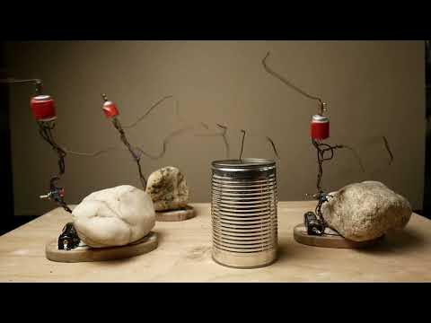

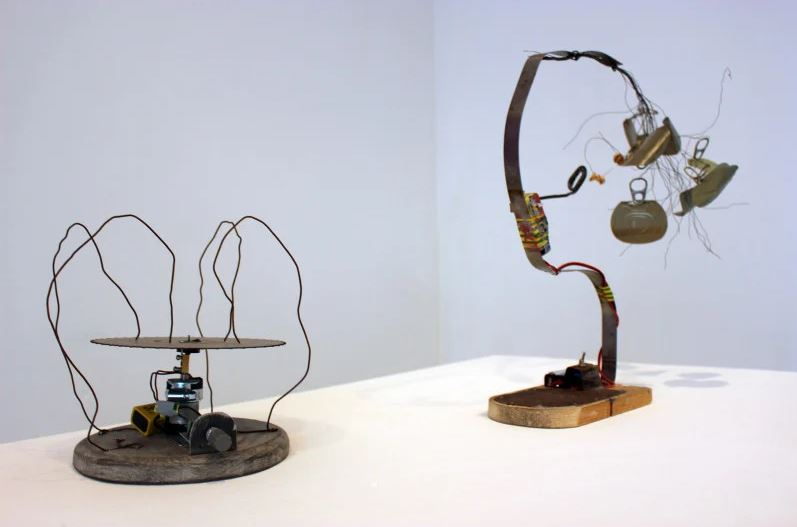

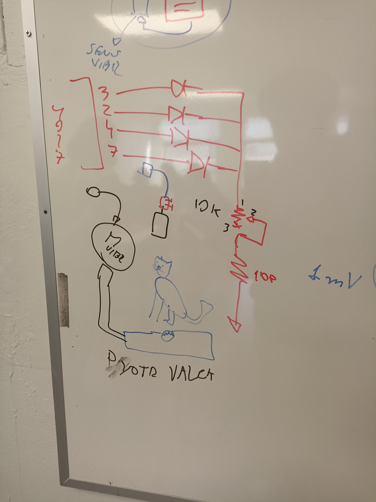

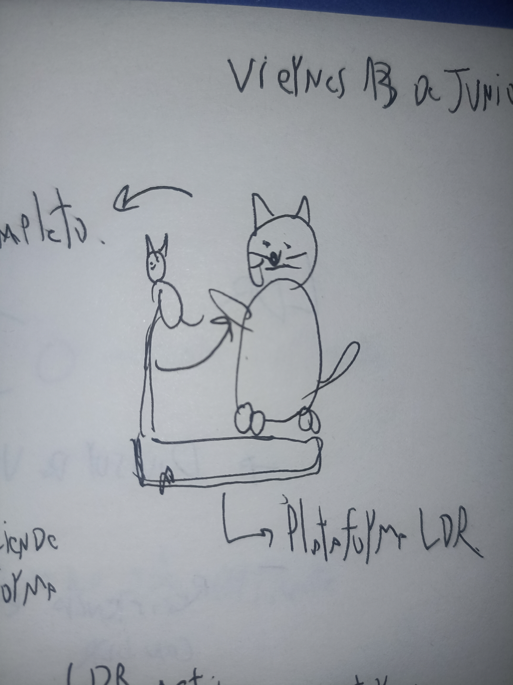

Lo que se busca es que **al subir el gato a la plataforma, un sensor LDR detecte sombra y active el motor para que se mueva el juguete de forma automática**, para ello el proyecto fue estudiado y se basó en el siguiente esquemático.

## Esquemático

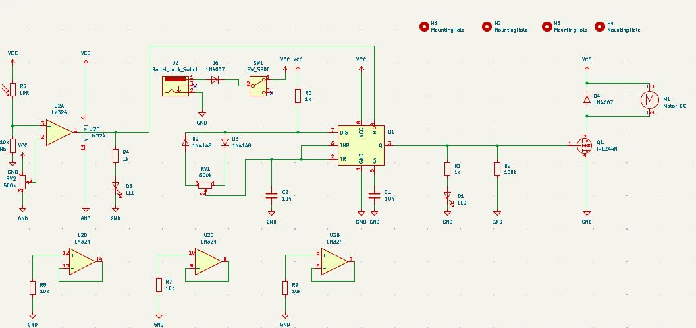

El circuito electrónico del proyecto tiene los siguientes componentes principales:

- Detector de sombra
  - Divisor de voltaje
  - Comparador de voltaje
- Controlador de motor
  - Chip 555 en modo astable
  - Transistor como interruptor
  - Motorreductor

### Detector de sombra

El detector de sombra tiene como entrada un sensor LDR, que es un resistor variable según la luz que detecta. Este LDR es uno de los dos resistores en un circuito divisor de voltaje.

Este divisor de voltaje es luego alimentado como entrada a un circuito comparador de voltaje. Este circuito está implementado con un amplificador operacional LM324, que compara el voltaje asociado a luz/sombra contra un umbral, que definimos con un potenciómetro para poder afinar el circuito.

Como refuerzo visual al funcionamiento del circuito, usamos un LED en paralelo que muestra si el comparador detecta o no sombra.

AGREGAR FOTOS DE ESQUEMATICO, DE DETALLE DE PROTOBOARD, Y DE DETALLE DE PCB.

### Controlador de motor

La salida del amplificador operacional LM324 en su pin 1 es alimentada como entrada al pin 4 de un chip 555, configurado en modo astable.

La salida del chip 555 es la que controla si debemos o no mover el motor. Como esta señal de control no es suficiente para mover el motor del circuito, usamos un transistor conectado como interruptor controlado por voltaje, que regula el paso o la ausencia de energía alimentada al motor al final de la cadena.

AGREGAR FOTOS DE ESQUEMATICO, DE DETALLE DE PROTOBOARD, Y DE DETALLE DE PCB.

## protoboard

El desarrollo de la protoboard es el primer paso para que nuestro circuito sea probado y verifiquemos que todo funcione de la manera en la cuál propusimos. 

Debido a que el esquemático en el cuál está basado la protoboard contiene muchos componentes, decidimos que la forma más ordenada y clara de trabajarlo era con dos protoboard conectadas entre sí para que de esta forma se entendiera mucho mejor el circuito y no diera problemas estéticos ni de espacio.

## PCB

## Soldadura

Una vez verificado el funcionamiento del circuito en la protoboard, avanzamos a la siguiente fase del proyecto: la soldadura y ensamblaje de la PCB (Placa de Circuito Impreso). Esta etapa consistió en trasladar el diseño electrónico funcional desde la protoboard a una placa fabricada previamente, siguiendo un diseño generado en software especializado.

Esta fue una experiencia completamente nueva para nosotros, ya que nunca habíamos realizado soldaduras electrónicas antes. Gracias a la clase de soldadura impartida durante el curso, pudimos aprender las técnicas básicas y luego ponerlas en práctica para soldar correctamente los componentes en la PCB del proyecto.

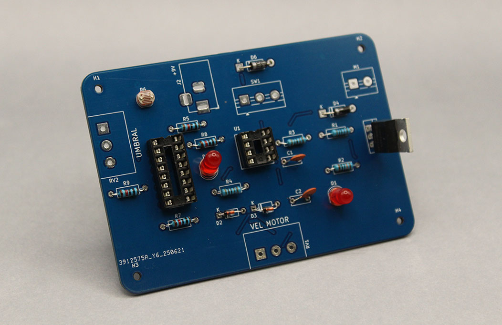

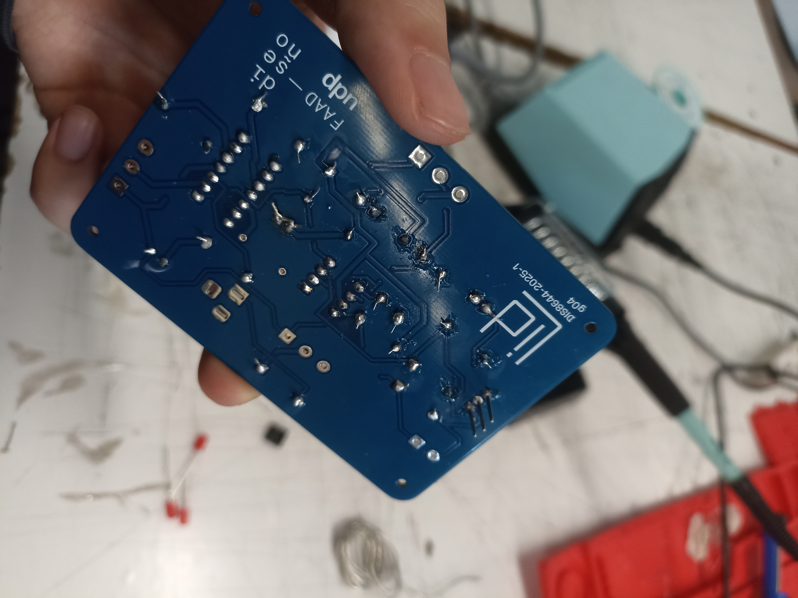

# Durante esta etapa, soldamos un total de tres placas:

### 1. Placa principal (carcasa)

Es la placa que está instalada dentro de la carcasa del juguete. En esta versión, utilizamos **cables largos** para poder alcanzar componentes que se encuentran en distintas zonas del exterior, como:
- Sensor LDR
- Motor 9V
- 2 potenciómetros
- Terminal Jack de alimentación 

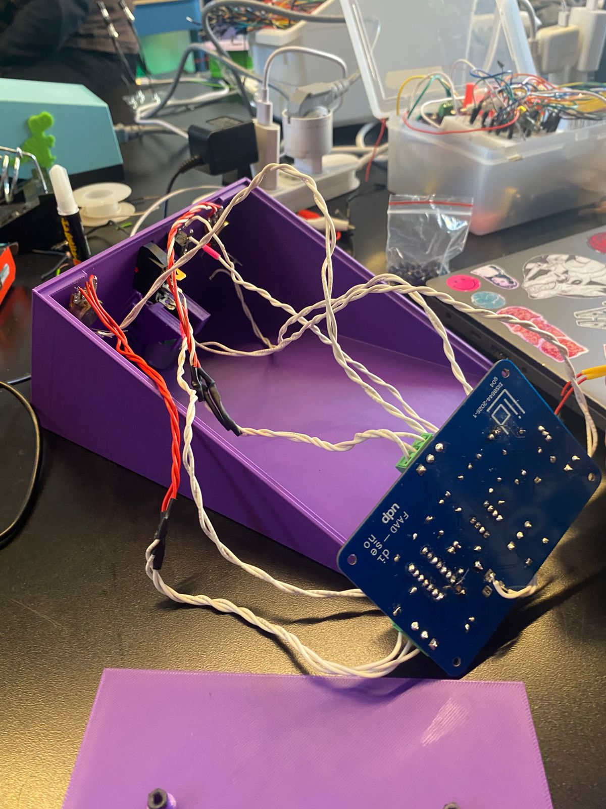

### 2. Placa de muestra

Esta placa fue diseñada con **cables más cortos**, lo cual la hace más cómoda para pruebas, validaciones y para entender visualmente cómo funciona el circuito sin la carcasa. Es la que usamos en las demostraciones.

### 3. Placa de repuesto

Similar a la placa de muestra, pero armada con **cables trenzados y terminal blocks**, lo que facilita el reemplazo o conexión rápida de componentes si fuera necesario. Como se puede apreciar en las imágenes.

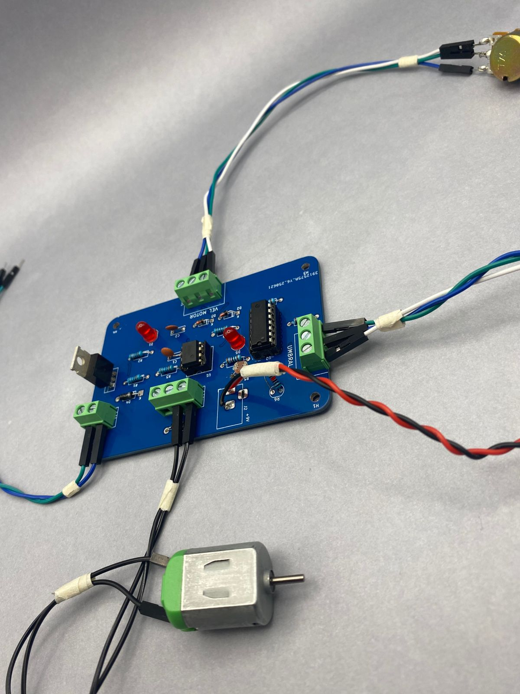
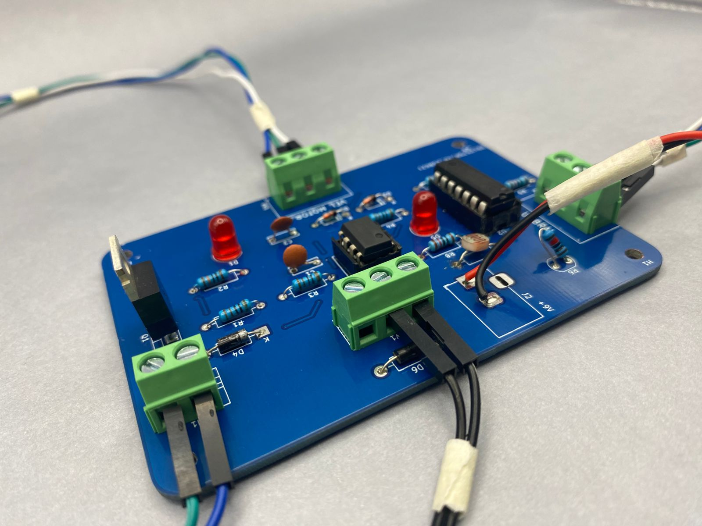

## Desafíos durante la soldadura

Durante el proceso de armado, nos enfrentamos a distintos **problemas técnicos**:

- **Errores en la PCB:** Algunas conexiones estaban mal ubicadas o fallaban. Gracias a la ayuda de **FRAN UDP**, aprendimos a **hacer puentes con cables** y **cortar pistas de cobre en la parte posterior** para corregir errores y redirigir conexiones utilizando flex.
- **LED de velocidad del motor:** Este LED, que funcionaba correctamente en la protoboard, **no encendía en la PCB final**. Pero si funcionaba en la Protoboard.
- **Orientación de componentes:** Aprendimos sobre la correcta orientación de los polos de componentes como transistores, diodos y el LDR. A medida que soldábamos más placas, nuestro entendimiento sobre polaridad y ubicación mejoró considerablemente.
- **Problema con el LDR en la placa principal:** En la PCB principal, la que va dentro de la carcasa, el **LDR no funcionaba correctamente**, o su señal era **muy débil**. Esto se debió a un problema con las **resistencias SMD** en el diseño de la placa. Estas resistencias, al tener un **espacio muy pequeño entre el pin del LDR y la conexión a tierra**, generaban una **resistencia muy baja**, lo que impedía que el LDR recibiera la corriente adecuada. Como resultado, el sistema estaba **alimentando una resistencia fija de 10k** en lugar del LDR, y por eso este último no actuaba como debía. Este fue un error difícil de identificar inicialmente, pero nos ayudó a comprender mejor cómo afectan las pistas y componentes del diseño a nivel físico.

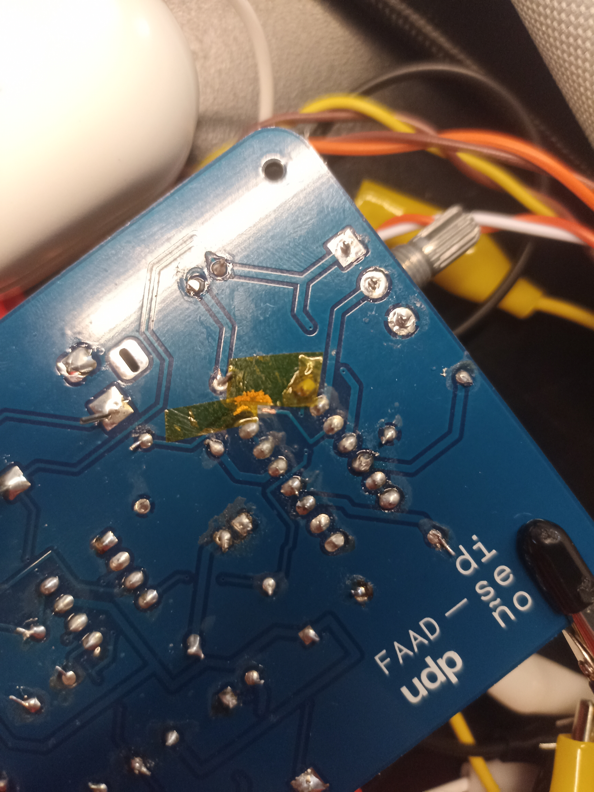

## Aprendizaje despues de la soldadura

Esta etapa fue una experiencia súper completa y práctica. No solo repasamos lo que habíamos aprendido en clases, sino que también pusimos manos a la obra y aprendimos a soldar y armar placas reales por primera vez. Fue un proceso donde realmente entendimos cómo funcionan las cosas, y también cómo detectar y corregir errores cuando algo no anda bien.

El hecho de haber soldado tres placas distintas nos ayudó mucho a entender mejor los componentes, cómo conectarlos bien, y a tener más confianza con las herramientas y materiales.

## carcasa

## montaje
