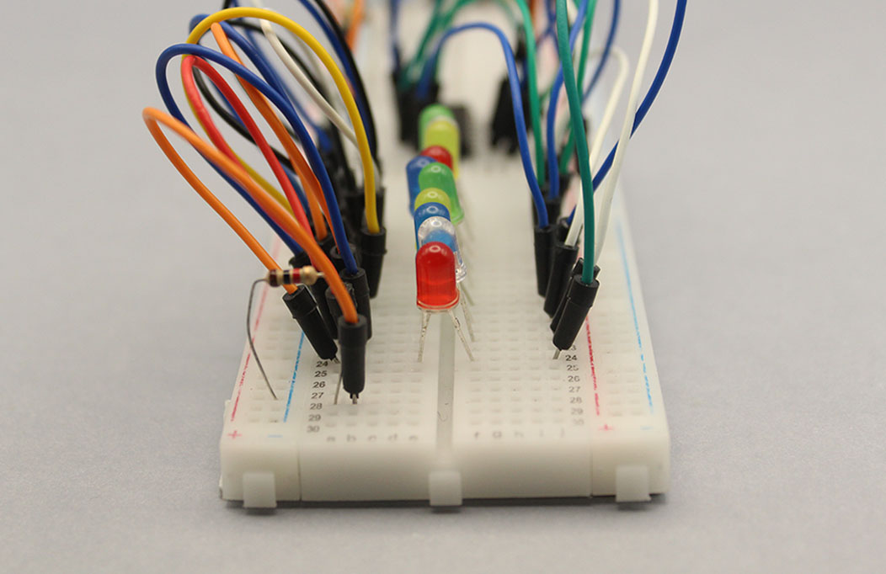

# examen

grupo-05

## integrantes
  - Antonia Cristi [@antocristi](https://github.com/antocristi)
  - Natalia Pilar [@sz-mada](https://github.com/sz-mada)
  - Paulina Vargas [@paulinavargasf](https://github.com/paulinavargasf)

## proyecto-02

### aprendizajes

Pedir ayuda a gente externa al equipo (específicamente los grupos 00), organizarnos en estaciones de trabajo para facilitar el avance durante el día

### dificultades

El circuito de la ruleta en las placas no funcionaba como se esperaba

Los cables para soldar los componentes colgantes se cortaban constantemente a la altura de la placa

Se nos olvidó quitar un chip al momento de soldar y lo quemamos, pero conseguimos darnos cuenta y cambiarlo

El circuito no recibía el input del LDR

[FranUDP](https://github.com/FranUDP) y Aarón nos ayudaron a darnos cuenta que el chip LM324 no lo habíamos conectado a tierra ni VCC en el esquemático, así que en la placa final tampoco estaba conectado

La solución que nos dió Aarón, fue conectar los pines 4 y 11 externamente a la alimentación de la placa

## PCB

Protoboards de prototipado

El proyecto consiste en dos circuitos paralelos; el primero consiste en un detector de sombra y una secuencia de leds de 10 pasos, y el segundo de un micrófono electret que activa una luz led. Estos circuitos no afectan entre sí, y tan solo son un truco para el usuario.

Imágenes de las protoboards

Imágenes de las placas PCB

## soldadura

Decidimos soldar las placas a lo largo de distintos días.

Inicialmente, soldamos una de cada placa con todos los componentes directo en estas para asegurarnos que todo funcionara como debía.

Luego, las otras placas las soldamos con cables para poder montar en la carcasa, pero tuvimos problemas ya que estos cables tendían a cortarse muy fácilmente.

Finalmente, luego de terminar de soldar y arreglar los cables cortados, montamos las placas correspondientes a la carcasa.

## carcasa

La carcasa se hizo en dos partes, la tapa con terciado de 3mm, y el contendor con impresión 3D PLA+ en Bambulab.

Las luces LED de la ruleta se colocaron en la parte superior de la carcasa en forma de arco, y el LDR fue situado en el centro para ser accesible al usuario.

Para la tapa decidimos agregar un diseño inspirado por la rueda de la fortuna de las cartas de tarot, con el centro de esta ruleta alineándose con el LDR.

Imágenes de la carcasa

## montaje

????
