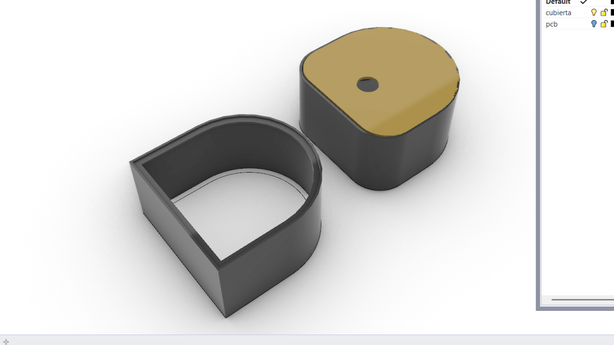

# Examen

grupo-0a

## Integrantes

- [Félix Rodríguez Guevara](https://github.com/felix-rg416/)
- [Alanis Vásquez Jara](https://github.com/AlanisMria)

## Labores

Este grupo ayudó a los equipos del Taller de Máquinas Electrónicas a desarrollar sus exámenes, considerando aspectos formales, materiales e interacción con el usuario, mediante el uso de modelado e impresión 3D.

Se usaron los programas de modelado Rhinoceros, Inventor y los slicers de Creality y Bambu lab, para imprimir las carcasas de cada proyecto con las impresoras y filamentos disponibles en el laboratorio de interacción.

Este grupo surgió en la semana del 6 de junio, cuando el equipo docente propuso la iniciativa.

Como evaluación inicial tuvimos que crear una carcasa para la UDPUDU y realizar cotizaciones de productos que necesitaría cada grupo para fabricar su carcasa.

## Cotización

| Materiales de fijación | Especificación  | Cantidad | Precio | Proveedores |
| ---------------------- | --------------- | -------- | ------ | --------------------------------------------------------------------------------------------------------- |
| Pernos | M3 20mm DIN7985 | 50 | $5.500 | [Victronics](https://www.victronics.cl/hardware/perno-m320-cincado-negro-din7985-50u/) |
| Tuercas | M3 DIN934 | 20 | $1.936 | [Victronics](https://www.victronics.cl/hardware/tuerca-m3-cincado-negro-din934-50u/) |
| Adhesivo instantaneo | La Gotita | 2 | $2.780 | [Mercado libre](https://articulo.mercadolibre.cl/MLC-2031807832-la-gotita-gel-3gr-_JM?matt_tool=16931662) |

| Materiales | Especificación | Cantidad    | Precio  | Proveedores |
| -------------- | -------------- | ----------- | ------- | ------- |
| Acrilico | 3mm o 2mm | 1 de 120x40 | $10.800 | Acrilicos Chile |
| Terciado | 3mm | 1 de 144x220cm   | $9.800  | [Imperial](https://www.imperial.cl/terciados/terciado-eucaliptus-rosado-3mm-144x220mt/product/104758?srsltid=AfmBOopOXERjgIg-dKOKwRMRTMQxq2_KSK7vkKB4Qd6P6lHKCeTpgV_4) |
| Filamentos | PLA+ 1.75 | Por definir | $14.380 | [TodoToner](https://www.todotoner.cl/impresoras/impresoras-3d/filamentos/pla-plus-1kg-rojo-fuego-esun?source_impresee=7cs24374qdr2d7y72u3ig2b6p2)                      |

## UDPUDU

La UDPUDU es la primera placa de circuito impreso que se mandó a hacer al extrantero. Su función es reproducir sonidos usando pinzas caimán para conectar losse  objetos, usando cosas cotidianas como resistencias variables. La idea es que la pcb pueda ser visible, para dejar de lado la incógnita de la caja negra. Por lo tanto decidimos usar acrílico para la parte superior y PLA para lo demás. La carcasa debe tener espacio para una entrada jack, un cable USB como fuente de poder y un espacio para pinzas caimán

---

La semana del 17 de junio comenzamos a hablar con los grupos para saber quiénes los integran y qué proyecto quieren realizar. Categorizamos los conceptos necesarios para la fabricación, entre estos están: la función, input y output, el contexto, el usuario y las dimensiones, además les preguntamos la forma que imaginan para su proyecto.

La semana del 30 de junio se estipula un plazo máximo hasta el martes 8 de julio para tener todas o la mayor parte de las carcasas listas.

A pesar de que este plazo fue cumplido muchos grupos tuvieron inconvenientes, sin embargo, se logró antes del viernes 11 de julio.

## Grupo-01 KET-cloud

- Emilia Contreras
- Katalina Riquelme
- Thyare Santander

### Placa de circuito impreso-01

#### Descripción del proyecto 01

Es una luz de noche hecha a partir de un detector de sombra invertido. Se enciende con una secuencia gradual.

#### Proceso 01

El proyecto tiene forma de nube, una forma suave y clara, que acompaña al dormir o querer un momento tranquilo y de relajación.

Este grupo decidió, desde el inicio, ser parte única del desarrollo de todos sus procesos, fabricaron cada parte de su proyecto llegando a muy buenos resultados. Al igual que las demás carcasas, está fabricada en impresión 3D con filamento PLA blanco.

## Grupo 02 Bongazo

### Integrantes 02

- Sofia etchepare
- Antonia Fuentealba
- Sofía Pérez

#### Placa de circuito impreso 02

#### Descripción del proyecto 02

Es un instrumento de percusión que mediante un piezo eléctrico se envían señales para alterar la frecuencia de un speaker.

#### Proceso 02

Desde el primer momento tuvieron definida una identidad visual que se complementa perfectamente con las decisiones formales, al integrar ambos aspectos se consiguió que el objeto invite a la percusión mediante su color vibrante y formas puntiagudas presentes en su logo. El equipo nos pidió ayuda con el diseño, modelado e impresión de la carcasa, ya que, al ser de la mención gráfico, no están familiarizadas con el modelado 3D.

Usaron de referente el EF105 [Drum Thing](https://www.electrofaustus.com/ef105-drum-thing), un “Dispositivo de ruido”. En el tema de la carcasa, se guiaron por el color vibrante y el dibujo en la parte superior.

Ellas nos propusieron la forma principal y las dimensiones, usando un cilindro para imitar a un tambor, querían usar PLA rojo vibrante para llamar la atención.

Como primera propuesta se planteó que este cilindro se abriera por la parte de abajo y tuviera un soporte voladizo para el piezo, más adelante el diseño tomó un curso diferente.

Pusimos una figura con puntas simulando una explosión o golpe en la parte superior y en el lado del parlante para que se asimile con una explosión de sonido.

Ubicamos los componentes de forma que cada uno tenga su lugar. En la parte superior, dentro de la tapa, se encuentra el piezo, ya que es el lugar donde éste recibirá las señales al ser golpeado. En el interior, en uno de los laterales, está el potenciómetro con una perilla para un agarre más amigable, a la derecha de este están los espacios para el interruptor, la entrada jack y la salida del cable USB. En el lateral contrario, se encuentran unos rieles para ubicar el speaker de forma que quede fijo a la carcasa. Finalmente, sobre todos esos espacios, están las bases donde se ubicará la PCB.

En el proceso hicimos una prueba para ver cómo sería finalmente.

Al hablar con el grupo, decidimos cambiar el tipo de interruptor, antes era un switch muy pequeño, así que lo cambiamos por uno más grande y circular para que tenga relación con la forma de la carcasa. También cambiamos la orientación del potenciómetro para que sea más cómodo a la hora de ponerlo junto a la placa.

Luego de ver el tamaño final y cómo quedaría, pasamos a hacer pruebas de calce y tolerancia solo para los componentes. Para ahorrar tiempo y no gastar filamento. Luego de la prueba de los 3 componentes, sólo tuvimos que agrandar un poco los espacios para que las piezas pudieran caber sin forzarlas demasiado. En la segunda impresión, quedaron perfectos.

Para la parte del potenciómetro sólo tuvimos que hacer una impresión, ya que quedó perfecto a la primera.

## Grupo 03 Spectra

### Integrantes 03

- Sofía Cartes
- Isabella Gutierrez
- Valentina Ruz

#### Placa de circuito impreso

#### Descripción del proyecto 03

Es un controlador de luces LEDs de colores que se activan con el sonido.

#### Proceso 03

El equipo planteó desde el inicio el uso de acrílico, por lo que se volvió un desafío el fijar la placa a su carcasa sin romper la transparencia del material. Como primera propuesta, por parte de nuestro grupo, se planteó el uso de acrílico curvado para crear una especie de riel dentro de la estructura, lo que lograba no romper la transparencia y exponer al exterior la placa.

El grupo, en un comienzo, consideró viable esta opción, pero luego decidieron crear una base de impresión 3D en PLA que contuviera la placa y los componentes para fijarlos de manera ordenada y estratégica respecto al  funcionamiento de su proyecto.

Partieron planteando referentes de piezas acrilicas de colores ensambladas, para crear una estructura. También plantearon  los conceptos “orgánico y fluidez” y durante el proceso decidieron optar por el concepto de la ortogonalidad, siguiendo el lenguaje ordenado de su placa y priorizando los procesos de fabricación, descartando el encaje de piezas, pero manteniendo las lógicas de fabricación en relación al corte de acrílico.

Este grupo modeló su propia carcasa y acudió al grupo 0a por consejos relacionados con impresión 3D y los procesos para fijar la placa. Al mostrarnos su modelo vimos que tenían pensado imprimir muchas piezas distintas y pequeñas, por lo que nosotros les
recomendamos hacer esas piezas directamente en la base final para que sea más fácil imprimirlo y armarlo.

![Primera versión de la carcasa]

## Grupo 04 MeowTech

### Integrantes 04

- Braulio Figueroa
- Carlo Martínez
- Batian Solíz

#### Placa de circuito impreso 04

#### Descripción del proyecto 04

Este proyecto consiste en una pequeña rampa con un sensor de sombra que activa un motor que hace girar un juguete para gatos.

#### Proceso 04

Durante el proceso los integrantes tienen definida una forma inicial de rampa, para que el gato pudiera apoyar sus patas al momento de querer alcanzar el objeto giratorio, es por eso que el desafío se encontraba en desarrollar y organizar su estructura interna.

Al conocer los diversos componentes que este grupo utiliza se llegó a una propuesta inicial, que consiste en la creación de orificios para potenciómetros, alimentación, LEDs e interruptor, junto a un soporte interno que permite fijar el motor a la carcasa.

Enviaron un referente a considerar en cuanto a la forma de las curvas, sin considerar las dimensiones, ya que por tiempo y dimensiones de la impresora se decidió disminuir el tamaño al máximo posible para que el usuario logre una buena interacción.

Imprimimos primero el soporte de motor para ver si tenía las dimensiones necesarias y lograba contener al motor.

En la primera prueba se obtuvieron las dimensiones pero al mover a atrás y adelante el motor caía, por lo que en la segunda versión se implementaron topes que lo dejaran fijo.

En el siguiente punto se ideó una especie de conector que permitiera insertar el palo y el motor para lograr el giro esperado.

Luego se imprimió la primera prueba de carcasa, ya que se tuvo que realizar una segunda, por un fallo en la impresión y las tolerancias en relación a los componentes.

Al imprimir la cubierta inferior hubo un problema relacionado a la distancia de los componentes de la placa con el soporte interno del motor, ya que el método para fijar la pcb se modificó, debido a esto se tuvo que reubicar las bases de fijación de la pcb, ubicandolas mucho más en medio.

Tuvimos que rectificar los orificios de la PCB con un dremel y broca de 3mm para poder usar los pernos M3 disponibles.

Se creó una pieza para colgar el juguete de gato.

Finalmente se propuso el uso de un logo para brindar personalidad al proyecto, inspirado en un dibujo de un gato presente en su diagrama de flujo inicial.

## Grupo 05 Vibe Checker

### Integrantes 05

- Antonia Cristi
- Natalia Pilar
- Paulina Vargas

#### Placa de circuito impreso 05

#### Descripción del proyecto 05

Este proyecto es una ruleta “Medidora de vibra”  que funciona mediante la percepción de sombra, voz y vibras del usuario.

#### Proceso 05

En primera instancia este grupo planteó la fabricación de su proyecto en base a madera terciada de 3mm cortada en láser y en forma curva, al saber esta información el grupo 0a propuso un método más rápido, mostrando como referente el proyecto MarcaMorsa realizado en uno de los talleres anteriores, planteando el uso de impresión 3D y madera, optimizando tiempos de fabricación y  previniendo posibles errores o fallas al momento de curvar la madera o hacer encajar las partes.

En un principio se planteó una forma bastante curva, la cual el grupo rechazó, enfatizando en que las curvas de los extremos no fueran tan pronunciadas.

Para luego llegar a la forma final.

## Grupo 06 fps555

### Integrantes 06

- Santiago Gaete
- Anaís Marschhausen
- Sebastían Sáez

#### Placa de circuito impreso 06

#### Descripción del proyecto 06

Es un dispositivo que regula la orientación de un lente de sol mediante un motor.

#### Proceso 06

Al igual que el grupo-01 este grupo llevó a cabo cada parte de su proyecto, incluyendo la fabricación, de igual manera los integrantes se acercaron a pedir opiniones respecto a que relleno creíamos mejor para que su producto fuera cómodo y adaptable al usuario.

Similarmente a los demás grupos usaron impresión 3D, pero en este caso, al ser un proyecto wearable se imprimió en filamento TPU, por sus propiedades flexibles.

Al saber de su proyecto se propone como referente los lentes de cíclope de x-men.

Luego de la producción de las carcasas, se acompañó a cada grupo en el proceso de armado de sus productos finales, indicando métodos de fijación, terminaciones y resolución de problemas que surgieron.

El grupo realizó un moodboard de referentes en base a como ubicar los circuitos y lograr que el proyecto sea wearable, cabe destacar que su intención de no disimular el dispositivo, se ve muy reflejada en estos referentes.

Como referente formal más directo usaron el proyecto [Bo-Katan LED Headband](https://learn.adafruit.com/led-headband/overview)
 de Ruiz Brothers.

Luego de la producción de las carcasas, se acompañó a cada grupo en el proceso de armado de sus productos finales, indicando métodos de fijación, terminaciones y resolución de problemas que surgieron.

## Aprendizajes

A partir de este proceso como grupo aprendimos a adentrarnos en las mentes y conceptualizaciones de nuestros pares, logramos tener una gran comunicación y desarrollar un sentimiento de compañerismo.

Reafirmamos lo relevante que es organizar tiempos para pruebas, errores y modificaciones.

Finalmente valoramos  cada elemento o situación presente en el proceso y como estos nutren nuestro aprendizaje
