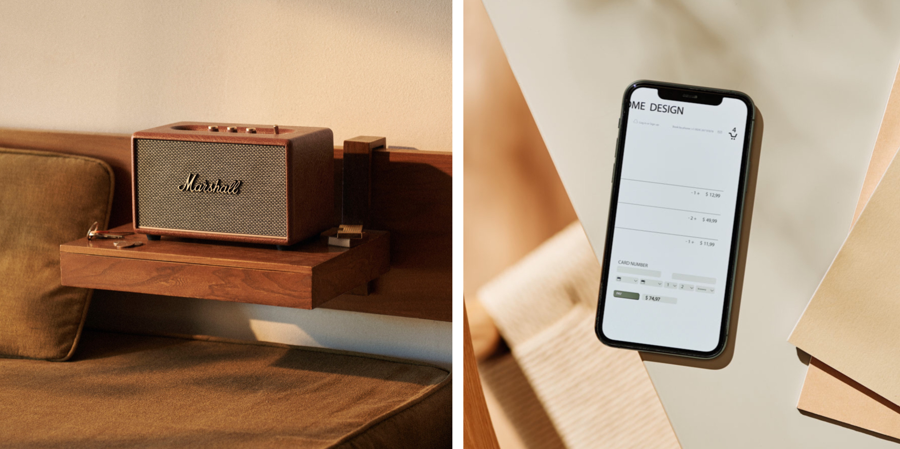
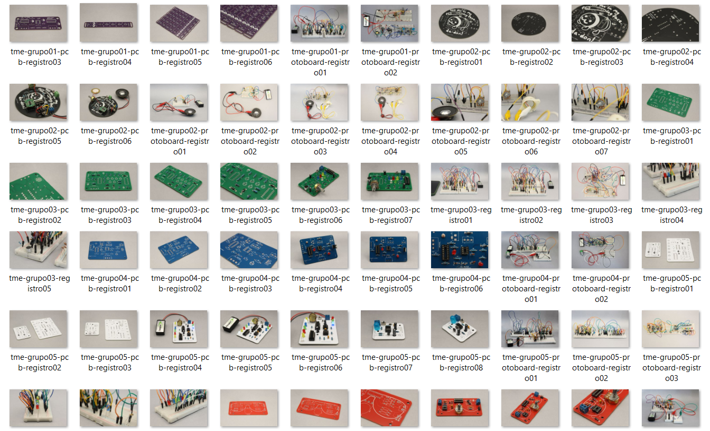

# Examen

## Grupo-0b

### integrantes

- [José Morales](https://github.com/jotamorales-romulus)
- [Bernardita Lobo](https://github.com/Bernardita-lobo)
- [Camila Parada](https://github.com/Camila-Parada)

## registro fotografico y plan de documentacion

- La responsable de esta sección es @Bernardita-lobo.

- mi trabajo consistió en la gestión, captura y edición fotográfica de los protoboards, placas PCB y carcasas desarrollados por mis compañeros.

### Referentes e investigación para registros fotográficos

- Para esto, inicié con una investigación de referentes fotográficos vinculados al área tecnológica y de producto, con el fin de definir un estilo visual coherente.

- Basé mi proyecto en [Añadir referentes y explicar]. Sugiere simpleza y neutralidad al momento de exponer sus productos de manera muy acotada. <https://www.trucco.photography/productos>

▼ Fuente: Foto de referente fotográfico. Arturia. *MICROBRUTE*. Recuperado de <https://images.squarespace-cdn.com/content/v1/55814e1de4b0f9f986faf351/1440725269068-ZH3CG5A674FMJMB0ZQ4R/image-asset.jpeg?format=2500w>

▼ Fuente: Foto de referente fotográfico. Torna Final Post. Recuperado de <https://images.squarespace-cdn.com/content/v1/55814e1de4b0f9f986faf351/1437147802659-J0WL73ASBVFSBVZXKKHD/Torna+Final+-+Post.jpg?format=2500w>

- El segundo referente lo consideré para la segunda parte del proyecto, ya que en esa etapa nos interesa que los proyectos sean documentados de manera directa en relación con su funcionamiento y propósito.

- La idea es que la imagen no solo muestre el objeto, sino también se halla inmerso en su entorno o cómo podría ser utilizado en una situación real. <http://martisans.com/portfolio/>

▼ Fuentes: Marshall BCN 201 R3. Recuperado de <http://martisans.com/wp-content/uploads/2022/06/Marshall-BCN_201_R3-6000x4000.jpg>

<http://martisans.com/wp-content/uploads/2021/10/2021-02-10_stock6271-2500x4000.jpg>

- La idea es que la imagen no solo muestre el objeto, sino también se halla inmerso en su entorno o cómo podría ser utilizado en una situación real. <http://martisans.com/portfolio/>

- Además, revisé un video como referencia para comprender mejor qué elementos son necesarios al momento de fotografiar los procesos. <https://youtu.be/75OEz5csiP8?si=EtXw4-0HqXXj7hrX>

### Planificación de tomas

- Luego, planifiqué el set fotográfico: definí que el fondo sería neutro para mantener una estética limpia y facilitar su integración con la identidad gráfica y tipográfica del proyecto.

- En un comienzo se consideró el uso de fondos de color, pero se descartó por razones de legibilidad y coherencia visual.

- Para poder tomar registros fotográficos del proceso, primero hacemos el montaje del set. Estas fotos las tomamos en una caja de luz con fondo infinito, que cuenta con iluminación integrada. También colocamos un trípode y una cámara.

- Organicé los horarios de las sesiones y diseñé una pauta de tomas que incluyó tres tipos de encuadres: una toma en perspectiva, una cenital (desde arriba) y una de detalle. Esta variedad buscó capturar tanto la forma general como las terminaciones de cada objeto.

### Plan de documentación

- Se documentaron las protoboard, las placas PCB, las carcasas, el producto final y en general, cualquier avance que los grupos de trabajo consideren pertinente registrar.

- Para las fotografías de las protoboard tomamos tres tipos de tomas: una desde la parte frontal con perspectiva, otra en vista superior para que se aprecien con claridad los circuitos, y una tercera que enfoca algún detalle distintivo que sea necesario destacar.

- Para poder tomar registros fotográficos del proceso, primero hacemos el montaje del set. Estas fotos las tomamos en una caja de luz con fondo infinito, que cuenta con iluminación integrada. También colocamos un trípode y una cámara Canon que pedimos prestada del pañol digital.

- Los registros fotográficos se realizan durante el horario de taller. Comenzamos a tomar las fotos a partir de las 10 de la mañana. Además, vamos a agendar sesiones fotográficas en horarios fuera del taller, con el fin de alcanzar a documentar todos los procesos grupales  

### Postproducción

- Las fotografías se editan en caso de que queden muy oscuras o si es necesario, eliminar alguna parte del fondo para mejorar su presentación. También se ajusta su tamaño a 1080x1080 píxeles, formato que elegimos para generar contenido para el Instagram del taller, en conjunto con mi compañera Camila Parada.

- Estas fotos son subidas a este [Drive](<https://drive.google.com/drive/folders/1OwoyJ_nTuie-A1s_U5647DsOHI4zlNnj?usp=drive_link>), donde están disponibles en formato JPG y también como archivos editables de Photoshop. Además, las fotografías se encuentran organizadas en la carpeta "imagenes" presente en las carpetas de los grupos dentro del repositorio "00-examen", así como en la carpeta "[imagenes](https://github.com/Bernardita-lobo/dis8644-2025-1-proyectos/tree/main/00-examen/grupo-0b/imagenes)" del "grupo-0b", al que pertenece esta misma documentación.

- Los archivos de las fotos fueron nombrados siguiendo el formato por ejemplo: tme-grupo01-protoboard-registro01, donde se indican las siglas del taller (TME: Taller Máquinas Electrónicas), el número del proyecto, el número del grupo y el número de registro correspondiente.

### archivos de fotos

- [Grupo 01](https://github.com/Bernardita-lobo/dis8644-2025-1-proyectos/tree/main/00-examen/grupo-01/imagenes)
- [Grupo 02](https://github.com/Bernardita-lobo/dis8644-2025-1-proyectos/tree/main/00-examen/grupo-02/imagenes)
- [Grupo 03](https://github.com/Bernardita-lobo/dis8644-2025-1-proyectos/tree/main/00-examen/grupo-03/imagenes)
- [Grupo 04](https://github.com/Bernardita-lobo/dis8644-2025-1-proyectos/tree/main/00-examen/grupo-04/imagenes)
- [Grupo 05](https://github.com/Bernardita-lobo/dis8644-2025-1-proyectos/tree/main/00-examen/grupo-05/imagenes)
- [Grupo 06](https://github.com/Bernardita-lobo/dis8644-2025-1-proyectos/tree/main/00-examen/grupo-06/imagenes)

### Registro fotográfico

- Como ejemplo de lo que se trabajó, incluiré tres fotografías correspondientes al grupo 05.

## Propuesta de montaje de proyectos en sala de clases y en laboratorio (1 punto)

La responsable de esta sección es @Bernardita-lobo.

### Elementos clave a mostrar en el montaje

- Para el montaje es fundamental lograr explicar, de manera concisa y accesible, cómo se llegó a los resultados finales. Este taller en especial, trabaja en una disciplina algo diferente y puede resultar difícil de comprender. En ese sentido, la propuesta del montaje se dividirá en dos secciones: una donde se expongan los proyectos finales y otra donde se evidencien todos los procesos por los que tuvieron que pasar los grupos de trabajo.

### Sección Proyectos finales

- En esta sección se presentará la pieza final, compuesta por la PCB y su carcasa. Cada grupo tendrá su propio espacio, donde el proyecto será expuesto sobre una mesa. Frente a cada objeto se colocará una lámina simple, en la que se explicará únicamente la parte conceptual y la interacción del proyecto, con el objetivo de comunicar su funcionamiento y propósito.

### Sección Procesos

- Esta sección estará dividida de acuerdo a las distintas etapas del proceso que desarrollaron los grupos. Entre estas se incluyen: el maqueteo en protoboard, la creación de los esquemáticos, el diseño y fabricación de las PCBs, las soldaduras, el modelado de las carcasas y sus impresiones. Cada parte estará acompañada por una pieza visual, por ejemplo, las protoboard o algunas de las primeras impresiones 3D que se fueron modificando a lo largo del proceso, lo que permitirá comprender fácilmente cada etapa. Además, se incluirá un video de apoyo. Esta sección funcionará como una recopilación de los procesos productivos que atravesaron los grupos de trabajo para llegar al resultado final.

- Los archivos de Rhino están subidos en la carpeta [Modelados](https://github.com/Bernardita-lobo/dis8644-2025-1-proyectos/tree/main/00-proyecto-02/grupo-0b/modelados)

***

Espacio a cargo de [@Camila-Parada](https://github.com/Camila-Parada)

### Texto e información contenida en soportes impresos

#### Afiche introductorio a la exhibición

El Taller de diseño de máquinas electrónicas es un espacio de encuentro entre lo análogo y lo digital, entre lo artesanal y lo industrial, entre lo local y lo mundial. Su metodología se centra en las prácticas de inteligencias de carácter colectivo en pos del desarrollo de ideas innovadoras por parte de les estudiantes en un espacio.

Las piezas de la muestra son evidencia de un arduo trabajo por parte de 26 estudiantes estructurados en 9 equipos: 6 equipos concibieron y fabricaron máquinas electrónicas, mientras que otros 3 equipos se encargaron de tareas de apoyo colectivo que abarcan la planificación de aspectos técnicos, estéticos y funcionales para la producción de las máqiunas y su exposición.

Es así que cada máquina emerge como un fruto de iteraciones grupales, validaciones colectivas y soluciones cocreadas, cuyos procesos y resultados han sido sido rigurosamente documentadas en repositorios de GitHub, en el que se han incluido todas las etapas de desarrollo: archivos de diseño de PCBs en Kicad, simulaciones de circuitos en Falstad, y todo lo necesario para comprender el proceso productivo de cada máquina.

Bienvenides a un espacio que funciona metafóricamente como una máquina electrónica: cada estudiante, docente y herramienta actúan como componentes conectados para formar un circuito por donde transita energía y datos de forma colectiva. Les animamos a seguir la corriente y disfrutar de la exhibición.

#### Cédulas introductoras de los contenidos

**Parte 1:** Esta exposición surge gracias al modelado de ideas generadas por cada grupo para desarrollar un objeto que funcionara en base a un circuito eléctrico. Para simular el comportamiento de la red en conjunto con la corriente eléctrica se trabajó con el simulador “Falstad”. Por otra parte, para generar diagramas, afianzar las piezas y diseño de las placas impresas se usó el software de KiCad. Estás últimas fueron fabricadas por “JLCPBC”, y entregadas al curso para su pronta soldadura de los componentes y montaje del objeto.

**Parte 2:** Estas piezas trascienden su función: son manifestaciones tangibles de un enfoque sistémico del diseño. Son resultado del potencial de las redes colaborativas, donde la interconexión humana fue tan esencial como las redes electrónicas. Es así que la muestra propone repensar la práctica del diseño electrónico como un ecosistema sinérgico, en el que la innovación rompe las barreras entre disciplinas, se despliega y hace eco gracias al flujo horizontal de saberes.
