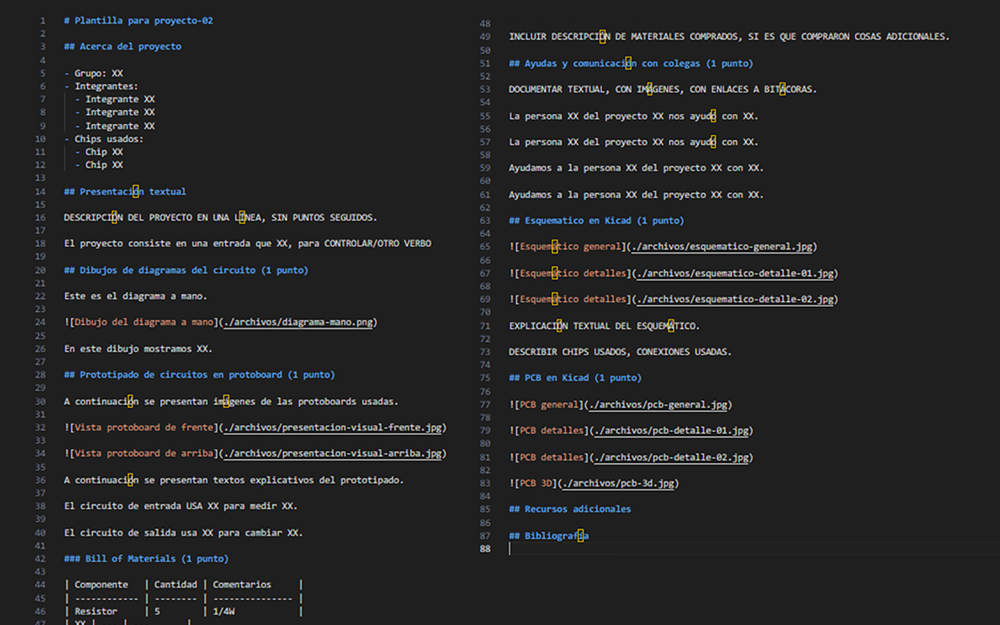
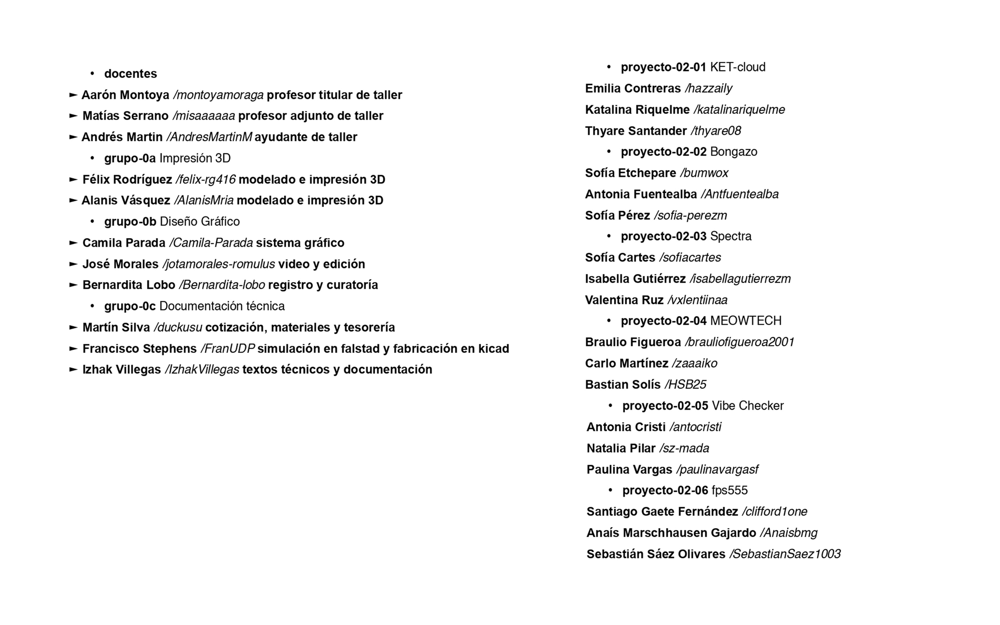
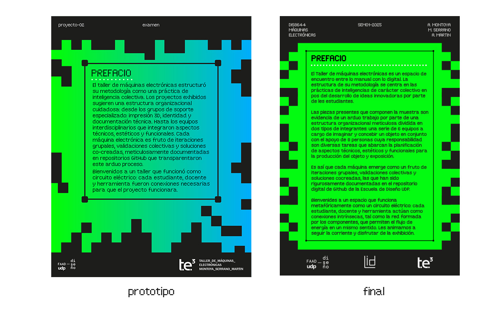

# examen

grupo-0c

## integrantes

- [Martín Silva](https://github.com/duckusu)
- [Francisco Stephens](https://github.com/FranUDP)
- [Izhak Villegas](https://github.com/IzhakVillegas)

## Materiales y tesorería: Apoyo Registro y Cotizaciones

**Encargado:** Martín Silva *@duckusu*

## Labores a realizar (1)

(Presentación)

Detalles

Bill of materials

Cotización tesorería

Ayudantía

## Observaciones y conclusiones (1)

- Dificultades:

Añadir.

- Logros:

Añadir.

---

## Simulación: Apoyo en Falstad y Fabricación en KiCad

**Encargado:** Francisco Stephens *@FranUDP*

## Labores a realizar (2)

(Presentación)

Detalles

Revisión de esquemáticos

Revisión de PCBs en KiCad

Ayudantía

## Observaciones y conclusiones (2)

- Dificultades:

 Añadir.

- Logros:

 Añadir.

---

## Documentación: apoyo texto y redacción

**Encargado:** Izhak Villegas *@IzhakVillegas*

## Labores a realizar (3)

Como asistente en el taller, mi labor consistió en **apoyar la documentación, redacción y estructuración de contenidos** para los proyectos. Trabajé en dos frentes principales.

1. Grupos de proyecto (desarrollo de propuestas concretas)

2. Grupos de apoyo (documentación general y soporte logístico)

A continuación, las labores realizadas.

## Colaboración con grupos-proyecto

### Documentación base

- Propuesta de README.md para proyecto-02:

 Se diseñó un **formato estandarizado para la carpeta 00-proyecto-02** y se presentó para su posterior aprobación de parte del equipo docente.

- Se incluyó una estructura de **secciones, lineamientos de redacción y ejemplos visuales**.

### Soporte técnico y conceptual

Resolución de dudas mediante commits, issues en Github y comunicación externa tanto en Whatsapp como presencialmente.

imagen commit

Fuente: añadir

imagen inbox

Fuente: añadir

imagen en el lab

Fuente: añadir

- Se recopilaron los datos entregados por cada grupo-proyecto para presentarlos como diagrama de bloque mediante Mermaid gracias a la herramienta [Mermaid Chart](https://www.mermaidchart.com/). Sintetizando la arquitectura de cada proyecto.

Fuente:

## Colaboración con grupo-0b (logística)

### Recopilación de datos

Créditos de integrantes (para videos, viñetas y redes sociales).

Exportación de fotografías en Drive (.jpg) para edición en Adobe Photoshop y posterior subida al repositorio.

### Textos descriptivos

- Redacción y diseño de materiales impresos (cartulina fluorescente, monocromía):

Descripción general del curso

*"El Taller de diseño de máquinas electrónicas es un espacio de encuentro entre lo análogo y lo digital, entre lo artesanal y lo industrial, entre lo local y lo mundial. Su metodología se centra en las prácticas de inteligencias de carácter colectivo en pos del desarrollo de ideas innovadoras por parte de les estudiantes en un espacio.*

*Las piezas de la muestra son evidencia de un arduo trabajo por parte de 26 estudiantes estructurados en 9 equipos: 6 equipos concibieron y fabricaron máquinas electrónicas, mientras que otros 3 equipos se encargaron de tareas de apoyo colectivo que abarcan la planificación de aspectos técnicos, estéticos y funcionales para la producción de las máqiunas y su exposición.*

*Es así que cada máquina emerge como un fruto de iteraciones grupales, validaciones colectivas y soluciones cocreadas, cuyos procesos y resultados han sido sido rigurosamente documentadas en repositorios de GitHub, en el que se han incluido todas las etapas de desarrollo: archivos de diseño de PCBs en Kicad, simulaciones de circuitos en Falstad, y todo lo necesario para comprender el proceso productivo de cada máquina.*

*Bienvenides a un espacio que funciona metafóricamente como una máquina electrónica: cada estudiante, docente y herramienta actúan como componentes conectados para formar un circuito por donde transita energía y datos de forma colectiva. Les animamos a seguir la corriente y disfrutar de la exhibición".*

▼ **Fuente:** Texto descriptivo iterativo entre grupo-0c, grupo-0b y equipo docente. Grupo 0c. *Texto descriptivo del curso (lámina)* [Github] Recuperado de <https://github.com/IzhakVillegas/dis8644-2025-1-proyectos/tree/main/00-examen/grupo-0b>

Comparativa entre propuesta y diseño final.

Textos para mesas de avances (medío carta).

[Adjuntar propuesta]

Textos para mesas de proyectos (medío carta).

[Adjuntar propuesta]

Viñetas por proyecto (nombre, integrantes, explicación técnica).

Propuesta de stickers NFC (en colaboración con Laboratorio de Interacción Digital UDP) para vincular físicamente al repositorio GitHub.

[Adjuntar propuesta]

- Soporte físico

Mediciones de mesas para curatoría y distribución espacial de proyectos.

[Adjuntar medidas]

## Observaciones y conclusiones (3)

- Dificultades:

 Limitaciones en la redacción centralizada para permitir las expresiones libres de cada grupo.

 Comunicación más efectiva en persona que en medios digitales.

- Logros:

 Estandarización de formatos (README, diagramas, textos físicos).

 Documentación de procesos y respaldo visual.

---

## Conclusiones generales

Se destaca el **ambiente colaborativo** digital y físico de cada uno de los integrantes de este Taller.
