# examen

grupo-0c

## integrantes

- [Martín Silva](https://github.com/duckusu)
- [Francisco Stephens](https://github.com/FranUDP)
- [Izhak Villegas](https://github.com/IzhakVillegas)

## Materiales y tesorería: Apoyo Registro y Cotizaciones

**Encargado:** Martín Silva *@duckusu*

- Pedir por adelantado la información de cada proyecto y sus materiales.
- Trabajar en un Excel para la organización de cada uno de los materiales.
- Dicho Excel, compartirlo para todo el curso y que estén atentos a cualquier cambio.
- Buscar proveedores para los materiales.
- Mantener contacto con mis compañeros/as para ver que materiales comprar.

### **Link del Excel / Google sheets: <https://docs.google.com/spreadsheets/d/1CT1RtA_BYuWpyJ54k9VGduSAs_nKiFYd9yf2WvjZ-4g/edit?gid=529027261#gid=529027261>**

### Proveedores

- Victronics <https://www.victronics.cl/>
- Afel <https://afel.cl/>
- Mercado Libre <https://www.mercadolibre.cl/>
- MCI electronics <https://mcielectronics.cl/>


## Materiales del Lab

Antes de tomar en cuenta la idea de comprar los materiales, primero se reviso en la sala Lab si los materiales necesitados para cada grupo se encontraban en ese lugar, el resultado fue el siguiente:


## Bill of Materials (B.O.M)

Para los BOM de cada grupo, se trabajó en un Excel de donde se desgloso cada uno de los materiales que se iban a usar por grupo y a su vez, cuales le podrían hacer falta, a continuación, estos son los BOM de cada grupo:

| Grupo 1  |           |    Integrantes    |                              |
|:-------: |---------- |:----------------: |----------------------------- |
|          | hazzaily  | katalinariquelme  |           thyare08           |
|          |           |                   |                              |
|          |           |                   |                              |
|   Item   |    Qty    |       Valor       |         Tipo de ítem         |
|    1     |    12     |        5mm        |             LED              |
|    2     |     2     |       500k        |         Potenciómetro         |
|    3     |     1     |        LDR        |             LDR              |
|    4     |     1     |       100K        |         Resistencia          |
|    5     |     6     |        47K        |         Resistencia          |
|    6     |    12     |        1K         |         Resistencia          |
|    7     |     5     |        10k        |         Resistencia          |
|    8     |     1     |      Lmn324       |             Chip             |
|    9     |     1     |       NE555       |             Chip             |
|    10    |     1     |      CN4017       |             Chip             |
|    11    |     3     |       10uF        | Condensador (electrolitico)  |
|    12    |     1     |       103n        | Condensador (electrolitico)  |
|    13    |     6     |       220uF       | Condensador (electrolitico)  |
|    14    |     1     |   ph-2 (2.54mm)   |          PinHeader           |
|    15    |     3     |   ph-3 (2.54mm)   |          PinHeader           |
|    16    |     2     |   mod1 (2.54mm)   |          PinHeader           |
|    17    |     2     |       mod2        |          PinHeader           |

| Grupo 2  |                  |         Integrantes         |                                         |
|:-------: |----------------- |:--------------------------: |---------------------------------------- |
|          | Anto Fuentealba  | Sofia Perez (sofia-perezm)  |             Sofia Etchepare             |
|          |                  |                             |                                         |
|          |                  |                             |                                         |
|   Item   |       Qty        |            Valor            |              Tipo de ítem               |
|    1     |        1         |           LM324N            |                 DIP-14                  |
|    2     |        1         |                             |             Piezoeléctrico              |
|    3     |        1         |             1M              |               Resistencia               |
|    4     |        3         |            100k             |               Resistencia               |
|    5     |        4         |             1k              |               Resistencia               |
|    6     |        2         |             10k             |               Resistencia               |
|    7     |        1         |             22k             |               Resistencia               |
|    8     |        2         |            10uF             | Condensador polarizado (electrolitico)  |
|    9     |        1         |           2N2222            |               Transistor                |
|    10    |        1         |            500k             |              Potenciómetro              |
|    11    |        1         |            3.5mm            |               Socket jack               |
|    12    |        1         |             8Ω              |                 Speaker                 |
|    13    |        2         |                             |           Jumpers (caimanes)            |
|    14    |        1         |            5V–9V            |         Fuente de alimentación.         |
|    15    |        1         |            LM324            |                 Socket                  |
|    16    |                  |       Largo variable        |               Conectores                |
|    17    |        1         |           PAM8403           |              Amplificador               |

| Grupo 3  |                     | Integrantes  |                              |
|:-------: |-------------------- |:-----------: |----------------------------- |
|          |    Valentina ruz    |   Isabella   |         Sofia cartes         |
|          |                     |              |                              |
|          |                     |              |                              |
|   Item   |         Qty         |    Valor     |         Tipo de ítem         |
|    1     |          1          |   CZN-15E    |    Microfono condenzador     |
|    2     |          2          |     22k      |         Resistencia          |
|    3     |          8          |      1k      |         Resistencia          |
|    4     |          4          |     10k      |         Resistencia          |
|    5     |          1          |     220      |         Resistencia          |
|    6     |          2          |     10uF     | Condensador (electrolitico)  |
|    7     |          1          |     1uF      | Condensador (electrolitico)  |
|    8     |          2          |    1n5819    |            Diodo             |
|    9     |          1          |    1n4007    |            Diodo             |
|    10    |          1          |    1M omh    |        Potenciometro         |
|    11    |          1          |     500k     |        Potenciometro         |
|    12    |    8 (variados)     |     LED      |           LED 10mm           |
|    13    | 2 (verde y blanco)  |     LED      |           LED 5mm            |
|    14    |          1          |    LM324N    |            DIP-14            |
|    15    |          2          |    CN4017    |            DIP-16            |
|    16    |          1          |    2 pin     |        Terminal block        |
|    17    |          1          |     spdt     |            Switch            |
|    18    |          1          |      9v      |           Batería            |

| Grupo 4  |                                |   Integrantes    |                          |
|:-------: |------------------------------- |:---------------: |------------------------- |
|          | Braulio (brauliofigueroa2001)  | Carlo (zaaaiko)  |     Bastían (HSB25)      |
|          |                                |                  |                          |
|          |                                |                  |                          |
|   Item   |              Qty               |      Valor       |       Tipo de ítem       |
|    1     |               5                |       10k        |       Resistencia        |
|    2     |               2                |        1k        |       Resistencia        |
|    3     |               1                |       100k       |       Resistencia        |
|    4     |               1                |        1         |       Resistencia        |
|    5     |               2                |       500k       |       Potenciómetro       |
|    6     |               1                |       LDR        |           LDR            |
|    7     |               2                |       104n       |   Condensador cerámico   |
|    8     |               2                |      1N4148      |          Diodo           |
|    9     |               2                |      1N4007      |          Diodo           |
|    10    |               2                |     5mm Rojo     |           LED            |
|    11    |               1                |      NE555       |          DIP-8           |
|    12    |               1                |      LM324       |          DIP-14          |
|    13    |               1                |      5V–9V       | Fuente de alimentación.  |
|    14    |               1                |     2 pines      |      Terminal Block      |
|    15    |               1                |     3 pines      |      Terminal Block      |
|    16    |               1                |       SPDT       |         Switch           |
|    17    |               1                |        9v        |         Motor DC         |
|    18    |               1                |  MOSFET IRLZ44N  |        Transistor        |
|    19    |               2                | 5.5 mm estándar  |   Conector Barrel Jack   |

| Grupo 5  |              | Integrantes  |                            |
|:-------: |------------- |:-----------: |--------------------------- |
|          | Anto Cristi  |  Pau Vargas  |       Natalia Pilar        |
|          |              |              |                            |
|          |              |              |                            |
|   Item   |     Qty      |    Valor     |        Tipo de ítem        |
|    1     |      3       |      -       |        Socket 8-pin        |
|    2     |      1       |      -       |       Socket 14-pin        |
|    3     |      7       |     10k      |        Resistencia         |
|    4     |      3       |      1k      |        Resistencia         |
|    5     |      1       |     100k     |        Resistencia         |
|    6     |      1       |      -       |            LDR             |
|    7     |      3       |     100n     |    Condensador cerámico    |
|    8     |      1       |    PN2222A    |         Transistor         |
|    9     |      1       |     MIC      |     Micrófono electret     |
|    10    |      3       |       1u      | Condensador electrolítico  |
|    11    |      1       |     407n     |    Condensador cerámico    |
|    12    |      12      |     LED      |          LED 5mm           |
|    13    |      1       |     500k     |       Potenciómetro        |
|    14    |      3       |    NE555     |           DIP-8            |
|    15    |      1       |    LM324     |           DIP-14           |
|    16    |      1       |    CD4017    |           DIP-16           |

| Grupo 6  |                          |          Integrantes           |                                                  |
|:-------: |------------------------- |:-----------------------------: |------------------------------------------------- |
|          | Santiago (clifford1one)  | Sebastián (SebastianSaez1003)  |                 Anaís (Anaisbmg)                 |
|          |                          |                                |                                                  |
|          |                          |                                |                                                  |
|   Item   |           Qty            |             Valor              |                   Tipo de ítem                   |
|    1     |            2             |               1K               |                   Resistencia                    |
|    2     |            2             |              100K              |                   Resistencia                    |
|    3     |            2             |              470K              |                   Resistencia                    |
|    4     |            1             |              10K               |                   Resistencia                    |
|    5     |            6             |             1n4007             |                      Diodo                       |
|    6     |            1             |              104               |              Condensador (cerámico)              |
|    7     |            1             |              474               |              Condensador (cerámico)              |
|    8     |            1             |              3mm               |                       Led                        |
|    9     |            1             |              555               |                       Chip                       |
|    10    |            1             |             L293D              |                       Chip                       |
|    11    |            1             |       6 Pines ON-OFF-ON        |                Interruptor Switch                |
|    12    |            1             |            6V 3RPM             |                 Motorreductor DC                 |
|    13    |            1             |              500K              |                  Potenciometro                   |
|    14    |            2             |            2 pines             |                      Tblock                      |
|    15    |            1             |            8 pines             |                      Socket                      |
|    16    |            1             |            16 pines            |                      Socket                      |
|    17    |            5             |                                |                    Pin Header                    |
|    18    |            5             |                                | Cable dupont: terminal receptora a terminal pin  |

## Cotizaciones

Cotizaciones que se realizaron de cada uno de los materiales que se iban a usar en base a lo visto en los bom:

|          Item           | Precio unidad  |                                  Precio cantidad                                   |             Tipo              |                                                                                                                          Item y proveedor                                                                                                                          |
|:----------------------: |:-------------: |:---------------------------------------------------------------------------------: |:----------------------------: |:-----------------------------------------------------------------------------------------------------------------------------------------------------------------------------------------------------------------------------------------------------------------: |
|      Resistencias       |       x        |                                   $1.390 x 50un                                    |             100k              |                                                                                         <https://www.victronics.cl/resistencias/resistencia-100k-0-4w-1-1937mm-50ppm-c-50u/>                                                                                         |
|      Resistencias       |       x        |                                   $1.390 x 50un                                    |              1M               |                                                                                              <https://www.victronics.cl/resistencias/res-1m-04w-1-1937mm-50ppm-c-50u/>                                                                                               |
|      Resistencias       |       x        |                                    $890 x 50un                                     |              47k              |                                                                                             <https://www.victronics.cl/resistencias/resistencia-47k-5-1-2w-32x9mm-50u/>                                                                                              |
|           Led           |       x        | $590 x 10un (rojo) $740 x 10un (amarillo) $600 x 10un (blanco) $920 x 10un (azul)  |          5mm difuso           |                                                                                            <https://www.victronics.cl/display/led-5mm-azul-difuso-375mcd-60-470nm-10u/>                                                                                              |
|           LDR           |       x        |                                    $990 x 10un                                     |       5mm 10Mohm GL5549       |                                                                                            <https://www.victronics.cl/sensoresmod/resistencia-ldr-5mm-10mohm-gl5549-10u/>                                                                                            |
|      Condensadores      |       x        |                                         x                                          |      Ceramico 680pF 50V       |                                                                                     <https://www.victronics.cl/condensadores/cond-ceramico-multicapa-680pf-50v-10-x7r-p5mm-10u/>                                                                                     |
|      Condensadores      |       x        |                                    $670 x 10un                                     |      Electrolitico 100UF      |                                                                                     <https://www.victronics.cl/condensadores/cond-electrolitico-100uf-50v20-105oc-812-p4mm-10u/>                                                                                     |
|      Condensadores      |       x        |                                    $990 x 10un                                     |    Electrolitico 220UF/50v    |                                                                                    <https://www.victronics.cl/condensadores/cond-electrolitico-220uf-50v-105oc-1012-5-p5mm-10u/>                                                                                     |
|      Condensadores      |       x        |                                    $540 x 10un                                     |    Electrolitico 220UF/25V    |                                                                                   <https://www.victronics.cl/condensadores/cond-electrolitico-220uf-25v-20-105oc-812-p3-5mm-10u/>                                                                                    |
|      Condensadores      |       x        |                                    $440 x 10un                                     |    Electrolitico 220UF/16v    |                                                                                  <https://www.victronics.cl/condensadores/cond-electrolitico-220uf-16v-20-105oc-6-311-p2-5mm-10u/>                                                                                   |
|         Diodos          |       x        |                                    $790 x 50un                                     |            1N4007             |                                                                                            <https://www.victronics.cl/diodos/diodo-rectif-1n4007-1000v-1a-vfd-1-1v-50u/>                                                                                             |
|         Diodos          |       x        |                                    $840 x 50un                                     |            1N4148             |                                                                                                <https://www.victronics.cl/diodos/diodo-switch-1n4148-75v-150ma-50u/>                                                                                                 |
|       Transistor        |      $490      |                                         x                                          |   DARL PNP 5A 100V 2W TO220   |                                                                                        <https://www.victronics.cl/transistores/tip127-transistor-darl-pnp-5a-100v-2w-to220/>                                                                                         |
|       Transistor        |       x        |                                    $350 x 50un                                     |                PN2222A        |                                                                                          <https://www.victronics.cl/transistores/transistor-pn2222a-npn-06a-40v-to92-10u/>                                                                                           |
|          Chips          |      $520      |                                         x                                          |             L293D             |                                                                                            <https://www.victronics.cl/circuitos-integrados/l293nequadhalf-hdriverdip16/>                                                                                             |
|          Chips          |      $390      |                                         x                                          |             555,0             |                                                                                       <https://www.victronics.cl/circuitos-integrados/lm555cngeneralpurposebipolartimerdip8/>                                                                                        |
|          Chips          |      $295      |                                         x                                          |            CD4017             |                                                                                                  <https://altronics.cl/ic-cd4017?tag=circuito%20integrado%20CD4017>                                                                                                  |
|         Puentes         |       x        |                                    $990 x 20un                                     |             20cm              |                                                                                             <https://www.victronics.cl/con-conectores/kit20puentesm-h20cmsp-protoboard/>                                                                                             |
|         Switch          |       x        |                                    $740 c 10un                                     |              9mm              |                                                                                             <https://www.victronics.cl/interruptores/tact-switch-90o-pcb-boton-9mm-10u/>                                                                                             |
|          Botón          |       x        |                                    $620 x 10un                                     |          6*6*h5mm 4P          |                                                                                               <https://www.victronics.cl/interruptores/tact-switch-pcb-66h5mm-4p-10u/>                                                                                               |
|       Pin header        |       x        |                                    $320 x 20un                                     |     3×1 FILA 2.54mm (10u)     |                                                                                                <https://www.victronics.cl/conectores/pin-header-3x1-fila-254mm-10u/>                                                                                                 |
|      Socket DIP 14      |      $600      |                                         x                                          | DIP14/0.3″ PARA C. INTEGRADO  |                                                                                             <https://www.victronics.cl/conectores/base-dip14-0-3-para-c-integrado-10u/>                                                                                              |
|      Socket DIP 16      |      $470      |                                         x                                          |      DIP 16 PIN TORNEADO      |                                                                                                   <https://www.victronics.cl/conectores/base-dip-16-pin-torneado/>                                                                                                   |
|      Socke DIP 16       |      $600      |                                         x                                          | DIP16/0.3″ PARA C. INTEGRADO  |                                                                                             <https://www.victronics.cl/conectores/base-dip16-0-3-para-c-integrado-10u/>                                                                                              |
|     Socket DIP 20       |      $570      |                                         x                                          |      DIP20 PIN TORNEADO       |                                                                                                   <https://www.victronics.cl/conectores/base-dip20-pin-torneado/>                                                                                                    |
|     Socket DIP 20       |      $890      |                                         x                                          | DIP20/0.3″ PARA C. INTEGRADO  |                                                                                             <https://www.victronics.cl/conectores/base-dip20-0-3-para-c-integrado-10u/>                                                                                              |
|      Socket DIP 18      |       x        |                                    $750 x 10un                                     |      TICVT-18 INTEGRADO       |                                                                                            <https://www.victronics.cl/conectores/base-para-circuito-integrado-dip18-10u/>                                                                                            |
|       Socket DIP        |       x        |                                       $5.990                                       |                               |                                                                                 <https://afel.cl/products/kit-66-sockets-para-circuitos-integrados?_pos=5&_psq=socket&_ss=e&_v=1.0>                                                                                  |
|       Protoboard        |       x        |                               $8.630 x kit completo                                |            PB1660             |                                                                                           <https://www.victronics.cl/desarrolloylab/protoboard-1260-400-puntos-con-base/>                                                                                            |
|       Protoboard        |     $1.990     |                                         x                                          |           PROTO400            |                                                                                                  <https://www.victronics.cl/desarrolloylab/protoboard-400-puntos/>                                                                                                   |
|   Motor DC Miniatura    |      $500      |                                         x                                          |                               |                                                                                              <https://afel.cl/products/3v-0-2a-12000rpm-65gcm-mini-micro-dc-motor-for>                                                                                               |
|     Piezoeléctrico      |       x        |                                   $6.990 x 10un                                    |             35mm              |    <https://articulo.mercadolibre.cl/MLC-1462843105-pack-10-sensor-piezoelectrico-ceramico-35-mm-cable-_JM#polycard_client=search-nordic&position=22&search_layout=stack&type=item&tracking_id=b37be49a-3edd-46ea-b663-91ad25870330&wid=MLC1462843105&sid=search>    |
|   Microfono electret    |     $5.928     |                                         x                                          |            Max4466            | <https://articulo.mercadolibre.cl/MLC-492489125-max4466-amplificador-microfono-electret-arduino-raspberry-_JM#polycard_client=search-nordic&position=18&search_layout=stack&type=item&tracking_id=82578b5c-c580-4275-82d6-fb3e16a92d44&wid=MLC492489125&sid=search>  |
|     Terminal block      |    $ 1.990     |                                         x                                          |             2 pin             |               <https://articulo.mercadolibre.cl/MLC-480521906-terminal-block-de-35mm-2-pines-_JM#polycard_client=search-nordic&position=31&search_layout=stack&type=item&tracking_id=e351851c-5ad3-462b-8acd-3a7e4ea3ddc1&wid=MLC480521906&sid=search>               |
|     Terminal block      |      $990      |                                         x                                          |             3 pin             |                                                                                            <https://mcielectronics.cl/shop/product/terminal-block-de-35mm-3-pines-10255/>                                                                                            |
| Espaciadores Metalicos  |       x        |                                   $8.490 x 120un                                   |              M3               |                                                                        <https://mcielectronics.cl/shop/product/kit-de-espaciadores-metalicos-m3-para-pcb-120-unidades-mci-electronics-25747/>                                                                        |

## A comprar

Despues de analizar la disponibilidad de cada uno de los materiales, se llego a la conclusión de que se tiene que comprar en estos lugares:

|       Materiales        | Cantidad  |   Grupos    |      Tienda      |     Precio      |                                                                                                                                Link                                                                                                                                |
|:----------------------: |:--------: |:----------: |:---------------: |:--------------: |:-----------------------------------------------------------------------------------------------------------------------------------------------------------------------------------------------------------------------------------------------------------------: |
|        Chip 4017        |     4     | G1, G3, G5  |    altronics     |   $ 295 x un    |                                                                                                  <https://altronics.cl/ic-cd4017?tag=circuito%20integrado%20CD4017>                                                                                                  |
| Espaciadores Metalicos  |     1     |    Todos    | MCI electronics  | $8.490 x 120un  |                                                                        <https://mcielectronics.cl/shop/product/kit-de-espaciadores-metalicos-m3-para-pcb-120-unidades-mci-electronics-25747/>                                                                        |
|        Socket 14        |     2     | G2, G3, G5  |    victronics    |    $600 x un    |                                                                                             <https://www.victronics.cl/conectores/base-dip14-0-3-para-c-integrado-10u/>                                                                                              |
|        Socket 16        |     1     |     G6      |    victronics    |    $600 x un    |                                                                                             <https://www.victronics.cl/conectores/base-dip16-0-3-para-c-integrado-10u/>                                                                                              |
|        Socket 18        |     1     |     G5      |    victronics    |   $750 x 10un   |                                                                                            <https://www.victronics.cl/conectores/base-para-circuito-integrado-dip18-10u/>                                                                                            |
|      Diodo 1n5819       |     2     |     G3      |    victronics    |   $500 x 10un   |                                                                                                 <https://www.victronics.cl/diodos/schottky-1n5819-40v-1a-do-41-10u/>                                                                                                 |
|      Diodo 1n4148       |     2     |     G4      |    victronics    |  $840 x 50 un   |                                                                                                <https://www.victronics.cl/diodos/diodo-switch-1n4148-75v-150ma-50u/>                                                                                                 |
|  LED 10mm (variables)   |     8     |     G3      |    altronics     |   $908 x 10un   |                                                                                              <https://altronics.cl/led-10mm-rojo> / <https://altronics.cl/led-10mm-verde>                                                                                              |
|        Chip 324N        |     2     |     G3      |    victronics    |    $290 x un    |                                                                                            <https://www.victronics.cl/circuitos-integrados/lm324nquadlowpoweropampdip14/>                                                                                            |
|       Switch spdt       |     1     |     G3      |    victronics    |    $340 x un    |                                                                                         <https://www.victronics.cl/interruptores/interruptor-spdt-3a-250vac-1015mm-rocker/>                                                                                          |
|           LDR           |     2     |   G4, G5    |    victronics    |   $990 x 10un   |                                                                                            <https://www.victronics.cl/sensoresmod/resistencia-ldr-5mm-10mohm-gl5549-10u/>                                                                                            |
| Terminal block 3 pines  |     2     |     G4      | MCI electronics  |    $990 x un    |                                                                                            <https://mcielectronics.cl/shop/product/terminal-block-de-35mm-3-pines-10255/>                                                                                            |
|  Conector barrel jack   |     2     |     G4      | MCI electronics  |   $1.490 x un   |                                                                                                 <https://mcielectronics.cl/shop/product/conector-dc-para-pcb-9766/>                                                                                                  |
|   Microfono electret    |     1     |     G5      |  mercado libre   |   $5.928 x un   | <https://articulo.mercadolibre.cl/MLC-492489125-max4466-amplificador-microfono-electret-arduino-raspberry-_JM#polycard_client=search-nordic&position=18&search_layout=stack&type=item&tracking_id=82578b5c-c580-4275-82d6-fb3e16a92d44&wid=MLC492489125&sid=search>  |
|      Diodo 1n4007       |     6     |     G5      |    victronics    |   $790 x 50un   |                                                                                            <https://www.victronics.cl/diodos/diodo-rectif-1n4007-1000v-1a-vfd-1-1v-50u/>                                                                                             |
|       Chip L293D        |     1     |     G6      |    victronics    |    $520 x un    |                                                                                            <https://www.victronics.cl/circuitos-integrados/l293nequadhalf-hdriverdip16/>                                                                                             |
|   Insertos Metálicos    |  2 packs  |    G1-G9    |    cinemech3D    |  $2.240 x 20un  |                                                                                                <https://www.cimech3d.cl/producto/insertos-metalicos-m3-pack-20-4mm/>                                                                                                 |
|  Potenciomentro 1M ohm  |     3     |     G3      |       Afel       |    $500 x un    |                                                                                                           <https://afel.cl/products/potenciometro-1m-ohm>                                                                                                            |
|                         |           |             |                  | Total: $40.713  |                                                                                                                                                                                                                                                                    |

## Boletas

Tras la compra, se recopilaron las boletas para hacer un recuento de todo lo implementado, el siguiente orden seguirá la siguiente logica:

- Victronics
- Afel
- Mercado libre
- Electrónica Ibarra y Orfalí
- Katode


## Observaciones y conclusiones

Dificultades:Mi principal reto fue organizar rápidamente los archivos Markdown. Afortunadamente, Misaa me ayudó mostrándome cómo generarlos desde Excel usando la siguiente pagina:

- [Tables Generator](https://www.tablesgenerator.com/markdown_tables#)

Logros: Aprendí a identificar los proveedores más viables del mercado, a comprar al por mayor y a realizar pagos con factura.

---

## Simulación: Apoyo en Falstad y Fabricación en KiCad

**Encargado:** Francisco Stephens *@FranUDP*

## Labores a realizar (2)

## Simulación: Apoyo en Falstad, Fabricación en KiCad y Soporte Técnico

*Encargado:* Francisco Stephens @FranUDP

## Labores a realizar (2)

Asistencia a los grupos en diseño del circuito, investigando las datasheet de los componentes y realizando simulaciones en Falstad y Tinkercad.

Diseño de las PCBs en Kicad, apoyando en dudas en cuanto al uso del programa, revisando y dando feedback de los esquemáticos y planos de las placas.

Apoyo soldando los componentes a las placas y troubleshooting de cualquier problema que estas presenten.

- Detalles

Mis labores comenzaron en la sesión 14a revisando y simulando el esquema enviado el grupo-05, después de revisar el comportamiento del circuito se conversó con el grupo sobre su visión del proyecto y el comportamiento deseado de este mismo.

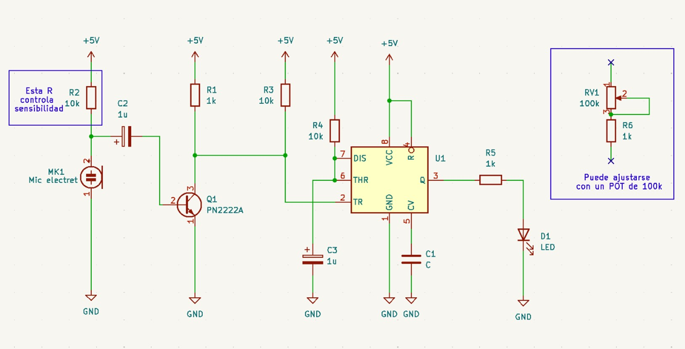

▼ *Fuente:* Grupo-05

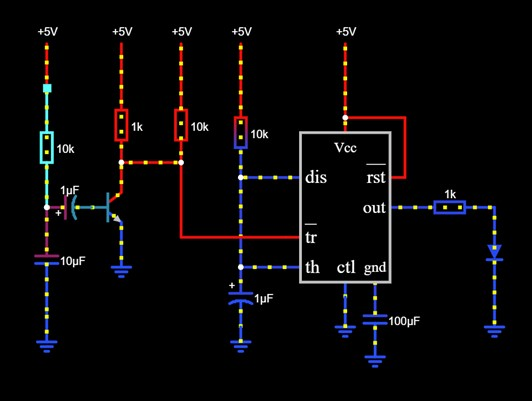

▼ *Fuente:* [@FranUDP](https://github.com/FranUDP/dis8644-2025-1/tree/main/25-FranUDP)

El grupo 05 explicó que buscaban un objeto que al detectar “movimiento”, mediante un LDR, que en respuesta active los LDRs en secuencia, por lo que se les aconsejó comenzar con el segmento INPUT del circuito “detector de sombra”, visto en clases, que utiliza un LM324 (comparador) conectado a un NE555p en configuración monostable (para evitar múltiples activaciones) y luego conectar su OUTPUT a un segundo NE555p en configuración astable (oscilador) y su OUTPUT conectado a un CD4017 (secuenciador), para generar la secuencia de LEDs.


▼ *Fuente:* [@misaaaaaa](https://github.com/misaaaaaa/)

En la sesión 14b se revisó el esquemático que [@misaaaaaa](https://github.com/misaaaaaa/) le dio al grupo 04 y se les aconsejó que invirtieran los INPUTS del comparador (LM324), en comparación con el "detector de sombras" que en lugar de tener el LDR conectado al Pin3 y el potenciómetro al Pin2, conectaran el LDR al Pin2 y el potenciómetro al Pin3. 

Esto es debido a que cuando el LDR recibe menos luz, su resistencia aumenta, por lo que el voltaje que emite, al estar conectado como divisor de voltaje, aumenta. Esto hace que, al recibir poca luz, el comparador emita HIGH, activando el NE555P.

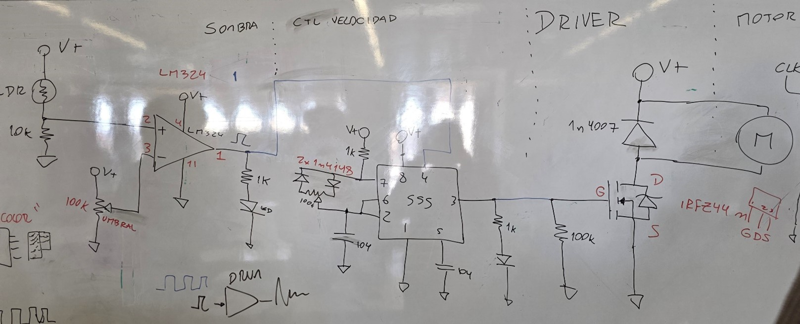

▼ *Fuente:* Fotografiado por [@FranUDP](https://github.com/FranUDP/dis8644-2025-1/tree/main/25-FranUDP)

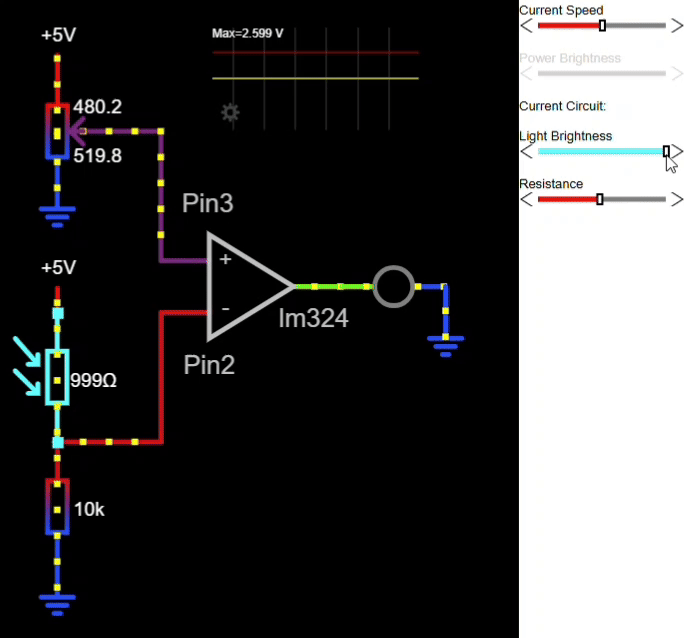

▼ *Fuente:* [@FranUDP](https://github.com/FranUDP/dis8644-2025-1/tree/main/25-FranUDP)


▼ *Fuente:* Microcontrollerslab. OP/AMP pinout datasheet. Recuperado de <https://microcontrollerslab.com/lm324-op-amp-pinout-datasheet-applications-features-datasheet/>

Tras dificultades con sus circuitos, se asistó al grupo 05 mediante el diseño de un circuito base en Falstad, teniendo en cuenta el comportamiento deseado, que pudieran ajustar después.

```txt
LDR recibe poca luz -> LM324 -> NE555p (monostable) -> NE555P (astable) -> CD4017 -> LEDs que se iluminan y apagan en secuencia.
```

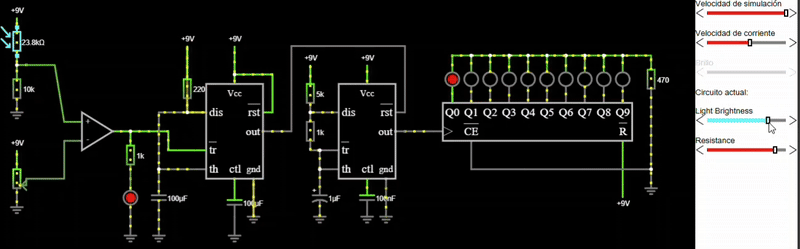

▼ *Fuente:* [@FranUDP](https://github.com/FranUDP/dis8644-2025-1/tree/main/25-FranUDP)

En la sesión 15a, tras revisar su esquemático antes de la clase, se le corrigió al grupo 06 las conexiones de los pines 1A y 2A (dirección) del L293D (controlador de motor), a una señal PWM y se les propuso añadir un 2n2222 (NPN transistor) que conecte el pin4 del NE555p a GND, para apagarlo cuando la "segunda parte" (L293D) del circuito esté apagada.

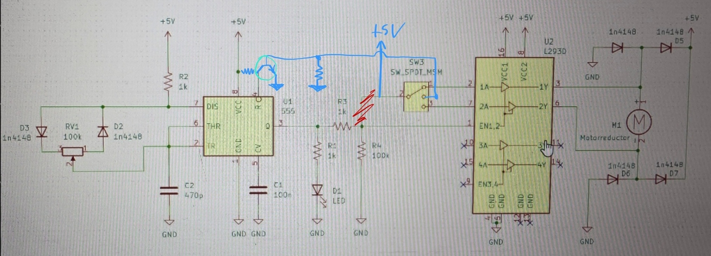

▼ *Fuente:* Grupo 06, fotografiado y editado por [@FranUDP](https://github.com/FranUDP/dis8644-2025-1/tree/main/25-FranUDP)

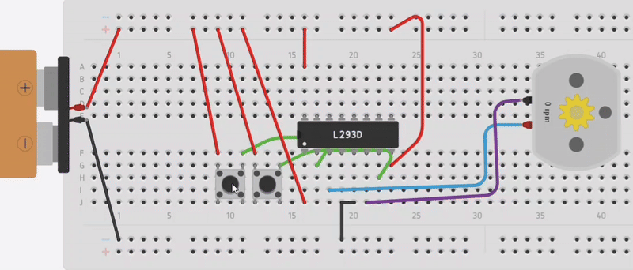

▼ *Fuente:* [@FranUDP](https://github.com/FranUDP/dis8644-2025-1/tree/main/25-FranUDP)

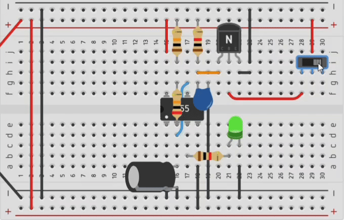

▼ *Fuente:* [@FranUDP](https://github.com/FranUDP/dis8644-2025-1/tree/main/25-FranUDP)

Posteriormente se ayudó al grupo 01 con su esquemático, para distribuir las partes de su circuito, en varias placas distintas, de forma modular. Reorganizando las conexiones de los componentes y añadiendo pines para que las placas se comuniquen entre sí.

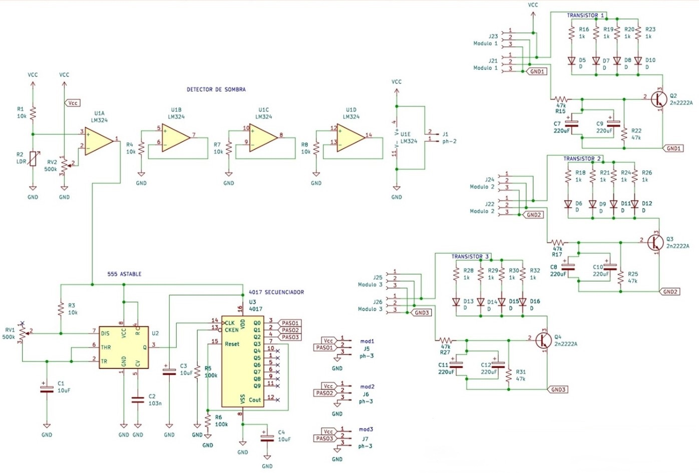

▼ *Fuente:* Grupo 01, editado por [@FranUDP](https://github.com/FranUDP/dis8644-2025-1/tree/main/25-FranUDP)

Después se asistió al grupo 04 a colocar sus potenciómetros, motor e interruptor fuera de la placa, definiendo las footprints de esos componentes como “terminal blocks” (conectores) en Kicad.

## Apoyo fuera de horario de clase

Grupo-06:

- Resolviendo dudas sobre la resistencia al uso de su proyecto


▼ *Fuente:* Captura de pantalla por [@FranUDP](https://github.com/FranUDP/dis8644-2025-1/tree/main/25-FranUDP)


▼ *Fuente:* Captura de pantalla por [@FranUDP](https://github.com/FranUDP/dis8644-2025-1/tree/main/25-FranUDP)

- Feedback del esquemático

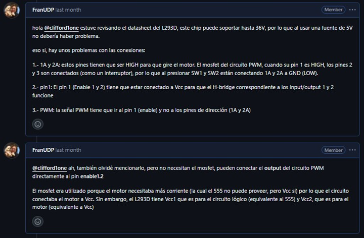

▼ *Fuente:* Captura de pantalla por [@FranUDP](https://github.com/FranUDP/dis8644-2025-1/tree/main/25-FranUDP)

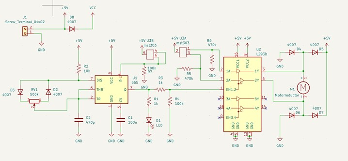

▼ *Fuente:* grupo 06


▼ *Fuente:* Captura de pantalla por [@FranUDP](https://github.com/FranUDP/dis8644-2025-1/tree/main/25-FranUDP)

Grupo 04:

- Resolviendo dudas de Kicad

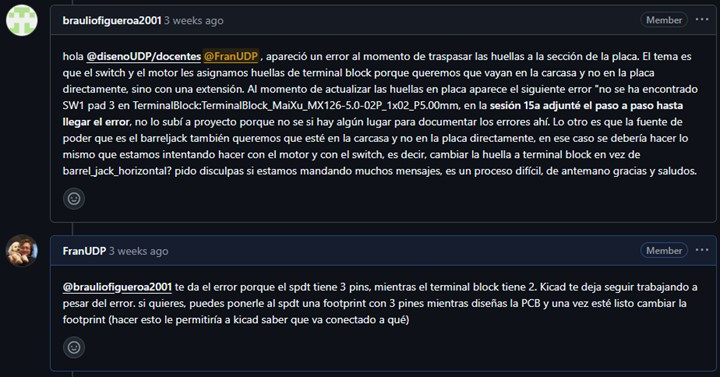

▼ *Fuente:* Captura de pantalla por [@FranUDP](https://github.com/FranUDP/dis8644-2025-1/tree/main/25-FranUDP)

- Feedback del esquemático y PCB

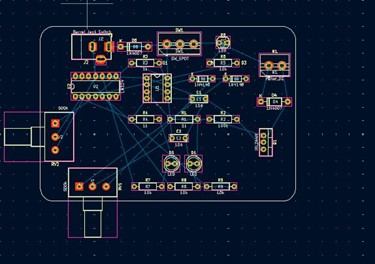

▼ *Fuente:* Grupo 04

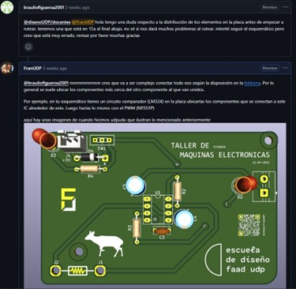

▼ *Fuente:* Captura de pantalla por [@FranUDP](https://github.com/FranUDP/dis8644-2025-1/tree/main/25-FranUDP)

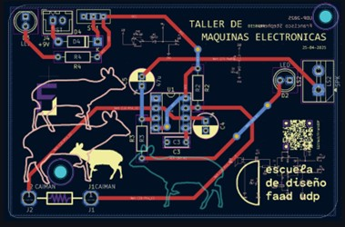

▼ *Fuente:* UDPudu hecha por [@FranUDP](https://github.com/FranUDP/dis8644-2025-1/tree/main/25-FranUDP) en clase

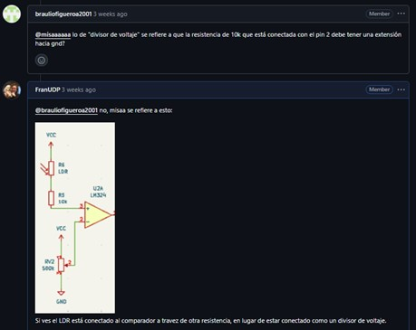

▼ *Fuente:* Captura de pantalla por [@FranUDP](https://github.com/FranUDP/dis8644-2025-1/tree/main/25-FranUDP)


▼ *Fuente:* Captura de pantalla por [@FranUDP](https://github.com/FranUDP/dis8644-2025-1/tree/main/25-FranUDP)

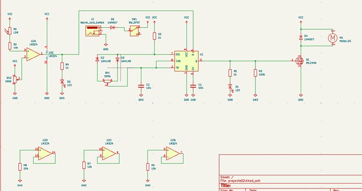

▼ *Fuente:* Grupo 04

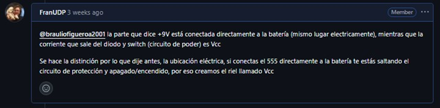

▼ *Fuente:* Captura de pantalla por [@FranUDP](https://github.com/FranUDP/dis8644-2025-1/tree/main/25-FranUDP)


▼ *Fuente:* Captura de pantalla por [@FranUDP](https://github.com/FranUDP/dis8644-2025-1/tree/main/25-FranUDP)

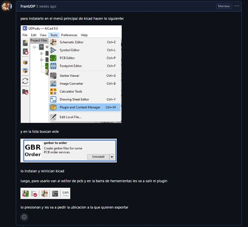

▼ *Fuente:* Captura de pantalla por [@FranUDP](https://github.com/FranUDP/dis8644-2025-1/tree/main/25-FranUDP)

Grupo 02

- Dudas de Kicad


▼ *Fuente:* Captura de pantalla por [@FranUDP](https://github.com/FranUDP/dis8644-2025-1/tree/main/25-FranUDP)

Grupo 01

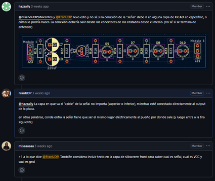

▼ *Fuente:* Captura de pantalla por [@FranUDP](https://github.com/FranUDP/dis8644-2025-1/tree/main/25-FranUDP)

- Troubleshooting

Después de ayudar a soldar las PCBs, hubo que revisar las placas de los grupos 04 y 05, pues su funcionamiento difería de sus prototipos en breadboard, e intervenirlas para recuperar la funcionalidad.

Grupo-04

Las PCBs del grupo 04 presentaban un LDR que no funcionaba, tras una inspección se encontró que el LDR y R5 estaban conectados en serie y no como un divisor de voltaje, a pesar de estar conectados distinto en el esquemático.
Ocurrió que tras realizar los cambios al esquema, olvidaron actualizar la PCB.

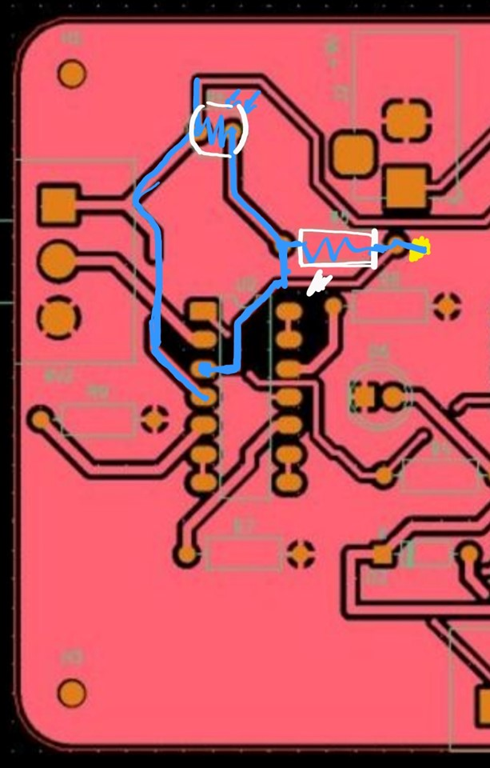

▼ *Fuente:* Captura de pantalla por Grupo 04, editada por [@FranUDP](https://github.com/FranUDP/dis8644-2025-1/tree/main/25-FranUDP)

Tras corregir el divisor de voltaje nos percatamos que en el esquemático, y por ende la PCB, el LDR y el potenciómetro que van conectados al comparador no fueron cambiados del Pin2 al Pin3 y viceversa, sin embargo, en la breadboard si se hiso esta rotación de pines.

Para corregir esto, se desoldó el LDR y R5 y se intercambiaron de lugar, invirtiendo el divisor de voltaje

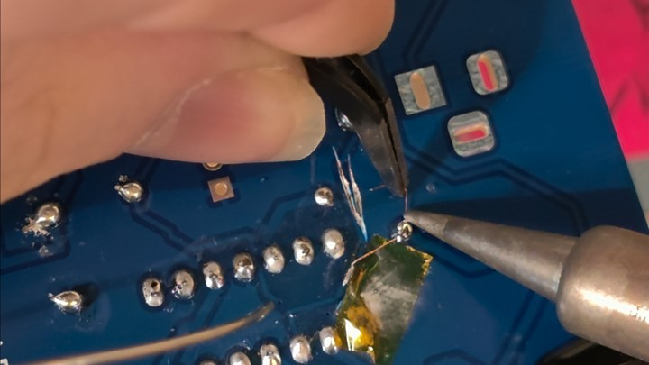

▼ *Fuente:* [@FranUDP](https://github.com/FranUDP/dis8644-2025-1/tree/main/25-FranUDP) modificando la placa, captura de pantalla de video grabado por [@FranUDP](https://github.com/FranUDP/dis8644-2025-1/tree/main/25-FranUDP)

Hubo una placa que después de realizar las modificaciones siguió sin funcionar, ya que entre GND y el Pin3 (LM324) hay un "cortocircuito" con un valor de 10KΩ, por lo que la corriente no fluye a través del LDR. Es posible que sea debido a GND estando expuesto en muy poca proximidad del Pin3 (error cometido durante los arreglos)

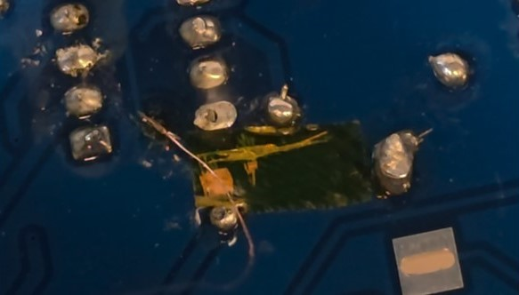

▼ *Fuente:* [@FranUDP](https://github.com/FranUDP/dis8644-2025-1/tree/main/25-FranUDP) modificando la placa, captura de pantalla de video grabado por [@FranUDP](https://github.com/FranUDP/dis8644-2025-1/tree/main/25-FranUDP)


Grupo 05

Este grupo también tenía un LDR que no funcionaba, tras una rápida revisión se identificó la causa del problema, el LM324 no tenía las conexiones VCC ni GND trazadas.

Mas su PCB no se comportaba como la versión de la breadboard, los LEDs parpadeaban todos al mismo tiempo, en lugar de activarse y desactivarse en secuencia, y al retirar la mano del LDR, o se apagaban todos los LEDs o se mantenía encendido la mayoría, en lugar de mantenerse encendido solo uno.

Se conectaron capacitores y pulldowns, pero el problema no se solucionó.

# Observaciones y conclusiones (3)

- **Dificultades:**

 Complejidades a la hora de distribuir el tiempo entre los otros ramos, investigar cada problema y/o duda de los distintos grupos.   

 Debido a la naturaleza sensible de los circuitos, debía estar "encima" para cerciorarme que mi INPUT fue comprendido correctamente y prevenir errores.

- **Logros:**

 Éxito guiando a los distintos grupos a un objeto funcional

 Aprendizaje más profundo sobre el uso de chips nuevos, de transistores, amplificadores y demás componentes.

---

## Documentación: apoyo texto y redacción

**Encargado:** Izhak Villegas *@IzhakVillegas*

## Labores a realizar (3)

Como asistente en el taller, mi labor consistió en **apoyar la documentación, redacción y estructuración de contenidos** para los proyectos. Trabajé en dos frentes principales.

1. Grupos de proyecto (desarrollo de propuestas concretas)

2. Grupos de apoyo (documentación general y soporte logístico)

A continuación, las labores realizadas.

## Colaboración con grupos-proyecto

### Documentación base

- Propuesta de README.md para proyecto-02:

 Se diseñó un **formato estandarizado para la carpeta 00-proyecto-02** y se presentó para su posterior aprobación de parte del equipo docente.


- Se incluyó una estructura de **secciones, lineamientos de redacción y ejemplos visuales**.

### Soporte técnico y conceptual

Resolución de dudas mediante commits, issues en Github y comunicación externa tanto en Whatsapp como presencialmente.

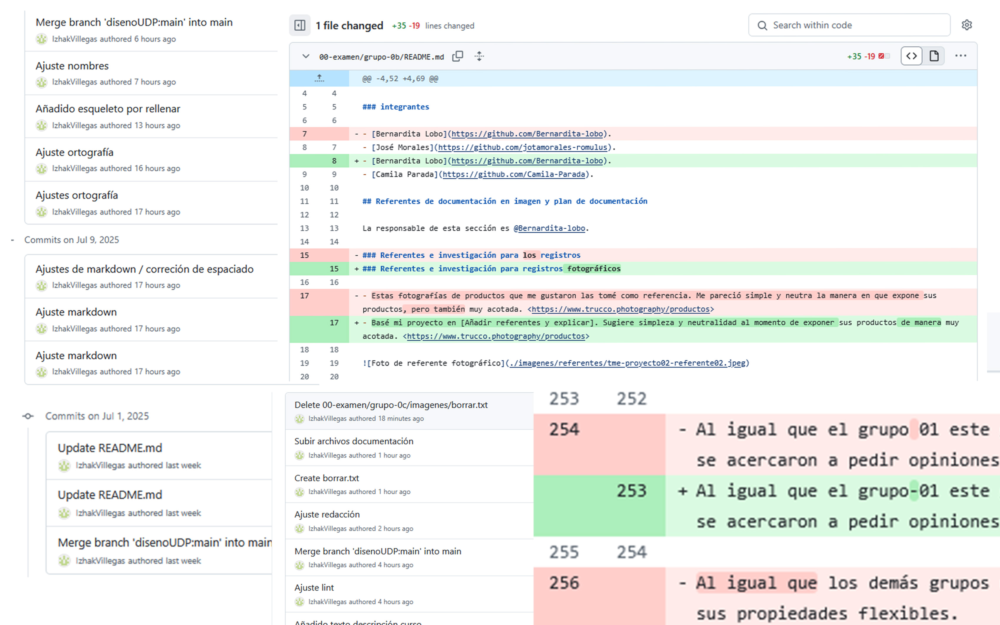

▼ **Fuente:** DiseñoUDP. *Commits*.[Github] Recuperado de <https://github.com/disenoUDP/dis8644-2025-1-proyectos/commits?author=IzhakVillegas&since=2025-07-01&until=2025-07-11>

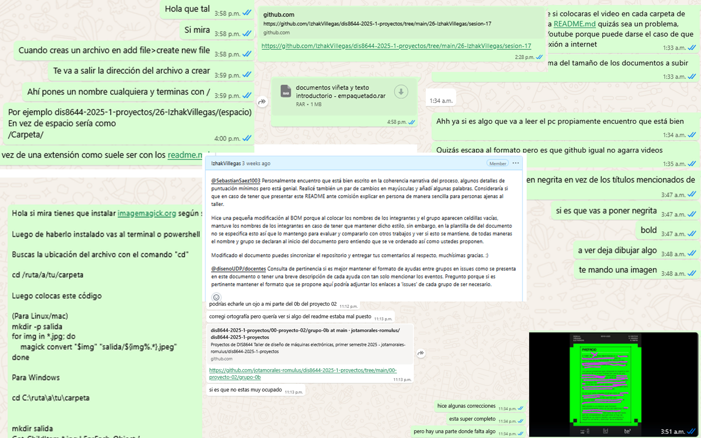

Pantallazos de conversaciones y correcciones sobre el repositorio y temas técnicos

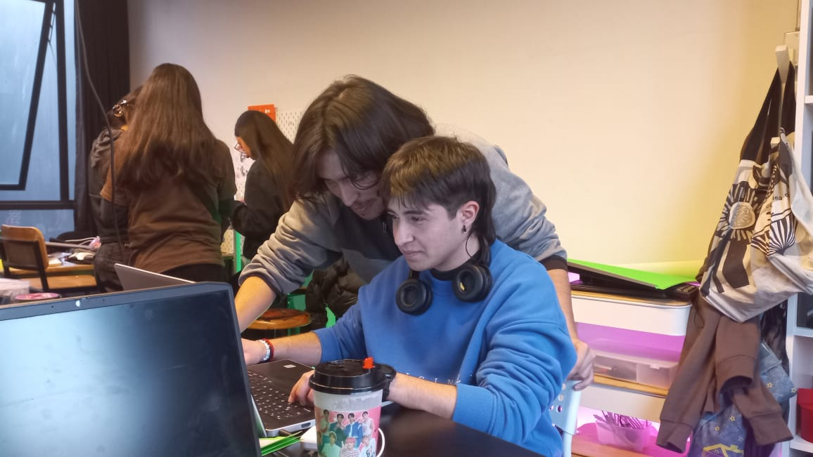

▼ **Fuente:** Fotografiado por [@jotamorales-romulus](https://github.com/jotamorales-romulus)

- Se recopilaron los datos entregados por cada grupo-proyecto para presentarlos como diagrama de bloque mediante Mermaid gracias a la herramienta [Mermaid Chart](https://www.mermaidchart.com/). Sintetizando la arquitectura de cada proyecto.

## Colaboración con grupo-0b (logística)

### Recopilación de datos

Créditos de integrantes (para videos, viñetas y redes sociales).


Exportación de fotografías en Drive (.jpg) para edición en Adobe Photoshop y posterior subida al repositorio.

### Textos descriptivos

- Redacción y diseño de materiales impresos (cartulina fluorescente, monocromía):

- Descripción general del curso

*"El Taller de diseño de máquinas electrónicas es un espacio de encuentro entre lo análogo y lo digital, entre lo artesanal y lo industrial, entre lo local y lo mundial. Su metodología se centra en las prácticas de inteligencias de carácter colectivo en pos del desarrollo de ideas innovadoras por parte de les estudiantes en un espacio.*

*Las piezas de la muestra son evidencia de un arduo trabajo por parte de 26 estudiantes estructurados en 9 equipos: 6 equipos concibieron y fabricaron máquinas electrónicas, mientras que otros 3 equipos se encargaron de tareas de apoyo colectivo que abarcan la planificación de aspectos técnicos, estéticos y funcionales para la producción de las máqiunas y su exposición.*

*Es así que cada máquina emerge como un fruto de iteraciones grupales, validaciones colectivas y soluciones cocreadas, cuyos procesos y resultados han sido sido rigurosamente documentadas en repositorios de GitHub, en el que se han incluido todas las etapas de desarrollo: archivos de diseño de PCBs en Kicad, simulaciones de circuitos en Falstad, y todo lo necesario para comprender el proceso productivo de cada máquina.*

*Bienvenides a un espacio que funciona metafóricamente como una máquina electrónica: cada estudiante, docente y herramienta actúan como componentes conectados para formar un circuito por donde transita energía y datos de forma colectiva. Les animamos a seguir la corriente y disfrutar de la exhibición".*

▼ **Fuente:** Texto descriptivo iterativo entre grupo-0c, grupo-0b y equipo docente. Grupo 0c. *Texto descriptivo del curso (lámina)* [Github] Recuperado de <https://github.com/IzhakVillegas/dis8644-2025-1-proyectos/tree/main/00-examen/grupo-0b>


La presente imagen indica la comparativa entre propuesta (0c) y diseño final (0b).

- Se estableció un orden de presentación para los textos de la presentación.

1. Textos para mesas de avances (medio carta).

2. Textos para mesas de proyectos (medio carta).

3. Viñetas por proyecto (nombre, integrantes, explicación técnica).

Propuesta de stickers NFC (en colaboración con Laboratorio de Interacción Digital UDP) para vincular físicamente al repositorio GitHub.

- **Soporte físico**

Mediciones de mesas para curatoría y distribución espacial de proyectos.

- Medidas mesa: 90.8x70.7x89cm.
- Medida grosor de madera (en mesa): 1.5 cm  madera.
- Primera medida 2.30m.
- Segunda medida 3m.
- Distancia entre dos mesas 75cm.
- Distancia máxima entre mesas 3,23m.
- Espacio para caminar entre mesas 181cm.
- Añadido a mesas por tela 15cm.
- 15 cm x2 (por cada extremo).

## Observaciones y conclusiones (3)

- **Dificultades:**

 Limitaciones en la redacción centralizada para permitir las expresiones libres de cada grupo.

 Mejor comunicación en persona que en medios digitales, sin embargo, gracias a los canales de comunicación como Commits y Discord se logró llegar a buen puerto.

- **Logros:**

 Estandarización de formatos (README, diagramas, textos físicos).

 Documentación de procesos y respaldo visual.

---

## Conclusiones generales

Se destaca el **ambiente colaborativo** digital y físico de cada uno de los integrantes de este Taller. **Transparencia, comunicación efectiva y voluntad de cada uno de los integrantes** en desarrollar colectivamente cada proyecto-02.

Se reforzó el valor del **trabajo en red.** La sinergia entre roles demuestra que la conexión entre partes diversas genera un resultado mayor que la suma de sus partes. La exhibición final es un testimonio de cómo la **colaboración estructurada y la creatividad compartida pueden transformar desafíos complejos en soluciones tangibles**.
