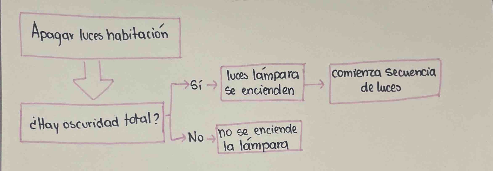
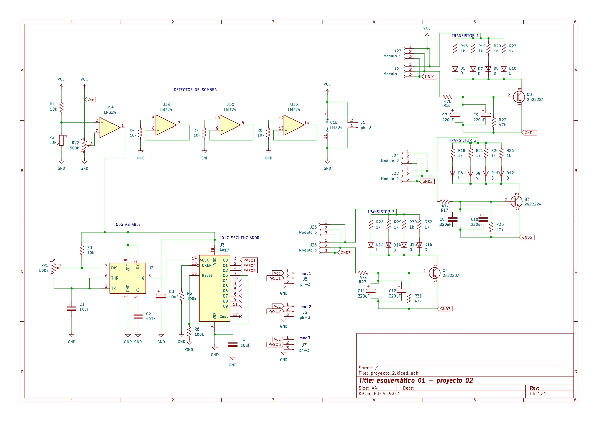
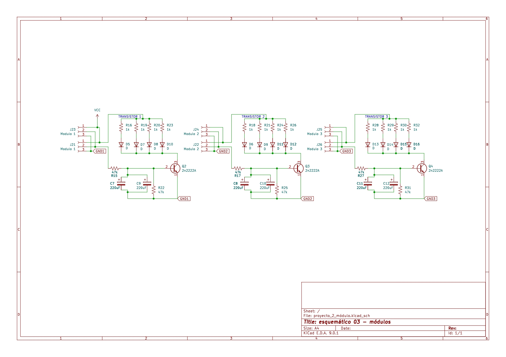
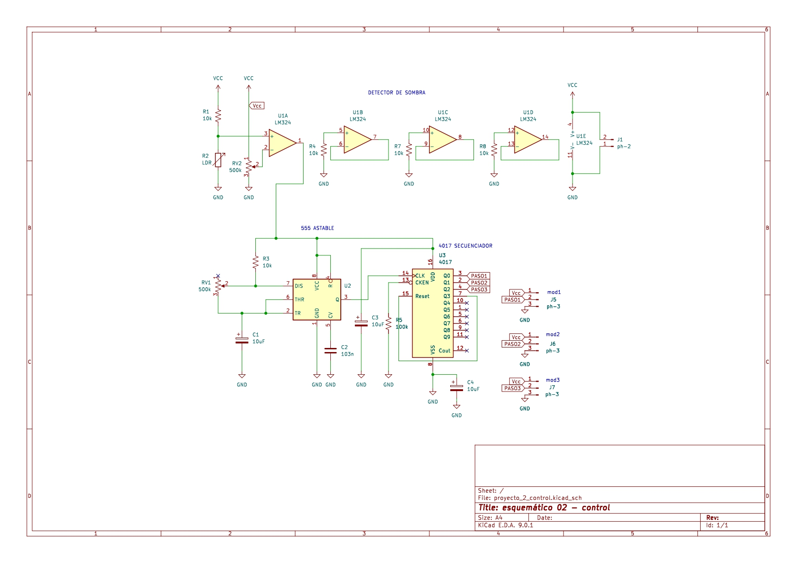
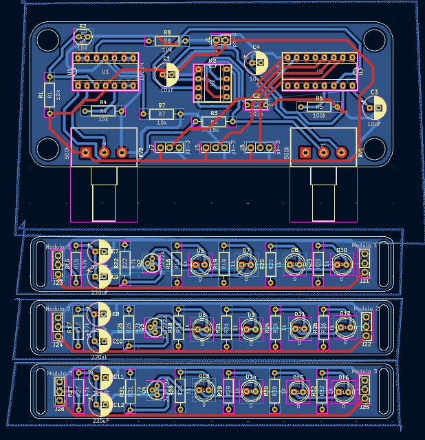
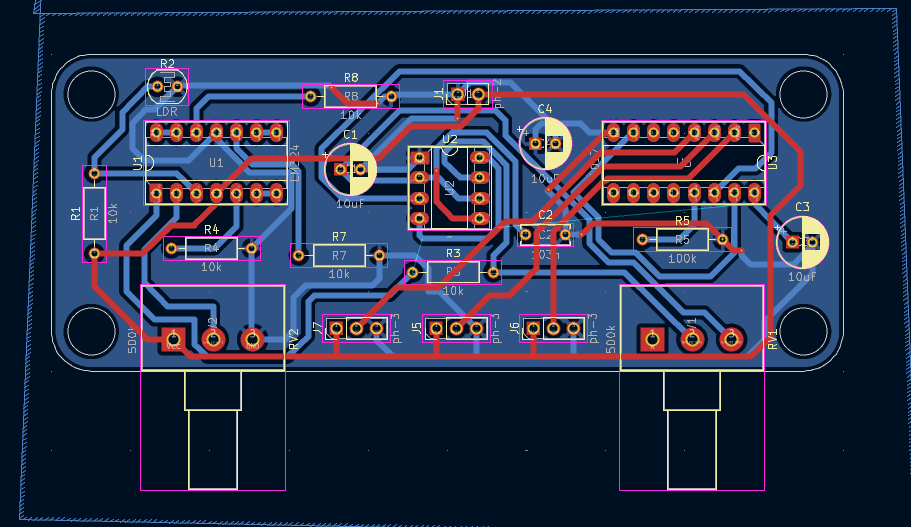
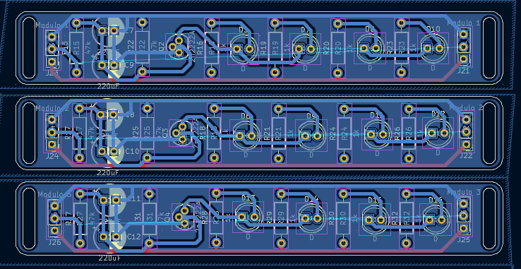
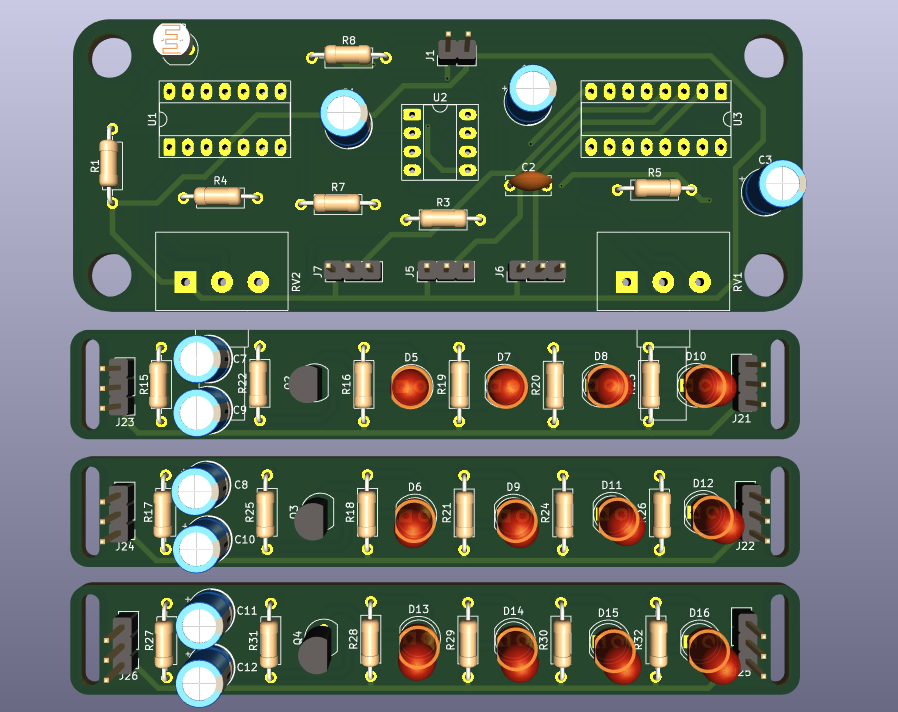

# proyecto-02

## Acerca del proyecto

- Grupo: 01
- Integrantes:
  - Emilia Contreras / [hazzaily](https://github.com/hazzaily)
  - Katalina Riquelme / [katalinariquelme](https://github.com/katalinariquelme)
  - Thyare Santander / [thyare08](https://github.com/thyare08)
- Chips usados:
  - Chip 555
  - Chip 4017
  - Chip LM324

## Presentación textual

Luz de noche en secuencia gradual con forma de nube.

El proyecto consiste en un detector de sombra invertido que enciende una lámpara que posee una secuencia gradual.

## Dibujos de diagramas del circuito (1 punto)

Este es el diagrama a mano.

En este  dibujo mostramos en orden cómo se efectúa la secuencia de luces o no, según sea que esté en una habitación con luz u oscuridad.

## Prototipado de circuitos en protoboard (1 punto)

A continuación se presentan imágenes de las protoboards usadas.

En la protoboard larga está configurado el detector de sombras, en el cual se utiliza un LDR para encender si está oscuro y apagarse si hay luz. Luego viene el chip 555 con un potenciómetro que regula la intesidad de la luz, continuando con un LM324 que crea la secuencia de las luces. Finalizamos el circuito de salida usando transistores que hicieron que al encender y apagarlos LED se prendieran y apagaran de manera gradual.

## Bill of Materials (1 punto)

| Reference                                       | Value   | Qty |
|-------------------------------------------------|---------|-----|
| C1,C3,C4                                        | 10uF    | 3   |
| C2                                              | 103n    | 1   |
| C7,C8,C9,C10,C11,C12                            | 220uF   | 6   |
| D5,D6,D7,D8,D9,D10,D11,D12,D13,D14,D15,D16      | LED 5mm | 12  |
| J1                                              | ph-2    | 1   |
| J5,J6,J7                                        | ph-3    | 2   |
| J21,J23                                         | mod1    | 2   |
| J22,J24                                         | mod2    | 2   |
| J25,J26                                         | mod3    | 2   |
| Q2,Q3,Q4                                        | 2n2222  | 3   |
| R1,R3,R4,R7,R8                                  | 10k     | 5   |
| R2                                              | LDR     | 1   |
| R5                                              | 100K    | 1   |
| R15,R17,R22,R25,R27,R31                         | 47K     | 6   |
| R16,R18,R19,R20,R21,R23,R24,R26,R28,R29,R30,R32 | 1K      | 12  |
| RV1,RV2                                         | 500K    | 2   |
| U1                                              | LM324   | 1   |
| U2                                              | 555     | 1   |
| U3                                              | 4017    | 1   |

## Ayudas y comunicación con colegas (1 punto)

[FranUDP](https://github.com/FranUDP) nos ayudó a revisar nuestro esquemático, a buscar y asignar huellas, y además de ayudarnos a resolver dudas sobre la PCB.

[Bernardita-lobo](https://github.com/Bernardita-lobo) y [jotamorales-romulus](https://github.com/jotamorales-romulus) nos ayudaron con el registro fotográfico de nuestra protoboard.

[duckusu](https://github.com/duckusu) nos ayudó a busacr lugares en donde podríamos comprar materiales faltantes, y por mayor.

Ayudamos a [antocristi](https://github.com/antocristi) y a [paulinavargasf](https://github.com/paulinavargasf) del grupo 05 a saber cómo subir fotos a los archivos de github.

## Esquematico en Kicad (1 punto)

El esquemático comienza con un chip LM324, el cual funciona como detector de luz, esto porque es la configuración inicial de un detector de sombra, pero con R1 y R2 intercambiados, logrando así que el circuito se encienda cuando no haya luz estimulando el LDR. El chip siguiente es un 555 configurado en modo astable, lo que nos permite controlar la velocidad con la que cambia la "tira de LED" a la siguiente. Seguido de esto tenemos un chip 4017 que funciona como secuenciador, siendo esta secuencia de "tiras de LED" la que controla el chip anterior. Por último, gracias al uso de transistores es que logramos una iluminación que va de menor a mayor, y cuando se apaga de mayor a menor, generando una onda que cambia suavemente y no de manera abrupta.

## PCB en Kicad (1 punto)

## Recursos adicionales

## Bibliografía
