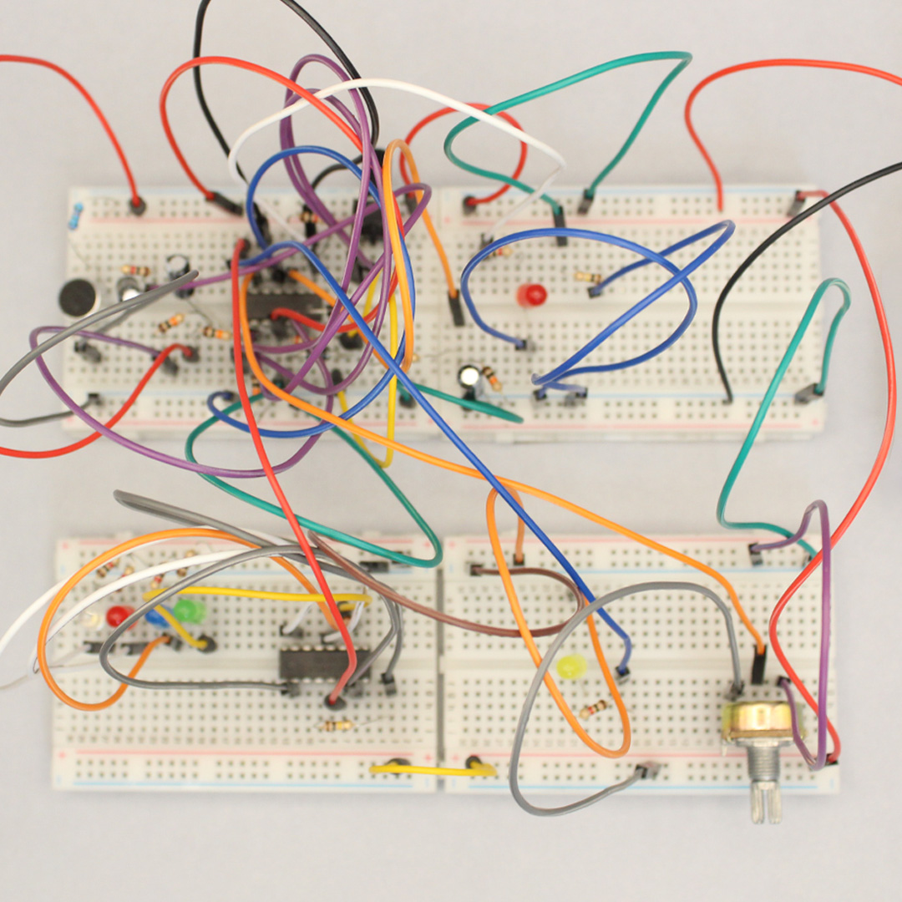
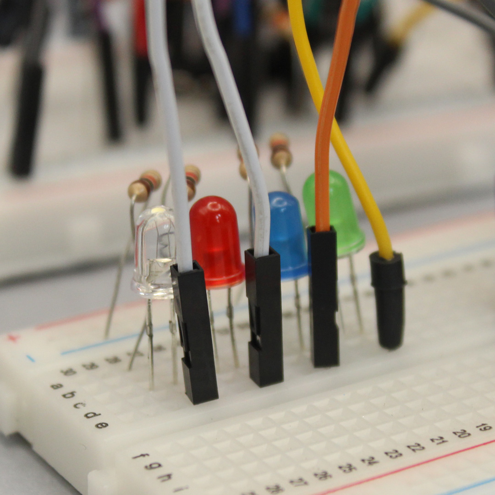
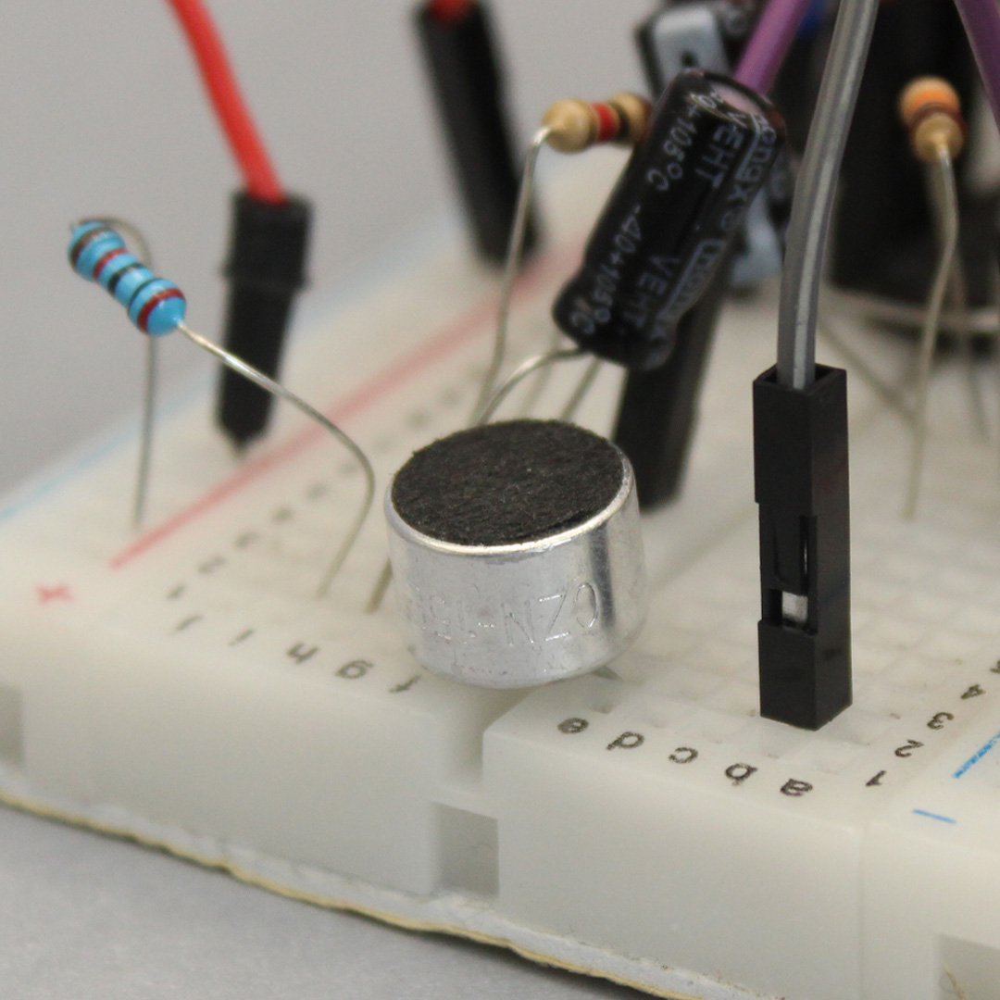
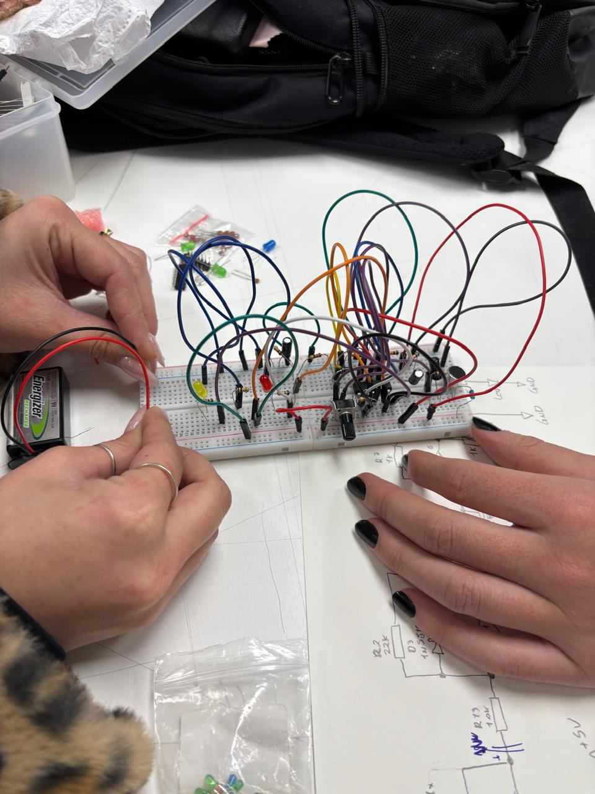
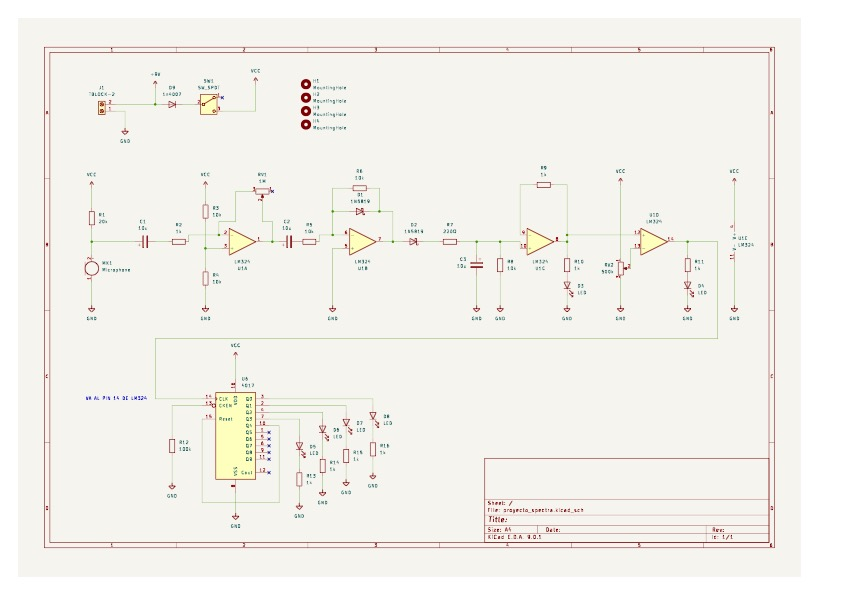

# proyecto-02

## Acerca del proyecto

- Grupo: 03
- Integrantes:
  - Sofía Cartes
  - Isabella Gutierrez
  - Valentina Ruz
- Chips usados:
  - Chip LM324
  - Chip 4017

## Presentación textual

Spectra consiste en una entrada que reacciona con el sonido, para controlar ka salida de luces LEDS de colores.

## Dibujos de diagramas del circuito (1 punto)

Este es el diagrama a mano comlpleto y del Chip LM324

Este es el diagrama del Chip 4017

En este dibujo mostramos la ayuda de Matías con Ángel; lograron hacer el esquemático del micrófono con el Chip LM324 para poder regular la sensibilidad de este (nos había faltado un condensador de 1 uF en el pin 1) luego desde el pin 14 del chip LM324 poder conectarlo al pin 14 del Chip 4017 y que funcionen las luces.

## Prototipado de circuitos en protoboard (1 punto)

A continuación se presentan imágenes de las protoboards usadas.

- El circuito de entrada reacciona al sonido para medir la sensibilidad del micrófono, mediante un potenciómetro.

- El circuito de salida usa luces LEDS de colores para representar y ver el sonido que entra en el circuito.

## Bill of Materials (1 punto)

| Componente    | Cantidad | Comentarios     |
| ------------- | -------- | --------------- |
| Resistencia   | 8        | 1k              |
| Resistencia   | 4        | 10k             |
| Resistencia   | 1        | 220             |
| Resistencia   | 2        | 22k             |
| Microfono     | 1        | CZN-15E         |
| Condensador   | 2        | 10uF            |
| Condensador   | 1        | 1uF             |
| Diodo         | 2        | 1n5819          |
| Diodo         | 1        | 1n4007          |
| Potenciómetro | 1        | 1M Ohm          |
| Potenciómetro | 1        | 500k            |
| LED           | 8        | 10mm            |
| LED           | 2        | 5mm             |
| Chip          | 1        | LM324N          |
| Chip          | 1        | 4017            |
| Terminal block | 1        | 2 pin           |
| Switch        | 1        | spdt            |
| Bateria        | 1        | 9v              |  

- Los LEDS de 10mm son de colores variados y los LEDS de 5mm uno es de color verde y otro blanco.
- En este BOM lo único que nos faltaría sería el Terminal Block de 2 pin y el switch, para poder conectarlo a la fuente de poder.

## Ayudas y comunicación con colegas (1 punto)

FranUDP del proyecto esquemáticos nos ayudó con poner y encontrar las huellas (footprints) de los Chips LM324 y 4017 en Kicad. La respuesta fue que se llama "DIP-[numeroDePines]W7.62mm-LongPads"

<https://github.com/disenoUDP/dis8644-2025-1-proyectos/issues/125#issuecomment-2984535616>

<https://github.com/disenoUDP/dis8644-2025-1-proyectos/issues/137#issuecomment-2984472409>

Duckusu del proyecto BOMS nos ayudó en ver la lista de los componentes e incluir algunas cosas que nos faltaban.

<https://github.com/disenoUDP/dis8644-2025-1-proyectos/issues/143#issuecomment-2981033544>

Angel oyente de la clase, nos ayudó con el prototipo en protoboard.

<https://github.com/disenoUDP/dis8644-2025-1-proyectos/issues/115#issuecomment-2984512973>

Paulinavargasf del grupo nos ayudó con el prototipo en protoboard, ya que su grupo tenía un problema parecido con el nuestro, que no le funcionaba el micrófono y nos dijo que el pin 15 iba conectado a GND, pero no nos funcionó.

<https://github.com/disenoUDP/dis8644-2025-1-proyectos/issues/137#issuecomment-2984472409>

Misaaaaaa docente nos ayudó con el esquemático para regular el micrófono.

<https://github.com/disenoUDP/dis8644-2025-1-proyectos/issues/115#issuecomment-2984512973>

Jotamorales-romulu y Bernardita-lobo del proyecto duvumentacionVisual nos ayudaron con fotografiar nuestra protoboard y el registro en clases mediante videos.

<https://drive.google.com/drive/folders/1xyW8lfvPIwpi3rZzOzuXnkZNs_ZTMohJ>

## Esquematico en Kicad (1 punto)

En el primer esquemático, es el del Chip LM324, donde conectamos primero el micrófono, luego mediante los condensadores regulamos la sensibilidad de este para que capte mejor los sonidos e incorporamos dos LEDS para ver si el circuito funciona correctamente, dentro de este, el potenciómetro nos da la posibilidad de que elijamos la receptividad.

En el segundo esquemático es la secuencia/contador de luces mediante el Chip 4017, donde el pin 14 va al pin 14 del LM324, lo cual nos da la posibilidad de la diferente frecuencia de los cuatro LEDS incorporados y que esta dependa del sonido emitido.

DESCRIPCIÓN:

- LM324 nos sirvió para amplificar la señal emitida y poder regular la sensibilidad de la recepción de los sonidos (micrófono)

CONEXIONES UTILIZADAS:

CHIP LM324

- pin 1 y 2 para la conexión con el potenciómetro la dos para la su pin central,  mientras la uno se dirige al condensador.

- pin 3 hacia dos resistencias de 10k, una hacia VCC y otra a GND.

- pin 4 a  VVC

- pin 5 a GND

- pin 6 va con una conexión al pin 1, pasando por la resistencia de 10k y el condensador de 1uF, anteriormente mencionados.También, está conectado al diodo 1N5819 en serie? a la resistencia de 22k, intersectando con el pin 7 que está conectado al diodo 1N5819, siguiendo a la resistencia de 220, al condensador de 10uF, resistencia 10k, llegando al pin 10.

- pin 9 se dirige a la resistencia de 1k, conectando con el pin 8 dirigiéndose a GND por medio una resistencia de 1k y un LED. De igual manera, la conexión anterior pasa por el pin 12.

- pin 13, está conectado al pin central de un potenciómetro de 500k y sus otros pines uno a VVC y otro a GND.

- pin 14 hacia GND, mediante una resistencia de 1k y al LED.

CHIP 4017

- Nos sirvió para hacer la secuencia de luces con un reset por cada beat.

- Desde el pin 14 del LM324N se dirige al pin 14 del 4017.

- pin 2 hacia un LED, con un color predeterminado, consecutivamente a una resistencia de 1k llegando a GND. Se repite esto con los pins 3, 4 y 7.

- pin 8 a GND.

- pin 13 va a una resistencia de 100k, finalizando en GND.

- pin 15 para hacer reset se conecta al pin 10.

- pin 16 a VVC.

## PCB en Kicad (1 punto)

Enlace de la PCB para ver los PDF <https://drive.google.com/drive/folders/13fPj71c8mFoW2-MyDWrl_n2MRV8LrotA?usp=sharing>

## Recursos adicionales

- El chip LMV324M del SparkFun Sound Detector lo desglosamos, por así decirlo, para tener el chip aparte y poder regular la sensibilidad del micrófono.

<https://www.sparkfun.com/sparkfun-sound-detector.html>

## Bibliografía

<https://www.sparkfun.com/sparkfun-sound-detector.html>

<chrome-extension://efaidnbmnnnibpcajpcglclefindmkaj/https://cdn.sparkfun.com/datasheets/Sensors/Sound/LMV324.pdf>

<https://www.digikey.com/es/resources/conversion-calculators/conversion-calculator-resistor-color-code>

<https://www.alldatasheet.com/datasheet-pdf/pdf/26855/TI/CD4017.html>

<https://www.alldatasheet.es/datasheet-pdf/pdf/22756/STMICROELECTRONICS/LM324N.html>
