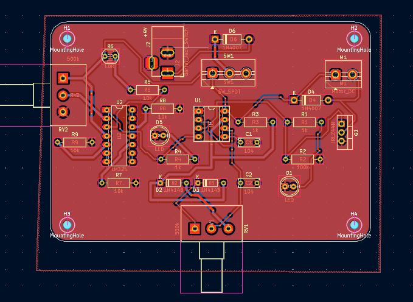

# proyecto-02

## Acerca del proyecto

- Grupo: 04
- Integrantes:
  - Braulio Figueroa
  - Carlo Martínez
  - Bastian Solís
- Chips usados:
  - Chip LM324
  - Chip NE555

## Presentación textual

El proyecto consiste en un juguete para gato que funciona con un LDR que controla la activación de un motor dc

## Dibujos de diagramas del circuito (1 punto)

Este es el diagrama a mano.

En este dibujo mostramos XX.

## Prototipado de circuitos en protoboard (1 punto)

A continuación se presentan imágenes de las protoboards usadas.

A continuación se presentan textos explicativos del prototipado.

El circuito de entrada USA XX para medir XX.

El circuito de salida usa XX para cambiar XX.

## Bill of Materials (1 punto)

| Componente   | Cantidad | Comentarios     |
| ------------ | -------- | --------------- |
| Resistor     | 5        | 1/4W            |
| XX | ... | ...       |

INCLUIR DESCRIPCIÓN DE MATERIALES COMPRADOS, SI ES QUE COMPRARON COSAS ADICIONALES.

## Ayudas y comunicación con colegas (1 punto)

DOCUMENTAR TEXTUAL, CON IMÁGENES, CON ENLACES A BITÁCORAS.

La persona XX del proyecto XX nos ayudó con XX.

La persona XX del proyecto XX nos ayudó con XX.

Ayudamos a la persona XX del proyecto XX con XX.

Ayudamos a la persona XX del proyecto XX con XX.

## Esquematico en Kicad (1 punto)

EXPLICACIÓN TEXTUAL DEL ESQUEMÁTICO.

DESCRIBIR CHIPS USADOS, CONEXIONES USADAS.

## PCB en Kicad (1 punto)

## Recursos adicionales

## Bibliografía
