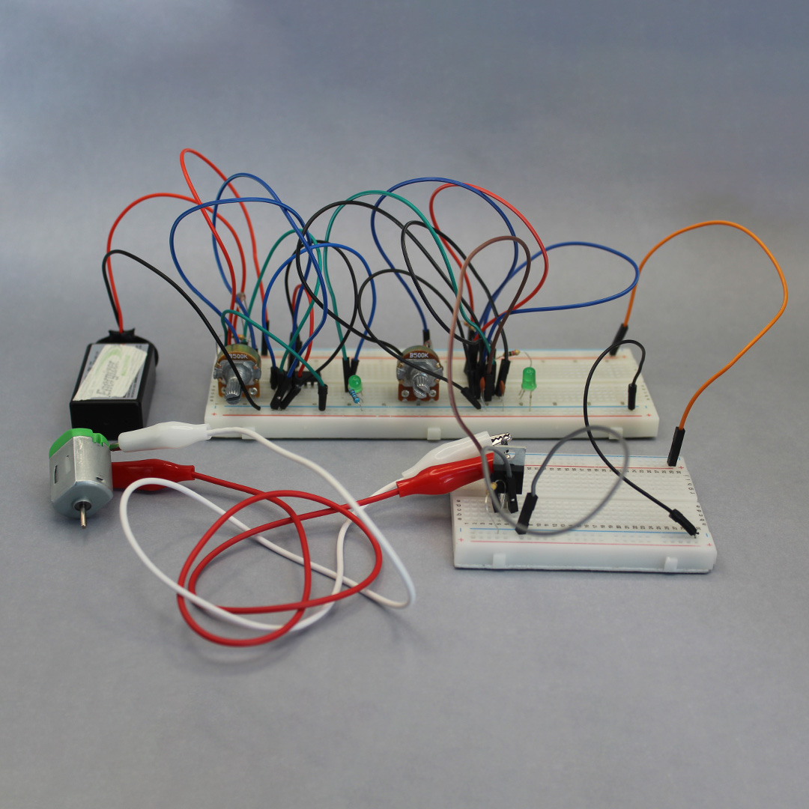
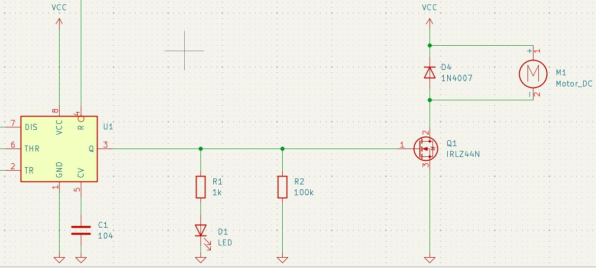
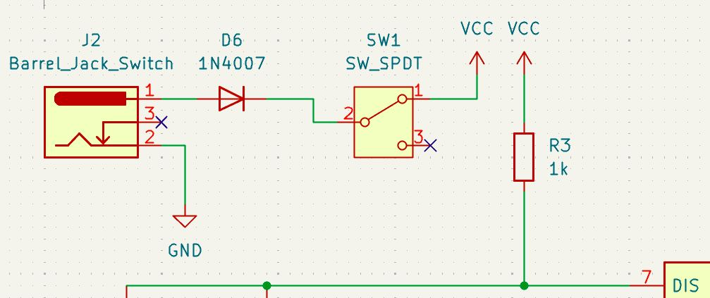
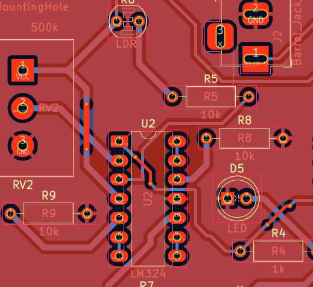
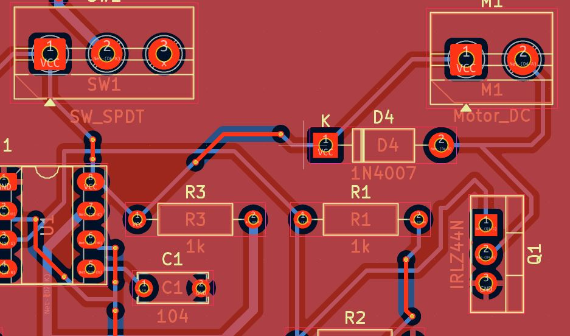
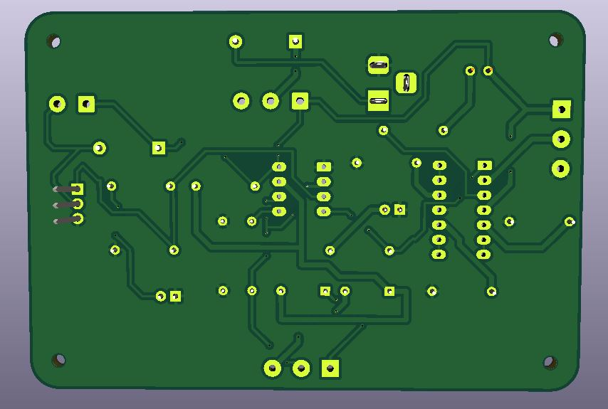

# proyecto-02

## Acerca del proyecto

- Grupo: 04
- Integrantes:
  - Braulio Figueroa
  - Carlo Martínez
  - Bastian Solís
- Chips usados:
  - Chip LM324
  - Chip NE555

## Presentación textual

El proyecto consiste en un juguete para gato que funciona con un LDR que controla la activación de un motor dc

## Dibujos de diagramas del circuito (1 punto)

Este es el diagrama a mano.

En este dibujo mostramos XX.

## Prototipado de circuitos en protoboard (1 punto)

A continuación se presentan imágenes de las protoboards usadas.

A continuación se presentan textos explicativos del prototipado.

El circuito de entrada USA XX para medir XX.

El circuito de salida usa XX para cambiar XX.

## Bill of Materials (1 punto)

| Grupo 4 	|                               	|   Integrantes   	|                 	|                         	|                                    	|
|:-------:	|-------------------------------	|:---------------:	|-----------------	|-------------------------	|------------------------------------	|
|         	| Braulio (brauliofigueroa2001) 	| Carlo (zaaaiko) 	| Bastían (HSB25) 	|                         	|                                    	|
|         	|                               	|                 	|                 	|                         	|                                    	|
|         	|                               	|                 	|                 	|                         	|                                    	|
|   Item  	|              Qty              	|    Referencia   	|      Valor      	|       Tipo de ítem      	|            Accesibilidad           	|
|    1    	|               5               	|  R1,R2,R3,R4,R5 	|       10k       	|       Resistencia       	|      Se puede conseguir en lab     	|
|    2    	|               2               	|      R6, R7     	|        1k       	|       Resistencia       	|      Se puede conseguir en lab     	|
|    2    	|               1               	|        R8       	|       100k      	|       Resistencia       	|      Se puede conseguir en lab     	|
|    3    	|               1               	|        R9       	|        1        	|       Resistencia       	|      Se puede conseguir en lab     	|
|    4    	|               2               	|     RV1,RV2     	|       500k      	|      	Potenciómetro      	|      Se puede conseguir en lab     	|
|    5    	|               1               	|       R10       	|       LDR       	|           LDR           	|       Se tendrán que comprar       	|
|    6    	|               2               	|      C1, C2     	|       104n      	|   Condensador cerámico  	|      Se puede conseguir en lab     	|
|    7    	|               2               	|      D1, D2     	|      1N4148     	|          Diodo          	|       Se tendrán que comprar       	|
|    8    	|               2               	|      D3, D4     	|      1N4007     	|          Diodo          	|       Se tendrán que comprar       	|
|    9    	|               2               	|      D5, D6     	|     5mm Rojo    	|           LED           	|      Se puede conseguir en lab     	|
|    10   	|               1               	|        U1       	|      LM324      	|          DIP-14         	|       Se tendrán que comprar       	|
|    11   	|               1               	|        U2       	|      NE555      	|          DIP-8          	|      Se puede conseguir en lab     	|
|    12   	|               1               	|       BT1       	|      5V–9V      	| Fuente de alimentación. 	|      Se puede conseguir en lab     	|
|    13   	|               1               	|        J1       	|     2 pines     	|      Terminal Block     	|       Se tendrán que comprar       	|
|    14   	|               1               	|        J2       	|     3 pines     	|      Terminal Block     	|       Se tendrán que comprar       	|
|    15   	|               1               	|       SW1       	|       SPDT      	|         Switch          	|      Se puede conseguir en lab     	|
|    16   	|               1               	|                 	|        9v       	|         Motor DC        	|      Se puede conseguir en lab     	|
|    17   	|               1               	|        Q1       	|  MOSFET IRLZ44N 	|        Transistor       	| Se pueden usar los que nos pasaron 	|
|    18   	|               1               	|        J3       	| 5.5 mm estándar 	|   Conector Barrel Jack  	|       Se tendrán que comprar       	|

## Ayudas y comunicación con colegas (1 punto)

DOCUMENTAR TEXTUAL, CON IMÁGENES, CON ENLACES A BITÁCORAS.

La persona 21 del proyecto 00 nos ayudó con pasar el BoM desde un Excel a MarkDown (Revisar su fork en la sesion 15b).

La persona XX del proyecto XX nos ayudó con XX.

Ayudamos a la persona XX del proyecto XX con XX.

Ayudamos a la persona XX del proyecto XX con XX.

## Esquematico en Kicad (1 punto)

EXPLICACIÓN TEXTUAL DEL ESQUEMÁTICO.

DESCRIBIR CHIPS USADOS, CONEXIONES USADAS.

## PCB en Kicad (1 punto)

## Recursos adicionales

## Bibliografía
