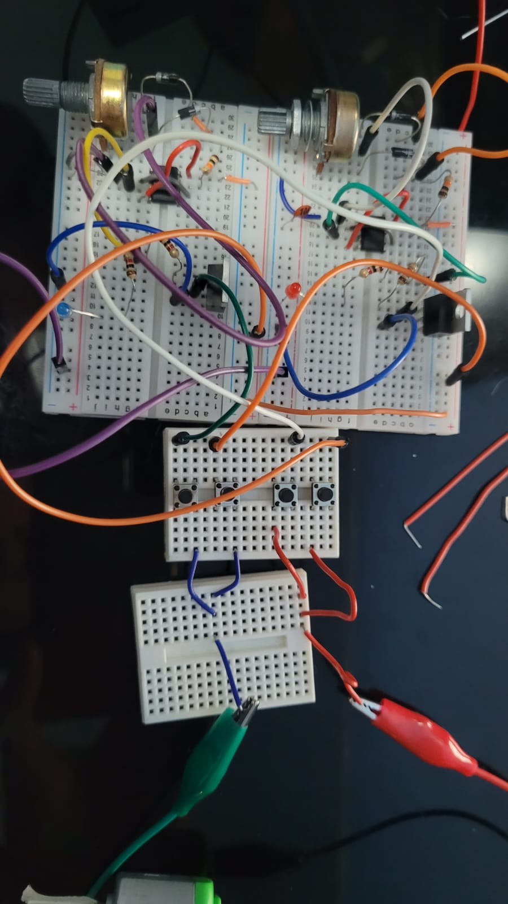
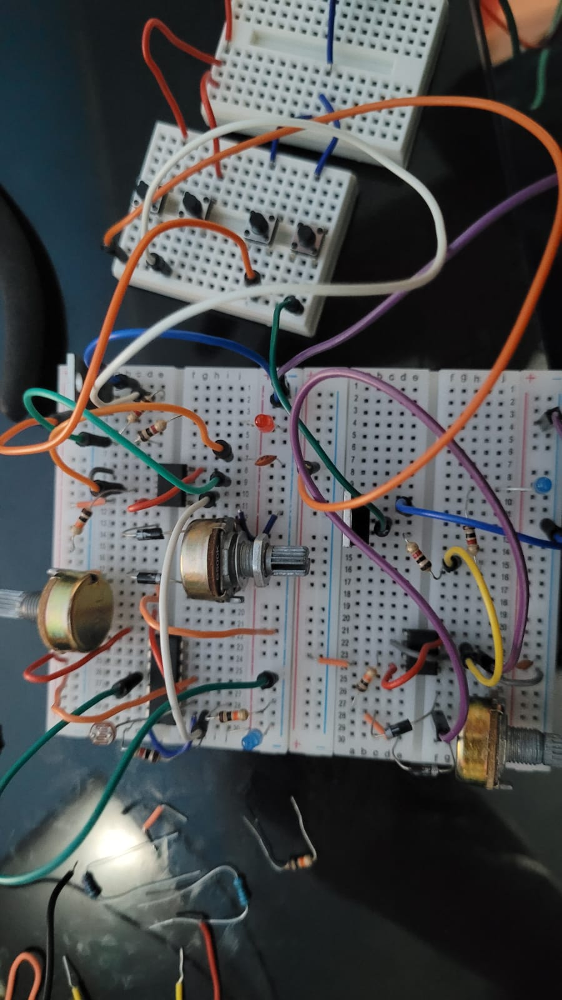

# proyecto-02

## Acerca del proyecto

- Grupo: 06
- Integrantes:
  - Santiago Gaete Fernández
  - Anaís Marschhausen Gajardo
  - Sebastián Saez Olivares
- Chips usados:
  - NE555
  - L293D

## Presentación textual

fps555 es un dispositivo de protección ocular con posición adaptable mecánicamente. consiste en un circuito que recibe un input a través de un interruptor on-off-on. esta acción provoca un output de rotación mecánico, ajustando la posición de los lentes

## Dibujos de diagramas del circuito (1 punto)

Este es el diagrama a mano.

En este dibujo mostramos XX.

## Prototipado de circuitos en protoboard (1 punto)

En un principio queríamos que nuestro circuito funcionara gracias a un servomotor para crear un movimiento controlado al interactuar con nuestro producto, pero no funcionó ningún circuito que encontramos en internet, y los que sí funcionaban requieren Arduino para su funcionamiento.

A continuación, un video de todos los componentes y la protoboard que habíamos armado:

Luego Matías nos explicó sobre los puentes H, donde podíamos controlar la velocidad y la dirección del movimiento de un motor como el que se encontraba en nuestro kit.

También se nos mencionó que existe un chip integrado que realizaba esta función, pero de igual manera se hizo una prueba del circuito de manera mecánica, con 4 botones, a que era lo que más se asemejaba al esquemático del puente H a primera vista.

El funcionamiento era el siguiente:

Se armaron 2 circuitos PWM donde su output eran conectados hacia botones, donde el circuito 1 quedaría posicionado con su output al positivo del motor, mientras que a través de otro botón se dejaría pasar la conexión para completar el circuito, mientras que el circuito 2 estaría de la manera opuesta, todo esto para que no ocurriese ningún cortocircuito.

Video de prueba del puente H con 4 botones, hecho de manera mecánica:

Luego pasamos a integrar el chip L293D con el que se pudo reducir su funcionamiento a simplemente 2 botones, uno para cada dirección del motor.

Video de prueba del chip al tener 2 botones:

Luego se integró el switch 6 PDT para poder generar este cambio de dirección con tan solo 1 componente, como también el estado neutro “off” del motor.

Pero se nos dejó claro en la clase del martes 17 de junio unas ciertas correcciones, para poder asegurarnos de que el L293D estaba correctamente conectado, como también el uso de la otra mitad de nuestro switch on/off/on, y que de esta manera no se fuese a ocupar todo el circuito de manera constante al conectarlo al pin 4 del chip 555.

Como último componente, se conectó el motor reductor de 3 rpm que compramos, para poder demostrar el funcionamiento como lo asignamos.

Video del funcionamiento de la protoboard final:

Como resumen:

El circuito de entrada usa la posición del switch para determinar el estado del motoreductor.

El circuito de salida usa el L293D para cambiar el sentido de la rotación del motoreductor.

## Bill of Materials (1 punto)

| Componente   | Cantidad | Comentarios     |
| ------------ | -------- | --------------- |
| Resistor     | 5        | 1/4W            |
| XX | ... | ...       |

INCLUIR DESCRIPCIÓN DE MATERIALES COMPRADOS, SI ES QUE COMPRARON COSAS ADICIONALES.

## Ayudas y comunicación con colegas (1 punto)

### protoboards

[issue protoboards](https://github.com/orgs/disenoUDP/projects/4/views/1?pane=issue&itemId=115280226&issue=disenoUDP%7Cdis8644-2025-1-proyectos%7C140)

• documentar: aarón nos confirmo que era necesario documentar todo el progreso para entender el proceso de aprendizaje

• feedback: no hemos recibido respuesta

### bom

[issue bom](https://github.com/orgs/disenoUDP/projects/4/views/1?pane=issue&itemId=115280715&issue=disenoUDP%7Cdis8644-2025-1-proyectos%7C146)

• caso a y b: franudp del grupo 0c nos ayudo con unos nudos que podríamos utilizar y recomendaciones de como podríamos trabajar nuestra placa, también que podríamos utilizar resina uv para cubrir las conexiones
matías nos comento que podríamos utilizar silicona y también sugirió si utilizábamos tblock deberíamos ocupar terminales para aislar

• boletas: matías nos comento que era probable que existieran los pin header en el lab, y también confirmo nuestra idea de comprar una regleta y utilizar solo 5 pin
duckusu del grupo 0c confirmo que en el lab hay pin header y se encargo de guardar las boletas de los componentes comprados.

### esquematico

[issue esquemático](https://github.com/orgs/disenoUDP/projects/4/views/1?pane=issue&itemId=115278736&issue=disenoUDP%7Cdis8644-2025-1-proyectos%7C128)

• interacción previa: aarón comento que era más rápido etiquetar a @disenoUDP/docentes que estar etiquetando uno a uno
franudp del grupo 0c nos ayudo con correcciones para nuestro esquemático

• símbolo: aarón nos envió una guía para KiCAD
matías nos guío con el componente y este como estaba en la footprint

• feedback diagramación: aarón comento que esta hermoso y que podríamos añadir cajas de texto, lo cual se profundizara para el examen

### pcb

[issue pcb](https://github.com/orgs/disenoUDP/projects/4/views/1?pane=issue&itemId=115279178&issue=disenoUDP%7Cdis8644-2025-1-proyectos%7C134)

• forma: matías comento que probablemente la pcb haga alusión al sol, seria muy redundante, pero la forma de lentes hacia atrás, la encuentra interesante

• screw terminal y lente: franudp del grupo 0c nos corrigió que toda la fuente de poder tuviera el mismo voltaje y matías nos confirmo que estaba bien las footprints de la batería

• drc: franudp del grupo 0c nos comento que en la pagina de jlcpcb salen las dimensiones mínimas para cada perforación, separación.

### carcasas

[issue carcasas](https://github.com/orgs/disenoUDP/projects/4/views/1?pane=issue&itemId=116136542&issue=disenoUDP%7Cdis8644-2025-1-proyectos%7C554)

• issue felix: santiago especifico las medidas de nuestra pcb y también adjunto el repo en donde podrían ver la información completa

## Esquematico en Kicad (1 punto)

EXPLICACIÓN TEXTUAL DEL ESQUEMÁTICO.

DESCRIBIR CHIPS USADOS, CONEXIONES USADAS.

## PCB en Kicad (1 punto)

## Recursos adicionales

## Bibliografía
