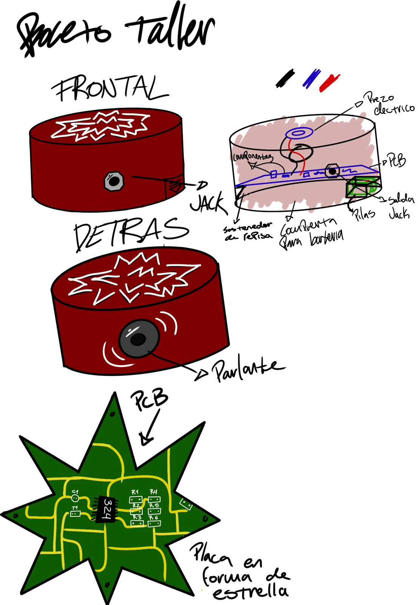
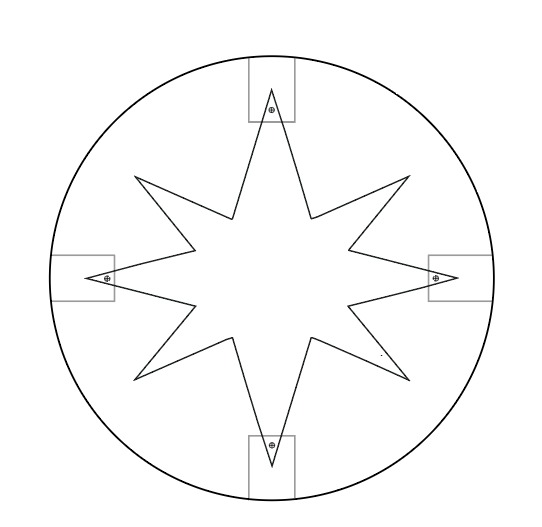
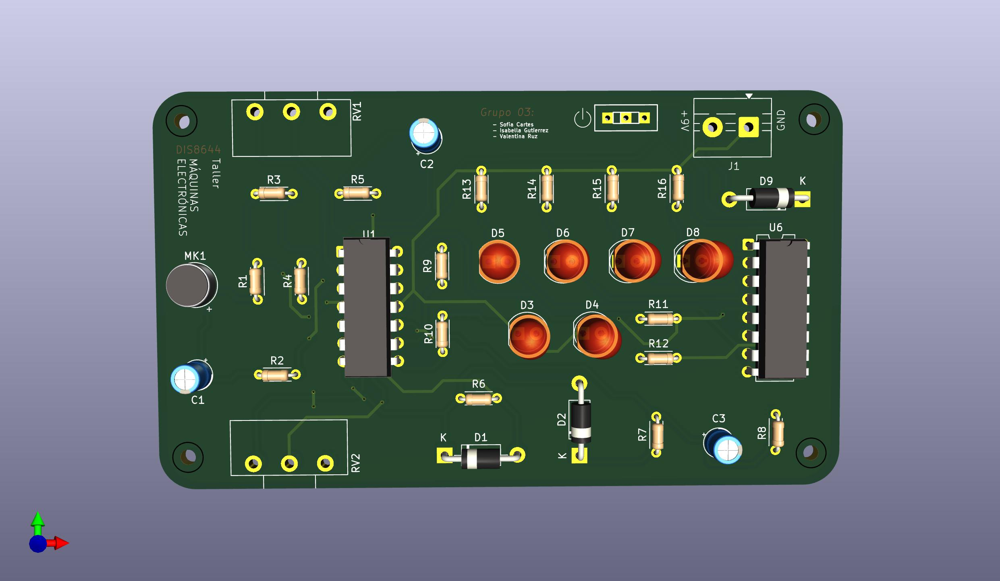
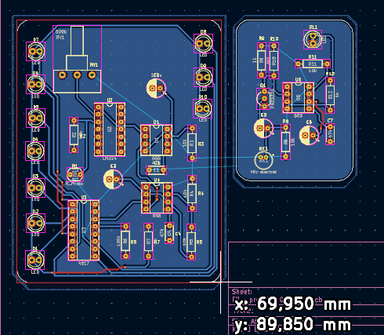
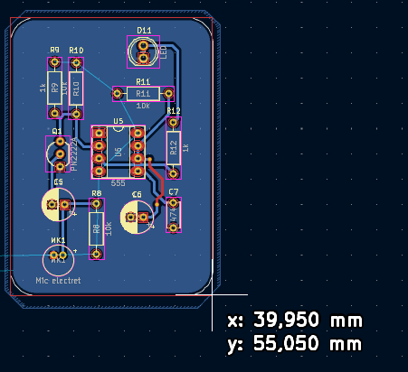
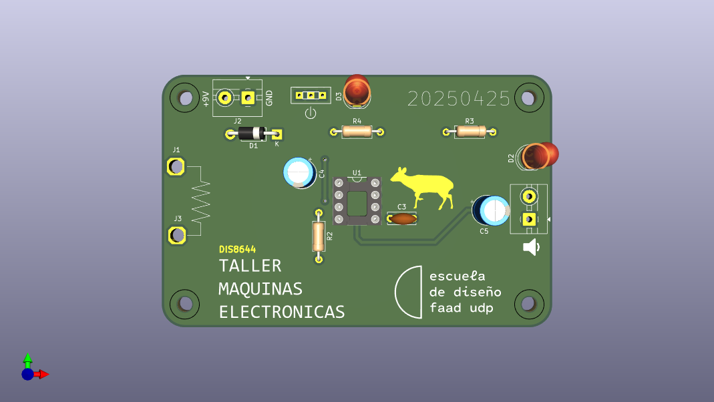
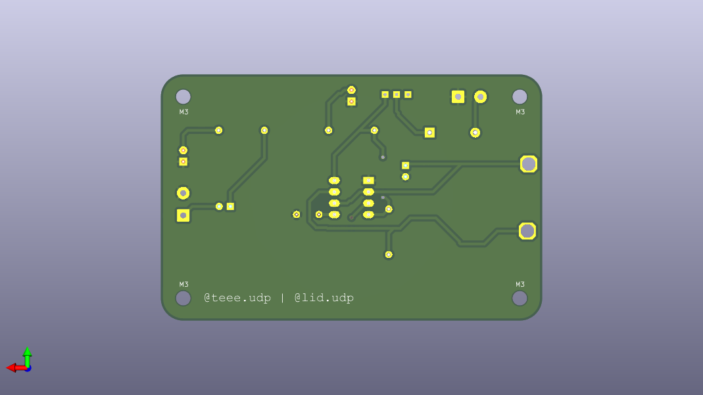
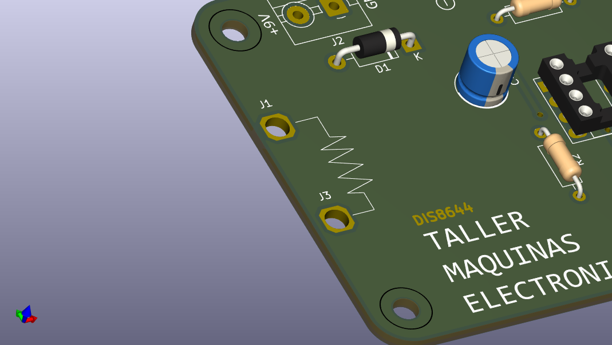
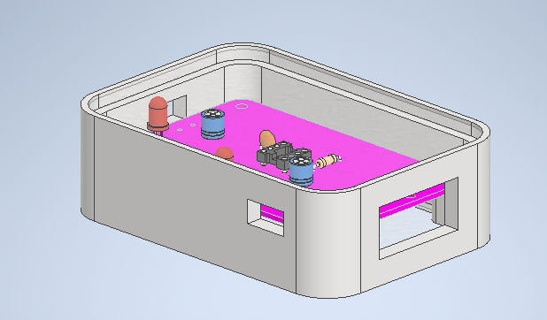

# proyecto-02-grupo-0a

## Acerca del proyecto

Integrantes:

- Félix Rodríguez Guevara: <https://github.com/felix-rg416/dis8644-2025-1-proyectos>
- Alanis Vásquez TODO: agregar enlace a su github.com

## Medidas de placas PCB de cada proyecto (1 punto)

### Medidas de placas PCB del proyecto-01

> FALTAN LAS IMÁGENES

Son 3 PCBs: 1 mide aproximadamente 100mm x Xmm, las otras 2 miden menos de 100mm

### Medidas de placas PCB del proyecto-02

> FALTAN LAS IMÁGENES DE PCBs

Su proyecto es un bombo eléctrico. Recibe señal mediante un piezo eléctrico y genera sonido.

Su PCB tiene forma de estrella o explosión, pero se basaron en un círculo de 100mm de diámetro

Los dibujos son hechos por el grupo-02

### Medidas de placas PCB del proyecto-03

El proyecto es una esfera que emite luz a partir de la recepción de sonido.

Quieren que sea una esfera de capas de acrílico de colores. En total de unos 150 a 200mm de diámetro. Dentro estaría la pcb afirmada por una base de impresión 3D.

Las medidas de su pcb son: 95 mm x 55 mm

### Medidas de placas PCB del proyecto-04

> FALTAN LAS IMÁGENES

Juguete de gato "tamaño gato". Detecta al gato con un LDR y hace girar un motor que mueve un juguete para entretener al gatito.

Piensan en una base tipo rampa que detecte al gatito y arriba un brazo que tenga el juguete colgando.

Un juguete para gato con LDR y un motor. Las medidas son: 95mm x 65 mm

### Medidas de placas PCB del proyecto-05

[carpeta kicad grupo-05](https://github.com/disenoUDP/dis8644-2025-1-proyectos/tree/main/00-proyecto-02/grupo-05/kicad)

Es una ruleta de luces led que "gira" al tapar el LDR y al destaparlo se detiene en un color de led aleatorio.

Quieren hacerlo en corte láser en terciado y en acrílico opaco, que tenga forma de ruleta.

Tienen 2 PCBs una mide 69.95mm x 89.85mm, la otra es de 39.50mm x 55.05mm

### Medidas de placas PCB del proyecto-06

[sesion-15b de clifford1one](https://github.com/clifford1one/dis8644-2025-1-proyectos/tree/main/07-clifford1one/sesion-15b)

A continuación se presentan textos explicativos del prototipado.

El circuito de entrada USA XX para medir XX.

El circuito de salida usa XX para cambiar XX.

INCLUIR DESCRIPCIÓN DE MATERIALES COMPRADOS, SI ES QUE COMPRARON COSAS ADICIONALES.

***

## Cotización de materiales de fijación (1 punto)

TODO

## Filamentos 3D y materiales de carcasas para cada proyecto (1 punto)

### Filamentos 3D y carcasas de proyecto-01

### Filamentos 3D y carcasas de proyecto-02

### Filamentos 3D y carcasas de proyecto-03

### Filamentos 3D y carcasas de proyecto-04

### Filamentos 3D y carcasas de proyecto-05

### Filamentos 3D y carcasas de proyecto-06

## Diseño de carcasas UDPUDU (1 punto)

UDPUDU es una pcb que debe verse, no puede estar oculta. Por lo tento decidimos usar acrílico para la parte superior e inferior. La carcasa necesita espacio para cables de speaker, fuente de poder y caimanes.

La carcaasa se basa en un borde de PLA con agujeros libres para la salida de cables del speaker y la fuente de poder, además de un espacio para poder poner los caimánes. En la parte superior e inferior tiene un sacado para poner el acrílico cortado en láser.

En la siguiente imagen se ve la idea principal de la carcasa. Aún falta la forma final y el ensamble del acrílico.

***

## Impresión de carcasas UDPUDU (1 punto)

TODO

## Montaje de carcasas UDPUDU (1 punto)

TODO

## Bibliografía

TODO
