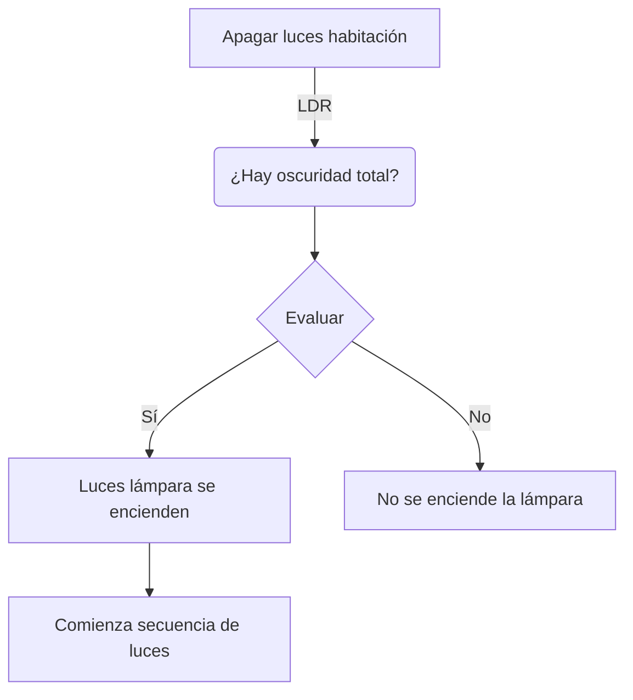
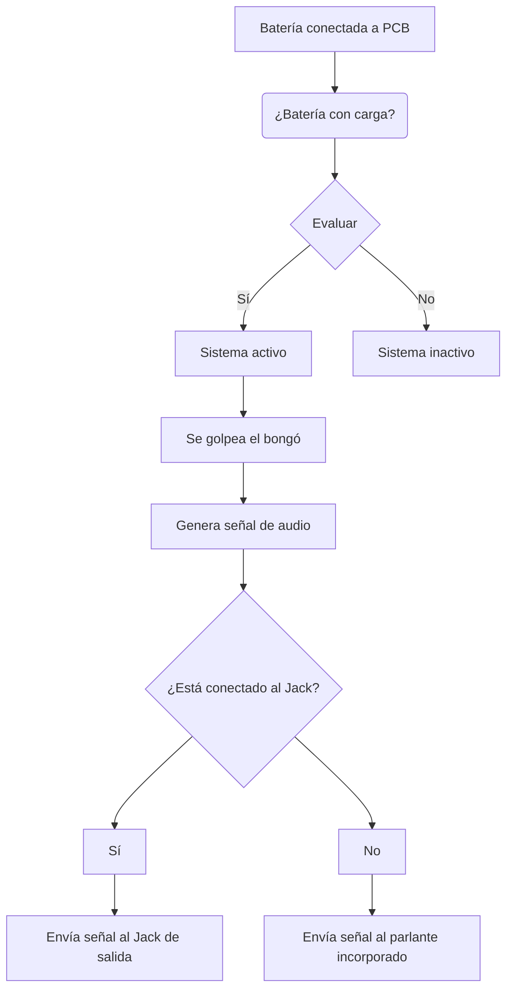
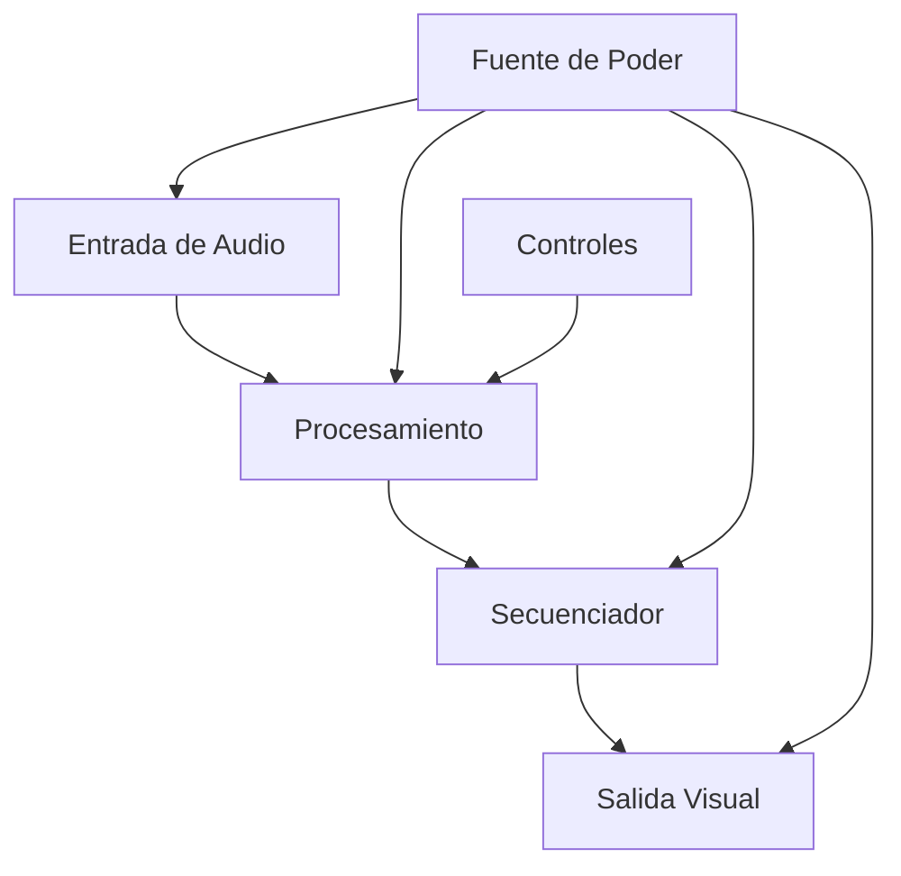
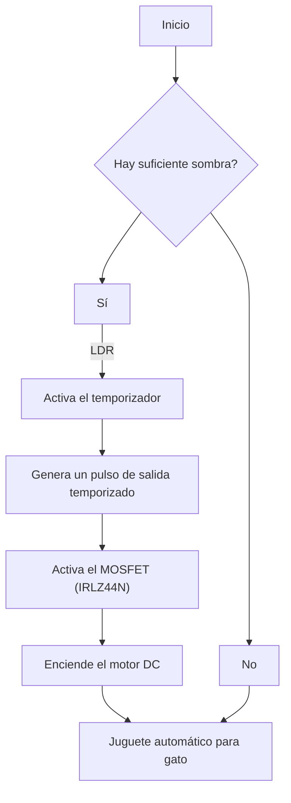
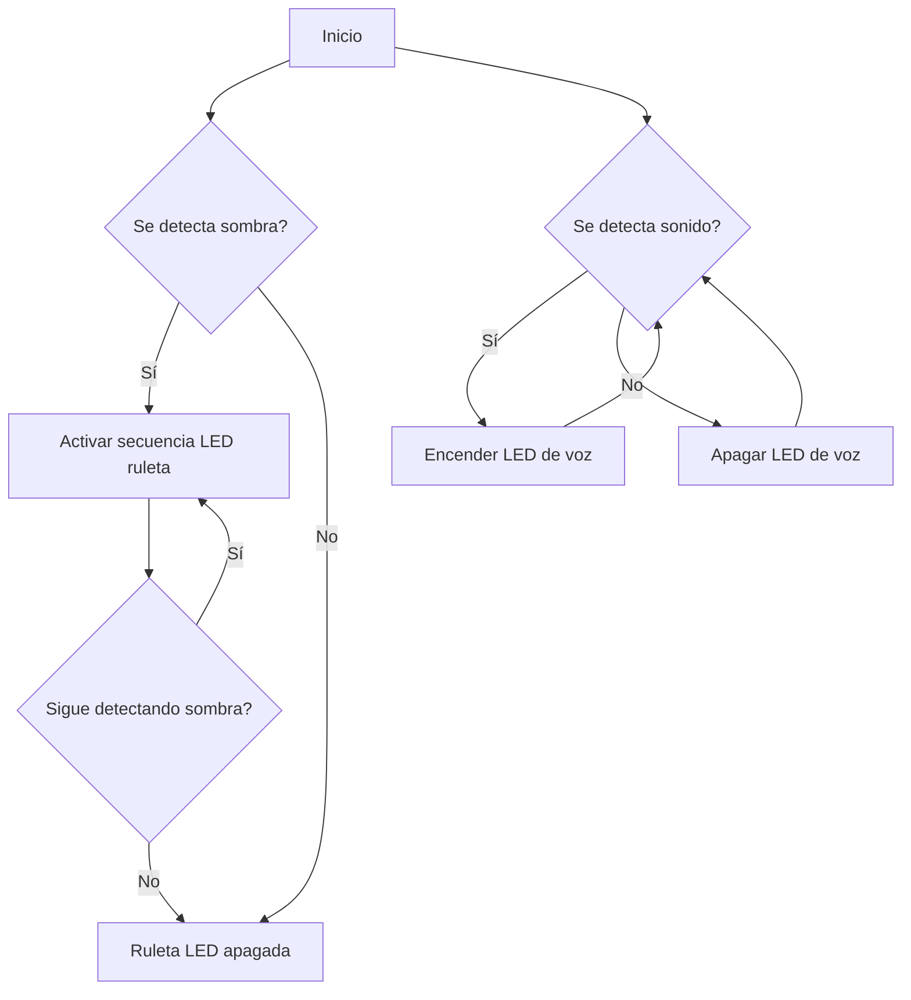
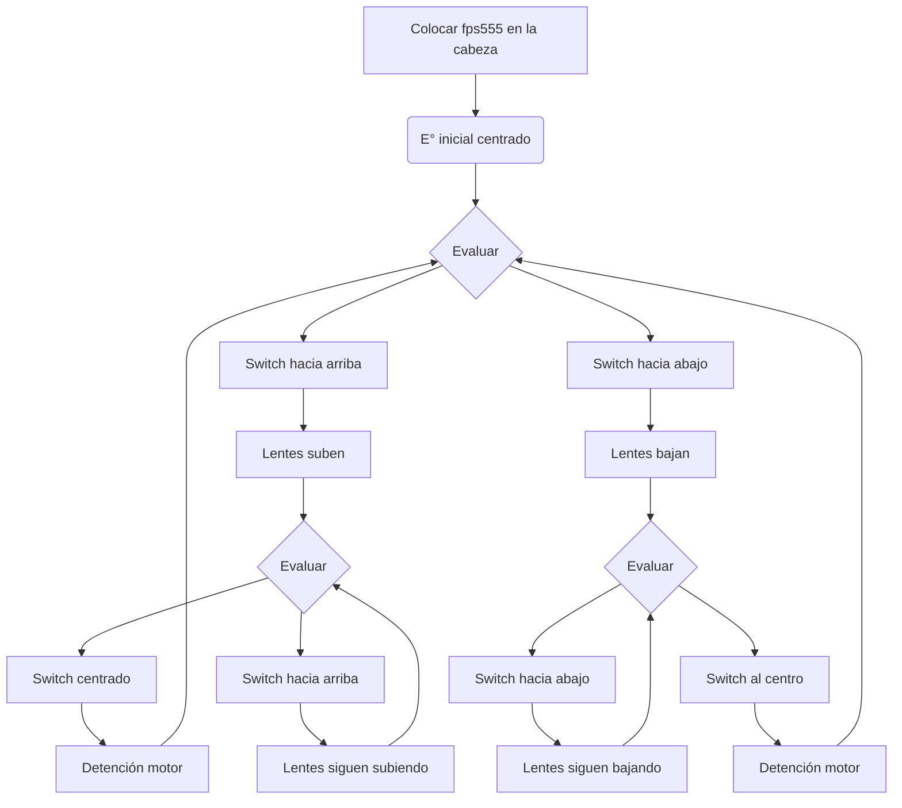

# proyecto-02-grupo-0c

## Acerca del proyecto

Documentación técnica y materiales electrónicos

Integrantes:

- [Martín Silva](https://github.com/duckusu)
- [Francisco Stephens](https://github.com/FranUDP)
- [Izhak Villegas](https://github.com/IzhakVillegas)

## Dibujos de diagramas del circuito (1 punto)

## Bill of materials de todos los proyectos y materiales del curso (1 punto)

| Grupo 1  |           |                   Integrantes                    |                |                              |                                |
|:-------: |---------- |:-----------------------------------------------: |--------------- |----------------------------- |------------------------------- |
|          | hazzaily  |                 katalinariquelme                 |    thyare08    |                              |                                |
|          |           |                                                  |                |                              |                                |
|          |           |                                                  |                |                              |                                |
|   Item   |    Qty    |                    Referencia                    |     Valor      |         Tipo de ítem         |         Accesibilidad          |
|    1     |    12     |                     D1 ~ D12                     |      5mm       |             LED              |   Se puede conseguir en lab    |
|    2     |     2     |                     RV1, RV2                     |      500k      |         Potenciómetro         |   Se puede conseguir en lab    |
|    3     |     1     |                        R2                        |      LDR       |             LDR              | Pueden usar los que ya tienen  |
|    4     |     1     |                        R5                        |      100K      |         Resistencia          |   Se puede conseguir en lab    |
|    5     |     6     |             R15,R17,R22,R25,R27,R31              |      47K       |         Resistencia          |   Se puede conseguir en lab    |
|    6     |    12     | R16,R18,R19,R20,R21,R23,R24,R26,R28,R29,R30,R32  |       1K       |         Resistencia          |   Se puede conseguir en lab    |
|    7     |     5     |                  R1,R3,R4,R7,R8                  |      10k       |         Resistencia          |   Se puede conseguir en lab    |
|    8     |     1     |                        U1                        |     Lmn324     |             Chip             |   Se puede conseguir en lab    |
|    9     |     1     |                        U2                        |     NE555      |             Chip             |   Se puede conseguir en lab    |
|    10    |     1     |                        U3                        |      4017      |             Chip             |     Se tendrá que comprar      |
|    11    |     3     |                     C1,C3,C4                     |      10uF      | Condensador (electrolitico)  |   Se puede conseguir en lab    |
|    12    |     1     |                        C2                        |      103n      | Condensador (electrolitico)  |   Se puede conseguir en lab    |
|    13    |     6     |                     C7 ~ C12                     |     220uF      | Condensador (electrolitico)  |   Se puede conseguir en lab    |
|    14    |     1     |                        J1                        | ph-2 (2.54mm)  |          PinHeader           |   Se puede conseguir en lab    |
|    15    |     3     |                     J5,J6,J7                     | ph-3 (2.54mm)  |          PinHeader           |   Se puede conseguir en lab    |
|    16    |     2     |                     J21,J23                      | mod1 (2.54mm)  |          PinHeader           |   Se puede conseguir en lab    |
|    17    |     2     |                     J22,J24                      |      mod2      |          PinHeader           |   Se puede conseguir en lab    |

| Grupo 2  |                  |         Integrantes         |                  |                                         |                                                     |
|:-------: |----------------- |:--------------------------: |----------------- |---------------------------------------- |---------------------------------------------------- |
|          | Anto Fuentealba  | Sofia Perez (sofia-perezm)  | Sofia Etchepare  |                                         |                                                     |
|          |                  |                             |                  |                                         |                                                     |
|          |                  |                             |                  |                                         |                                                     |
|   Item   |       Qty        |         Referencia          |      Valor       |              Tipo de ítem               |                    Accesibilidad                    |
|    1     |        1         |             U1              |      LM324N      |                 DIP-14                  |              Se puede conseguir en lab              |
|    2     |        1         |              x              |                  |             Piezoeléctrico              |              Se puede conseguir en lab              |
|    3     |        1         |             R1              |        1M        |               Resistencia               |             Se puede conseguir en lab               |
|    4     |        3         |         R2, R3, R4          |       100k       |               Resistencia               |              Se puede conseguir en lab              |
|    5     |        4         |       R6, R7, R8, R9        |        1k        |               Resistencia               |              Se puede conseguir en lab              |
|    6     |        2         |          R10, R11           |       10k        |               Resistencia               |              Se puede conseguir en lab              |
|    7     |        1         |             R12             |       22k        |               Resistencia               |              Se puede conseguir en lab              |
|    8     |        2         |           C1, C2            |       10uF       | Condensador polarizado (electrolitico)  |              Se puede conseguir en lab              |
|    9     |        1         |             Q1              |      2N2222      |               Transistor                |              Se puede conseguir en lab              |
|    10    |        1         |             RV1             |       500k       |              Potenciómetro              |              Se puede conseguir en lab              |
|    11    |        1         |             J1              |      3.5mm       |               Socket jack               |                Se tendrá que comprar                |
|    12    |        1         |             LS1             |        8Ω        |                 Speaker                 | Se puede conseguir en lab o usar los que ya tienen  |
|    13    |        2         |             JP1             |                  |           Jumpers (caimanes)            |              Se puede conseguir en lab              |
|    14    |        1         |             BT1             |      5V–9V       |         Fuente de alimentación.         |              Se puede conseguir en lab              |
|    15    |        1         |             U1              |      LM324       |                 Socket                  |                Se tendrá que comprar                |
|    16    |                  |              -              |  Largo variable  |               Conectores                |              Se puede conseguir en lab              |
|    17    |        1         |             LS2             |     PAM8403      |              Amplificador               |              Se puede conseguir en lab              |

| Grupo 3  |                     | Integrantes  |               |                              |                                                     |
|:-------: |-------------------- |:-----------: |-------------- |----------------------------- |---------------------------------------------------- |
|          |    Valentina ruz    |   Isabella   | Sofia cartes  |                              |                                                     |
|          |                     |              |               |                              |                                                     |
|          |                     |              |               |                              |                                                     |
|   Item   |         Qty         |  Referencia  |     Valor     |         Tipo de ítem         |                    Accesibilidad                    |
|    1     |          1          |     MK1      |    CZN-15E    |    Microfono condenzador     |                Se tendrá que comprar                |
|    2     |          2          |    R1 ,R2    |      22k      |         Resistencia          |              Se puede conseguir en lab              |
|    3     |          8          |   R3 ~ R10   |      1k       |         Resistencia          |              Se puede conseguir en lab              |
|    4     |          4          |  R11 ~ R14   |      10k      |         Resistencia          |              Se puede conseguir en lab              |
|    5     |          1          |     R15      |      220      |         Resistencia          |              Se puede conseguir en lab              |
|    6     |          2          |    C1, C2    |     10uF      | Condensador (electrolitico)  |              Se puede conseguir en lab              |
|    7     |          1          |      C3      |      1uF      | Condensador (electrolitico)  |              Se puede conseguir en lab              |
|    8     |          2          |    D1, D2    |    1n5819     |            Diodo             |                Se tendrá que comprar                |
|    9     |          1          |      D3      |    1n4007     |            Diodo             |                Se tendrá que comprar                |
|    10    |          1          |     RV1      |    1M omh     |        Potenciometro         |              Se puede conseguir en lab              |
|    11    |          1          |     RV2      |     500k      |        Potenciometro         |              Se puede conseguir en lab              |
|    12    |    8 (variados)     |   D1 ~ D8    |      LED      |           LED 10mm           |                Se tendrá que comprar                |
|    13    | 2 (verde y blanco)  |   D9, D10    |      LED      |           LED 5mm            |              Se puede conseguir en lab              |
|    14    |          1          |      U1      |    LM324N     |            DIP-14            |                Se tendrá que comprar                |
|    15    |          2          |      U2      |    CN4017     |            DIP-16            |                Se tendrá que comprar                |
|    16    |          1          |      J1      |     2 pin     |        Terminal block        |                Se tendrá que comprar                |
|    17    |          1          |     SW1      |     spdt      |            Switch            | Si se usán switch de palanca se tendrá que comprar  |
|    18    |          1          |     BT1      |      9v       |           Batería            |              Se puede conseguir en lab              |

| Grupo 4  |                                |   Integrantes    |                  |                          |                                     |
|:-------: |------------------------------- |:---------------: |----------------- |------------------------- |------------------------------------ |
|          | Braulio (brauliofigueroa2001)  | Carlo (zaaaiko)  | Bastían (HSB25)  |                          |                                     |
|          |                                |                  |                  |                          |                                     |
|          |                                |                  |                  |                          |                                     |
|   Item   |              Qty               |    Referencia    |      Valor       |       Tipo de ítem       |            Accesibilidad            |
|    1     |               5                |  R1,R2,R3,R4,R5  |       10k        |       Resistencia        |      Se puede conseguir en lab      |
|    2     |               2                |      R6, R7      |        1k        |       Resistencia        |      Se puede conseguir en lab      |
|    2     |               1                |        R8        |       100k       |       Resistencia        |      Se puede conseguir en lab      |
|    3     |               1                |        R9        |        1         |       Resistencia        |      Se puede conseguir en lab      |
|    4     |               2                |     RV1,RV2      |       500k       |       Potenciómetro       |      Se puede conseguir en lab      |
|    5     |               1                |       R10        |       LDR        |           LDR            |       Se tendrán que comprar        |
|    6     |               2                |      C1, C2      |       104n       |   Condensador cerámico   |      Se puede conseguir en lab      |
|    7     |               2                |      D1, D2      |      1N4148      |          Diodo           |       Se tendrán que comprar        |
|    8     |               2                |      D3, D4      |      1N4007      |          Diodo           |       Se tendrán que comprar        |
|    9     |               2                |      D5, D6      |     5mm Rojo     |           LED            |      Se puede conseguir en lab      |
|    10    |               1                |        U1        |      LM324       |          DIP-14          |       Se tendrán que comprar        |
|    11    |               1                |        U2        |      NE555       |          DIP-8           |      Se puede conseguir en lab      |
|    12    |               1                |       BT1        |      5V–9V       | Fuente de alimentación.  |      Se puede conseguir en lab      |
|    13    |               1                |        J1        |     2 pines      |      Terminal Block      |       Se tendrán que comprar        |
|    14    |               1                |        J2        |     3 pines      |      Terminal Block      |       Se tendrán que comprar        |
|    15    |               1                |       SW1        |       SPDT       |         Switch           |      Se puede conseguir en lab      |
|    16    |               1                |                  |        9v        |         Motor DC         |      Se puede conseguir en lab      |
|    17    |               1                |        Q1        |  MOSFET IRLZ44N  |        Transistor        | Se pueden usar los que nos pasaron  |
|    18    |               1                |        J3        | 5.5 mm estándar  |   Conector Barrel Jack   |       Se tendrán que comprar        |

| Grupo 5  |              |    Integrantes    |                |                            |                                                         |
|:-------: |------------- |:----------------: |--------------- |--------------------------- |-------------------------------------------------------- |
|          | Anto Cristi  |    Pau Vargas     | Natalia Pilar  |                            |                                                         |
|          |              |                   |                |                            |                                                         |
|          |              |                   |                |                            |                                                         |
|   Item   |     Qty      |    Referencia     |     Valor      |        Tipo de ítem        |                      Accesibilidad                      |
|    1     |      3       |     U1,U4,U5      |       -        |        Socket 8-pin        |                Se puede conseguir en lab                |
|    2     |      1       |        U2         |       -        |       Socket 14-pin        |                 Se tendrán que comprar                  |
|    3     |      1       |        U3         |       -        |       Socket 18-pin        |                 Se tendrán que comprar                  |
|    4     |      4       |   R2,R9,R11,R12   |      10k       |        Resistencia         |                Se puede conseguir en lab                |
|    5     |      5       | R3,R5,R6,R10,R13 |       1k       |        Resistencia         |                Se puede conseguir en lab                |
|    6     |      1       |        R4         |      220       |        Resistencia         |                Se puede conseguir en lab                |
|    7     |      1       |        R8         |      100k      |        Resistencia         |                Se puede conseguir en lab                |
|    8     |      1       |         R7        |      470       |        Resistencia         |                Se puede conseguir en lab                |
|    9     |      1       |        R1         |       -        |            LDR             | Se tendrán que comprar o pueden usar los que ya poseen  |
|    10    |      3       |     C1,C4,C7      |      100n      |    Condensador cerámico    |                Se puede conseguir en lab                |
|    11    |      1       |        Q1         |     PN2222A     |         Transistor         |                Se puede conseguir en lab                |
|    12    |      1       |        MK1        |      MIC       |     Micrófono electret     |                 Se tendrán que comprar                  |
|    13    |      3       |     C3,C5,C6     |        1u      | Condensador electrolítico  |                Se puede conseguir en lab                |
|    14    |      1       |        C2         |      407n      |    Condensador cerámico    |                Se puede conseguir en lab                |
|    15    |      12      |      D1~D12       |      LED       |          LED 5mm           |                Se puede conseguir en lab                |
|    16    |      1       |        RV1        |      500k      |       Potenciómetro        |                Se puede conseguir en lab                |
|    17    |      3       |     U1,U4,U5      |     NE555      |           DIP-8            |                Se puede conseguir en lab                |
|    18    |      1       |        U2         |     LM324      |           DIP-14           |                Se puede conseguir en lab                |
|    19    |      1       |        U3         |     CD4017     |           DIP-16           | Se tendrán que comprar o no encontré ninguno en el lab  |

| Grupo 6  |                          |          Integrantes           |                    |                                                  |                                                             |
|:-------: |------------------------- |:-----------------------------: |------------------- |------------------------------------------------- |------------------------------------------------------------ |
|          | Santiago (clifford1one)  | Sebastián (SebastianSaez1003)  |  Anaís (Anaisbmg)  |                                                  |                                                             |
|          |                          |                                |                    |                                                  |                                                             |
|          |                          |                                |                    |                                                  |                                                             |
|   Item   |           Qty            |           Referencia           |       Valor        |                   Tipo de ítem                   |                        Accesibilidad                        |
|    1     |            2             |             R1, R2             |         1K         |                   Resistencia                    |                  Se puede conseguir en lab                  |
|    2     |            2             |             R3, R4             |        100K        |                   Resistencia                    |                  Se puede conseguir en lab                  |
|    3     |            2             |             R5, R6             |        470K        |                   Resistencia                    |                  Se puede conseguir en lab                  |
|    4     |            1             |               R7               |        10KΩ        |                   Resistencia                    |                  Se puede conseguir en lab                  |
|    5     |            6             |             D1~D6              |       1n4007       |                      Diodo                       |                   Se tendrán que comprar                    |
|    6     |            1             |               C1               |        104         |              Condensador (cerámico)              |                  Se puede conseguir en lab                  |
|    7     |            1             |               C2               |        474         |              Condensador (cerámico)              |        Se puede conseguir en lab pero no hay muchos         |
|    8     |            1             |               D7               |        3mm         |                       Led                        |                  Se puede conseguir en lab                  |
|    9     |            1             |               U1               |        555         |                       Chip                       |                  Se puede conseguir en lab                  |
|    10    |            1             |               U2               |       L293D        |                       Chip                       |                   Se tendrán que comprar                    |
|    11    |            1             |              SW1               | 6 Pines ON-OFF-ON  |                Interruptor Switch                |                    Comprado (katode.cl)                     |
|    12    |            1             |                                |      6V 3RPM       |                 Motorreductor DC                 |                     Comprado (Afel.cl)                      |
|    13    |            1             |              RVC1              |        500K        |                  Potenciometro                   |                  Se puede conseguir en lab                  |
|    14    |            2             |                                |      2 pines       |                      Tblock                      | Se tendrán que comprar si es que no usan los que ya tienen  |
|    15    |            1             |               U1               |      8 pines       |                      Socket                      |                  Se puede conseguir en lab                  |
|    16    |            1             |               U2               |      16 pines      |                      Socket                      |                   Se tendrán que comprar                    |
|    17    |            5             |                                |                    |                    Pin Header                    |                  Se puede conseguir en lab                  |
|    18    |            5             |                                |                    | Cable dupont: terminal receptora a terminal pin  |                  Se puede conseguir en lab                  |

## Cotización de materiales para todos los proyectos y materiales del curso (1 punto)

|   Coste material    |               |                |                                                                                    |                               |                Proveedores                 |
|:------------------: |-------------- |--------------- |----------------------------------------------------------------------------------- |------------------------------ |:-----------------------------------------: |
|                     |               |                |                                                                                    |                               |         <https://www.victronics.cl/>         |
|                     |               |                |                                                                                    |                               |              <https://afel.cl/>              |
|        Item         | Se necesitan  | Precio unidad  |                                  Precio cantidad                                   |             Tipo              |                                            |
|    Resistencias     |  Por definir  |       x        |                                   $1.390 x 50un                                    |             100k              |       Resistencia 100k (victronics)        |
|    Resistencias     |  Por definir  |       x        |                                   $1.390 x 50un                                    |              1M               |        Resistencia 1M (victronics)         |
|    Resistencias     |  Por definir  |       x        |                                    $890 x 50un                                     |              47k              |        Resistencia 47k (victronics)        |
|         Led         |  Por definir  |       x        | $590 x 10un (rojo) $740 x 10un (amarillo) $600 x 10un (blanco) $920 x 10un (azul)  |          5mm difuso           |           LED 5mm (victronics)             |
|         LDR         |       2       |       x        |                                    $990 x 10un                                     |       5mm 10Mohm GL5549       |              LDR (victronics)              |
|    Condensadores    |  Por definir  |       x        |                                         x                                          |      Ceramico 680pF 50V       |     Condensador ceramico (victronics)      |
|    Condensadores    |  Por definir  |       x        |                                    $670 x 10un                                     |      Electrolitico 100UF      |   Condensador Electrolítico (victronics)   |
|    Condensadores    |  Por definir  |       x        |                                    $990 x 10un                                     |    Electrolitico 220UF/50v    |     Electrolítico 220 uf (victronics)      |
|    Condensadores    |  Por definir  |       x        |                                    $540 x 10un                                     |    Electrolitico 220UF/25V    |      Electrolítico 220uf (victronics)      |
|    Condensadores    |  Por definir  |       x        |                                    $440 x 10un                                     |    Electrolitico 220UF/16v    |      Electrolítico 220uf (victronics)      |
|       Diodos        |       8       |       x        |                                    $790 x 50un                                     |            1N4007             |         Diodo 1N4007 (victronics)          |
|       Diodos        |  Por definir  |       x        |                                    $840 x 50un                                     |            1N4148             |         Diodos 1N4148 (victronics)         |
|     Transistor      |  Por definir  |      $490      |                                         x                                          |   DARL PNP 5A 100V 2W TO220   |          Transistor (victronics)           |
|     Transistor      |  Por definir  |       x        |                                    $350 x 50un                                     |                PN2222A        |          Transistor (victronics)           |
|        Chips        |       1       |      $520      |                                         x                                          |             L293D             |             L293D (victronics)             |
|        Chips        |  Por definir  |      $390      |                                         x                                          |              555              |              555 (victronics)              |
|        Chips        |       1       |      $295      |                                         x                                          |            CD4017             |             CD4017 (altronics)             |
|       Puentes       |  Por definir  |       x        |                                    $990 x 20un                                     |             20cm              |            Puentes (victronics)            |
|       Switch        |  Por definir  |       x        |                                    $740 c 10un                                     |              9mm              |          Tact switch (victronics)          |
|        Botón        |  Por definir  |       x        |                                    $620 x 10un                                     |          6*6*h5mm 4P          |             Botón (victronics)             |
|     Pin header      |  Por definir  |       x        |                                    $320 x 20un                                     |     3×1 FILA 2.54mm (10u)     |          Pin header (victronics)           |
|    Socket DIP 14    |       2       |      $600      |                                         x                                          | DIP14/0.3″ PARA C. INTEGRADO  |           Socket 14 (victronics)           |
|    Socket DIP 16    |       1       |      $470      |                                         x                                          |      DIP 16 PIN TORNEADO      |           Socket 16 (victronics)           |
|    Socke DIP 16     |       1       |      $600      |                                         x                                          | DIP16/0.3″ PARA C. INTEGRADO  |           Socket 16 (victronics)           |
|   Socket DIP 20     |  Por definir  |      $570      |                                         x                                          |      DIP20 PIN TORNEADO       |           Socket 20 (victronics)           |
|   Socket DIP 20     |  Por definir  |      $890      |                                         x                                          | DIP20/0.3″ PARA C. INTEGRADO  |           Socket 20 (victronics)           |
|    Socket DIP 18    |       1       |       x        |                                    $750 x 10un                                     |      TICVT-18 INTEGRADO       |           socket 18 (victronics)           |
|     Socket DIP      |  Por definir  |       x        |                                       $5.990                                       |                               |             Sockets kit (afel)             |
|     Protoboard      |  Por definir  |       x        |                               $8.630 x kit completo                                |            PB1660             |        Protoboard kit (victronics)         |
|     Protoboard      |  Por definir  |     $1.990     |                                         x                                          |           PROTO400            |          Protoboard (victronics)           |
| Motor DC Miniatura  |  Por definir  |      $500      |                                         x                                          |                               |              Motor DC (Afel)               |
|   Piezoeléctrico    |  Por definir  |       x        |                                   $6.990 x 10un                                    |             35mm              |       Piezoeléctrico (mercado libre)       |
| Microfono electret  |       1       |     $5.928     |                                         x                                          |            Max4466            |      Micrófono elec. (mercado libre)       |
|   Terminal block    |       x       |    $ 1.990     |                                         x                                          |             2 pin             |   Terminal block 3 pines (mercado libre)   |
|   Terminal block    |            1  | $990           | x                                                                                  |             3 pin             | Terminal block 3 pines (MCI electronics))  |

Desarrollado en google sheets: <https://docs.google.com/spreadsheets/d/1CT1RtA_BYuWpyJ54k9VGduSAs_nKiFYd9yf2WvjZ-4g/edit?gid=529027261#gid=529027261>

## Texto acerca de los diagramas de bloque en cada proyecto (1 punto)

El responsable de esta sección es @IzhakVillegas.

A continuación se presenta documentación de cada grupo respecto a los diagramas de bloques en formato de citas, se añade una visualización en escritura de flowchart (mermaid) para su posible lectura en .markdown (github) y una descripción del circuito en términos simplificados.

Para la construcción de los flowchart se utilizó <https://www.mermaidchart.com/>, los carácteres de interrogación '¿' no son admitidos por mermaid en github por lo que se omitieron.

### Texto sobre diagramas de bloque del proyecto-01

- Luz de noche en secuencia gradual con forma de nube
  

> En este dibujo mostramos en orden cómo se efectúa la secuencia de luces o no, según sea que esté en una habitación con luz u oscuridad.

Se trata de un sistema inverso de detección de luz el cual enciende una lámpara de manera gradual.

1. Inicio: Al apagar las luces de la habitación.
2. Condición: Verifica si hay oscuridad total.
   - Si es verdadero : Enciende la lámpara e inicia una secuencia de luces.
   - Si es falso : La lámpara permanece apagada.
3. Resultado: Dependiendo de la condición, sigue un flujo u otro.

### Texto sobre diagramas de bloque del proyecto-02

- Máquina de tapa percutible

▲ **Figura:**  Dibujo de diagrama de bloque grupo 02 issue. Diagrama subido por @AntFuentealba[https://github.com/disenoUDP/dis8644-2025-1-proyectos/issues/114]. Consultado el 19 de junio de 2025.

En este dibujo mostramos el funcionamiento lógico del sistema de percusión electrónica.
El proceso inicia cuando la batería es conectada a la PCB. Si la batería tiene carga, el sistema se activa; de lo contrario, permanece inactivo.

Una vez activo, si se golpea la tapa (bongo), se genera una señal de audio.
Esa señal se dirige dependiendo del estado del jack de salida:

Si está conectado, la señal se envía al jack de salida.  Si no está conectado, la señal se envía al parlante incorporado. Este flujo asegura que el sistema responda correctamente al estímulo físico, priorizando la salida externa cuando esté disponible.

▲ **Fuente:** Grupo 02. *Descripción de funcionamiento*. TDME. Consultado de <https://github.com/disenoUDP/dis8644-2025-1-proyectos/tree/main/00-proyecto-02/grupo-02>. Consultado el 19 de junio de 2025.

Este diagrama de flujo describe el funcionamiento básico de un bongó electrónico (un instrumento musical electrónico que simula un bongó tradicional).

Es un sistema simple que detecta golpes, genera sonido y lo dirige a una salida externa (si existe) o al altavoz integrado.

1. Alimentación: El sistema se activa solo si la batería tiene carga; de lo contrario, queda inactivo.  

2. Entrada: Cuando el usuario golpea el bongó, se genera una señal de audio.  

3. Salida de audio: El sistema verifica si hay un jack de auriculares/amplificador conectado:  

- Si está conectado : envía el audio por el jack.  
- Si no está conectado : reproduce el sonido por el parlante interno.  

### Texto sobre diagramas de bloque del proyecto-03

- Spectra:

La entrada (input) reacciona al nivel de sonido para medir la sensibilidad del micrófono, mediante un potenciómetro.

El output usa luces LED de colores para representar, y ver el sonido que entra en el circuito.

### Texto sobre diagramas de bloque del proyecto-04

- Juguete automático para gato

▲ **Figura:** Diagrama de bloque gráfico proyecto-04. Consultado de <https://raw.githubusercontent.com/disenoUDP/dis8644-2025-1-proyectos/main/00-proyecto-02/grupo-04/imagenes/DIAGRAMADEFLUJO02.png>. Consultado el 19 de junio de 2025.

- Inicio -> ¿Hay suficiente sombra?

- Sí -> Se activa el 555 que genera un pulso -> Se activa el MOSFET -> Enciende el motor -> Juguete automático.
- No -> Juguete automático.

- Inicio: Punto de partida del sistema, aquí se enciende el circuito y comienza la supervisión del entorno a través del LDR.

- Detección del gato: El sistema evalúa si el gato está en frente del sensor, lo sabe ya que el gato se para en frente y bloquea la luz.

- Activa el motor: El sensor al detectar poca luz, se activa el timer 555 que envía la señal para activar el motor.

- Desactivar el motor: El sensor detecta que el gato se va, el sistema corta señal al motor.

> "Juguete automático para gatos que funciona con un sensor de luz (LDR). Cuando el gato se coloca frente al sensor, su sombra reduce la luz que llega al LDR, lo que activa el motor del juguete. Si el gato se aleja, vuelve a llegar luz al sensor, lo que hace que el motor se apague. Así, el juguete se enciende solo cuando el gato está presente y se apaga automáticamente cuando se va".

▲  **Fuente:** Dibujo y descripción de diagrama proyecto-04. TDME. Consultado de <https://github.com/disenoUDP/dis8644-2025-1-proyectos/tree/main/00-proyecto-02/grupo-04>. Consultado el 19 de junio de 2025.

### Texto sobre diagramas de bloque del proyecto-05

> "Al detectar una sombra, el dispositivo activa una secuencia de luces LED en forma de ruleta, y esta secuencia se mantiene desactivada mientras no se detecten sombras; y al detectar sonido, se enciende un LED separado de esta secuencia que le hace saber al usuario que su voz está siendo captada. La detección de sonido en sí no afecta al detector de sombra o la ruleta de LEDs".

▲  **Fuente:** Grupo 05. *Descripción de proyecto-05.* TDME. Consultado de <https://github.com/disenoUDP/dis8644-2025-1-proyectos/tree/main/00-proyecto-02/grupo-05>. Consultado el 19 de junio de 2025.

Este diagrama de flujo describe un sistema que combina dos funcionalidades principales: detección de sombra y detección de sonido, controlando diferentes secuencias de LEDs en función de estas entradas.

- Inicio:

El sistema comienza en el estado inicial, donde ambos sensores (de sombra y de sonido) están en espera de una señal.

- Detección de sombra:

Condición:

- Sí (se detecta sombra): El sistema activa una secuencia de LEDs en modo "ruleta". Luego, verifica si sigue detectando sombra.  

1. Si sigue detectando: La secuencia de la ruleta LED continúa.  

2. Si ya no detecta sombra: Apaga la ruleta LED y vuelve al estado inicial.

- No (no hay sombra).

La ruleta LED permanece apagada.

- Detección de sonido.

Este flujo es independiente del anterior (funciona en paralelo):

Condición:

1. Sí (se detecta sonido):
  1.1. Enciende un LED específico para voz (por ejemplo, un LED que indica que el sistema está captando audio
  1.2. Luego, vuelve a verificar si hay sonido.)
2. No (no hay sonido): Apaga el LED de voz y sigue monitoreando.

### Texto sobre diagramas de bloque del proyecto-06

- FPS555: Dispositivo de protección ocular con posición adaptable

> "Este es el diagrama a mano, desde la perspectiva de un usuario interactuando con nuestro proyecto".

▲  **Fuente:** Dibujo y descripción de diagrama proyecto-06. TDME. Consultado de <https://github.com/disenoUDP/dis8644-2025-1-proyectos/tree/main/00-proyecto-02/grupo-06>. Consultado el 19 de junio de 2025.

- Inicio:

Se coloca el dispositivo fps555 (posiblemente un sensor o controlador) en la cabeza.

El sistema inicia con el eje (E°) en posición centrada.

- Evaluación inicial:

El sistema verifica la posición del switch:

Si el switch está hacia arriba: Los lentes suben.

En cambio si el switch está hacia abajo: Los lentes bajan.

- Movimiento continuo:

1. Si los lentes están subiendo: El sistema evalúa nuevamente.
2. Si el switch vuelve al centro: El motor se detiene.
3. Si el switch sigue hacia arriba: Los lentes siguen subiendo y se repite la evaluación.
4. Si los lentes están bajando: El sistema evalúa nuevamente.
5. Si el switch vuelve al centro: El motor se detiene.
6. Si el switch sigue hacia abajo: Los lentes siguen bajando y se repite la evaluación.

- Retorno al estado de evaluación:
- Tras detenerse, el sistema regresa a la evaluación inicial para esperar nuevas instrucciones.

## Revisión de esquemáticos en KiCad de los proyectos (1 punto)

El responsable de esta sección es @FranUDP.

### Revisión de esquemáticos del proyecto-01

### Revisión de esquemáticos del proyecto-02

### Revisión de esquemáticos del proyecto-03

### Revisión de esquemáticos del proyecto-04

### Revisión de esquemáticos del proyecto-05

### Revisión de esquemáticos del proyecto-06

## Revisión de las PCB en KiCad de cada proyecto (1 punto)

El responsable de esta sección es @FranUDP.

### Revisión de PCB del proyecto-01

### Revisión de PCB del proyecto-02

### Revisión de PCB del proyecto-03

### Revisión de PCB del proyecto-04

### Revisión de PCB del proyecto-05

### Revisión de PCB del proyecto-06

## Bibliografía

1. Tienda de componentes para evaluar sus respectivos precios. <https://www.victronics.cl>
2. Tienda de componentes para evaluar sus respectivos precios. <https://afel.cl/>
3. Repositorio del taller dis8644-2025 (1). <https://github.com/disenoUDP/dis8644-2025-1-proyectos/tree/main/00-proyecto-02/>
