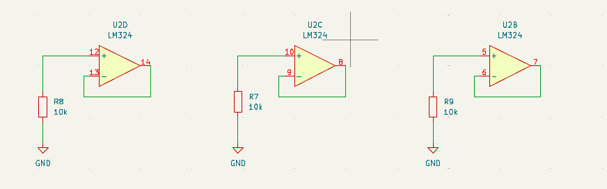
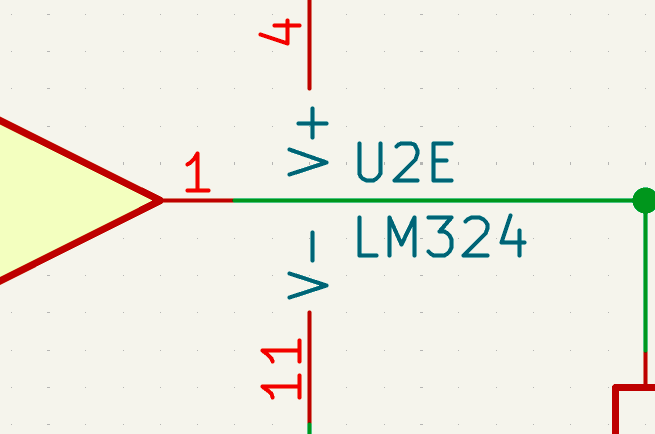
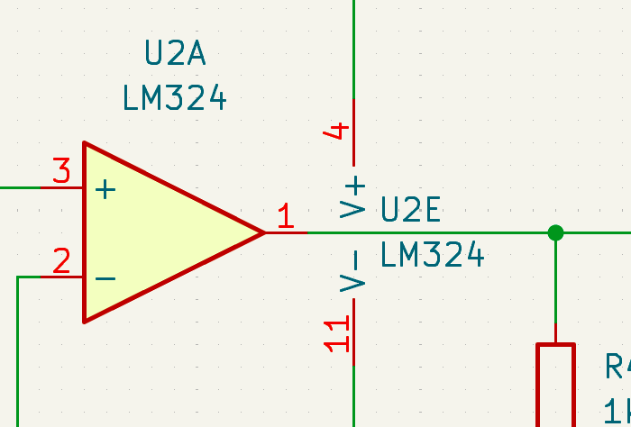

# sesion-15a

## adjunto acá la duda por si no quedó claro en el issue de project

la duda es si estos lm324 que están aparte del circuito deben tener huella o no, y si este componente que se desprende que son las patitas 4 y 11 debe tener huella o no, y en caso de tener que asignar huellas a todos, sería la misma huella que asigno al lm324 que está conectado en el circuito?

acá el otro componente que no se si debe tener huella, este sí va conectado directamente al circuito

por último, esta es la parte del lm324 que estamos usando directamente

