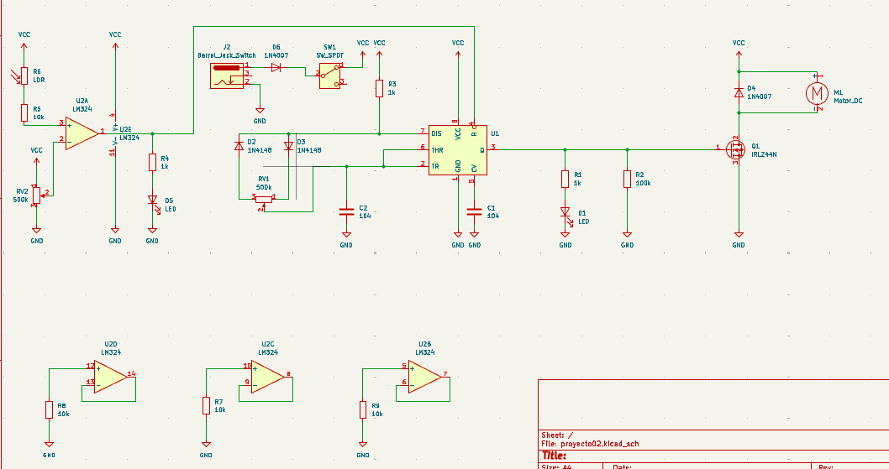
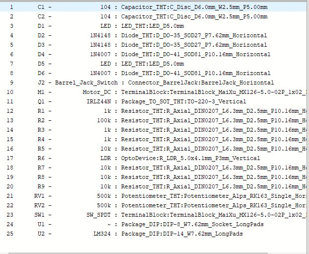
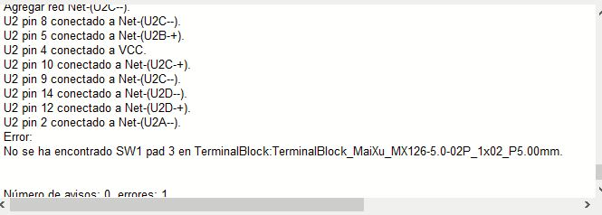
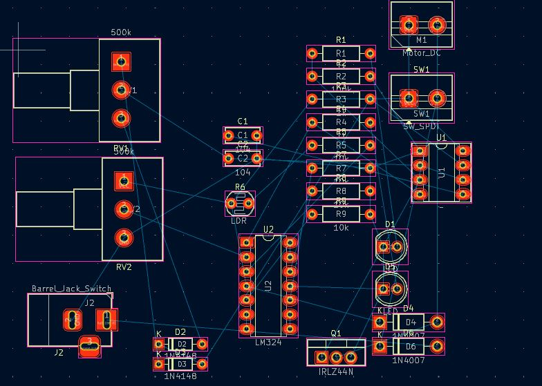
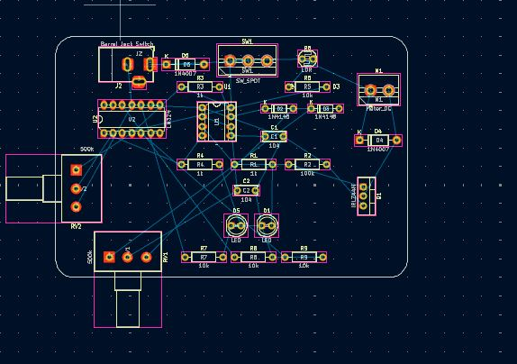

# sesion-15a
## ESTA SESIÓN LA DEJARÉ PARA SUBIR LOS ERRORES DEL PROCESO

## adjunto acá la duda por si no quedó claro en el issue de project

la duda es si estos lm324 que están aparte del circuito deben tener huella o no, y si este componente que se desprende que son las patitas 4 y 11 debe tener huella o no, y en caso de tener que asignar huellas a todos, sería la misma huella que asigno al lm324 que está conectado en el circuito?

acá el otro componente que no se si debe tener huella, este sí va conectado directamente al circuito

por último, esta es la parte del lm324 que estamos usando directamente

- hola aquí el esquemático completo de momento antes de pasar a la placa
- 

## segundo error encontrado y duda

- apareció un error al momento de pasar las huellas a la placa y no sé si se puede continuar trabajando o no, al parecer no detectó la huella de terminal block que le puse al motor dc ni al switch

- estas son las huellas asignadas antes de ir a la placa

- se asignó terminal block al switch y al motor ya que irán por fuera de la placa, en la carcasa
- al momento de pasar las huellas a la placa aparece el siguiente error

- Adjunto acá el cómo quedaron los componentes ya con sus huellas

## tercera duda

- tenemos la siguiente distribución de los elementos basados en el esquemático pero necesitamos feedback

