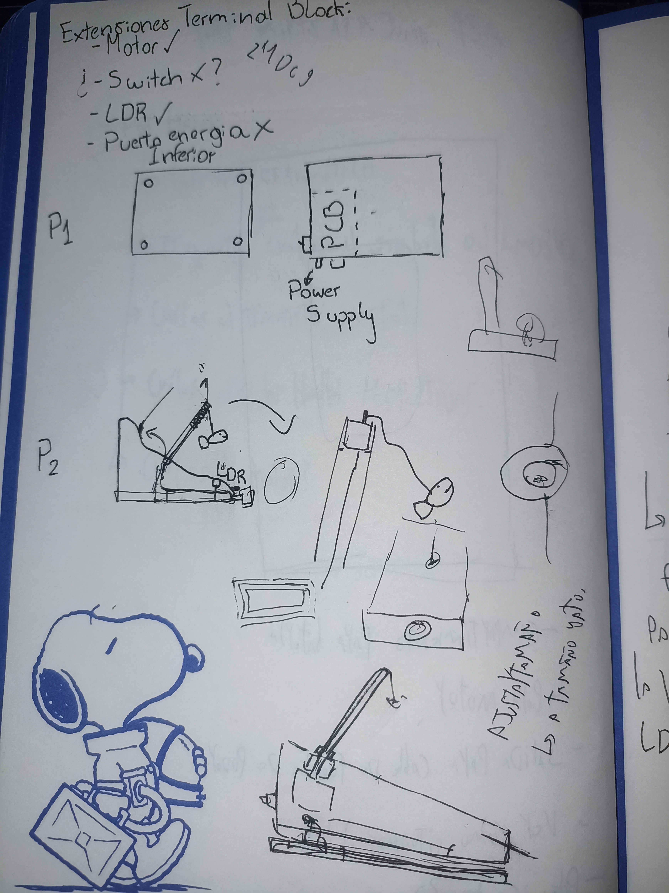
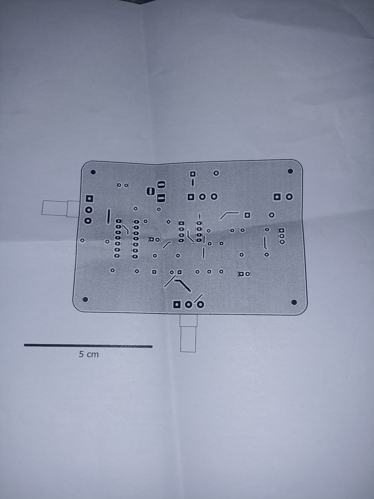

# sesion-16b

taller día viernes 27 de junio

- el día viernes 27 de junio se entregó feedback sobre el proyecto 2
- nos corrigieron un poco el esquemático, faltó poner para qué servía cada potenciómetro y corregir los valores de los condensadores en kicad, en vez de poner 104n, poner 100n
- no hubo mucha corrección más allá en el esquemático ni en la pcb ya que estaba bastante bien por lo que dijeron los profes
- este día mi grupo no asistió a clases por lo cuál me dispuse a avanzar solo en el proyecto
- Alanis del grupo 0 me comenzó a preguntar sobre aspectos de la carcasa, la forma y algún boceto que tuvierámos sobre cómo queríamos que fuera finalmente la carcasa
- le mostré a alanis el primer boceto que se había realizado, el día martes 10 de junio

- este boceto consistía en una especie de rampa de la cuál a través de un palo que va en el medio, cuelga un juguete para gato
- describe la idea de poner un LDR en posición para que detecte la sombra del gato
- luego dibujamos con Alanis un boceto un poco más claro

- después de conversar un poco sobre la carcasa, alanis me pidió si tenía la medida de la pcb para entender mejor las dimensiones de la placa por lo que con ayuda de Andrés logré imprimir en una hoja carta la pcb con las dimensiones reales

- con esta impresión Alanis pudo dimensionar mejor el tamaño del proyecto y comenzó a prototipar 3d en Rhino en base a medidas que conversamos y acordamos, aquí el modelado que realizó esa clase

- acordamos que la placa iría puesta en la parte posterior de la carcasa para que se tenga un acceso directo desde fuera hacia el conector barrel jack de la fuente de poder y sea más fácil conectarlo en vez de que el conector de la fuente quede alejado y haya que atravesar toda la carcasa para conectarla
- también hablamos sobre la posición de los potenciómetros que regulan umbral de luz y velocidad del motor respectivamente, decidimos que era más cómodo poner todo botón/perilla en la parte posterior para que estuviera todo junto, entonces dejamos los potenciómetros a izquierda y derecha respectivamente. También incluímos los leds con los que se nos muestra la regulación del umbral mediante el potenciómetro de este mismo
- al estar los potenciómetros fuera de la placa, se tendrán que soldar y cablear hacia fuera de la carcasa
- el switch quedó junto a la fuente de poder para que sea más intuitivo el uso, conectar fuente -- > encender interruptor. El switch también se tendrá que cablear un poco
- en la parte frontal de la rampa se planeó un agujero para el LDR
- los 2 leds de 5 mm también irán cableados desde la placa hacia la carcasa
- en la parte frontal superior de la rampa, se decidió poner el palo/mástil que sujetará el juguete de gato amarrado, también se decidió por sugerencia de Alanis que el motor en vez de ir en la punta como mostraban los primeros bocetos, ahora irá en un compartimiento dentro de la rampa para protegerlo de eventuales golpes del usuario gato
- Alanis pidió que buscara referentes para ver si le agregábamos algo más a la forma, también conversamos con Andrés buscando alguna forma de que la base fuera más pesada y no se diera vuelta con los golpes del gato. En un principio habíamos hablado de una base de madera, pero pensamos que por el tiempo y ahorrar recursos quizá no era lo mejor, Andrés sugirió poner arena en la base para hacer contrapeso y esta idea nos pareció buena así que la elegimos
