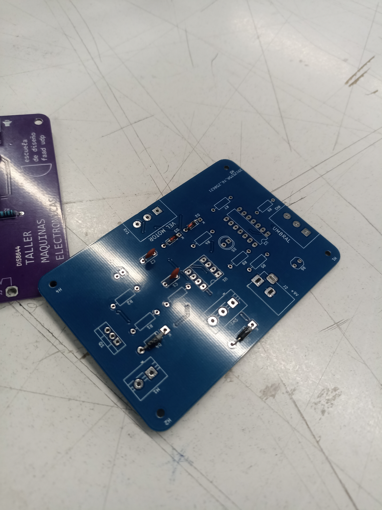
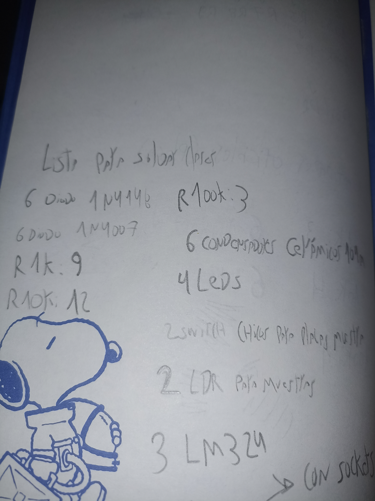
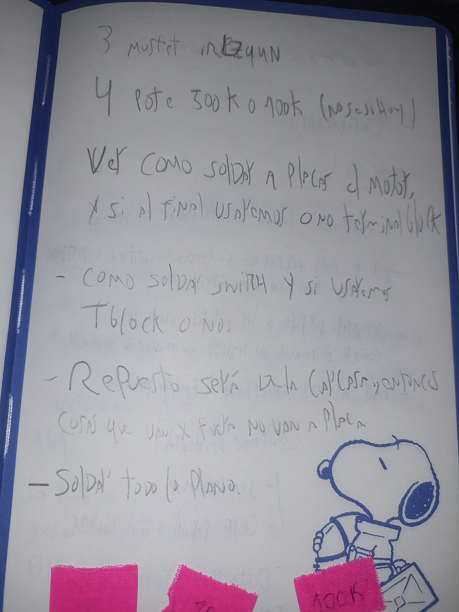

# sesion-17a
### taller día martes 1 de julio

- mi grupo asistió en su totalidad
- este día llegaron desde china las placas pcb
- la placa del grupo quedó color azul, muy lindo color la verdad

- aquí una foto de la placa ya con algunos componentes puestos por encima

- lo primero que hicimos como grupo fue ir checkeando el bill of materials y ver si estaba correcto en su totalidad o si nos faltaba algo
- hubo una pequeña confusión en cuanto al bill of materials y la guía en kicad de la placa ya que los valores estaban cambiados en el bom, ej: R1 en realidad era R2
- comenzamos a hacer una lista de las cosas que necesitábamos ya que por instrucciones de Aarón necesitabámos hacer 3 placas, una con la carcasa, otra de exhibición que funcione y una de repuesto

- después de completar la lista y triplicar el número de componentes en algunos casos, le pedimos los materiales necesarios a martín quién nos entregó de forma muy amable lo que le íbamos solicitando
- al mismo tiempo que conseguíamos los materiales e íbamos poniendo sobre las huellas respectivas en las placas, Alanis del grupo 0 nos iba haciendo preguntas sobre la carcasa y nos iba mostrando avances
- Alanis dibujó una explicación sobre la tapa de la carcasa y si esta sería un objeto entero o con una tapa aparte

 

- Alanis también nos habló sobre hacer una pieza para sostener el motor y que este no quedara en el aire o suelto, que estuviera estable dentro de la carcasa
- la pieza sostiene el motor y el motor tiene el palo/mástil puesto encima, la idea es perforar el palo para que al girar el motor el palo gire también
- la pieza tiene casi el ancho el motor, para que quede puesto a presión, por debajo la pieza tiene una ranura que es para que pasen los cables que están soldados del motor hacia la placa, nos pareció una muy buena idea
