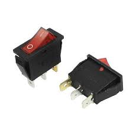
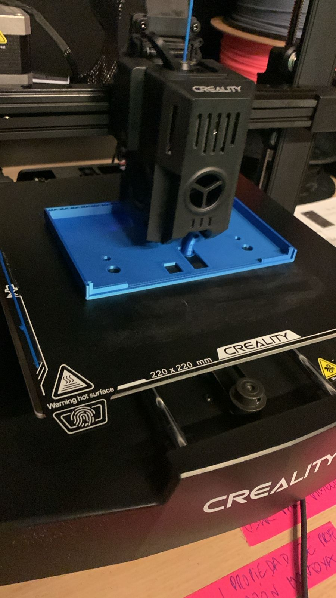

# sesion-17a

## taller día martes 1 de julio

- mi grupo asistió en su totalidad
- este día llegaron desde china las placas pcb
- la placa del grupo quedó color azul, muy lindo color la verdad

- aquí una foto de la placa ya con algunos componentes puestos por encima

- lo primero que hicimos como grupo fue ir checkeando el bill of materials y ver si estaba correcto en su totalidad o si nos faltaba algo
- hubo una pequeña confusión en cuanto al bill of materials y la guía en kicad de la placa ya que los valores estaban cambiados en el bom, ej: R1 en realidad era R2
- comenzamos a hacer una lista de las cosas que necesitábamos ya que por instrucciones de Aarón necesitabámos hacer 3 placas, una con la carcasa, otra de exhibición que funcione y una de repuesto

- después de completar la lista y triplicar el número de componentes en algunos casos, le pedimos los materiales necesarios a martín quién nos entregó de forma muy amable lo que le íbamos solicitando
- al mismo tiempo que conseguíamos los materiales e íbamos poniendo sobre las huellas respectivas en las placas, Alanis del grupo 0 nos iba haciendo preguntas sobre la carcasa y nos iba mostrando avances
- Alanis dibujó una explicación sobre la tapa de la carcasa y si esta sería un objeto entero o con una tapa aparte

 

- Alanis también nos habló sobre hacer una pieza para sostener el motor y que este no quedara en el aire o suelto, que estuviera estable dentro de la carcasa
- la pieza sostiene el motor y el motor tiene el palo/mástil puesto encima, la idea es perforar el palo para que al girar el motor el palo gire también
- la pieza tiene casi el ancho el motor, para que quede puesto a presión, por debajo la pieza tiene una ranura que es para que pasen los cables que están soldados del motor hacia la placa, nos pareció una muy buena idea
- se habló sobre el tipo de switch a utilizar, hubo un pequeño susto de mi parte porque pensé que al asignarle una huella a la placa, el componente físico debía calzar si o si con la huella pero no es el caso, podemos tener una huella distinta al componente físico y soldarlo igualmente con un cableo, como en este caso soldaremos desde la placa el switch directo en la carcasa
- el switch que utilizaremos es uno que poseemos en nuestro kit que fue entregado a principio de semestre, adjunto foto

- fuente: mechatronicstore.cl
- Alanis necesitaba saber el tipo de switch que utilizaríamos ya que necesitaba hacer un agujero en la carcasa en donde pudiera calzar el switch y también el conector de la fuente de poder que en este caso es un barreljack
- también conversamos con Alanis sobre cómo iría situado el mástil sobre el motor, para simular esto lo que hicimos fue agarrar un lápiz grafito y pegarlo con maskingtape sobre el motor, conectamos el motor directamente una batería. El lápiz giró en su eje a una velocidad bastante elevada otorgada por el motor, esto fue preocupante pero luego recordé que en nuestro circuito poseemos un potenciómetro que está encargado específicamente de regular la velocidad a la que gira el motor, el experimento que realizamos fue un éxito
- nos demoramos bastante organizando todo y preguntando dudas a los profes pero logramos avanzar, organizamos cuál placa sería para la carcasa, muestra y repuesto respectivamente
- ya casi al final de la clase fuimos a soldar porque los cautines estuvieron ocupados mucho rato

- en este punto de soldado franudp nos repasó la explicación de como utilizar el cautín y como cuidarlos también, franudp sugirió que cuando no estuviéramos usando el cautín le pusiéramos estaño en la punta para que no se oxide con la punta al vacío recibiendo aire, no sabía esto
- franudp nos supervisó en este proceso y respondió a todas las dudas que iban naciendo, también nos ayudó con una herramienta que es para extraer el líquido sobrante de la soldadura. Esto se hacía cuando quedaba una "pelotita" muy grande de la soldadura, entonces debíamos calentar nuevamente la soldadura para derretir la pelotita y de esta forma franudp con su herramienta extractora de líquidos que no sé cómo se llama, extraía el excedente y la soldadura quedaba más prolija
- ya casi a las dos de la tarde terminamos de soldar 2 placas con los componentes que teníamos, la tercera placa Carlo quedó a cargo de soldarla ya que dijo que tenía cautín en la casa
- Carlo soldó la placa el día miércoles y nos mandó registro de como quedó
- durante la tarde del miércoles conversé con Alanis sobre la carcasa y el filamento que queríamos utilizar, esto fue alrededor de la 1 pm
- me mandó esta foto sobre los filamentos que habían disponibles para utilizar y que también alcanzaran para lo que queríamos hacer y no quedáramos cortos de material

- en base a una investigación que se había hecho, concluímos que el azul era el mejor color para la carcasa del juguete de gato ya que este color es muy bien percibido y llamativo para los gatos, no así tonos rojos o rosados que no distinguen muy bien
- tras confirmar el color azul, Alanis inició el proceso de impresión 3d en el lab y me mandó fotos de cómo iba quedando, dijo que tardaría aproximadamente unas 5 horas en realizarse la impresión completa
- estas fotos muestran lo que hasta el momento llevaba la impresora, el viernes creo que la veremos completa

- Alanis ha sido una ayuda vital para la realización de la carcasa, estamos muy agradecidos por su colaboración
