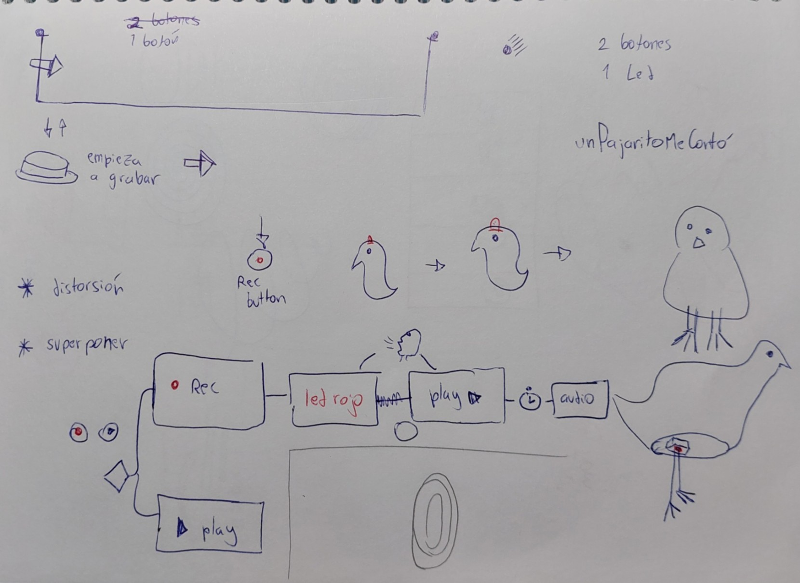
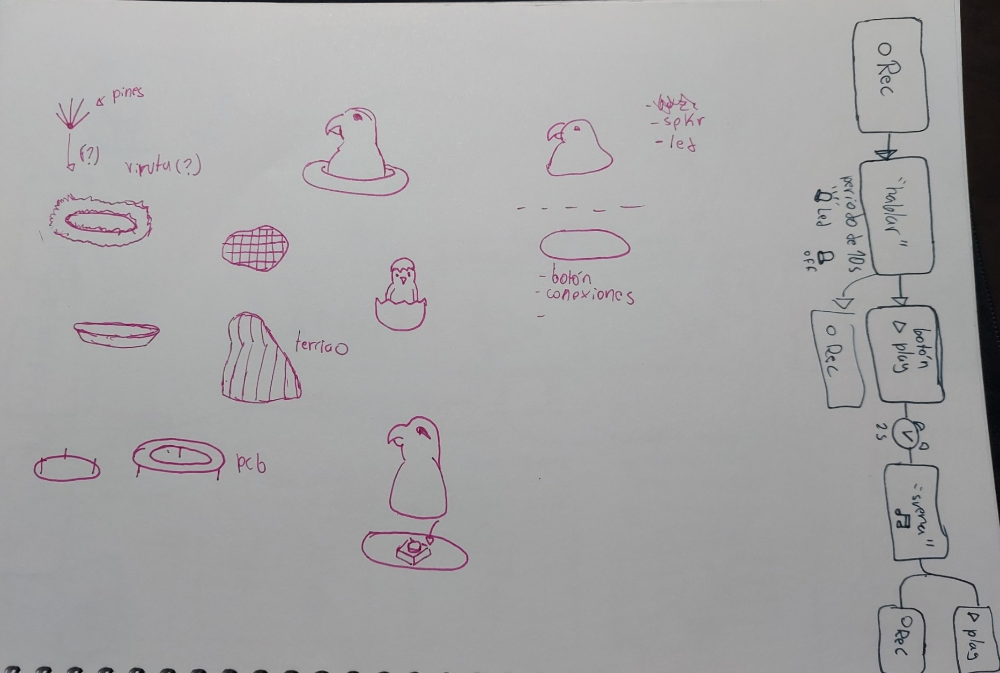
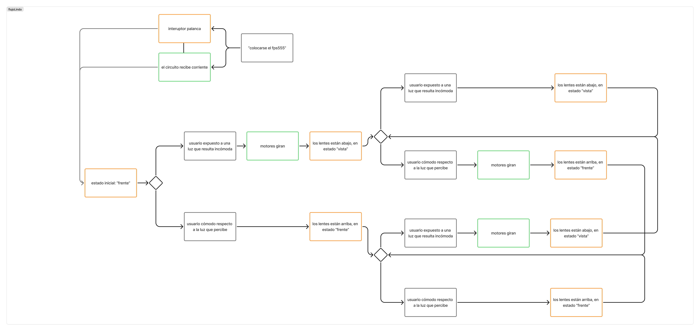

# sesion-14a

previo a esta sesión hicimos una reunión con mi grupo, para decidir con cuál de los proyectos propuestos nos quedaríamos. Debido a que parecía ser lo más sencillo, nos decidimos por "un pajarito me contó"

a continuación documentación de nuestra exploración:

tras una retroalimentación con misa, nos recomendó seguir con una propuesta cuyos componentes fueran conocidos para nosotres, por lo que decidimos continuar con el proyecto que había propuesto SebastianSaez1003, que trata sobre uno lentes de solo que varían su posición gracias a un motor.

## fps555

para ello, primero seguimos [este tutorial](https://www.youtube.com/watch?v=J-QO7jQGfoE&t=2s), con el que se controla un servo motor.

decidimos usar un servomotor, puesto que funciona por posición, a diferencia de otros motores que funcionan mediante rpm. Esto quiere decir, que un servo, al recibir una señal, se mueve de un punto x a un punto y. Mientras que un motor stepper, cuando recibe una señal gira durante un tiempo determinado.

paralelamente construimos un circuito detector de luz/sombra con un LDR, ya que nuestra idea era que los lentes se activen automáticamente al ser expuesto a luz directa.

tras una segunda retroalimentación de misa, nos recomendó hacerlo con un interruptor en vez del LDR, con el fin de aterrizar el proyecto hacia el contexto en que estamos.

También nos recomendó usar un motor stepper, ya que, como grupo consideramos que para garantizar una experiencia de usuario no intimidante, debe moverse lento, y si bien, un servo puede moverse lento, esto compromete la fuerza que este puede ejercer. Y ya que los motores de tipo stepper, por lo general, se mueven a altas velocidades, misa nos recomendó usar un motorreductor, el cual es capaz de bajar la intensidad de la corriente para moverse a menores velocidades. En afel podemos encontrar varias versiones de éste, cada una con sus características.

- [motorreductor de calidad baja](https://afel.cl/products/motorreductor-dc)

- [motorreductor de calidad media](https://afel.cl/products/motorreductor-n20-6v-30rpm)

- [motorreductor de calidad alta](https://afel.cl/products/motorreductor-dc-6v-3rpm-con-soporte-metalico)

el siguiente paso es crear 2 circuitos PWM: un circuito que mueva los lentes desde la frente del usuario hacia sus ojos, y un segundo circuito que mueva los lentes desde los ojos del usuario hacia su frente. Estos circuitos serán activados mediante un interruptor de 3 estados, llamado coloquialmente "on-off-on". 

Este interruptor estará colocado verticalmente, de modo que, al "subir" la palanca, los lente suban a la frente del usuario, al bajar la palanca, los lentes bajen a los ojos del usuario, y en el estado intermedio, la posición "central", el circuito esté apagado.

