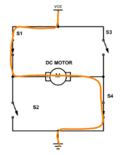
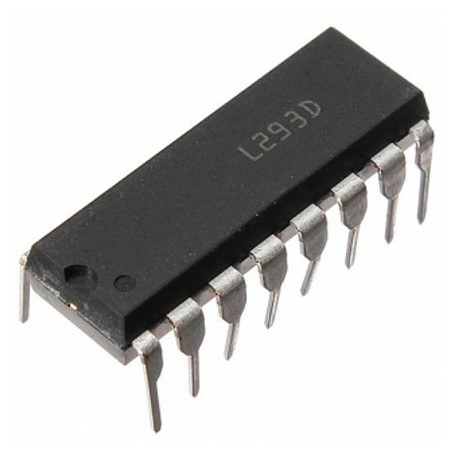
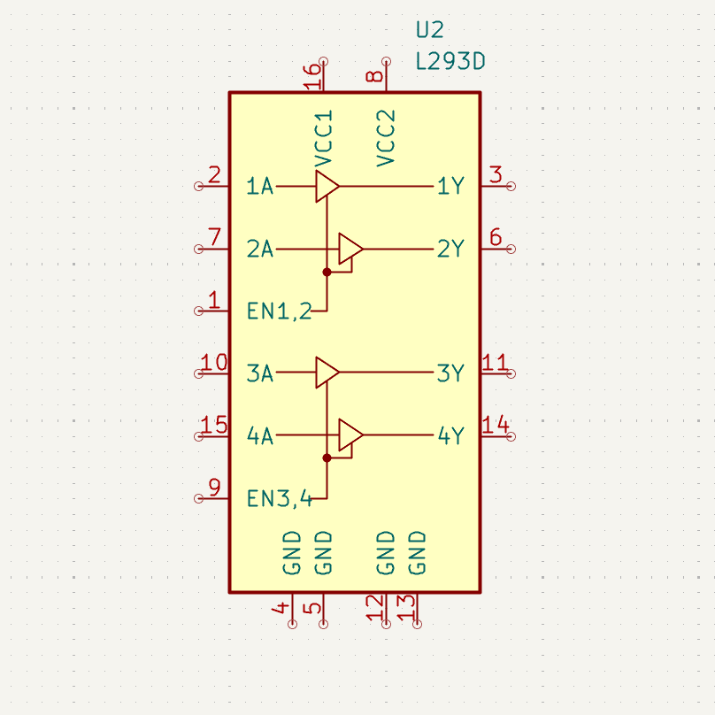
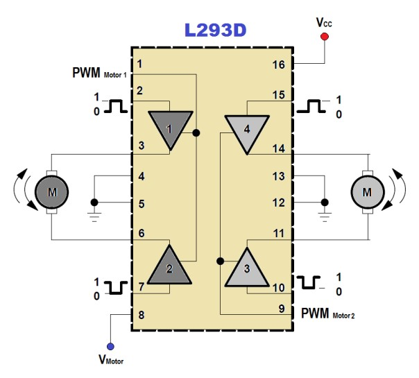
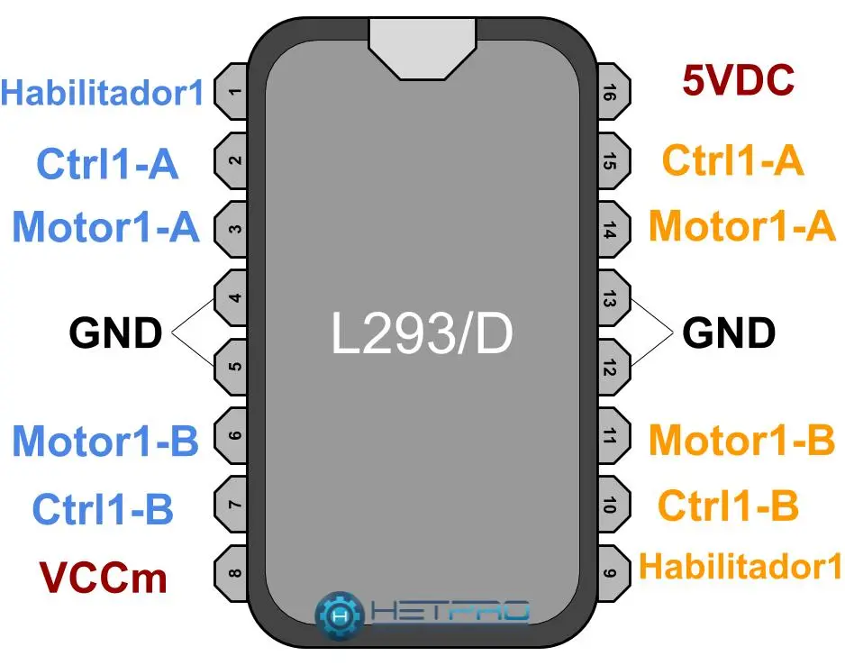

# sesion-14b

## puente H

un puente H es un circuito que permite controlar el sentido de giro de un motor de cocrriente continua (DC). El nombre hace referencia a la forma que tiene este circuito en el esquemático.

El sentido del giro de un motor DC está determinado por cómo se conectan los sus pines. El puente H permite al usuario intercambiar las conexiones de los pines. 

## L293D

el L293D es un circuito integrado el cual contienene 2 circuitos puente H. 

También permite variar el voltaje aplicado, lo que da la posibilidad de modificar la velocidad con la que se mueve el motor.

| N° pin | nombre pin | conexión          |
|--------|------------|-------------------|
| 1      | ENABLE 1   | activador         |
| 2      | INPUT 1    | entrada1          |
| 3      | OUTPUT 1   | salida 1          |
| 4      | GND        | tierra            |
| 5      | GND        | tierra            |
| 6      | OUTPUT 2   | salida 2          |
| 7      | INPUT 2    | entrada 2         |
| 8      | Vs         | fuente de energía |
| 9      | ENABLE 2   | activador 2       |
| 10     | INPUT 3    | entrada 3         |
| 11     | OUTPUT 3   | salida 3          |
| 12     | GND        | tierra            |
| 13     | GND        | tierra            |
| 14     | OUTPUT 4   | salida 4          |
| 15     | INPUT 4    | entrada 4         |
| 16     | Vss        | fuente de energía |

### referencias 

- [¿Qué es un  puente H?](https://cursos.mcielectronics.cl/2022/08/05/que-es-un-puente-h/)

- [¿Qué es y cómo funciona un L293D?](https://laelectronica.com.gt/extras/que-es-y-como-funciona-un-l293d?srsltid=AfmBOoqK09YlgPemvpnaaUVLkNTlgKEqgoMLb7GTKGZiuBi6C0POxybe)
