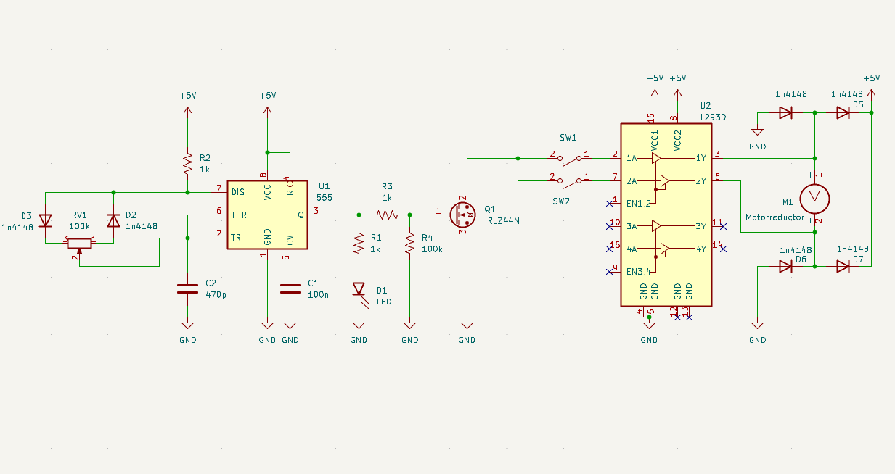
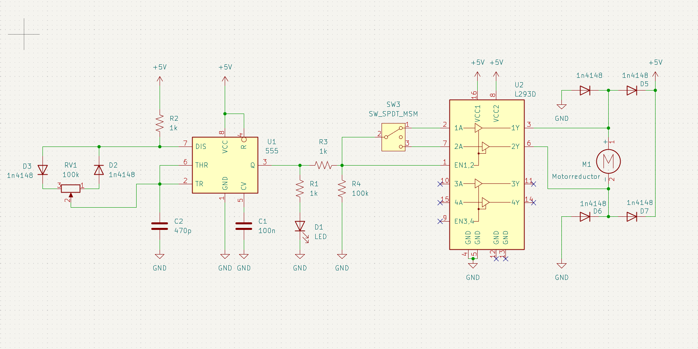
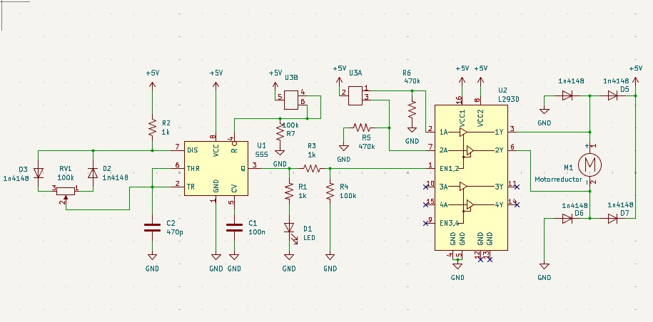
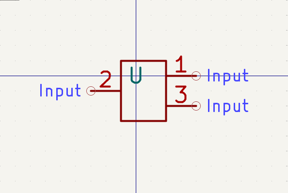
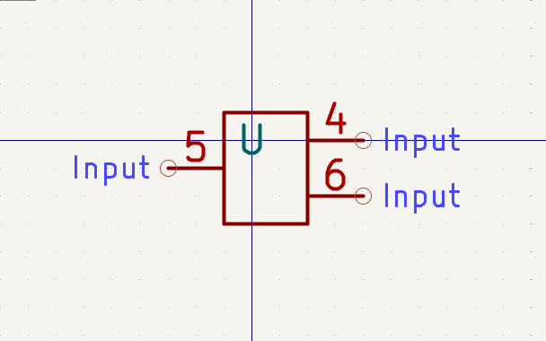

# sesion-15a

## Progreso

Conexión del circuito, en este paso, reemplazamos el puente H por un ci L293D. También redujimos la cantidad de circuitos PWM utilizados, de 2 a 1.

También subí el archivo kicad a la carptea [archivos](https://github.com/clifford1one/dis8644-2025-1-proyectos/tree/main/07-clifford1one/sesion-15a/archivos/).

## feedback

Cree un [issue]((https://github.com/disenoUDP/dis8644-2025-1-proyectos/issues/479)) donde mostraba el avance de nuestro esquemático anterior, y gracias al feedback de franUDP y misa, apliqué ciertos cambios.

### cambios

- reemplazar botones por un switch
- quitar el transistor, ya que la función que este cumplía era llevada a cabo por el L293D
- conectar la salida del PWM al pin 1 del L293D (ENABLE). 

## Progreso

gracias al feedback realizamos los siguientes cambios:

notas: a primera vista puede parecer que hay 2 switch, es una forma de representar cuando un componente controla mas de 1 pin a la vez, en este caso con el mismo switch le damos energpia al circuito, y tambien controlamos la dirección de giro del motor.

### Símbolo para el mts303

### cambios

- diseñé un símbolo para el componente smt303, el cual es un switch "ON-OFF-ON" de tipo toggle, con 6 pines. La librería con el símbolo se encuentra en la carpeta [archivos.](https://github.com/clifford1one/dis8644-2025-1-proyectos/tree/main/07-clifford1one/sesion-15a/archivos) 
- se elimina la conexión entre el circuito PWM y el switch, esta conexión se reemplaza por una conexión a VCC.

### organización

runión con grupo Seba y Anaís 17-junio 09:00pm