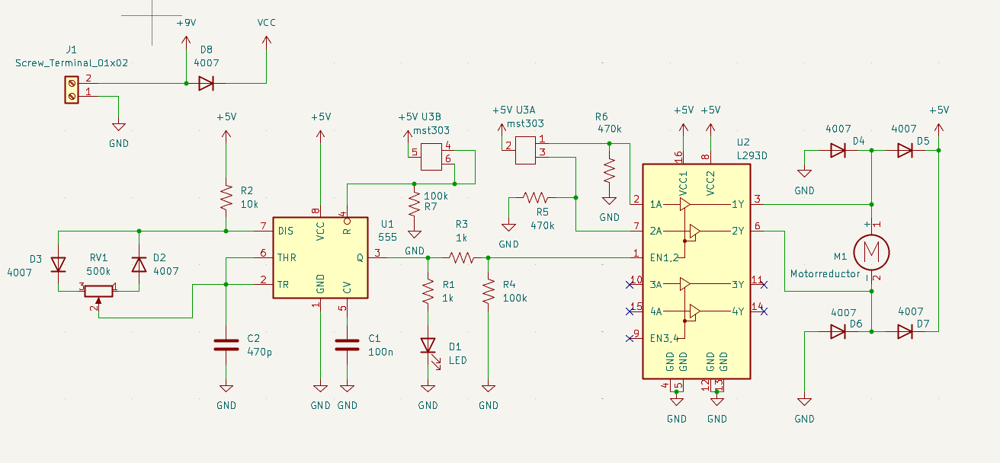
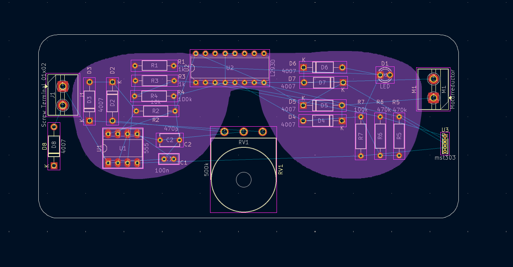
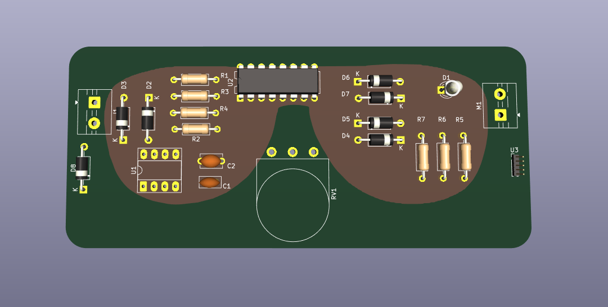
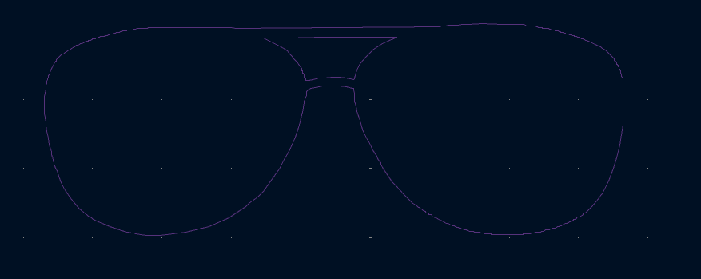
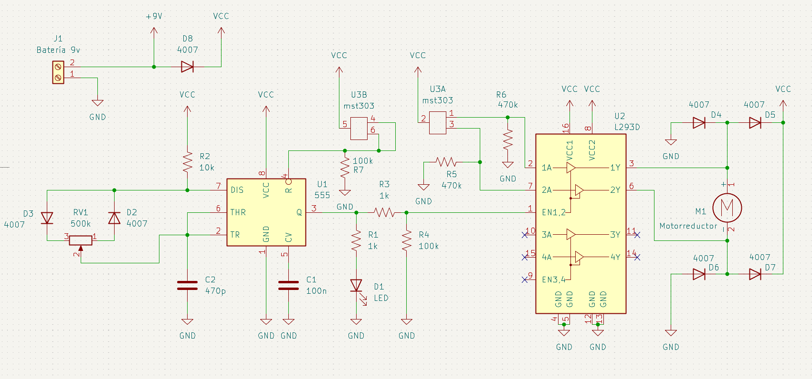
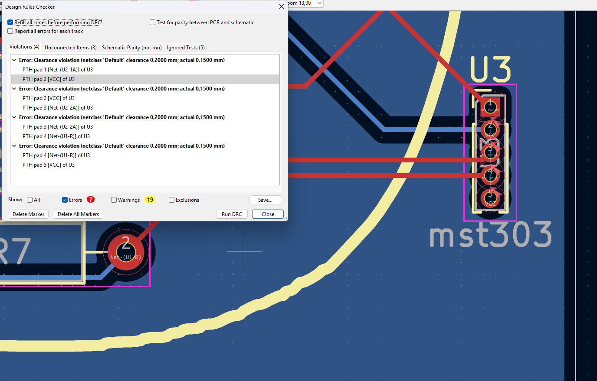

# sesion-15b

## KiCad

### footprints

las footprints son identificadores visuales impresos en la placa. En las placas de método THT incluyen los agujeros necesarios. 

en selector de footprints de KiCad, se diferencian las diferentes huellas por una serie de valores escritos.

- ejemplo 1: R_Axial_DIN0516_L15.5mm_D5.0mm_P20.32mm_Horizontal

tipoDeComponente_tipoDeEncapsulado_standardDelPackage_ longitudCuerpo_diametroCuerpo_pitch*_orientación

- ejemplo 2: C_Disc_D3.4mm_W2.1mm_P2.50mm

tipoDeComponente_tipoDeEncapsulado_diametroCuerpo_espesorCuerpo_pitch*

*el pitch es la separación entre sus pines

## avance kicad

Agregué el screw erminal, donde eventualmente irá la pila. 

### pcb

En un comienzo nuestra pcb era formato carta de presentación(55x85mm), sin embargo, adaptamos el formato para que se adecuara proporcionalmente a la forma del vector utilizado.

Los terminal block a ambos lados del lente representan la "patita" del lente.

El circuito está separado en 2 partes posicionadas en cada uno de los vidrios del lente. Al lado izquierdo se encuentra el circuiuto PWM, con el 555. Al lado derecho se encuentra la parte del motor. Siendo ambas partes conectadas por el L293D.

Esta es la primera versión oficial de nuestra propuesta de diagramación y organización de la pcb.

Render de la propuesta.

La idea es usar una silueta idéntica a la forma del lente físico que estamos ocupando.

### más progreso 

#### esquemático

gracias al feedback  de misa y franUDP, correjimos la fuente de energía. Con el símbolo +9V indicamos donde va la batería, y el resto de conexiones hacia positivo las marcamos como VCC.

#### progreso pcb 

en un inicio tenpiamos la idea de poner el vector del lente de sol con relleno, pero tras llevarlo a cabo, las dos opciones que teníamos para hacerlo agrandaban la complejidad del diseño de la pcb.

1. en caso de hacerlo en la capa de cobre, esto no forzaba a hacer todas las conexiones en una mirsma cara de la pcb, puesto que la gran mayroía de la superficie de la otra capa estaría cuibierta por el vector del lente(hecho de cobre.)

2. Por otro lado, cuando hicimos una prueba dibujando el lente en la capa "silkscreen", pero el lente de sol terminaba tapando todas las footprints e indicaciones de la pcb.

Por estos 2 motivos dedidimos dibujar el lente sin relleno, en la capa "silkscreen".

### errores

## faltantes uwu

- Diagrama de flujo
- Explicación breve del nombre del proyecto
- Subir videos protoboards
- Confirmar que duckusu pudo armar nuestra tabla BOM en markdown
- Explicar brevemente el motorreductor y el switch de 6 pines
- Ayuda y comunicación con colegas (Issues y conversa con nuestros profes y compas)
- Subir esquemático
- Describir esquemáticos y su función
- Describir los chips usados en el esquemático junto a las razones de sus conexiones
- Subir fotos de PCB
- Bibliografáa extra (Por ejemplo video para crear footprint de KiCad y los datasheet de chips)