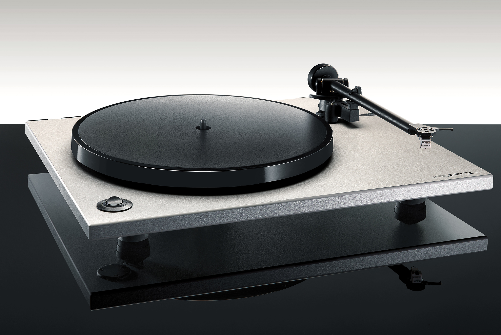

# sesion-14a

## Trabajo en clase / Martes 10 de Junio

### Cosas que hablamos en la mañana

- Hablamos un poco sobre el nuevo repositorio y las especificaciones en Markdown que debemos seguir para que todo funcione de manera fluida.
- Es importante tener especial cuidado con los nombres de los archivos, ya que una mala nomenclatura puede afectar la organización o el funcionamiento del repositorio.
- Hablamos sobre la importancia de iniciar actividades, un proceso formal que permite a una persona natural o jurídica declarar que comenzará actividades económicas, habilitándola para emitir boletas.
- Defensoría del Contribuyente

### Equipo de apoyo

- Como equipo, estuvimos definiendo cómo podíamos apoyar a los distintos grupos de trabajo.
- Nos enfocamos en el área de registro, planificando cómo fotografiar sus prototipos sin interrumpir su trabajo. Vamos a calendarizar fechas para sesiones fotográficas y de registro en video.
- Acordamos estar atentos a la llegada de las PCBs, para integrarlas al registro visual.
- Consultamos los horarios y requerimientos para solicitar las cámaras que se utilizarán durante las sesiones.
- Revisamos el espacio del laboratorio de interacción, el cual podemos adaptar como un pequeño estudio para fotografía y video.
- El viernes vamos a fotografiar y videograbar los prototipos en las protoboards.
- Vamos a buscar luces LED o focos para asegurar una buena iluminación ese día.
- También necesitamos que nos indiquen sus errores o dificultades en el proceso, para poder destacarlos en el registro y mostrar cómo enfrentaron esos desafíos.

### Organización para las sesiones de registro

- Pediremos la cámara y conseguiremos luces para la sesión de registro.
- Vamos a montar el espacio de trabajo, adaptándolo como estudio para fotografía y video.
- El horario de registro será el siguiente: desde las 11 am
- Solicitaremos que nos presten sus protoboards para poder fotografiarlas de forma detallada.
- También vamos a dejar grabando el proceso de impresión 3D, para incluir ese material en el video final.

### Grupos de trabajo

- lista de grupos de trabajo
- grupo 01:
- grupo 02:
- grupo 03: 
- grupo 04:
- grupo 05:
- grupo 06:

## Encargos

### Referentes e investigación para los registros

- Estas fotografías de productos que me gustaron las tomé como referencia. Me pareció simple y neutra la manera en que expone sus productos, pero también muy acotada. <https://www.trucco.photography/productos>

Fuente <https://images.squarespace-cdn.com/content/v1/55814e1de4b0f9f986faf351/1440725269068-ZH3CG5A674FMJMB0ZQ4R/image-asset.jpeg?format=2500w>

Fuente <https://images.squarespace-cdn.com/content/v1/55814e1de4b0f9f986faf351/1437147802659-J0WL73ASBVFSBVZXKKHD/Torna+Final+-+Post.jpg?format=2500w>

- Además, revisé un video como referencia para comprender mejor qué elementos son necesarios al momento de fotografiar los procesos. <https://youtu.be/75OEz5csiP8?si=EtXw4-0HqXXj7hrX>
