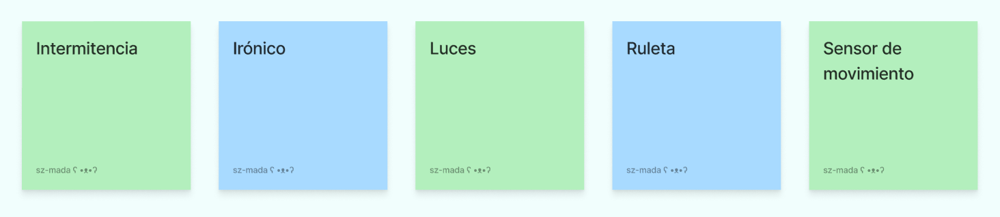

# sesion-13b

[6 de junio del 2025]

## [Mónica Bate](http://etab.cl/monica-bate/)

> Aarón le dio un quick rundown de cómo funcionan los talleres en la U y qué sucede en nuestro taller específicamente

- "Lo sonoro, lo orgánico, lo maquinal"

- La vida de los cristales/the life of crystals comenzó como un proyecto de tesis en inglés y luego lo hizo en español

- Estudió fotgrafía, procesos químicos, etc, crea un interés científico

- En su último año, llegó el primer computador a la carrera y alguien le dió una clase de Photoshop

- Trasnochar mucho le indujo un ataque epiléptico, se hizo un CT scan del cerebro

- Comenzó a verse a sí misma desde un punto de vista maquinista, el cómo funciona su cuerpo, etc

- Piezo eléctrico: fenómeno, características de los materiales, crea electricidad cuando se le aplica estrés mecánico

- Mezcló la ciencia de los cristales con lo místico de estos

- Los cristales crecidos fueron probados como micrófonos, parlantes y sensores

- Francisco Varela / Humberto Maturana

- Geología de Medios - Jussi Parikka

- Life of Crystals 32°S 71°W / Minera de Quintay y cristalera cerro El Roble

- Life of crystals `[c][o][r][o]` / Hacer un coro con 8 cristales

- La primera instalación fue en el Patio Domeyko, si te parabas en el centro, se podían escuchar todos juntos

- Expuesto en distintos lugares para comparar las distintas acústicas (audtitorio Las Encinas, Patio Domeyko, Iglesia San Ignacio, CENTEC, MAC)

- Su estilo de trabajo no es tan proyectual, más como taller, rizomático, experimental

- Algunos lugares que ha considerado para el coro de cristales: estadio o bosque

- Practice-based research

## Formación de grupos

Creamos los grupos para el examen por medio de Figma. Cada uno debía elegir 5 conceptos claves de su proyecto y colocar estos conceptos junto a otros afines; primero en una sección llamada "Espacio para compartir", y luego en "Orden de las funciones" donde separamos por input y output ex. iluminación y luces estarían juntos en la primera categoría, pero en la segunda, iluminación podría ser input mientras que luces sería output

De mis conceptos, coloqué LUCES en output y SENSOR DE MOVIMIENTO en input

A partir de esto, cada persona escribió su top5 de gente con la que le gustaría trabajar basado en la similitud de los proyectos, y de ahí se armaron los grupos

Quedé en el grupo 05 con Antonia Cristi y Paulina Vargas
