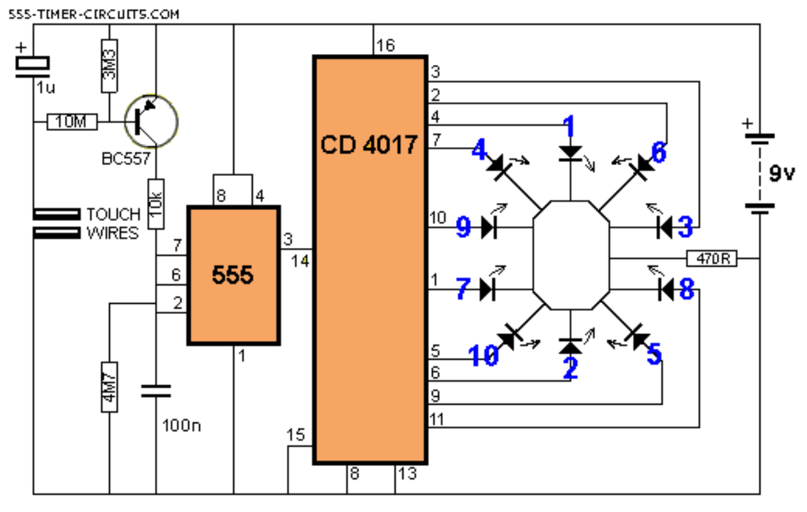
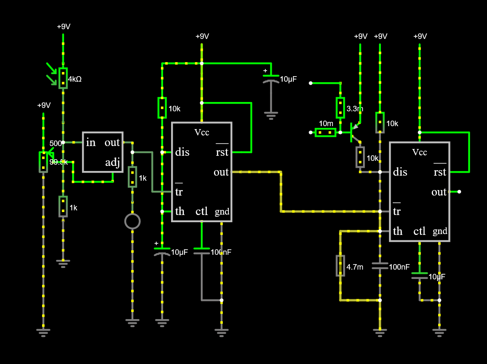
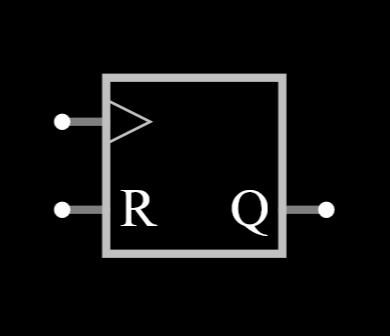
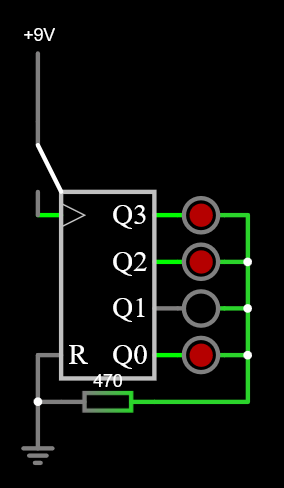
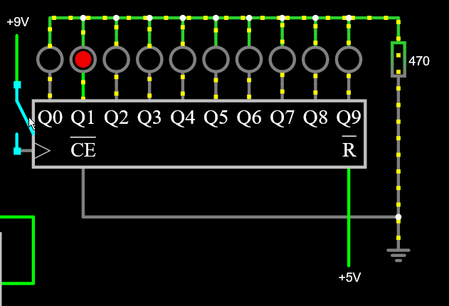
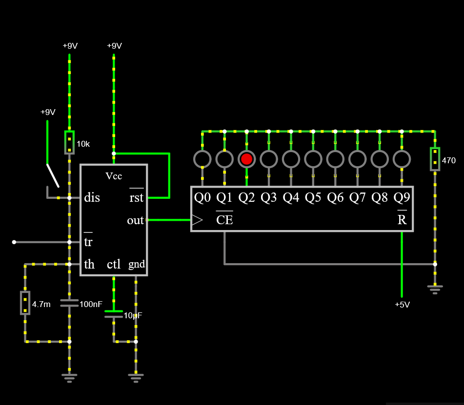

# sesion-14a

[10 de junio del 2025]

## Teloneo

Nuevo path: [00-info](/00-info/) con cómo pedir una revisión, cómo subir las imágenes y como funciona el lint

Aarón nos habló del markdown lint que agregó al repo para poder estandárizar los readme

Cómo nos vamos a organizar en los días que quedan pre-examen

## Diseñando el circuito en falstad

Comenzamos por establecer lo que queríamos que sucediera: luces LED que se encendieran en sequencia cuando detectan sombra y voz

- Sensor de sonido (micrófono?) + LDR en el circuito

- Luces LED estilo ruleta (en sequencia rápida)

- Electret mic para el sensor de sonido

Inicialmente, nos basamos en un circuito de ruleta que estaba en [555 Timer Circuits](https://www.555-timer-circuits.com/roulette.html), pero no lográbamos entender la finalidad del transistor BC557 en el circuito

Misaa nos recomendó buscar un circuito de dado digital y comparar, pero el que encontramos también tenía este componente, por lo que asumimos que era esencial para el circuito que queríamos armar



FranUDP nos recomendó basarnos en el circuito del detector de sombra que vimos en una clase anterior, y agregar un circuito astable

Confundí el chip LM324 (op-amp) con un LM317 (regulador ajustable), así que nuestro primer intento de circuito falló y no entendíamos por qué (chip incorrecto)



Excluyendo el timer 555, no éramos familiares con ninguno de los nombres que habían para los chips, así que tuvimos que asumir cuáles eran los que buscábamos y cómo se usaban

Para la sequencia, comenzamos un chip bajo el nombre "sequence generator", pero claramente no era lo que buscábamos porque solo tenía una salida



Luego nos quedamos con uno llamado "counter", el cual solo era de 4 pasos pero creímos que podíamos hacerlo funcionar. En este punto aún estábamos trabajando con el LM317, así que el circuito estaba destinado a fallar

De todas maneras, resultó ser que este "counter" es un chip que cuenta en sistema binario ([74HC393](https://assets.nexperia.com/documents/data-sheet/74HC_HCT393.pdf)). Lo notamos cuando Aarón sugirió conectar el circuito del chip a un push switch y ver si la secuencia funcionaba



Antes del descubrimiento, noté que este diagrama no tenía un clock enable, así que busqué el pinout del 4017 para ver qué tan esencial era. En esto, vi que alguien llamaba al chip "ring counter" e inmediatamente reconocí el nombre de la lista de chips en falstad



Procedimos a trabajar con el 4017, conectándolo al 555 monostable y a un push switch para comprobar que la sequencia funcionara (si funcionó yipee)



Mientras trabajábamos en el circuito, a Misaa le mencionamos el input de voz y nos entregó un electret mic junto a un circuito para que lo probemos

Aquí la idea de "input de voz" cambió de algo que debería estar integrado en el circuito en sí, a algo aparte, solo por apariencias (detectar voz &rarr; ruleta se enciende vs detectar voz &rarr; *parece* que algo sucede)


***

### Corrigiendo el circuito

Reorganizamos los componentes en el circuito y corregimos el chip incorrecto, ahora sí usando un op-amp, además de quitar el transistor BC557 y todo lo que traía conectado


Ahora los problemas eran (1) la sequencia solo avanzaba cuando el LDR detectaba luz (2) no era una secuencia automática constante, había que subir y bajar la luz en el LDR para que los LEDs avanzaran

La primera parte fue fácil de cambiar, simplemente invertir los inputs y ahí daba el resultado opuesto; pero el segundo problema no sabíamos cómo solucionarlo

Llegamos a la conclusión de que el problema era que después de recibir la señal, el circuito no se reiniciaba, así que decidimos conectar el op-amp directo al reset en vez de trigger solo por probar algo, y por primera vez vimos el circuito funcionar como lo esperábamos


&darr; Code block del circuito, por si acaso &darr;

```text
$ 1 0.000005 382.76258214399064 46 5 50 5e-11
r 2304 1040 2304 1088 0 470
165 1760 1088 1824 1088 6 0
162 1968 1088 1968 1040 2 default-led 1 0 0 0.01
163 1936 1120 2000 1120 2 10 0 0 0 0 0 0 0 0 0 0
162 2000 1088 2000 1040 2 default-led 1 0 0 0.01
162 2032 1088 2032 1040 2 default-led 1 0 0 0.01
162 2064 1088 2064 1040 2 default-led 1 0 0 0.01
162 2096 1088 2096 1040 2 default-led 1 0 0 0.01
162 2128 1088 2128 1040 2 default-led 1 0 0 0.01
162 2160 1088 2160 1040 2 default-led 1 0 0 0.01
162 2192 1088 2192 1040 2 default-led 1 0 0 0.01
162 2224 1088 2224 1040 2 default-led 1 0 0 0.01
162 2256 1088 2256 1040 2 default-led 1 0 0 0.01
374 1488 1200 1488 1248 0 0.3664 Light\sBrightness
r 1488 1328 1488 1280 0 10000
162 1664 1248 1664 1312 2 default-led 1 0 0 0.01
r 1664 1168 1664 1248 0 1000
g 1664 1312 1664 1344 0 0
w 2304 1040 2304 1024 0
w 2304 1024 2256 1024 0
w 2256 1024 2256 1040 0
w 2256 1024 2224 1024 0
w 2224 1024 2224 1040 0
w 2224 1024 2192 1024 0
w 2192 1024 2192 1040 0
w 2192 1024 2160 1024 0
w 2160 1024 2160 1040 0
w 2160 1024 2128 1024 0
w 2128 1024 2128 1040 0
w 2128 1024 2096 1024 0
w 2096 1024 2096 1040 0
w 2096 1024 2064 1024 0
w 2064 1024 2064 1040 0
w 2064 1024 2032 1024 0
w 2032 1024 2032 1040 0
w 2032 1024 2000 1024 0
w 2000 1024 2000 1040 0
w 2000 1024 1968 1024 0
w 1968 1024 1968 1040 0
w 2304 1088 2304 1216 0
w 2000 1184 2000 1216 0
g 2304 1216 2304 1248 0 0
w 2256 1216 2304 1216 0
w 2256 1216 2000 1216 0
R 2256 1184 2256 1280 0 0 40 9 0 0 0.5
w 1504 1264 1488 1264 0
w 1488 1264 1488 1280 0
w 1488 1248 1488 1264 0
R 1488 1200 1488 1168 0 0 40 9 0 0 0.5
g 1488 1328 1488 1344 0 0
174 1504 1040 1504 1088 0 500000 0.8564 Resistance
R 1504 1040 1504 1008 0 0 40 9 0 0 0.5
g 1504 1104 1504 1120 0 0
209 1744 1248 1744 1280 4 0.000009999999999999999 0.001 0.001 0 1
g 1744 1280 1744 1296 0 0
w 1744 1216 1744 1248 0
a 1568 1168 1648 1168 9 15 -15 1000000 0 0 100000
w 1520 1072 1552 1072 0
w 1552 1072 1552 1152 0
w 1552 1152 1568 1152 0
w 1568 1184 1552 1184 0
w 1552 1184 1552 1264 0
w 1552 1264 1504 1264 0
w 1664 1168 1648 1168 0
w 1744 1216 1744 1184 0
g 1856 1248 1856 1296 0 0
R 1824 1056 1824 1024 0 0 40 9 0 0 0.5
r 1728 1120 1728 1056 0 10000
w 1760 1120 1728 1120 0
R 1728 1056 1728 1024 0 0 40 9 0 0 0.5
r 1728 1120 1728 1184 0 2200
w 1760 1184 1744 1184 0
w 1760 1216 1744 1216 0
w 1744 1184 1728 1184 0
c 1824 1248 1824 1280 4 1.0000000000000001e-7 0.001 0.001 0
g 1824 1280 1824 1296 0 0
w 1888 1152 1936 1152 0
w 1888 992 1888 1120 0
w 1680 1168 1680 992 0
w 1680 992 1888 992 0
w 1680 1168 1664 1168 0
w 1648 1168 1648 1152 0
r 1648 1152 1648 1104 0 1000
g 1648 1104 1648 1088 0 0
```
