# sesion-14b

[13 de junio del 2025]

## Prototipado proyecto-02: output

Reorganizamos los componentes en el circuito y corregimos el chip incorrecto, ahora sí usando un op-amp, además de quitar el transistor BC557 y todo lo que traía conectado

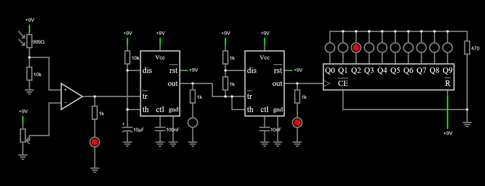

Ahora los problemas eran (1) la sequencia solo avanzaba cuando el LDR detectaba luz (2) no era una secuencia automática constante, había que subir y bajar la luz en el LDR para que los LEDs avanzaran

La primera parte fue fácil de cambiar, simplemente invertir los inputs y ahí daba el resultado opuesto; pero el segundo problema no sabíamos cómo solucionarlo

Llegamos a la conclusión de que el problema era que después de recibir la señal, el circuito no se reiniciaba, así que decidimos conectar el op-amp directo al reset en vez de trigger solo por probar algo, y por primera vez vimos el circuito funcionar como lo esperábamos (en falstad)

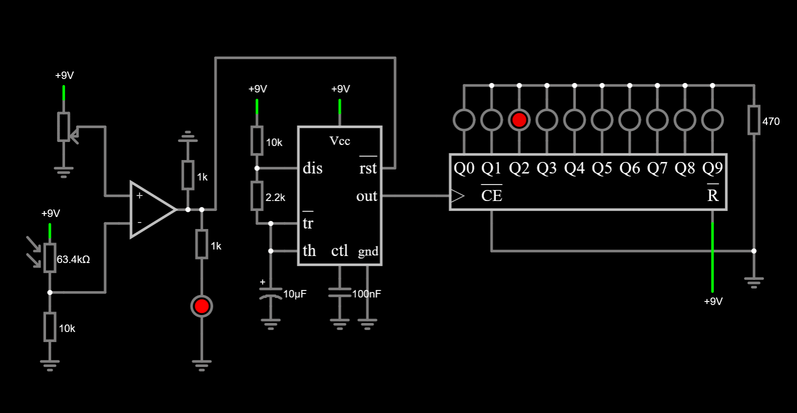

Al momento de pasar todo el circuito a protoboard, descubrimos que la parte con el LDR no funcionaba, le dábamos sombra (o luz) y no había cambio en el LED

Fuimos a pedirle ayuda a Aarón y nos delegó a FranUDP, quien nos dijo lo mismo que la primera vez que tuvimos problemas con el circuito (lol): conectar el detector a un astable y después a un monostable

Fran hizo todo el cambio de rehacer el circuito del detector de sombra y los NE555, tanto en falstad como en protoboard, y quedamos nosotros en terminar armando el 4017


Nuevo problema: la secuencia no avanzaba. El LED que mostraba la detección de sombra funcionaba bien, pero la secuencia se quedaba detenida en el primer LED, lo cual debía suceder **solo** si nunca se entregaba el input de sombra

Volvimos a hacer el circuito del 4017, y nada, seguía sin funcionar, así que nuevamente le pedimos ayuda a Aarón, ahora delegándonos a Misaa, sugiriendo que el problema debía estar en el CE

Luego de esperar a que Misaa terminara de ayudar a otro compañero, le explicamos nuestro circuito y el problema. Nos dijo que el pin 15 no lo teníamos conectado a nada, lo que hacía que constantemente se reseteara el circuito. Lo conectó a tierra, y al dar sombra sobre el LDR, la secuencia avanzaba

Terminamos nuestro prototipeo con dos sugerencias, por parte de Misaa, subir la velocidad de la secuencia, y Andrés (o fue Aarón, no recuerdo bien) dijo que podíamos desordenar los LEDs para que se vea más aleatorio

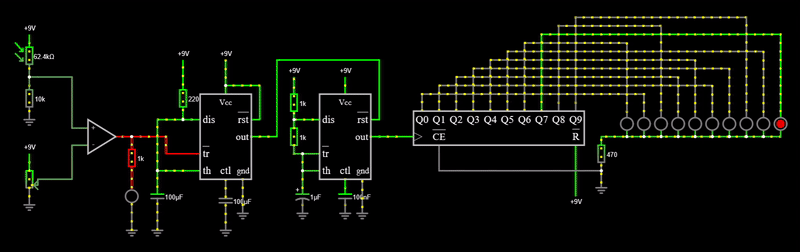

También dejamos el circuito ya hecho en KiCad. Faltaría asignar footprints

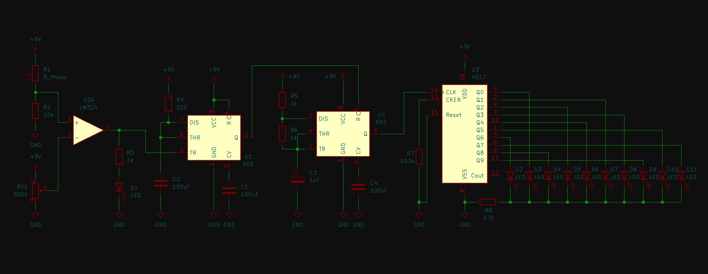


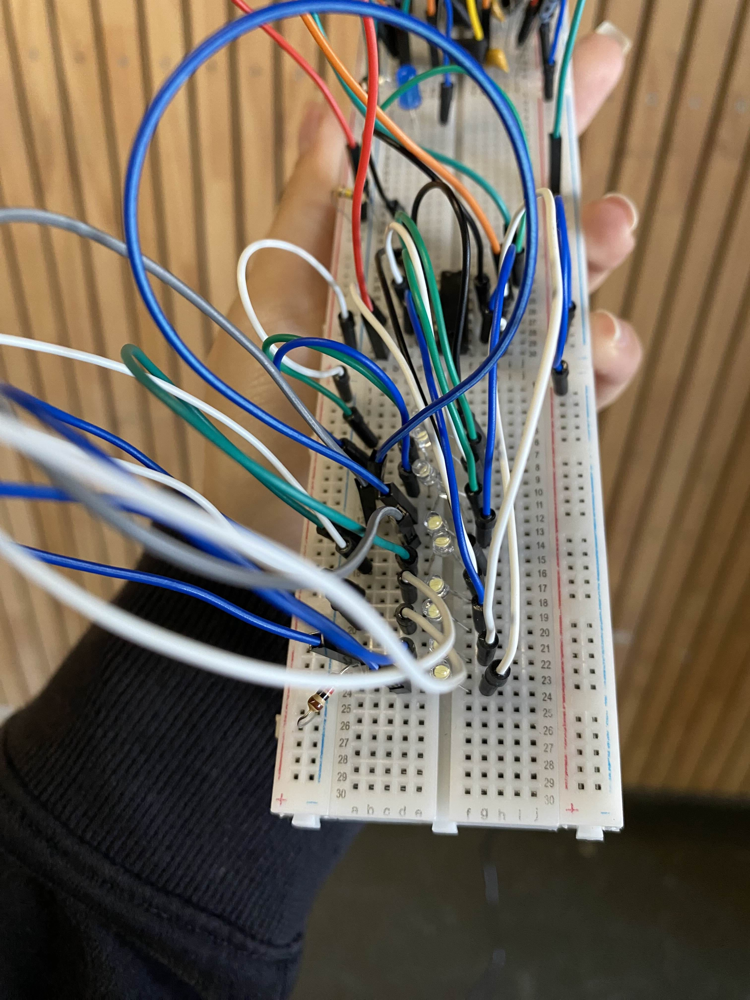

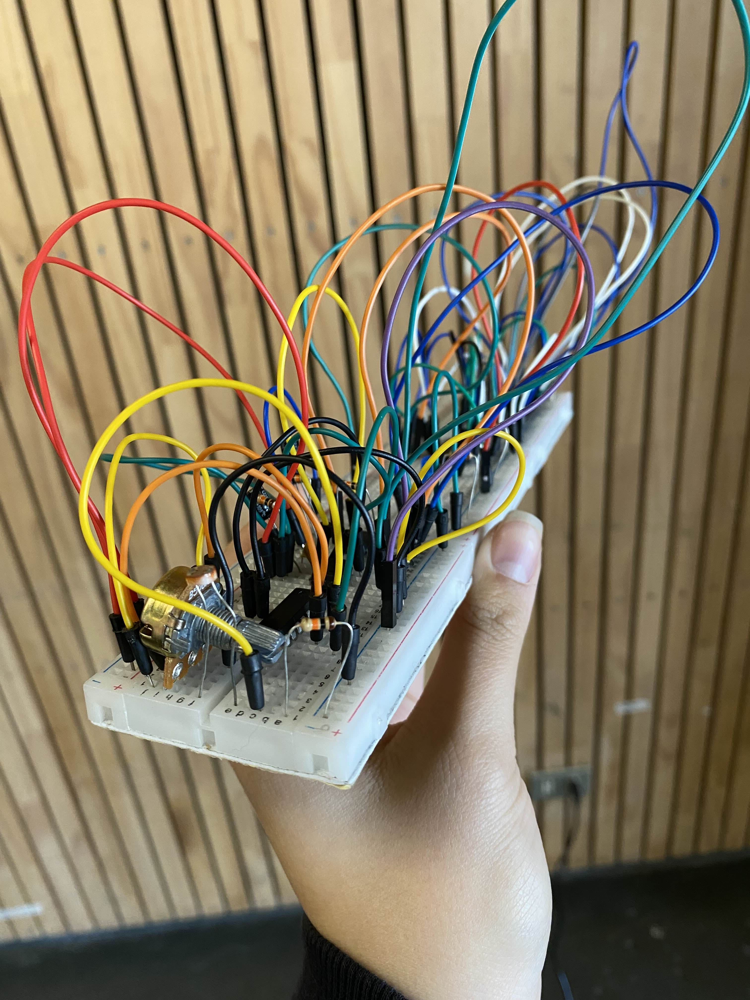

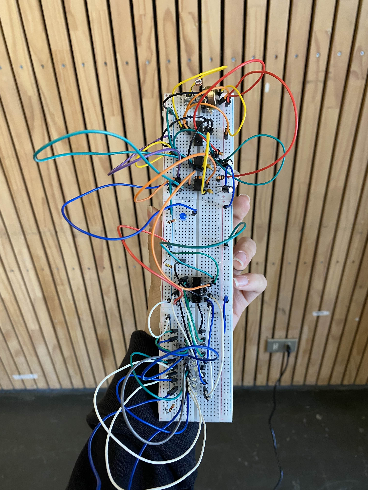

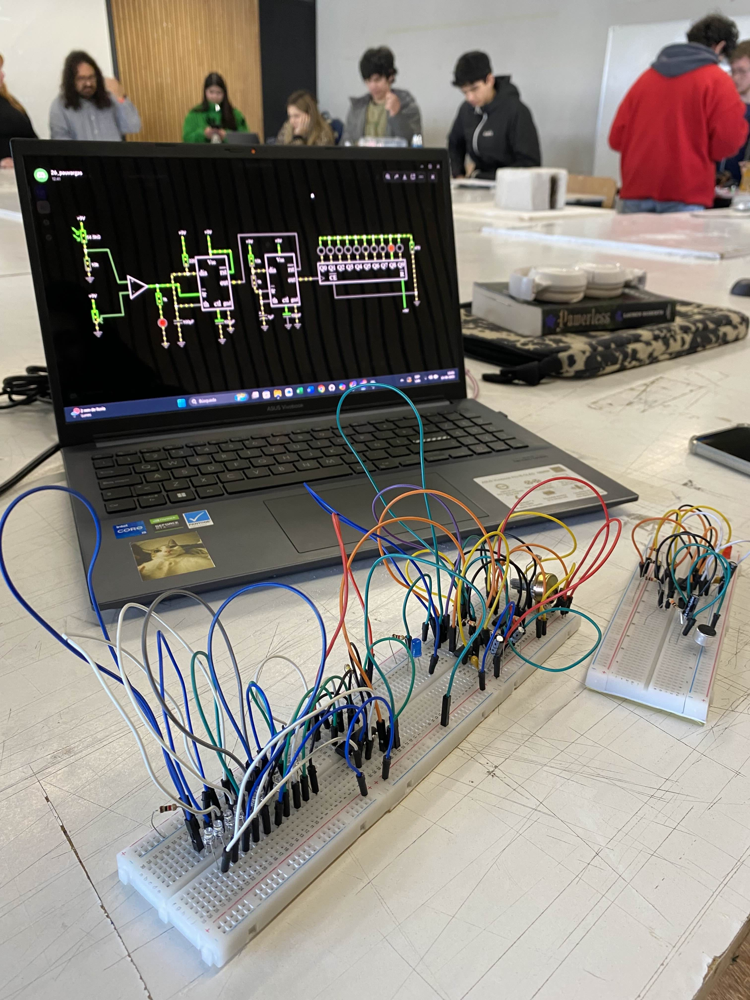

***
Aparte del detector de sombra con ruleta, el proyecto también tiene un circuito con un LED que se activa con sonido por medio de un micrófono, pero este circuito en sí no afecta en nada al circuito de la ruleta, solo está para engañar al usuario

Para este micrófono con LED, seguimos trabajando con el mismo circuito que nos entregó Misaa, así que lo incluimos en la diagramación de KiCad

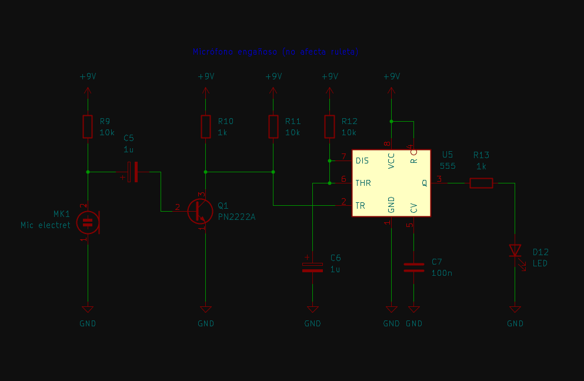

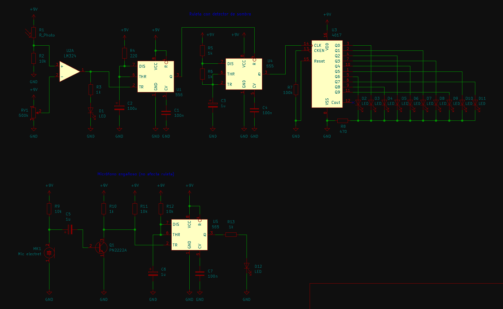

Cambiamos el diagrama del circuito principal, más que nada el value de algunos condensadores (C1 y C2), y el tipo en sí de C2 (electrolítico en vez de cerámico)

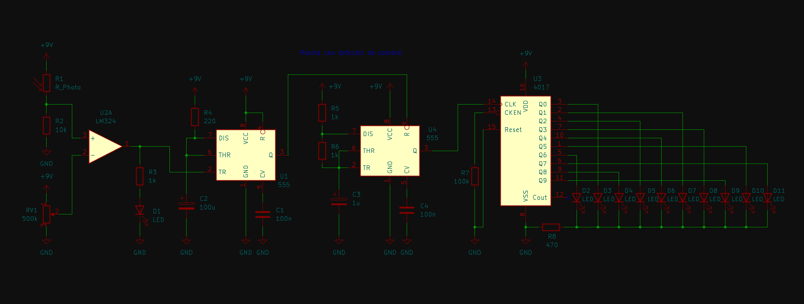

&darr; Code block del circuito en falstad, por si acaso &darr;

```text
$ 1 0.000005 382.76258214399064 46 5 50 5e-11
374 1472 992 1472 1040 0 0.1486 Light\sBrightness
r 1472 1120 1472 1072 0 10000
162 1664 1248 1664 1312 2 default-led 1 0 0 0.01
r 1664 1168 1664 1248 0 1000
g 1664 1312 1664 1344 0 0
w 1488 1056 1472 1056 0
w 1472 1056 1472 1072 0
w 1472 1040 1472 1056 0
R 1472 992 1472 960 0 0 40 9 0 0 0.5
g 1472 1120 1472 1136 0 0
174 1472 1216 1472 1264 0 500000 0.8564 Resistance
R 1472 1216 1472 1184 0 0 40 9 0 0 0.5
g 1472 1280 1472 1296 0 0
a 1568 1168 1648 1168 9 15 -15 1000000 0 0 100000
w 1552 1152 1568 1152 0
w 1568 1184 1552 1184 0
w 1552 1056 1488 1056 0
w 1664 1168 1648 1168 0
w 1680 1168 1728 1168 0
w 1680 1168 1664 1168 0
w 2128 1168 2176 1168 0
R 2496 1200 2496 1296 0 0 40 9 0 0 0.5
w 2496 1232 2240 1232 0
w 2496 1232 2544 1232 0
g 2544 1232 2544 1264 0 0
w 2240 1200 2240 1232 0
w 2624 1168 2592 1168 0
w 2656 1168 2624 1168 0
w 2688 1168 2656 1168 0
w 2720 1168 2688 1168 0
w 2752 1168 2720 1168 0
w 2784 1168 2752 1168 0
w 2816 1168 2784 1168 0
w 2848 1168 2816 1168 0
w 2880 1168 2848 1168 0
w 2592 1168 2544 1168 0
163 2176 1136 2240 1136 2 10 0 0 0 0 0 0 0 0 0 0
162 2592 1120 2592 1168 2 default-led 1 0 0 0.01
r 2544 1168 2544 1232 0 470
165 1776 1104 1856 1104 6 0
c 1840 1264 1840 1312 4 1.0000000000000001e-7 0.001 0.001 0
g 1840 1312 1840 1344 0 0
g 1872 1264 1872 1312 0 0
R 1840 1072 1840 1008 0 0 40 9 0 0 0.5
w 1776 1136 1760 1136 0
r 1760 1136 1760 1056 0 220
R 1760 1056 1760 1008 0 0 40 9 0 0 0.5
w 1760 1136 1712 1136 0
w 1712 1136 1712 1232 0
w 1712 1232 1776 1232 0
g 1712 1328 1712 1344 0 0
w 1904 1136 1904 1072 0
w 1840 1072 1904 1072 0
w 1728 1168 1728 1200 0
w 1728 1200 1776 1200 0
g 2064 1296 2064 1312 0 0
c 2064 1264 2064 1296 4 1.0000000000000001e-7 0.001 0.001 0
w 1984 1200 1968 1200 0
w 2000 1232 1984 1232 0
w 2000 1200 1984 1200 0
r 1968 1136 1968 1200 0 1000
R 1968 1072 1968 1040 0 0 40 9 0 0 0.5
w 2000 1136 1968 1136 0
r 1968 1136 1968 1072 0 1000
R 2064 1072 2064 1040 0 0 40 9 0 0 0.5
g 2096 1264 2096 1312 0 0
w 1984 1232 1984 1200 0
w 1984 1232 1984 1264 0
g 1984 1296 1984 1312 0 0
209 1984 1264 1984 1296 4 0.000001 0.001 0.001 0 1
165 2000 1104 2064 1104 6 0
w 2128 1136 2128 1024 0
w 2128 1024 1936 1024 0
w 1936 1024 1936 1168 0
w 1904 1168 1936 1168 0
w 1552 1056 1552 1152 0
w 1488 1248 1552 1248 0
w 1552 1248 1552 1184 0
w 2208 1104 2208 1088 0
w 2208 1088 2624 1088 0
w 2240 1104 2240 1072 0
w 2240 1072 2752 1072 0
w 2272 1104 2272 1056 0
w 2272 1056 2688 1056 0
w 2304 1104 2304 1040 0
w 2304 1040 2784 1040 0
w 2336 1104 2336 1024 0
w 2336 1024 2720 1024 0
w 2368 1104 2368 1008 0
w 2368 1008 2848 1008 0
w 2624 1088 2624 1120 0
w 2752 1072 2752 1120 0
w 2688 1056 2688 1120 0
w 2720 1024 2720 1120 0
w 2784 1040 2784 1120 0
w 2848 1008 2848 1120 0
w 2400 1104 2400 992 0
w 2400 992 2592 992 0
w 2592 992 2592 1120 0
w 2432 1104 2432 976 0
w 2432 976 2880 976 0
w 2880 976 2880 1120 0
w 2464 1104 2464 960 0
w 2464 960 2656 960 0
w 2656 960 2656 1120 0
w 2496 1104 2496 944 0
w 2496 944 2816 944 0
w 2816 944 2816 1120 0
162 2624 1120 2624 1168 2 default-led 1 0 0 0.01
162 2656 1120 2656 1168 2 default-led 1 0 0 0.01
162 2688 1120 2688 1168 2 default-led 1 0 0 0.01
162 2720 1120 2720 1168 2 default-led 1 0 0 0.01
162 2752 1120 2752 1168 2 default-led 1 0 0 0.01
162 2784 1120 2784 1168 2 default-led 1 0 0 0.01
162 2816 1120 2816 1168 2 default-led 1 0 0 0.01
162 2848 1120 2848 1168 2 default-led 1 0 0 0.01
162 2880 1120 2880 1168 2 default-led 1 0 0 0.01
209 1712 1232 1712 1328 4 0.00009999999999999999 0.001 0.001 0 1
```
