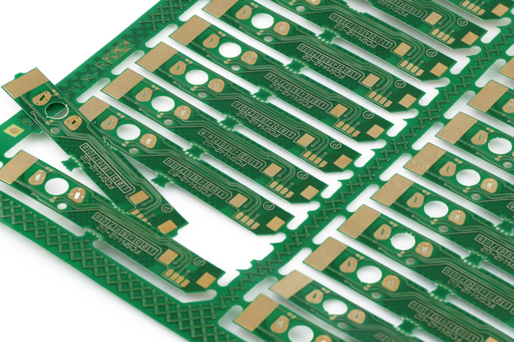

# sesion-16b

[27 de junio del 2025]

!! Examen es el viernes 11 de julio en SS sala 301 !!

## Teloneo??

[Capabilities de JLCPCB](https://jlcpcb.com/capabilities/pcb-capabilities)

JLCPCB puede panelizar (varias placas pequeñas en una más grande), conviene hacerlo si la PCB mide menos de 5cm

## Retroalimentación proyecto-02

- Faltó añadir los conectores de alimentación (switch y diodo)

- La ruleta y el micrófono tienen que ser proyectos KiCad distintos porque no tienen conexión entre sí

- Los condensadores 474 deberían estar escritos como 470n

***

En general (para toda la clase)

- Los diagramas eran de bloque, no de flujo

- Agregar al BOM los materiales necesitados fuera de KiCad ex. DIP, cables dupont

### Bill of Materials para la carcasa

|&nbsp; QTY &nbsp;|NAME|SPECS
|:-:|-|-
|26|CABLES DUPONT|15cm
|4|PERNOS M3|-
|4|GOLILLA M3|-
|4|TUERCA M3|-
|11|PORTA LED|5mm
