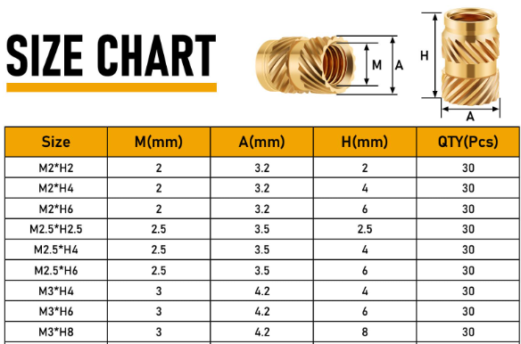

# sesion-16b

viernes 27 de junio

- [un loco hizo un computador en protoboard???](https://www.youtube.com/watch?v=zNu8yeL3mZs) - diy computer protoboard
- [ASANA - administrador de tareas](https://asana.com/es)

[límites de JLCPCB](https://jlcpcb.com/capabilities/pcb-capabilities)

PANELIZAR en jlcpcb --> el tamaño de promo para panelizar es 100x100mm - si una placa tiene un lado que mide menos de 50mm es mucho mejor panelizarlo, sale más barato

mouse bite (prepicado), también hay uno que es un semi corte, se llama V cut

## retroalimentación grupo-00a

en vez de poner el google drive, hacer una tabla en GitHub

se puede decir que un grupo no nos pescó

---

diagrama de bloque, explicación del circuito en macro

qué hace cada parte, input - output

---

## Modelado

### Insertos M3

### Carcasa grupo-02