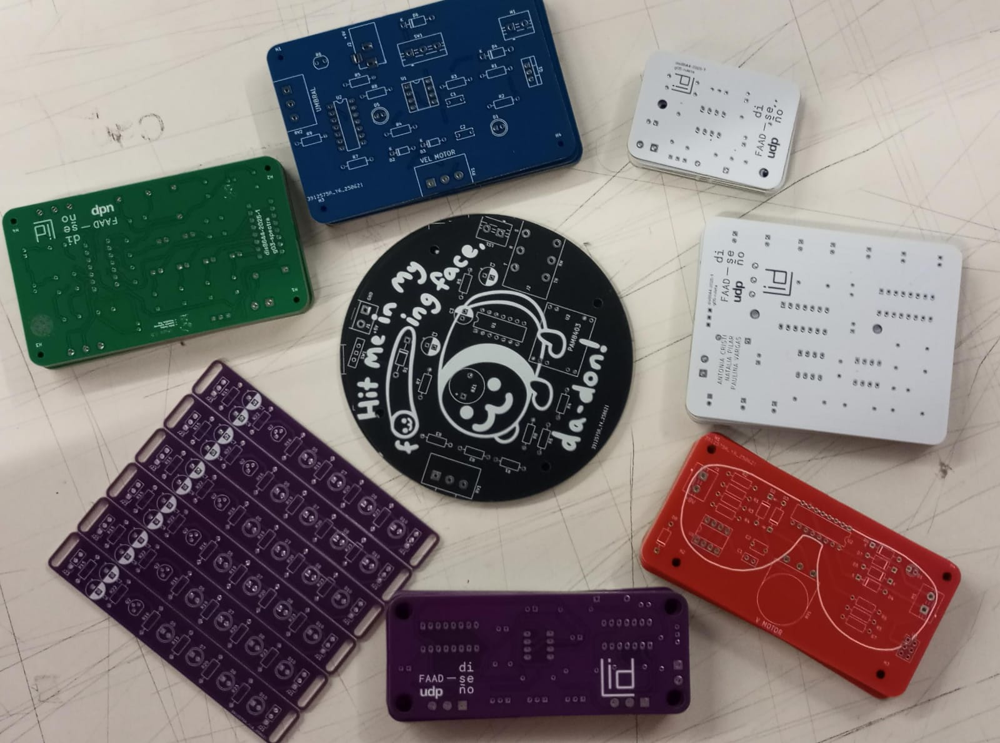
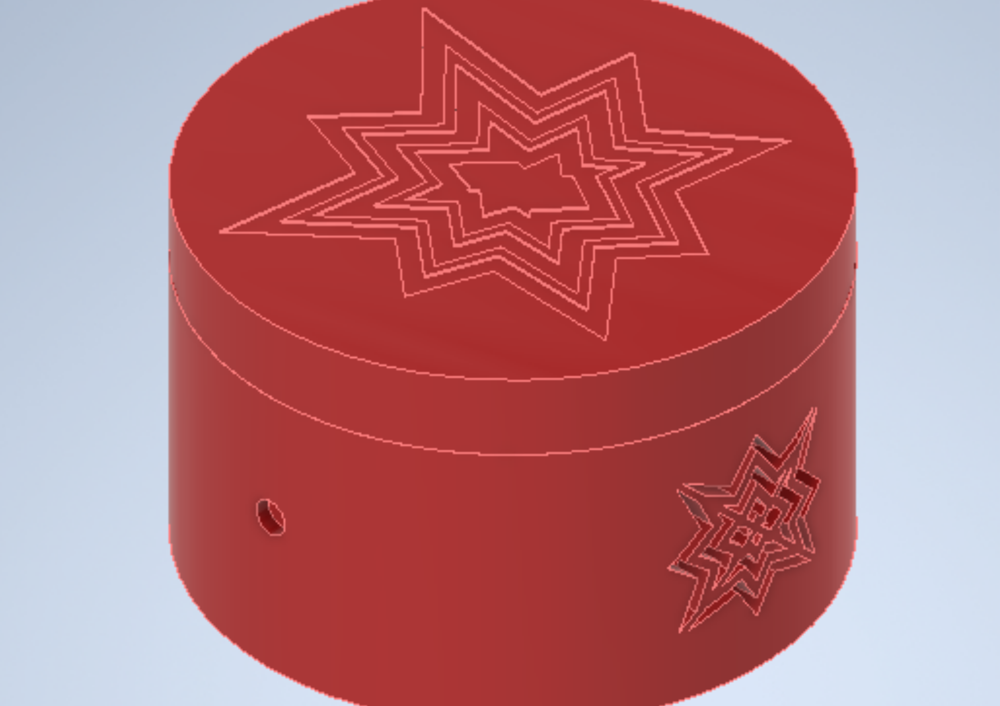
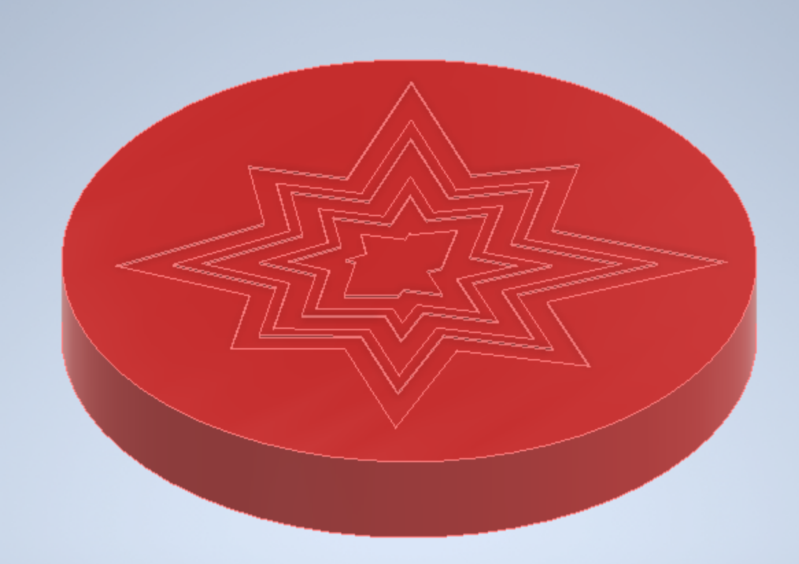
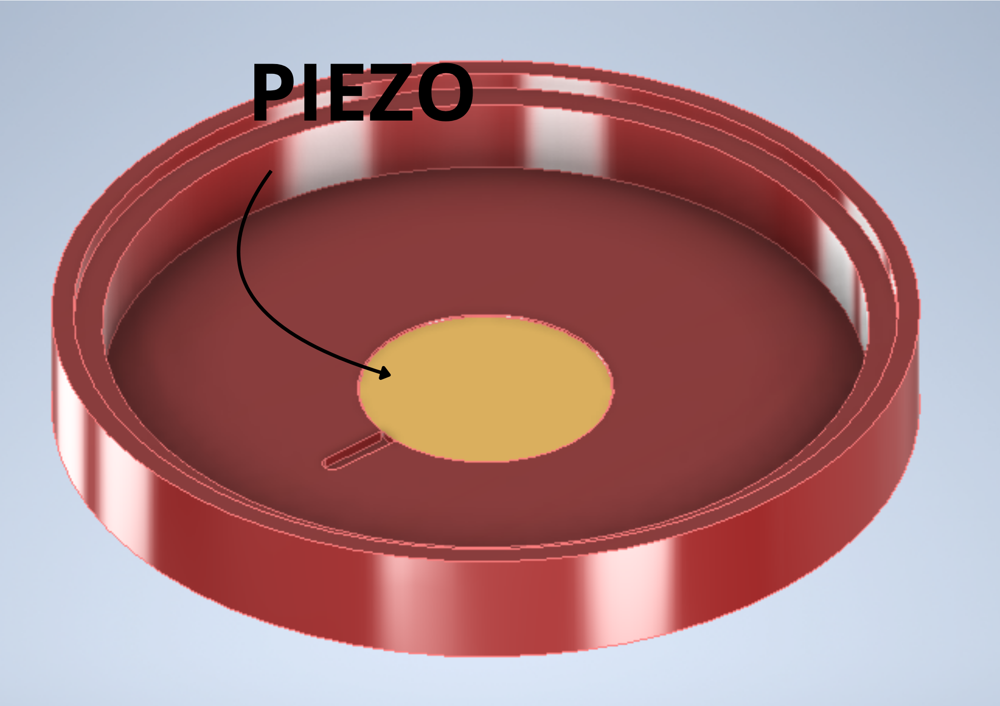
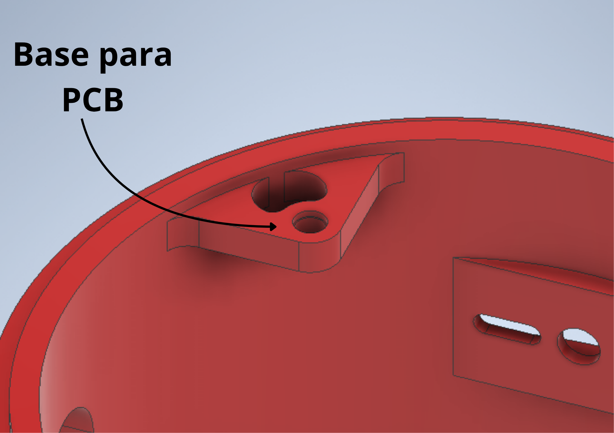
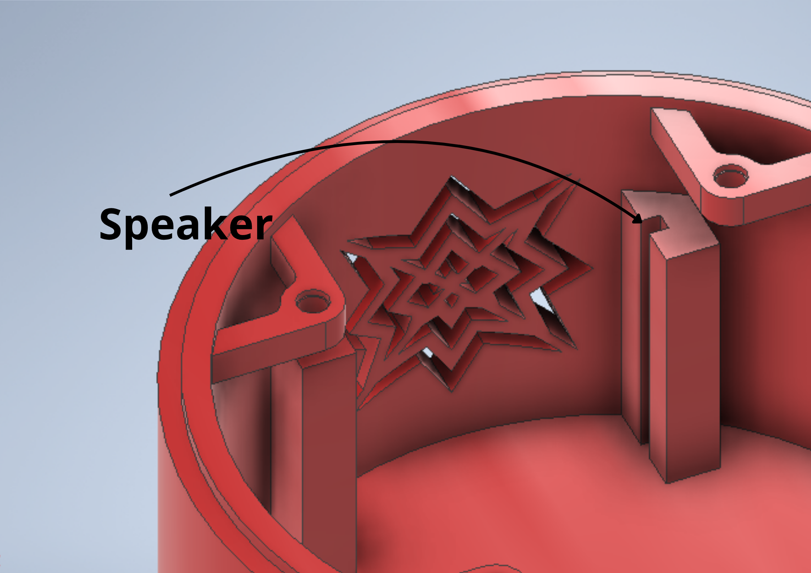
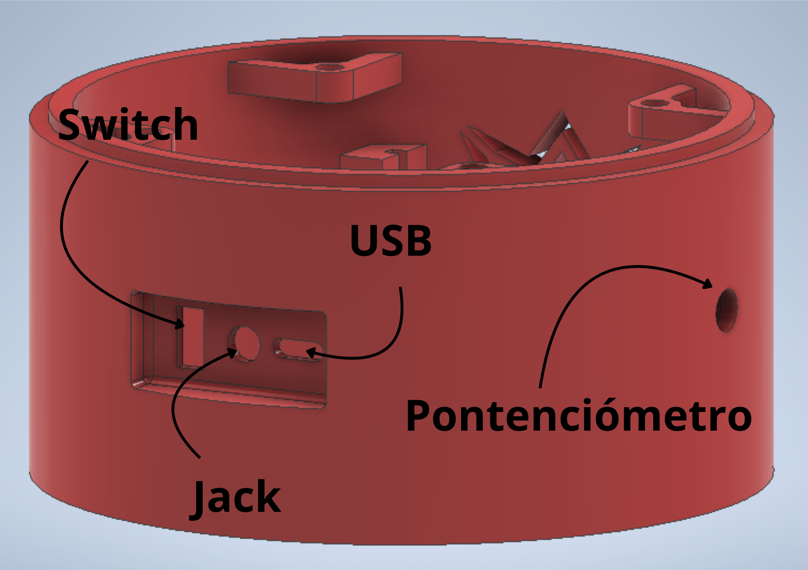

# sesion-17a

martes 01 de abril

## ¡¡¡LLEGARON LAS PLACAS!!!

Son bellísimas.

Aunque los del grupo 00 no mandamos a hacer plaquitas, Arrón nos dejó sacar :]

## Registro de quienes sacaron y cuáles:

- Grupo 01:
    - nadie
- Grupo 02:
    - Alanis
    - Bernardita
    - FranUDP
    - Jota Morales
    - Izhak Villeagas
    - Félix
- Grupo 03:
    - nadie
- Grupo 04:
    - FranUDP
- Grupo 05:
    - Félix (como el grupo tiene 2 pcb, Aarón me permitió sacar ambas)
- Grupo 06:
    - Nadie

## Carcasa grupo-02

### Forma general:

La cascasa es una caja cilíndrica con un bajo relieve del dibujo de una explosión o golpe.

### Piezo

En la tapa, por dentro, irá el piezo pegado al "techo" de la carcasa, tiene un espacio para que los cables vayan a la pcb

### PCB

La PCB irá fijada con tornillos a 4 bases donde van los insertos M3 de 4mm de alto

### Speaker

En el interior de la carcasa hay un par de rieles para poner el speaker. Tiene un tipo de rejilla en forma de explosión o impacto.

### Otros componentes

La carcasa tiene espacios disponibles para poner el potenciómetro, la entrada Jack para conectar un parlante, la entrada micro USB o USBC para cargar la batería y un espacio para el switch.

## Carcasa grupo-05

Junto a Alanis, le ofrecimos al grupo 05 hacerle la carcasa. 

El equipo quería hacerla totalmente de madera, sin embargo, nosotros les recomentamos combinar impresión 3D y terciado de 3mm para facilitar la fabricación y modelado. 

Las chicas apoyaron nuestra idea y Alanis la modeló para poder fabricarla.