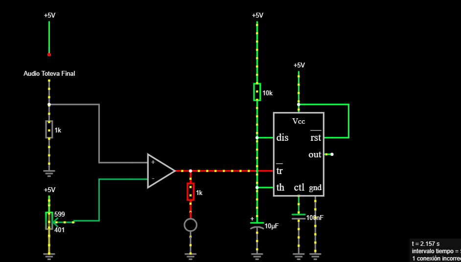

# sesion-14a
10-06-2025

## Apuntes

Grupo 3: Sofía Cartes- Isabella Gutierrez- Valentina Ruz 

|INPUT|OUTPUT|
|---|---|
|Sonido|Luz|

Al comienzo de la clase cada grupo se reunió para hablar de sus proyectos y Aarón nos enseñó a habilitar allworkflows (te muestra los errores técnicos de tu markdown)

Nos pusimos de acuerdo con los propósitos para nuestro proyecto, por lo que hicimos un pequeño punteo de las cosas que queríamos lograr. Para luego seguir con el prototipado en la protoboard y ver si realmente funcionaba. 

- `Descripción:` Objeto que emite luces de colores y reacciona mediante el sonido.

- `Objetivo:` Diseñar un objeto lumínico mediante la interacción con un sonido.

- `Interacción con el usuario:` Colocar música o emitir un sonido para que se prendan las luces.

- `Contexto de uso:` Se puede utilizar en una habitación, en espacios abiertos, encima del escritorio, etc.

- `¿Para qué sirve?:` Para ver lo que estamos escuchando, así representamos mediante luces el sonido que emitimos.

- `Decisiones de diseño:`  Carcasa de acrílicos de diversos colores, así se reflejan los colores de las luces LED y que se proyecten nuevas tonalidades. Queremos realizar el soporte de la placa en impresión 3D.

### 1. Diagrama de flujo circuito - Proyecto 02

- Lo primero que realizamos fue hacer la primera parte del circuito, nos basamos en el que mostraron en clases (el detector de sombra, utilizando los tres chip). Llegamos a la conclusión de que si la entrada de este circuito era un LDR, que pasaba si lo cambiabamos por un micrófono; para que la entrada sea el sonido y no la luz. Cabe destacar en la protoboard si prendía la luz pero había que regular todo el tiempo el micrófono, mediante un potenciómetro.

- El circuito en protoboard, si prendía la luz LED de la primera parte, pero al realizarlo en falstad, nos daba un error en la conexión de ese LED. No sabemos si nos equivocamos en elegir el chip LM324 o directamente es la conexión. Para simular el micrófono, colocamos un audio que disponíamos en ese momento.

### 2. Esquema hecho en Protoboard

### 3. BOM / Bill of materials

|Referencia|Valor|Huella|Qty|
|---|---|---|---|
|U1|LM324|DIP-14|1|
|R1,R5,R7,R8,R9,R10|1k|Resistencia|6|
|R3,R4|10k|Resistencias|2|
|Pot|500k|Potenciómetro|1|
|D1,D2,D3,D4,D5,D6|Colores|LEDS|6|
|C1|100n|Condensador|1|
|C2|10uF|Condensador polarizado|1|
|U2|NE555|DIP-8|1|
|U3|4017|DIP-16|1|
|Mic|ky-037|Sensor de sonido|1|

