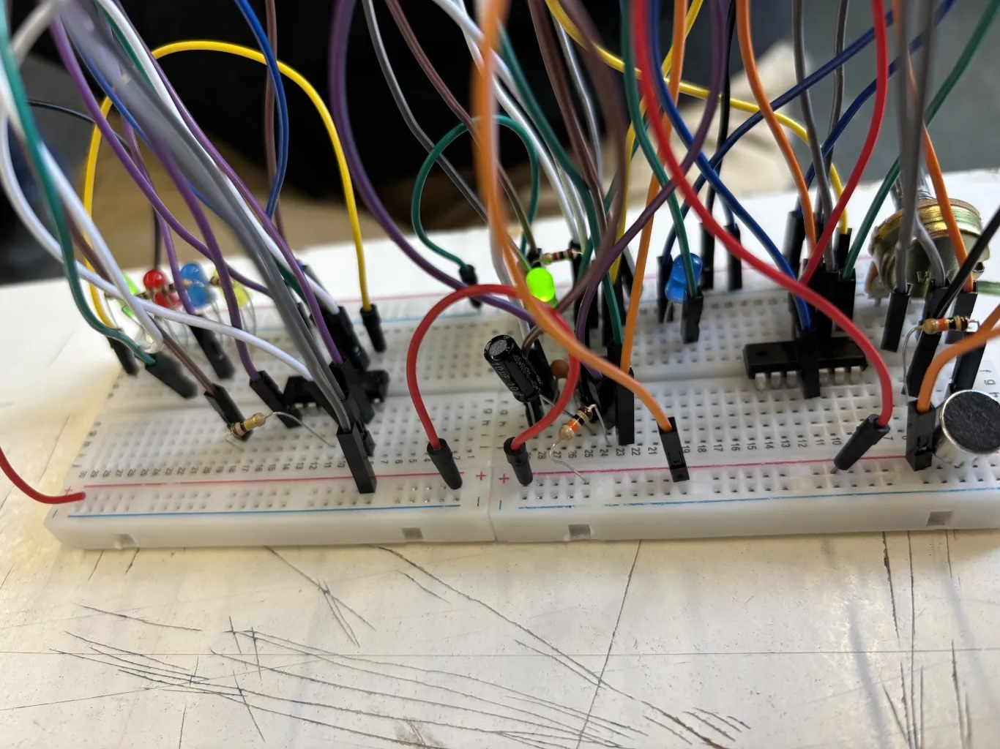

# sesion-14b

13-06-2025

## Apuntes

- En esta clase, seguíamos intentando el circuito en las protoboard, ya que queríamos encontrar el porqué no funcionaba la sensibilidad del micrófono
- Por otra parte, utilizamos el detector de sombra como referente para lograr lo que queríamos, ya que nuestra premisa fue; que si cambiabamos el LDR de la primera parte del circuito, por el micrófono, debería funcionar el cambio de luces; también utilizamos el chip 555 como estabilizador.
- Con la ayuda de FranUdp, nos dimos cuenta que solo al tocar el micrófono funcionaba y con sonidos muy fuertes.
- También, FranUdp nos ayudó a estabilizar la salida del circuito, conectando unos condensadores, pero no funcionó.
- Esta clase fue más de resolver el circuito y no de anotar cosas, por eso no tenemos apuntes anotados en el cuaderno.

