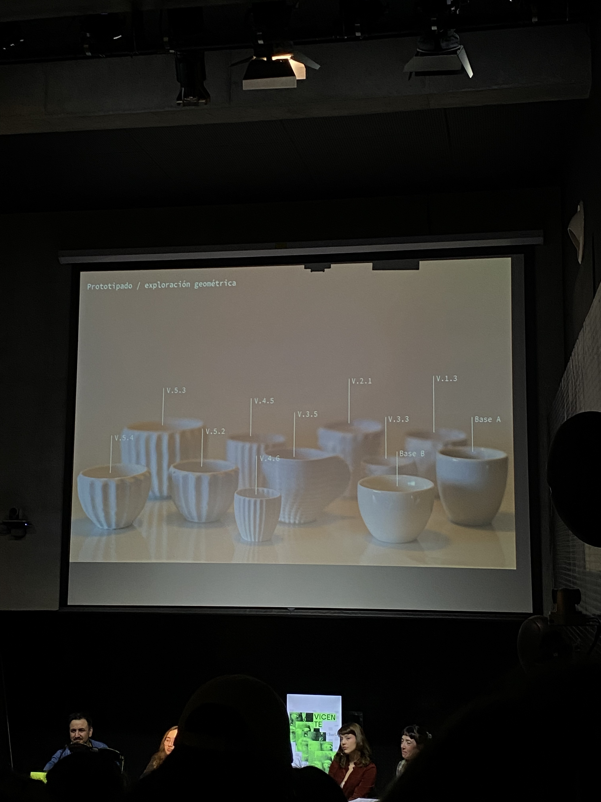
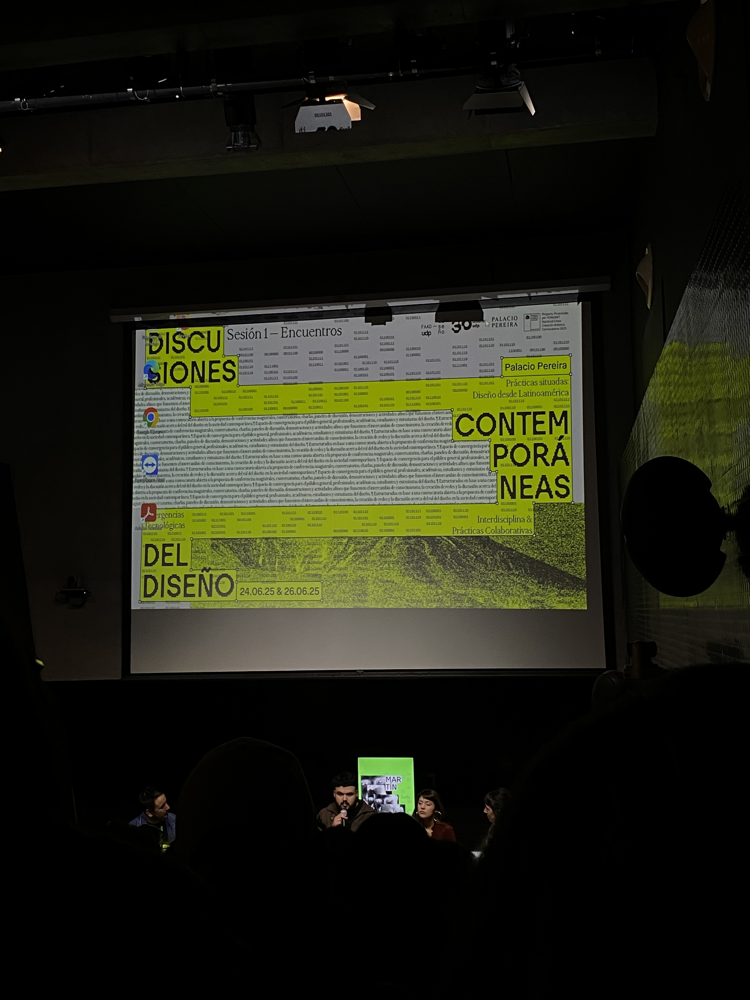
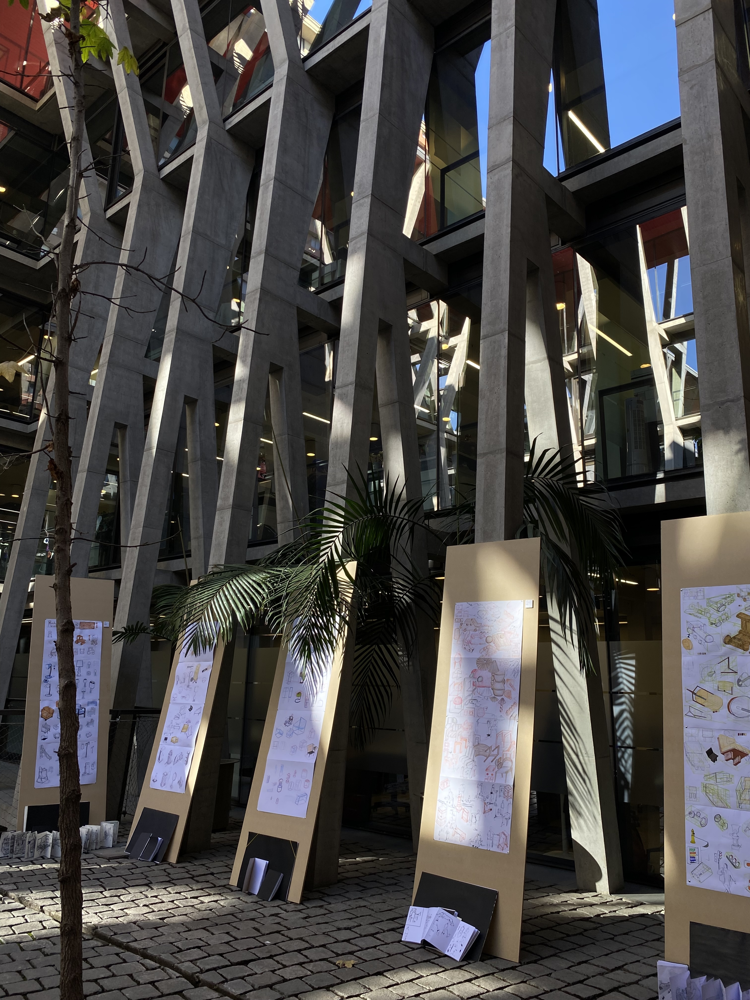
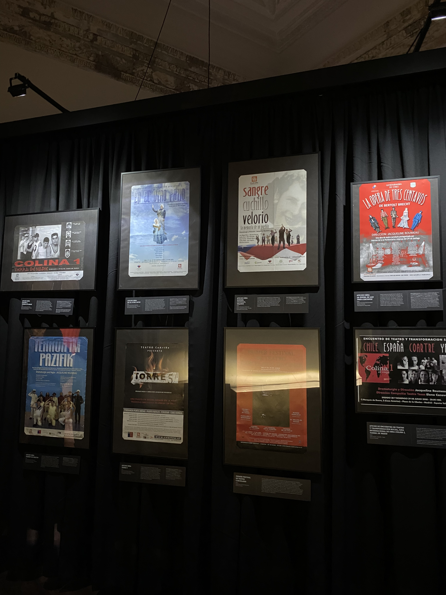

# sesion-16a

24-05-2025

## Apuntes

- En esta clase fuimos al Palacio Pereira a una charla llamada **Discusiones contemporáneas del diseño, prácticas situadas: diseño desde latinoamérica**
- Con Anais nos tuvimos que retirar antes de la charla, como a las 13:00 porque debíamos retirar unas probetas de biomaterial.
- Donde diseñadores de distintas universidades daban charlas sobre proyectos que realizaron. Dejo los nombres de los proyectos que anoté
- Ketal: por Nodosur
- Interacción de mutua transformación: Taza de café 2, por Camilo
- Prácticas sonoras: por Josefa Quezada
- La herencia de la técnica: Sebastián Romero
- Diseño pictográfico para la cultura Aónikenk
- Yungay: Nicolás Oyarzún

